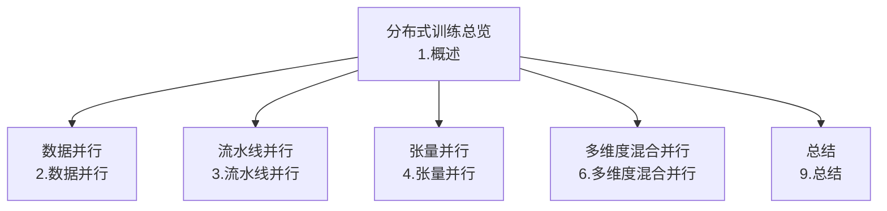
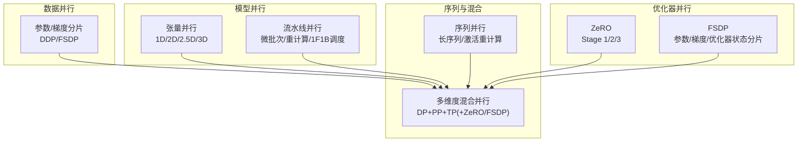
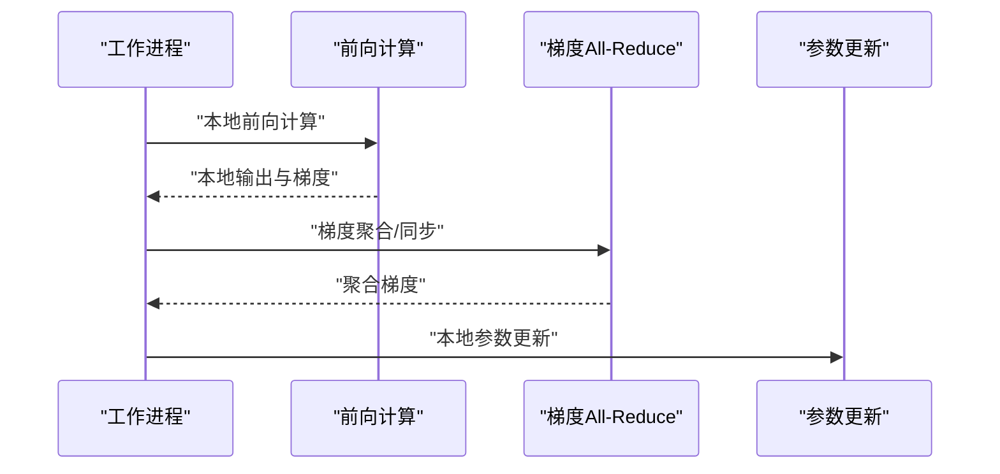
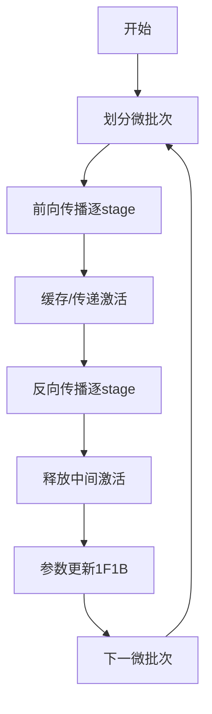
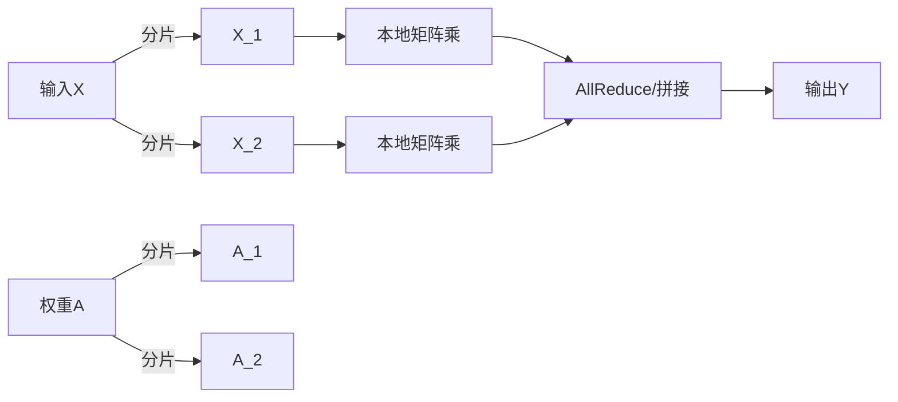
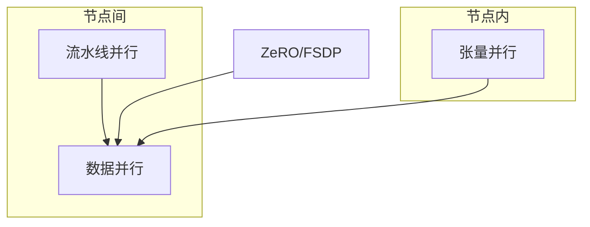
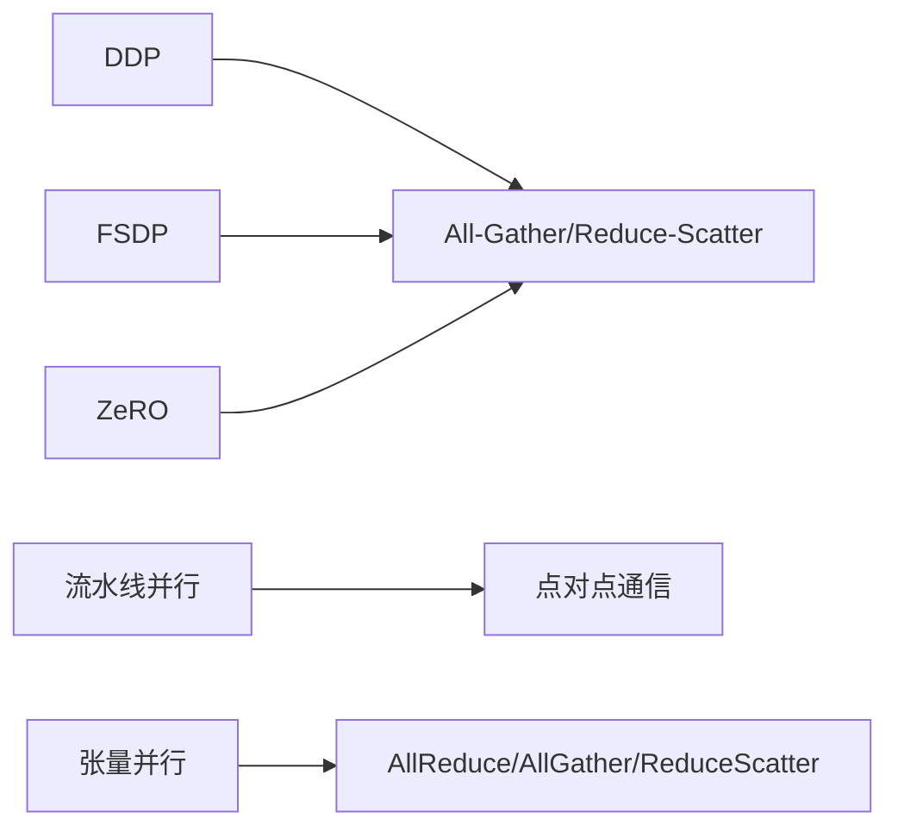

# 分布式训练

<cite>
**本文引用的文件**
- [分布式训练-概述](file://04.分布式训练/1.概述/1.概述.md)
- [分布式训练-数据并行](file://04.分布式训练/2.数据并行/2.数据并行.md)
- [分布式训练-流水线并行](file://04.分布式训练/3.流水线并行/3.流水线并行.md)
- [分布式训练-张量并行](file://04.分布式训练/4.张量并行/4.张顿并行.md)
- [分布式训练-多维度混合并行](file://04.分布式训练/6.多维度混合并行/6.多维度混合并行.md)
- [分布式训练-总结](file://04.分布式训练/9.总结/9.总结.md)
</cite>

## 目录
1. [引言](#引言)
2. [项目结构](#项目结构)
3. [核心组件](#核心组件)
4. [架构总览](#架构总览)
5. [详细组件分析](#详细组件分析)
6. [依赖关系分析](#依赖关系分析)
7. [性能考量](#性能考量)
8. [故障排查指南](#故障排查指南)
9. [结论](#结论)
10. [附录](#附录)

## 引言
本文件面向分布式训练场景，系统梳理并行策略的原理与实现要点，覆盖数据并行、流水线并行、张量并行、序列并行与多维度混合并行，并结合业界实践与DeepSpeed框架的ZeRO优化、梯度检查点等关键能力，给出策略选择与性能优化建议。内容以仓库中“分布式训练”主题文档为依据，辅以可视化图示帮助理解。

## 项目结构
围绕分布式训练主题，仓库提供了从基础概念到工程实践的多层级文档，涵盖数据并行、流水线并行、张量并行、多维度混合并行与总结等章节。这些文档共同构成分布式训练的知识体系，便于读者按需查阅与深入学习。

**图表来源**
- [分布式训练-概述:1-102](file://04.分布式训练/1.概述/1.概述.md#L1-L102)
- [分布式训练-数据并行:1-330](file://04.分布式训练/2.数据并行/2.数据并行.md#L1-L330)
- [分布式训练-流水线并行:1-264](file://04.分布式训练/3.流水线并行/3.流水线并行.md#L1-L264)
- [分布式训练-张量并行:1-441](file://04.分布式训练/4.张量并行/4.张量并行.md#L1-L441)
- [分布式训练-多维度混合并行:1-109](file://04.分布式训练/6.多维度混合并行/6.多维度混合并行.md#L1-L109)
- [分布式训练-总结:1-125](file://04.分布式训练/9.总结/9.总结.md#L1-L125)

**章节来源**
- [分布式训练-概述:1-102](file://04.分布式训练/1.概述/1.概述.md#L1-L102)
- [分布式训练-数据并行:1-330](file://04.分布式训练/2.数据并行/2.数据并行.md#L1-L330)
- [分布式训练-流水线并行:1-264](file://04.分布式训练/3.流水线并行/3.流水线并行.md#L1-L264)
- [分布式训练-张量并行:1-441](file://04.分布式训练/4.张量并行/4.张量并行.md#L1-L441)
- [分布式训练-多维度混合并行:1-109](file://04.分布式训练/6.多维度混合并行/6.多维度混合并行.md#L1-L109)
- [分布式训练-总结:1-125](file://04.分布式训练/9.总结/9.总结.md#L1-L125)

## 核心组件
- 数据并行：沿批次维度切分数据，每卡持有完整模型副本，反向传播后进行梯度聚合与广播，典型实现为DDP；FSDP在保持数据并行简洁性的同时，将参数、梯度、优化器状态跨进程分片，支持CPU卸载以提升内存效率。
- 流水线并行：将模型按层切分到不同设备，前向逐级传递激活，反向逐级回传梯度；通过微批次与重计算降低空泡与显存峰值。
- 张量并行：对层内张量进行分片（行/列并行），在设备间进行AllReduce/AllGather/ReduceScatter等通信以保证计算一致性；Megatron-LM采用1D张量并行，Colossal-AI提供2D/2.5D/3D张量并行以降低激活内存与通信成本。
- 序列并行：针对长序列训练的系统视角方案，旨在突破输入序列长度限制或降低激活重计算成本；仓库中亦提及相关研究工作。
- 多维度混合并行：DP/PP/TP组合（如3D并行），并可与ZeRO/FSDP协同，形成高可扩展的训练方案；不同阶段与通信拓扑的选择直接影响吞吐与显存占用。

**章节来源**
- [分布式训练-概述:3-87](file://04.分布式训练/1.概述/1.概述.md#L3-L87)
- [分布式训练-数据并行:23-330](file://04.分布式训练/2.数据并行/2.数据并行.md#L23-L330)
- [分布式训练-流水线并行:9-264](file://04.分布式训练/3.流水线并行/3.流水线并行.md#L9-L264)
- [分布式训练-张量并行:13-441](file://04.分布式训练/4.张量并行/4.张量并行.md#L13-L441)
- [分布式训练-多维度混合并行:3-109](file://04.分布式训练/6.多维度混合并行/6.多维度混合并行.md#L3-L109)

## 架构总览
下图展示分布式训练的总体架构与关键并行维度的关系：数据并行负责参数与梯度的分片与同步；模型并行（张量/流水线）负责模型切分与跨设备通信；优化器并行（ZeRO/FSDP）通过分片优化模型状态内存占用；序列并行与多维混合并行在系统层面进一步提升可扩展性与效率。

**图表来源**
- [分布式训练-概述:3-87](file://04.分布式训练/1.概述/1.概述.md#L3-L87)
- [分布式训练-数据并行:147-330](file://04.分布式训练/2.数据并行/2.数据并行.md#L147-L330)
- [分布式训练-流水线并行:18-264](file://04.分布式训练/3.流水线并行/3.流水线并行.md#L18-L264)
- [分布式训练-张量并行:47-441](file://04.分布式训练/4.张量并行/4.张量并行.md#L47-L441)
- [分布式训练-多维度混合并行:17-109](file://04.分布式训练/6.多维度混合并行/6.多维度混合并行.md#L17-L109)

## 详细组件分析

### 数据并行（DDP/FSDP）
- 原理与流程：每卡持有完整模型副本，前向在本地完成，反向后进行梯度All-Reduce，随后各自更新参数。FSDP进一步将参数、梯度、优化器状态分片，配合All-Gather/Reduce-Scatter实现通信与计算重叠，支持CPU卸载以提升内存效率。
- 关键点：
  - DDP：通信瓶颈主要在梯度All-Reduce；适合单机多卡与多机多卡。
  - FSDP：通过分片与重分片（reshard）降低峰值显存，支持自动/手动包装策略。
- 与ZeRO的关系：ZeRO侧重优化器状态与梯度分片，FSDP侧重参数/梯度/优化器状态的统一分片，二者可互补。

**图表来源**
- [分布式训练-数据并行:56-118](file://04.分布式训练/2.数据并行/2.数据并行.md#L56-L118)
- [分布式训练-数据并行:189-330](file://04.分布式训练/2.数据并行/2.数据并行.md#L189-L330)

**章节来源**
- [分布式训练-数据并行:23-330](file://04.分布式训练/2.数据并行/2.数据并行.md#L23-L330)

### 流水线并行（PP）
- 原理与流程：将模型按层切分为多个阶段，相邻阶段通过点对点通信传递激活与梯度；通过微批次（micro-batch）与重计算（activation re-materialization）降低空泡与显存峰值；1F1B调度在前向与反向间交错，缩短激活保留时间。
- 关键点：
  - 朴素PP空泡严重；GPipe引入微批次与重计算；PipeDream系列采用1F1B与双缓冲权重（2BW）等策略。
  - Megatron-LM提出交错式1F1B（虚拟流水线），以更多通信换取更低空泡。
- 与框架集成：PyTorch采用GPipe（F-then-B）；DeepSpeed采用PipeDream-Flush（非交错1F1B）；Megatron-LM采用交错式1F1B；Colossal-AI提供非交错与交错调度策略。

**图表来源**
- [分布式训练-流水线并行:56-264](file://04.分布式训练/3.流水线并行/3.流水线并行.md#L56-L264)

**章节来源**
- [分布式训练-流水线并行:9-264](file://04.分布式训练/3.流水线并行/3.流水线并行.md#L9-L264)

### 张量并行（TP）
- 原理与流程：对层内张量（如线性层权重、注意力Q/K/V）按行/列切分，设备间通过AllReduce/AllGather/ReduceScatter保持一致性；Megatron-LM采用1D张量并行；Colossal-AI提供2D/2.5D/3D张量并行以降低激活内存与通信成本。
- 关键点：
  - 1D（行/列并行）：简单直观，但激活未分片，通信随并行度增长。
  - 2D SUMMA：输入与权重均分片，激活内存显著下降。
  - 2.5D/3D：在设备规模上进一步平衡通信与内存开销。
- 与框架集成：Megatron-LM与Colossal-AI提供初始化与分片接口；PyTorch DTensor提供通用张量并行抽象。

**图表来源**
- [分布式训练-张量并行:47-110](file://04.分布式训练/4.张量并行/4.张量并行.md#L47-L110)
- [分布式训练-张量并行:118-441](file://04.分布式训练/4.张量并行/4.张量并行.md#L118-L441)

**章节来源**
- [分布式训练-张量并行:13-441](file://04.分布式训练/4.张量并行/4.张量并行.md#L13-L441)

### 序列并行（SP）
- 概念与动机：针对长序列训练的系统级方案，旨在突破输入序列长度限制或减少激活重计算带来的显存压力；仓库中提及两类相关工作：系统视角的长序列训练与减少激活重计算的序列并行。
- 实践要点：结合流水线并行与重计算策略，平衡通信与计算；在具备高速互联（如InfiniBand）的集群中，序列并行的额外通信成本可被吸收。

**章节来源**
- [分布式训练-总结:21-31](file://04.分布式训练/9.总结/9.总结.md#L21-L31)

### 多维度混合并行（DP+PP+TP+ZeRO/FSDP）
- 组合策略：将数据并行、流水线并行、张量并行与优化器并行（ZeRO/FSDP）结合，形成3D/更高维并行；不同阶段与通信拓扑的选择直接影响吞吐与显存占用。
- 典型案例：业界大模型普遍采用DP+PP+TP组合；ZeRO-1/2/3与PP可组合，但需注意梯度分片与流水线气泡的权衡；FSDP（ZeRO-3）可作为DP+MP的替代方案，使用更便捷。
- 通信与内存权衡：通常张量并行通信最密集，建议节点内用TP，节点间用DP/PP；在高带宽网络下，混合并行可显著提升可扩展性。

**图表来源**
- [分布式训练-多维度混合并行:17-109](file://04.分布式训练/6.多维度混合并行/6.多维度混合并行.md#L17-L109)
- [分布式训练-概述:75-87](file://04.分布式训练/1.概述/1.概述.md#L75-L87)

**章节来源**
- [分布式训练-多维度混合并行:1-109](file://04.分布式训练/6.多维度混合并行/6.多维度混合并行.md#L1-L109)
- [分布式训练-概述:75-87](file://04.分布式训练/1.概述/1.概述.md#L75-L87)

## 依赖关系分析
- 并行维度耦合：数据并行与模型并行（PP/TP）在系统层面相互补充；优化器并行（ZeRO/FSDP）与数据并行存在分片与通信的耦合关系。
- 通信与计算重叠：FSDP通过All-Gather/Reduce-Scatter实现通信与计算重叠；流水线并行通过微批次与1F1B调度降低空泡。
- 框架与实现：Megatron-LM、Colossal-AI、PyTorch DTensor与DeepSpeed在并行抽象与实现上各有侧重，需结合具体场景选择。

**图表来源**
- [分布式训练-数据并行:189-330](file://04.分布式训练/2.数据并行/2.数据并行.md#L189-L330)
- [分布式训练-流水线并行:18-264](file://04.分布式训练/3.流水线并行/3.流水线并行.md#L18-L264)
- [分布式训练-张量并行:47-110](file://04.分布式训练/4.张量并行/4.张量并行.md#L47-L110)

**章节来源**
- [分布式训练-数据并行:189-330](file://04.分布式训练/2.数据并行/2.数据并行.md#L189-L330)
- [分布式训练-流水线并行:18-264](file://04.分布式训练/3.流水线并行/3.流水线并行.md#L18-L264)
- [分布式训练-张量并行:47-110](file://04.分布式训练/4.张量并行/4.张量并行.md#L47-L110)

## 性能考量
- 通信与带宽：张量并行通信最密集，建议在节点内优先使用TP；在高带宽网络（如InfiniBand）下，混合并行可显著提升吞吐。
- 显存与激活：流水线并行通过微批次与重计算降低峰值显存；2D/2.5D/3D张量并行可降低激活内存；FSDP支持CPU卸载以进一步提升内存效率。
- 策略选择：单机单卡优先使用ZeRO/MCT；单机多卡可选PP/ZeRO/TP，视NVLink/NVSwitch与TP大小而定；多机多卡在网络带宽充足时可选ZeRO/PP+TP+DP，否则可选DP+PP+TP+ZeRO-1。
- 混合精度：FP16在巨型模型中易溢出，BF16可缓解数值不稳定问题，实践中更稳健。

**章节来源**
- [分布式训练-总结:52-125](file://04.分布式训练/9.总结/9.总结.md#L52-L125)

## 故障排查指南
- 显存不足：
  - 启用ZeRO-1/2/3或FSDP分片；在流水线并行中使用重计算与1F1B调度；在张量并行中采用2D/2.5D/3D以降低激活内存。
- 通信瓶颈：
  - 优化并行拓扑（节点内TP、节点间DP/PP）；在高带宽网络下扩大流水线深度；检查微批次数量与调度策略。
- 训练不稳定：
  - 优先尝试BF16；检查损失缩放与梯度裁剪；确认不同权重版本一致性（1F1B/双缓冲权重）。
- 策略兼容性：
  - PP与ZeRO-2/3组合需谨慎，通常推荐ZeRO-1与PP组合；FSDP（ZeRO-3）可作为DP+MP的替代方案。

**章节来源**
- [分布式训练-数据并行:147-330](file://04.分布式训练/2.数据并行/2.数据并行.md#L147-L330)
- [分布式训练-流水线并行:132-264](file://04.分布式训练/3.流水线并行/3.流水线并行.md#L132-L264)
- [分布式训练-张量并行:110-441](file://04.分布式训练/4.张量并行/4.张量并行.md#L110-L441)
- [分布式训练-多维度混合并行:25-109](file://04.分布式训练/6.多维度混合并行/6.多维度混合并并行.md#L25-L109)
- [分布式训练-总结:95-125](file://04.分布式训练/9.总结/9.总结.md#L95-L125)

## 结论
分布式训练涉及数据、模型、优化器与序列等多维度并行策略，需综合考虑通信、显存与计算的平衡。实践中，数据并行（DDP/FSDP）与流水线并行（微批次/重计算/1F1B）是通用基础，张量并行（1D/2D/2.5D/3D）与序列并行进一步提升可扩展性，而ZeRO/FSDP与多维度混合并行则在内存与吞吐之间提供灵活权衡。结合具体硬件与网络条件，选择合适的并行组合与调度策略，是实现高效训练的关键。

## 附录
- 策略选择速查：
  - 单机单卡：ZeRO/MCT；若最大层无法单卡承载，启用以内存为中心的平铺。
  - 单机多卡：可选DDP/ZeRO或PP/TP；若有NVLink/NVSwitch，三者性能相近；否则PP通常更优。
  - 多机多卡：网络带宽充足时可选ZeRO/PP+TP+DP；否则可选DP+PP+TP+ZeRO-1。
- 混合精度：优先BF16，配合损失缩放与梯度裁剪；在巨型模型中避免FP16溢出风险。

**章节来源**
- [分布式训练-总结:52-125](file://04.分布式训练/9.总结/9.总结.md#L52-L125)