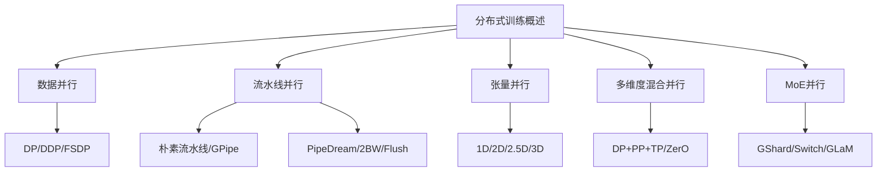
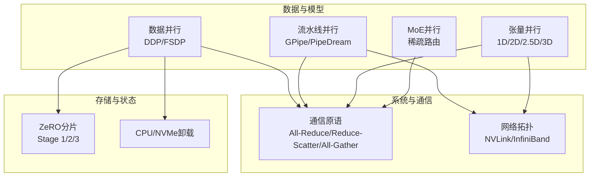
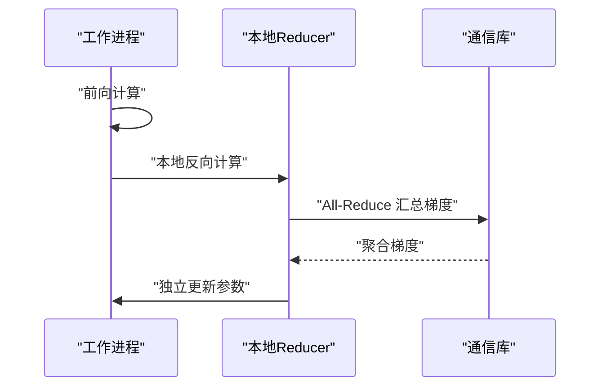
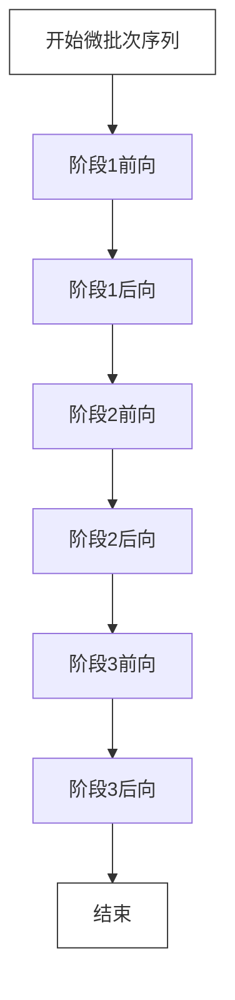
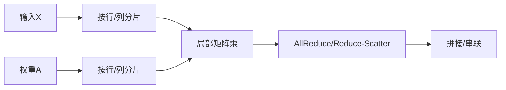
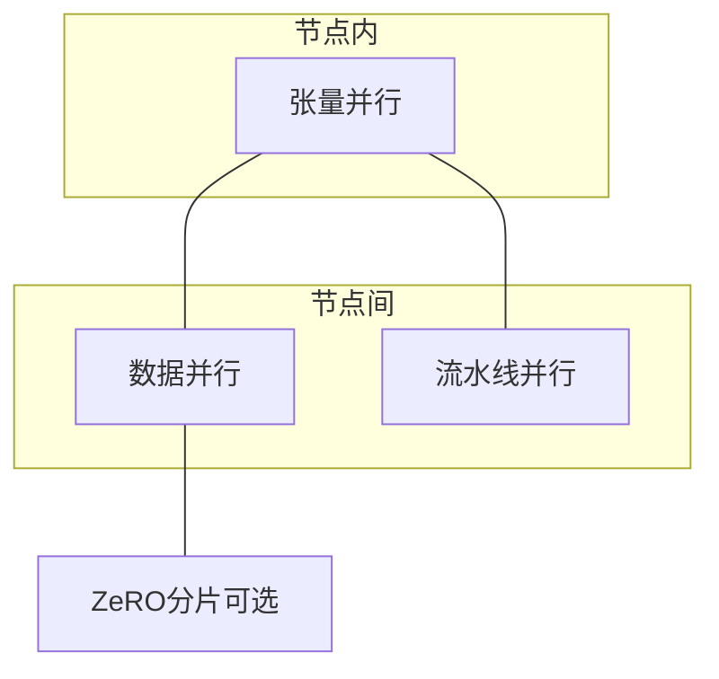
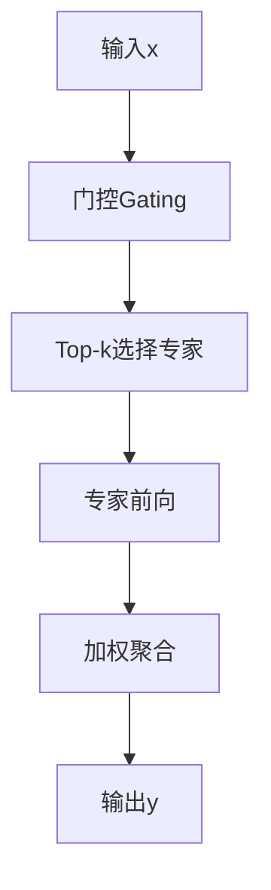
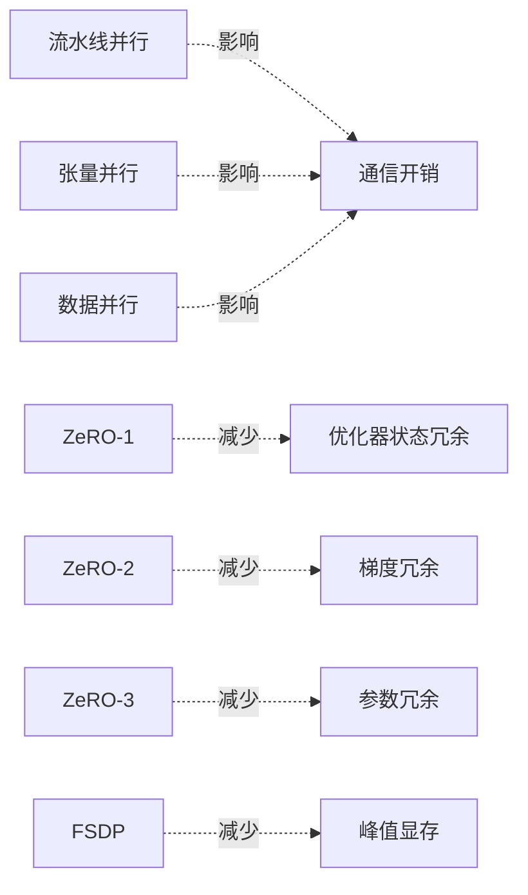

# 分布式训练概述

<cite>
**本文引用的文件**
- [1.概述.md](file://04.分布式训练\1.概述\1.概述.md)
- [2.数据并行.md](file://04.分布式训练\2.数据并行\2.数据并行.md)
- [3.流水线并行.md](file://04.分布式训练\3.流水线并行\3.流水线并行.md)
- [4.张量并行.md](file://04.分布式训练\4.张量并行\4.张量并行.md)
- [6.多维度混合并行.md](file://04.分布式训练\6.多维度混合并行\6.多维度混合并行.md)
- [8.moe并行.md](file://04.分布式训练\8.moe并行\8.moe并行.md)
- [9.总结.md](file://04.分布式训练\9.总结\9.总结.md)
</cite>

## 目录
1. [引言](#引言)
2. [项目结构](#项目结构)
3. [核心组件](#核心组件)
4. [架构总览](#架构总览)
5. [详细组件分析](#详细组件分析)
6. [依赖关系分析](#依赖关系分析)
7. [性能考量](#性能考量)
8. [故障排查指南](#故障排查指南)
9. [结论](#结论)
10. [附录](#附录)

## 引言
本文件面向分布式训练的入门与进阶读者，系统梳理分布式训练的基本概念、核心原理与工程实践，聚焦以下主题：
- 为什么需要分布式训练：单机显存与算力瓶颈、模型规模与数据规模的指数增长
- 分布式训练的主要挑战：通信开销、负载均衡、同步与一致性、内存与激活峰值
- 并行策略对比：数据并行、模型并行（张量并行、流水线并行）、混合并行（3D/多维）
- 优化器相关并行：ZeRO/FSHPD等状态分片策略
- 序列并行与MoE并行的要点与现状
- 性能评估指标与基准测试方法，帮助读者在不同硬件与场景下选择合适策略

## 项目结构
本仓库围绕“分布式训练”主题，按策略与技术维度组织内容，形成从基础到进阶的知识谱系。核心章节包括：
- 概述：并行范式与系统视角
- 数据并行：DP/DDP/FSDP 的演进与对比
- 流水线并行：朴素流水线、微批次、GPipe、PipeDream 系列
- 张量并行：1D/2D/2.5D/3D 及 PyTorch DTensor
- 多维度混合并行：DP+PP+TP 组合与业界案例
- MoE 并行：稀疏专家与路由策略
- 总结：策略选择、资源约束与精度权衡

**章节来源**
- [1.概述.md:1-102](file://04.分布式训练\1.概述\1.概述.md#L1-L102)

## 核心组件
- 数据并行（DP/DDP/FSDP）
  - DP：单进程多线程，易用但性能差、通信瓶颈集中在主卡
  - DDP：多进程、梯度All-Reduce，实现真正分布式，适合单机/多机
  - FSDP：参数/梯度/优化器状态全分片，支持CPU卸载，降低峰值显存
- 流水线并行（PP）
  - 朴素PP：设备空闲率低，存在显著Bubble
  - 微批次PP：GPipe通过切分mini-batch为micro-batches，提升利用率
  - PipeDream系列：1F1B策略、双缓冲权重（2BW）、Flush更新，平衡吞吐与内存
- 张量并行（TP）
  - 1D（行/列并行）：Megatron-LM方案，AllReduce通信密集
  - 2D/2.5D/3D：Colossal-AI方案，激活分片与通信优化
  - PyTorch DTensor：通用抽象，桥接TP/DP/FSDP
- 多维度混合并行
  - DP+PP+TP/ZerO：节点内TP、节点间DP/PP，通信与带宽利用策略
  - 业界案例：Bloom、GLM、OPT、Megatron-Turing等
- MoE并行
  - 稀疏路由（Top-k）、专家容量平衡、辅助损失、本地分发
  - GShard、Switch-Transformer、GLaM等实现与策略

**章节来源**
- [2.数据并行.md:1-330](file://04.分布式训练\2.数据并行\2.数据并行.md#L1-L330)
- [3.流水线并行.md:1-264](file://04.分布式训练\3.流水线并行\3.流水线并行.md#L1-L264)
- [4.张量并行.md:1-441](file://04.分布式训练\4.张量并行\4.张量并行.md#L1-L441)
- [6.多维度混合并行.md:1-109](file://04.分布式训练\6.多维度混合并行\6.多维度混合并行.md#L1-L109)
- [8.moe并行.md:1-317](file://04.分布式训练\8.moe并行\8.moe并行.md#L1-L317)

## 架构总览
分布式训练系统在“数据-模型-流水线-通信-存储”五个维度协同工作。下图给出高层视图，映射到仓库中的策略与实现要点。

**图表来源**
- [1.概述.md:47-87](file://04.分布式训练\1.概述\1.概述.md#L47-L87)
- [2.数据并行.md:143-330](file://04.分布式训练\2.数据并行\2.数据并行.md#L143-L330)
- [3.流水线并行.md:132-251](file://04.分布式训练\3.流水线并行\3.流水线并行.md#L132-L251)
- [4.张量并行.md:92-109](file://04.分布式训练\4.张量并行\4.张量并行.md#L92-L109)
- [6.多维度混合并行.md:17-37](file://04.分布式训练\6.多维度混合并行\6.多维度混合并行.md#L17-L37)

## 详细组件分析

### 数据并行：从DP到DDP再到FSDP
- DP的通信瓶颈与GIL限制导致主卡过载、利用率低
- DDP以进程隔离实现真正分布式，梯度All-Reduce避免主卡瓶颈
- FSDP进一步将参数、梯度、优化器状态全分片，支持CPU卸载，显著降低峰值显存

**图表来源**
- [2.数据并行.md:56-118](file://04.分布式训练\2.数据并行\2.数据并行.md#L56-L118)

**章节来源**
- [2.数据并行.md:1-330](file://04.分布式训练\2.数据并行\2.数据并行.md#L1-L330)

### 流水线并行：从朴素到1F1B与交错虚拟流水线
- 朴素流水线设备空闲率低，Bubble显著
- GPipe引入微批次，提升利用率；重计算降低激活峰值
- PipeDream系列：1F1B交叉执行、双缓冲权重（2BW）、Flush更新
- Megatron-LM的交错式1F1B（虚拟流水线）以更多通信换取更低Bubble

**图表来源**
- [3.流水线并行.md:132-235](file://04.分布式训练\3.流水线并行\3.流水线并行.md#L132-L235)

**章节来源**
- [3.流水线并行.md:1-264](file://04.分布式训练\3.流水线并行\3.流水线并行.md#L1-L264)

### 张量并行：1D到3D的通信与内存权衡
- 1D（行/列并行）：简单直观，但激活未分片，通信密集
- 2D/2.5D/3D：SUMMA思想与多维划分，激活分片显著降低峰值内存
- PyTorch DTensor提供通用抽象，支撑TP与DDP/FSDP融合

**图表来源**
- [4.张量并行.md:19-84](file://04.分布式训练\4.张量并行\4.张量并行.md#L19-L84)
- [4.张量并行.md:118-167](file://04.分布式训练\4.张量并行\4.张量并行.md#L118-L167)

**章节来源**
- [4.张量并行.md:1-441](file://04.分布式训练\4.张量并行\4.张量并parallel.md#L1-L441)

### 多维度混合并行：DP+PP+TP/ZerO 的工程化组合
- 节点内TP、节点间DP/PP，结合ZeRO分片，最大化带宽利用与内存效率
- 业界案例：Bloom、GLM、OPT、Megatron-Turing等模型的并行配置与精度选择

**图表来源**
- [6.多维度混合并行.md:17-37](file://04.分布式训练\6.多维度混合并行\6.多维度混合并行.md#L17-L37)
- [6.多维度混合并行.md:39-109](file://04.分布式训练\6.多维度混合并行\6.多维度混合并行.md#L39-L109)

**章节来源**
- [6.多维度混合并行.md:1-109](file://04.分布式训练\6.多维度混合并行\6.多维度混合并行.md#L1-L109)

### MoE并行：稀疏专家与路由策略
- 稀疏MoE通过门控网络（Top-k）动态路由，专家容量平衡与辅助损失缓解“赢者通吃”
- 代表性模型：GShard、Switch-Transformer、GLaM

**图表来源**
- [8.moe并行.md:13-24](file://04.分布式训练\8.moe并行\8.moe并行.md#L13-L24)

**章节来源**
- [8.moe并行.md:1-317](file://04.分布式训练\8.moe并行\8.moe并行.md#L1-L317)

## 依赖关系分析
- 策略耦合与解耦
  - PP与ZeRO-2/3组合存在梯度分片与累积冲突，不建议混用
  - TP通常限于单节点内，避免跨节点通信放大
- 通信与带宽
  - TP通信最密集，优先节点内实施；DP/PP在节点间承担
- 存储与状态
  - ZeRO-1/2/3逐步减少优化器状态与梯度/参数冗余
  - FSDP在DDP基础上引入分片与CPU卸载，降低峰值显存

**图表来源**
- [1.概述.md:47-87](file://04.分布式训练\1.概述\1.概述.md#L47-L87)
- [2.数据并行.md:143-330](file://04.分布式训练\2.数据并行\2.数据并行.md#L143-L330)
- [6.多维度混合并行.md:25-37](file://04.分布式训练\6.多维度混合并行\6.多维度混合并行.md#L25-L37)

**章节来源**
- [9.总结.md:95-109](file://04.分布式训练\9.总结\9.总结.md#L95-L109)

## 性能考量
- 关键指标
  - 吞吐（samples/sec）、有效吞吐（考虑Bubble与通信）、显存占用（峰值/均值）、通信带宽利用率、收敛速度与稳定性
- 评估方法
  - 固定硬件平台对比不同并行策略的吞吐与显存曲线
  - 微批次数量对Bubble与内存的影响
  - 通信拓扑（NVLink vs InfiniBand）对TP/PP的影响
  - 混合精度（FP16/BF16）对数值稳定与吞吐的影响
- 选择原则
  - 单机单卡：ZeRO/MCT（内存为中心平铺）或直接训练
  - 单机多卡：若模型可单卡，DDP/ZeRO择优；若不可单卡，PP/TP/ZerO组合
  - 多机多卡：优先DP+PP+TP/ZerO，依据节点间带宽选择策略组合

**章节来源**
- [9.总结.md:52-125](file://04.分布式训练\9.总结\9.总结.md#L52-L125)

## 故障排查指南
- 显存溢出（OOM）
  - 降低微批次、启用重计算（Re-materialization）、使用ZeRO/FSDP分片
  - 激活分片（2D/2.5D/3D TP）降低峰值
- 通信瓶颈
  - 优化拓扑（NVLink/IB）、减少AllReduce频次、采用1F1B与双缓冲
- 收敛不稳定
  - 选择BF16、损失缩放（FP16）、检查梯度累积与权重版本一致性
- 策略兼容性
  - PP与ZeRO-2/3不建议混用；确认框架对PipeDream/虚拟流水线的支持

**章节来源**
- [2.数据并行.md:143-330](file://04.分布式训练\2.数据并行\2.数据并行.md#L143-L330)
- [3.流水线并行.md:132-264](file://04.分布式训练\3.流水线并行\3.流水线并行.md#L132-L264)
- [9.总结.md:95-125](file://04.分布式训练\9.总结\9.总结.md#L95-L125)

## 结论
分布式训练是突破单机极限、实现超大规模模型训练的必由之路。在实践中，应以“数据-模型-流水线-通信-存储”五维协同为纲，结合硬件条件与业务目标，选择合适的并行策略组合。数据并行奠定分布式基础，流水线并行与张量并行分别从“层间”和“层内”化解显存压力，ZeRO/FSDP进一步降低冗余，MoE提供稀疏扩展路径。通过科学的评估与排错流程，可在不同场景下取得稳定的吞吐与收敛表现。

## 附录
- 术语速览
  - DP：数据并行；DDP：分布式数据并行；FSDP：完全分片数据并行
  - PP：流水线并行；TP：张量并行；ZeRO：零冗余优化器
  - MoE：稀疏专家；BF16/FP16：混合精度格式
- 参考资料
  - Megatron-LM、Colossal-AI、DeepSpeed、PyTorch DTensor等实现与论文