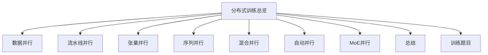
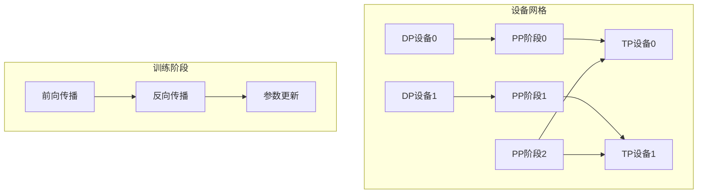
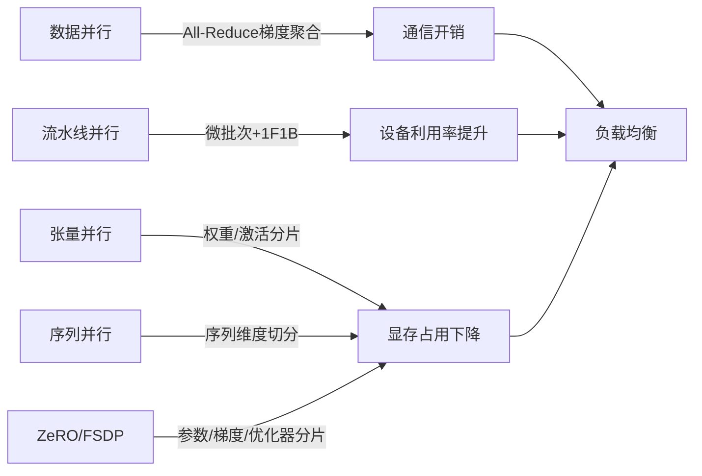

# 多维度混合并行

<cite>
**本文引用的文件**
- [04.分布式训练/6.多维度混合并行/6.多维度混合并行.md](file://04.分布式训练/6.多维度混合并行/6.多维度混合并行.md)
- [04.分布式训练/4.张量并行/4.张量并行.md](file://04.分布式训练/4.张量并行/4.张量并行.md)
- [04.分布式训练/3.流水线并行/3.流水线并行.md](file://04.分布式训练/3.流水线并行/3.流水线并行.md)
- [04.分布式训练/2.数据并行/2.数据并行.md](file://04.分布式训练/2.数据并行/2.数据并行.md)
- [04.分布式训练/9.总结/9.总结.md](file://04.分布式训练/9.总结/9.总结.md)
- [04.分布式训练/5.序列并行/5.序列并行.md](file://04.分布式训练/5.序列并行/5.序列并行.md)
- [04.分布式训练/7.自动并行/7.自动并行.md](file://04.分布式训练/7.自动并行/7.自动并行.md)
- [04.分布式训练/8.moe并行/8.moe并行.md](file://04.分布式训练/8.moe并行/8.moe并行.md)
- [04.分布式训练/分布式训练题目/分布式训练题目.md](file://04.分布式训练/分布式训练题目/分布式训练题目.md)
</cite>

## 目录
1. [引言](#引言)
2. [项目结构](#项目结构)
3. [核心组件](#核心组件)
4. [架构总览](#架构总览)
5. [详细组件分析](#详细组件分析)
6. [依赖关系分析](#依赖关系分析)
7. [性能考量](#性能考量)
8. [故障排查指南](#故障排查指南)
9. [结论](#结论)
10. [附录](#附录)

## 引言
本文件围绕“多维度混合并行”展开，系统阐述如何将数据并行（DP）、流水线并行（PP）、张量并行（TP）等策略组合使用，以最大化训练效率与资源利用率。文档从设计原则、通信拓扑、内存分配、性能调优到实际案例与监控诊断，提供一套面向工程实践的完整方法论。同时，结合业界典型大模型（如CodeGeeX、GPT-NeoX、GLM-130B、OPT-175B、Bloom-176B、Megatron-Turing NLG-530B）的混合并行配置，给出不同硬件拓扑下的最优组合策略与注意事项。

## 项目结构
本仓库与分布式训练相关的知识集中在“04.分布式训练”目录下，涵盖数据并行、流水线并行、张量并行、序列并行、混合并行、自动并行、MoE并行、总结与题目等主题。这些文档共同构成多维度混合并行的知识基础与实践参考。

章节来源
- [04.分布式训练/6.多维度混合并行/6.多维度混合并行.md:1-109](file://04.分布式训练/6.多维度混合并行/6.多维度混合并行.md#L1-L109)
- [04.分布式训练/4.张量并行/4.张量并行.md:1-441](file://04.分布式训练/4.张量并行/4.张量并行.md#L1-L441)
- [04.分布式训练/3.流水线并行/3.流水线并行.md:1-264](file://04.分布式训练/3.流水线并行/3.流水线并行.md#L1-L264)
- [04.分布式训练/2.数据并行/2.数据并行.md:1-330](file://04.分布式训练/2.数据并行/2.数据并行.md#L1-L330)
- [04.分布式训练/5.序列并行/5.序列并行.md:1-128](file://04.分布式训练/5.序列并行/5.序列并行.md#L1-L128)
- [04.分布式训练/7.自动并行/7.自动并行.md:1-274](file://04.分布式训练/7.自动并行/7.自动并行.md#L1-L274)
- [04.分布式训练/8.moe并行/8.moe并行.md:1-317](file://04.分布式训练/8.moe并行/8.moe并行.md#L1-L317)
- [04.分布式训练/9.总结/9.总结.md:1-125](file://04.分布式训练/9.总结/9.总结.md#L1-L125)
- [04.分布式训练/分布式训练题目/分布式训练题目.md:1-368](file://04.分布式训练/分布式训练题目/分布式训练题目.md#L1-L368)

## 核心组件
- 数据并行（DP）：通过在多个设备上复制完整模型，分别计算梯度并进行聚合，实现大规模数据与模型的并行训练。适用于显存受限但通信带宽充足的场景。
- 流水线并行（PP）：将模型层切分到不同设备，通过微批次（micro-batch）与交错调度（1F1B）降低气泡（bubble），提升设备利用率，降低单卡显存压力。
- 张量并行（TP）：在层内对权重与激活进行分片，减少单卡参数/激活占用，适合超大模型的参数规模扩展。
- 序列并行（SP）：对序列维度进行切分，降低注意力计算的二次方内存开销，支持更长序列训练。
- 混合并行（3D/多维）：DP+PP+TP组合，或引入ZeRO/FSDP，形成多维度混合策略，最大化吞吐与资源利用率。
- 自动并行：通过编译期/运行时搜索与调度，自动选择并组合并行策略，降低人工调参成本。
- MoE并行：在MoE层内/间进行专家并行与门控路由并行，结合数据/流水线/张量并行，实现千亿/万亿参数级别的稀疏模型训练。

章节来源
- [04.分布式训练/2.数据并行/2.数据并行.md:1-330](file://04.分布式训练/2.数据并行/2.数据并行.md#L1-L330)
- [04.分布式训练/3.流水线并行/3.流水线并行.md:1-264](file://04.分布式训练/3.流水线并行/3.流水线并行.md#L1-L264)
- [04.分布式训练/4.张量并行/4.张_tensor并行.md:1-441](file://04.分布式训练/4.张量并行/4.张量并行.md#L1-L441)
- [04.分布式训练/5.序列并行/5.序列并行.md:1-128](file://04.分布式训练/5.序列并行/5.序列并行.md#L1-L128)
- [04.分布式训练/6.多维度混合并行/6.多维度混合并行.md:1-109](file://04.分布式训练/6.多维度混合并行/6.多维度混合并行.md#L1-L109)
- [04.分布式训练/7.自动并行/7.自动并行.md:1-274](file://04.分布式训练/7.自动并行/7.自动并行.md#L1-L274)
- [04.分布式训练/8.moe并行/8.moe并行.md:1-317](file://04.分布式训练/8.moe并行/8.moe并行.md#L1-L317)

## 架构总览
多维度混合并行的核心思想是：在同一训练生命周期内，将不同维度的计算与通信进行解耦与协同，使设备在不同阶段承担不同职责，从而最大化整体吞吐与资源利用率。

图表来源
- [04.分布式训练/6.多维度混合并行/6.多维度混合并行.md:17-37](file://04.分布式训练/6.多维度混合并行/6.多维度混合并行.md#L17-L37)
- [04.分布式训练/3.流水线并行/3.流水线并行.md:110-158](file://04.分布式训练/3.流水线并行/3.流水线并行.md#L110-L158)
- [04.分布式训练/4.张量并行/4.张量并行.md:47-91](file://04.分布式训练/4.张量并行/4.张量并行.md#L47-L91)

## 详细组件分析

### 数据并行（DP）
- 设计原则：在设备间复制完整模型，通过梯度聚合实现参数同步；适合数据规模大、显存充足但通信带宽受限的场景。
- 关键点：
  - DDP采用All-Reduce聚合梯度，避免主卡瓶颈，提升负载均衡。
  - FSDP进一步将参数、梯度、优化器状态分片，降低峰值显存，适合超大模型。
- 与混合并行的结合：
  - 与PP/TP组合时，需关注梯度累积与分片一致性，避免ZeRO-2/3与PP叠加导致的额外通信开销。
  - 在节点间网络较慢时，可采用DP+PP+TP+ZeRO-1的组合策略。

章节来源
- [04.分布式训练/2.数据并行/2.数据并行.md:56-127](file://04.分布式训练/2.数据并行/2.数据并行.md#L56-L127)
- [04.分布式训练/2.数据并行/2.数据并行.md:143-330](file://04.分布式训练/2.数据并行/2.数据并行.md#L143-L330)
- [04.分布式训练/9.总结/9.总结.md:86-101](file://04.分布式训练/9.总结/9.总结.md#L86-L101)

### 流水线并行（PP）
- 设计原则：将模型层切分到不同设备，通过微批次与1F1B调度降低气泡，提升设备利用率。
- 关键点：
  - GPipe采用F-then-B，借助微批次与重计算（re-materialization）降低显存峰值。
  - PipeDream/2BW/Flush采用1F1B，减少激活缓存数量，节省显存；Megatron-LM的交错式1F1B进一步降低气泡但增加通信。
- 与混合并行的结合：
  - PP与ZeRO-2/3不兼容，PP+ZeRO-1更常见；可在节点间网络较慢时优先考虑ZeRO-1以降低梯度聚合通信。

章节来源
- [04.分布式训练/3.流水线并行/3.流水线并行.md:56-158](file://04.分布式训练/3.流水线并行/3.流水线并行.md#L56-L158)
- [04.分布式训练/3.流水线并行/3.流水线并行.md:211-235](file://04.分布式训练/3.流水线并行/3.流水线并行.md#L211-L235)
- [04.分布式训练/9.总结/9.总结.md:95-101](file://04.分布式训练/9.总结/9.总结.md#L95-L101)

### 张量并行（TP）
- 设计原则：在层内对权重与激活进行分片，降低单卡参数/激活占用，适合超大模型。
- 关键点：
  - 1D TP（Megatron-LM）直接对权重分片，通信以All-Reduce为主。
  - 2D/2.5D/3D TP（Colossal-AI）在输入与权重上进行多维切分，显著降低激活内存，但通信成本上升。
- 与混合并行的结合：
  - TP通常在节点内使用（NVLINK），节点间TP会显著降低GPU利用率。
  - 与PP/DP组合时，需平衡通信与计算，避免通信瓶颈。

章节来源
- [04.分布式训练/4.张量并行/4.张量并行.md:47-91](file://04.分布式训练/4.张量并行/4.张量并行.md#L47-L91)
- [04.分布式训练/4.张量并行/4.张量并行.md:118-167](file://04.分布式训练/4.张量并行/4.张量并行.md#L118-L167)
- [04.分布式训练/4.张量并行/4.张量并行.md:312-355](file://04.分布式训练/4.张量并行/4.张量并行.md#L312-L355)

### 序列并行（SP）
- 设计原则：对序列维度进行切分，降低注意力二次方内存开销，支持更长序列训练。
- 关键点：
  - Colossal-AI的SP通过环自注意力（RSA）与All-Gather/Reduce-Scatter实现通信。
  - Megatron-LM的SP将LayerNorm/Dropout按序列维度切分，降低激活峰值，配合重计算进一步节省显存。
- 与混合并行的结合：
  - SP与TP/PP可兼容，但需注意通信模式变化（All-Reduce→All-Gather/Reduce-Scatter）。

章节来源
- [04.分布式训练/5.序列并行/5.序列并行.md:1-128](file://04.分布式训练/5.序列并行/5.序列并行.md#L1-L128)

### 混合并行（DP+PP+TP）
- 设计原则：在不同维度上进行并行划分，避免通信瓶颈与负载不均，最大化吞吐与资源利用率。
- 关键点：
  - 3D并行（DP+PP+TP）是业界主流的大模型训练范式。
  - ZeRO-DP（ZeRO-1）与PP/TP结合，可进一步降低优化器状态与梯度内存占用。
  - 在节点间网络较慢时，可采用DP+PP+TP+ZeRO-1策略。
- 实战案例：
  - CodeGeeX：8路模型并行组+192路数据并行组+ZeRO-2。
  - GPT-NeoX：2路张量并行组+4路流水线并行组+数据并行组。
  - GLM-130B：4路张量并行组+8路流水线并行组+数据并行组+ZeRO-1。
  - OPT-175B：完全分片数据并行（FSDP，ZeRO-3）+张量并行（TP）。
  - Bloom-176B：3D并行（DP+PP+TP）。
  - Megatron-Turing NLG-530B：节点内TP（8路）+节点间PP（35路）+数据并行。

章节来源
- [04.分布式训练/6.多维度混合并行/6.多维度混合并行.md:39-109](file://04.分布式训练/6.多维度混合并行/6.多维度混合并行.md#L39-L109)
- [04.分布式训练/9.总结/9.总结.md:86-101](file://04.分布式训练/9.总结/9.总结.md#L86-L101)

### 自动并行
- 设计原则：通过编译期/运行时搜索与调度，自动选择并组合并行策略，降低人工调参成本。
- 关键点：
  - Mesh-TensorFlow/GSPMD：基于张量分片注解的半自动并行。
  - FlexFlow：SOAP搜索空间+执行模拟器，自动寻找高效并行策略。
  - Alpa：算子间/算子内并行自动划分，结合动态规划与整数线性规划，兼顾通信与计算。
- 与混合并行的关系：
  - 自动并行可作为混合并行的策略选择工具，辅助确定最优的DP/PP/TP组合与微批次/调度策略。

章节来源
- [04.分布式训练/7.自动并行/7.自动并行.md:1-274](file://04.分布式训练/7.自动并行/7.自动并行.md#L1-L274)

### MoE并行
- 设计原则：通过稀疏门控路由激活部分专家，实现千亿/万亿参数模型的高效训练。
- 关键点：
  - MoE+数据并行：门控与专家复制，简单但专家数量受单卡显存限制。
  - MoE+模型并行：专家独立放置，引入额外通信，可支持更多专家。
  - 业界方案：GShard、Switch-Transformer、GLaM等。
- 与混合并行的结合：
  - MoE层可与DP/PP/TP/ZerO结合，形成MoE+DP/PP/TP/ZerO的混合策略，以平衡通信与计算。

章节来源
- [04.分布式训练/8.moe并行/8.moe并行.md:1-317](file://04.分布式训练/8.moe并行/8.moe并行.md#L1-L317)

## 依赖关系分析
- 并行策略的耦合与解耦：
  - DP与PP/TP在通信与计算上存在耦合，需通过微批次与调度策略解耦。
  - TP与PP在节点内通信（NVLINK）与节点间通信（万兆网）的差异，决定了其适用场景。
  - ZeRO/FSDP与PP/TP的兼容性需谨慎评估，避免额外通信开销。
- 通信拓扑与带宽：
  - PP与ZeRO-2/3不兼容，PP+ZeRO-1更常见。
  - TP在节点内（NVLINK）通信成本低，节点间（万兆网）通信成本高。
- 内存分配与重计算：
  - GPipe的重计算（re-materialization）与PipeDream的1F1B调度显著降低显存峰值。
  - SP通过序列维度切分与All-Gather/Reduce-Scatter降低注意力内存。

图表来源
- [04.分布式训练/2.数据并行/2.数据并行.md:143-330](file://04.分布式训练/2.数据并行/2.数据并行.md#L143-L330)
- [04.分布式训练/3.流水线并行/3.流水线并行.md:56-158](file://04.分布式训练/3.流水线并行/3.流水线并行.md#L56-L158)
- [04.分布式训练/4.张量并行/4.张量并行.md:118-167](file://04.分布式训练/4.张量并行/4.张量并行.md#L118-L167)
- [04.分布式训练/5.序列并行/5.序列并行.md:1-128](file://04.分布式训练/5.序列并行/5.序列并行.md#L1-L128)
- [04.分布式训练/9.总结/9.总结.md:86-101](file://04.分布式训练/9.总结/9.总结.md#L86-L101)

章节来源
- [04.分布式训练/9.总结/9.总结.md:86-101](file://04.分布式训练/9.总结/9.总结.md#L86-L101)
- [04.分布式训练/分布式训练题目/分布式训练题目.md:320-368](file://04.分布式训练/分布式训练题目/分布式训练题目.md#L320-L368)

## 性能考量
- 通信与计算平衡：
  - PP通过微批次与1F1B降低气泡，但增加通信；TP在节点内通信成本低，节点间成本高。
  - ZeRO-1/2/3与PP的兼容性需谨慎评估，避免额外通信开销。
- 显存与内存优化：
  - GPipe重计算与PipeDream 1F1B显著降低显存峰值；SP通过序列维度切分降低注意力内存。
  - FSDP/ZeRO通过参数/梯度/优化器分片降低峰值显存。
- 硬件拓扑与网络带宽：
  - 节点内NVLINK高速互联适合TP；节点间万兆网适合DP+PP+TP+ZeRO-1组合。
- 混合精度与数值稳定性：
  - FP16在巨型模型中易溢出，BF16提供更宽动态范围；OPT-175B、Bloom-176B、GLM-130B等采用BF16。

章节来源
- [04.分布式训练/9.总结/9.总结.md:110-125](file://04.分布式训练/9.总结/9.总结.md#L110-L125)
- [04.分布式训练/分布式训练题目/分布式训练题目.md:150-173](file://04.分布式训练/分布式训练题目/分布式训练题目.md#L150-L173)

## 故障排查指南
- 常见问题与定位：
  - 气泡（bubble）过大：检查微批次数量与1F1B调度策略，确认PP阶段数与微批次数匹配。
  - 显存不足：启用重计算（re-materialization）、1F1B调度、SP或FSDP/ZeRO分片。
  - 通信瓶颈：评估节点内/节点间网络带宽，避免节点间TP；在万兆网下优先考虑ZeRO-1或DP+PP+TP+ZeRO-1。
  - 梯度聚合异常：确认ZeRO-2/3与PP的兼容性，优先采用ZeRO-1或FSDP。
- 监控与诊断：
  - 关注设备利用率、通信时间占比、显存峰值与梯度聚合时间。
  - 在PP中，检查微批次与阶段数的匹配，避免过度切分导致通信开销上升。
  - 在TP中，检查节点内NVLINK是否可用，避免节点间TP导致利用率骤降。

章节来源
- [04.分布式训练/3.流水线并行/3.流水线并行.md:110-158](file://04.分布式训练/3.流水线并行/3.流水线并行.md#L110-L158)
- [04.分布式训练/2.数据并行/2.数据并行.md:143-330](file://04.分布式训练/2.数据并行/2.数据并行.md#L143-L330)
- [04.分布式训练/9.总结/9.总结.md:86-101](file://04.分布式训练/9.总结/9.总结.md#L86-L101)

## 结论
多维度混合并行是实现超大规模模型高效训练的关键路径。通过在数据、流水线、张量、序列等维度上进行合理切分与调度，结合ZeRO/FSDP等显存优化技术，可在不同硬件拓扑与网络条件下实现吞吐与资源利用率的最大化。实践中应重视通信与计算的平衡、显存与内存的优化，并借助自动并行工具与监控手段，持续调优并行策略。

## 附录
- 实战案例与配置要点：
  - CodeGeeX：8路TP+192路DP+ZeRO-2，强调优化器状态分片。
  - GPT-NeoX：2路TP+4路PP+DP，节点内通信优先，节点间通信次之。
  - GLM-130B：4路TP+8路PP+DP+ZeRO-1，采用DeepSpeed PipeDream-Flush减少气泡。
  - OPT-175B：FSDP（ZeRO-3）+TP，强调参数分片与动态损失缩放。
  - Bloom-176B：3D并行（DP+PP+TP），节点间网络带宽充足。
  - Megatron-Turing NLG-530B：节点内TP（8路）+节点间PP（35路）+DP，强调TP在节点内使用。

章节来源
- [04.分布式训练/6.多维度混合并行/6.多维度混合并行.md:39-109](file://04.分布式训练/6.多维度混合并行/6.多维度混合并行.md#L39-L109)