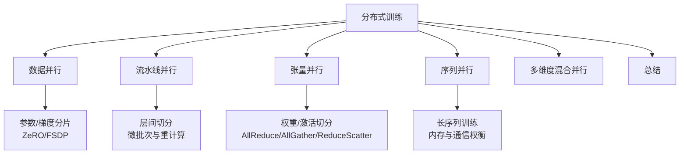
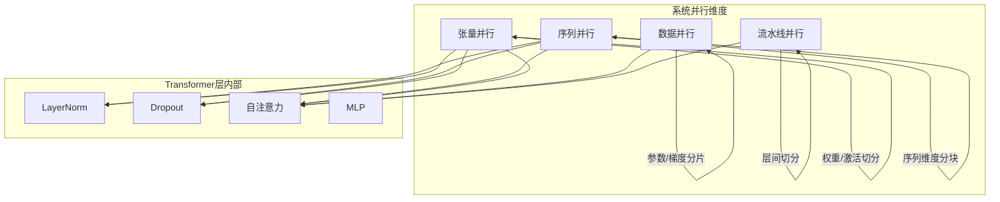
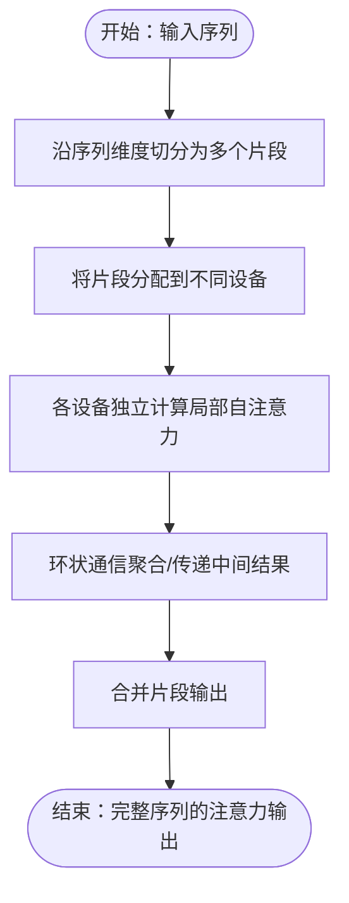
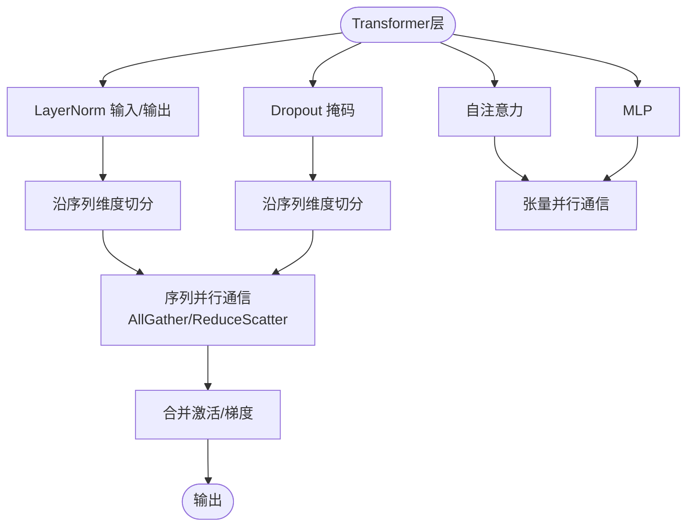
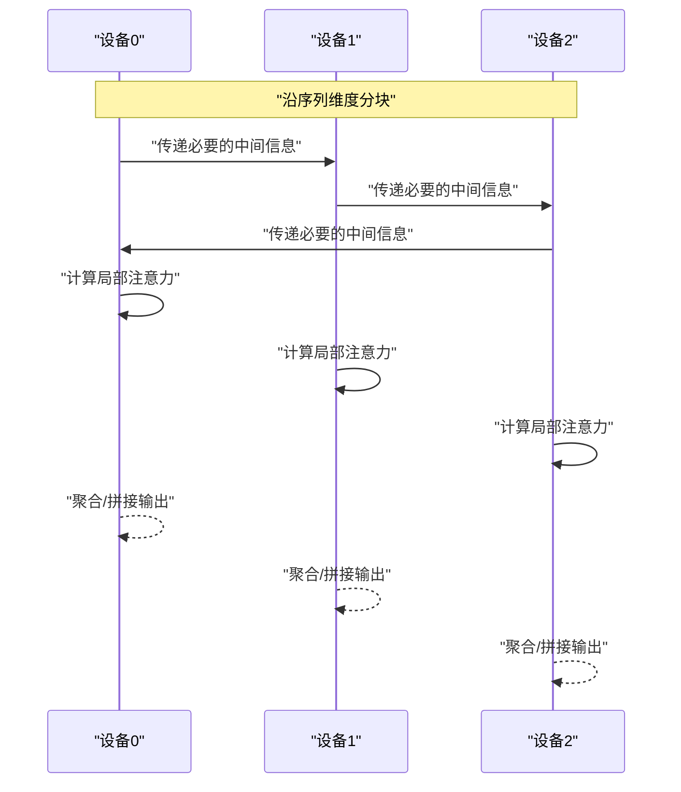
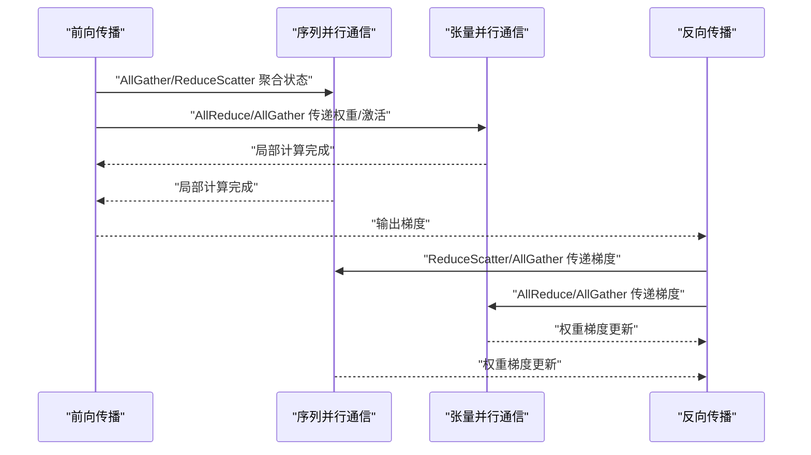
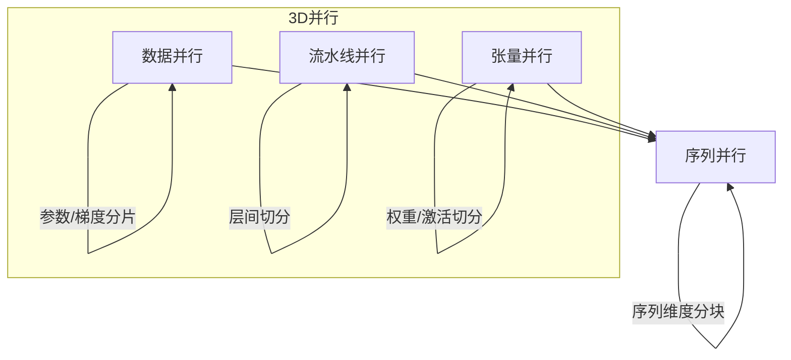
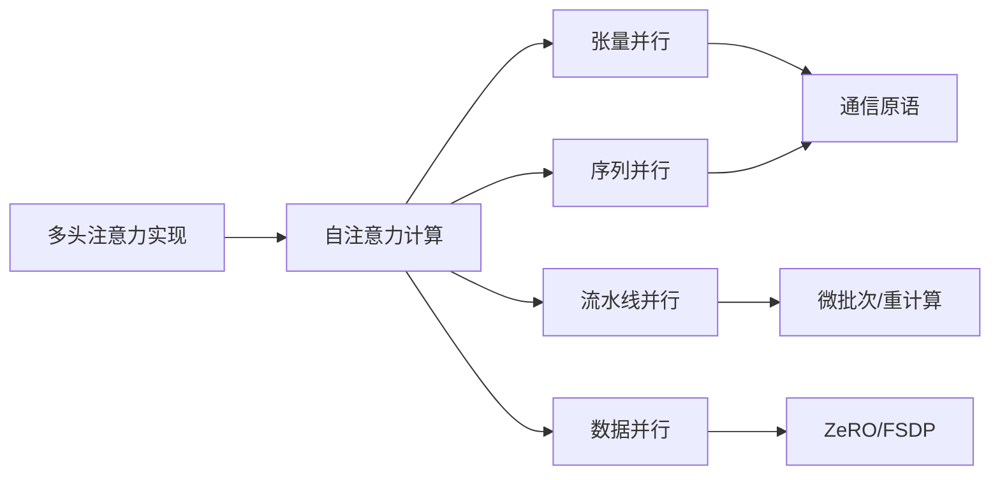

# 序列并行

<cite>
**本文引用的文件**
- [5.序列并行.md](file://04.分布式训练/5.序列并行/5.序列并平行.md)
- [6.多维度混合并行.md](file://04.分布式训练/6.多维度混合并行/6.多维度混合并行.md)
- [9.总结.md](file://04.分布式训练/9.总结/9.总结.md)
- [4.张量并行.md](file://04.分布式训练/4.张量并行/4.张量并行.md)
- [3.流水线并行.md](file://04.分布式训练/3.流水线并行/3.流水线并行.md)
- [2.数据并行.md](file://04.分布式训练/2.数据并行/2.数据并行.md)
- [MHA_MQA_GQA.md](file://02.大语言模型架构/MHA_MQA_GQA/MHA_MQA_GQA.md)
- [Transformer架构细节.md](file://02.大语言模型架构/Transformer架构细节/Transformer架构细节.md)
</cite>

## 目录
1. [引言](#引言)
2. [项目结构](#项目结构)
3. [核心组件](#核心组件)
4. [架构总览](#架构总览)
5. [详细组件分析](#详细组件分析)
6. [依赖分析](#依赖分析)
7. [性能考量](#性能考量)
8. [故障排查指南](#故障排查指南)
9. [结论](#结论)
10. [附录](#附录)

## 引言
本文件围绕“序列并行”展开，系统阐述其在长序列训练中的作用、与张量并行/数据并行/流水线并行的组合策略、在Transformer注意力计算中的关键挑战（跨片段注意力、状态传递、梯度传播），以及在不同序列长度下的性能优化方法。文档同时给出与仓库现有分布式训练知识体系的衔接，帮助读者理解序列并行在实际工程中的权衡与取舍。

## 项目结构
本仓库将序列并行置于“分布式训练”主题之下，配套有张量并行、数据并行、流水线并行、多维度混合并行与总结等章节，便于读者从系统视角理解序列并行的定位与协同。

图表来源
- [5.序列并行.md:1-128](file://04.分布式训练/5.序列并行/5.序列并行.md#L1-L128)
- [6.多维度混合并行.md:1-109](file://04.分布式训练/6.多维度混合并行/6.多维度混合并行.md#L1-L109)
- [9.总结.md:1-125](file://04.分布式训练/9.总结/9.总结.md#L1-L125)

章节来源
- [5.序列并行.md:1-128](file://04.分布式训练/5.序列并行/5.序列并行.md#L1-L128)
- [6.多维度混合并行.md:1-109](file://04.分布式训练/6.多维度混合并行/6.多维度混合并行.md#L1-L109)
- [9.总结.md:1-125](file://04.分布式训练/9.总结/9.总结.md#L1-L125)

## 核心组件
- 序列并行（Colossal-AI）：面向“输入序列长度限制”，通过沿序列维度分块并在设备间进行环状通信，实现长序列训练；与数据并行、流水线并行、张量并行兼容。
- 序列并行（Megatron-LM）：面向“显存占用优化”，将Transformer层中的LayerNorm/Dropout等沿序列维度切分，降低激活值与计算的显存占用；在张量并行基础上叠加序列并行，通信由AllReduce替换为AllGather/ReduceScatter。
- 与注意力计算的关系：自注意力的内存复杂度与序列长度的平方相关，序列并行通过分块与环自注意力（RSA）缓解长序列依赖带来的内存压力。
- 与并行策略的组合：序列并行可与数据并行、流水线并行、张塔并行协同，形成3D/多维混合并行，以平衡通信与内存开销。

章节来源
- [5.序列并行.md:3-29](file://04.分布式训练/5.序列并行/5.序列并行.md#L3-L29)
- [5.序列并行.md:31-96](file://04.分布式训练/5.序列并行/5.序列并行.md#L31-L96)
- [6.多维度混合并行.md:17-37](file://04.分布式训练/6.多维度混合并行/6.多维度混合并行.md#L17-L37)
- [9.总结.md:21-30](file://04.分布式训练/9.总结/9.总结.md#L21-L30)

## 架构总览
序列并行在系统层面的定位与交互如下：

图表来源
- [5.序列并行.md:31-96](file://04.分布式训练/5.序列并行/5.序列并行.md#L31-L96)
- [6.多维度混合并行.md:17-37](file://04.分布式训练/6.多维度混合并行/6.多维度混合并行.md#L17-L37)

## 详细组件分析

### 组件A：Colossal-AI 序列并行（长序列训练）
- 目标：突破单设备序列长度限制，支持更长序列的训练。
- 关键机制：
  - 将输入序列沿序列维度切分为多个片段，分配到不同设备。
  - 通过环状通信与自注意力计算结合，提出环自注意力（RSA）。
  - 实验表明在64卡环境下，相较张量并行，可显著提升最大批量大小与序列长度。
- 与注意力的关系：自注意力的内存需求与序列长度平方相关，序列并行通过分块与环通信降低单设备激活峰值，从而支持更长序列。

图表来源
- [5.序列并行.md:13-29](file://04.分布式训练/5.序列并行/5.序列并行.md#L13-L29)

章节来源
- [5.序列并行.md:3-29](file://04.分布式训练/5.序列并行/5.序列并行.md#L3-L29)

### 组件B：Megatron-LM 序列并行（显存优化）
- 目标：在张量并行基础上，进一步摊薄LayerNorm/Dropout等模块的显存与计算。
- 关键机制：
  - 将Transformer层中的LayerNorm与Dropout输入按序列维度切分，使各设备仅处理部分序列。
  - 在张量并行+序列并行的组合下，通信由AllReduce替换为AllGather/ReduceScatter，总通信量等价。
  - 通过选择性激活重计算（Selective Activation Recompute）进一步降低激活值开销。
- 显存分析：在开启张量并行后，仍有一部分显存由LayerNorm/Dropout输入/输出承担；序列并行将这些显存也进行分摊，进一步降低峰值显存。

图表来源
- [5.序列并行.md:39-96](file://04.分布式训练/5.序列并行/5.序列并行.md#L39-L96)

章节来源
- [5.序列并行.md:31-96](file://04.分布式训练/5.序列并行/5.序列并行.md#L31-L96)

### 组件C：注意力计算中的跨片段处理
- 问题：自注意力在序列维度上存在全局依赖，如何在分块后维持正确的注意力分数与输出？
- 方法：Colossal-AI 的环自注意力（RSA）通过环状通信在相邻设备间传递必要的中间信息，使每个设备在计算局部注意力时能“看到”跨片段的信息。
- 与实现的关系：仓库中提供了多头注意力的实现示例，可作为理解注意力计算与并行化映射的基础。

图表来源
- [5.序列并行.md:13-17](file://04.分布式训练/5.序列并行/5.序列并行.md#L13-L17)
- [MHA_MQA_GQA.md:33-87](file://02.大语言模型架构/MHA_MQA_GQA/MHA_MQA_GQA.md#L33-L87)

章节来源
- [5.序列并行.md:13-17](file://04.分布式训练/5.序列并行/5.序列并行.md#L13-L17)
- [MHA_MQA_GQA.md:33-87](file://02.大语言模型架构/MHA_MQA_GQA/MHA_MQA_GQA.md#L33-L87)

### 组件D：状态传递与梯度传播
- 状态传递：序列并行在张量并行+序列并行组合下，使用AllGather/ReduceScatter进行状态聚合与分发，确保各设备持有完整或局部的状态。
- 梯度传播：在反向传播中，序列并行与张量并行的通信模式相互配合，通过重叠通信与计算（如ReduceScatter与权重梯度计算的重叠）提升设备FLOPs利用率。
- 与流水线并行的协同：流水线并行通过微批次与重计算降低显存峰值，序列并行通过分块与环通信降低长序列依赖的内存压力，二者结合可在不同硬件条件下取得更好吞吐。

图表来源
- [5.序列并行.md:76-96](file://04.分布式训练/5.序列并行/5.序列并行.md#L76-L96)
- [3.流水线并行.md:98-106](file://04.分布式训练/3.流水线并行/3.流水线并行.md#L98-L106)

章节来源
- [5.序列并行.md:76-96](file://04.分布式训练/5.序列并行/5.序列并行.md#L76-L96)
- [3.流水线并行.md:98-106](file://04.分布式训练/3.流水线并行/3.流水线并行.md#L98-L106)

### 组件E：与张量并行、数据并行、流水线并行的组合策略
- 3D并行（DP + PP + TP）：在节点内优先使用TP/PP，节点间使用DP，通信开销可控。
- ZeRO-DP + PP + TP：ZeRO阶段1对优化器状态分片，与PP/TP结合；阶段2/3对梯度/参数分片，但与PP结合可能带来额外通信开销。
- 多维混合并行：结合DP/PP/TP/ZeRO，形成不同规模与网络拓扑的组合，以平衡吞吐与显存。
- 与序列并行的兼容性：序列并行与DP/PP/TP均可兼容，可作为长序列训练与显存优化的补充手段。

图表来源
- [6.多维度混合并行.md:17-37](file://04.分布式训练/6.多维度混合并行/6.多维度混合并行.md#L17-L37)
- [9.总结.md:97-101](file://04.分布式训练/9.总结/9.总结.md#L97-L101)

章节来源
- [6.多维度混合并行.md:17-37](file://04.分布式训练/6.多维度混合并行/6.多维度混合并行.md#L17-L37)
- [9.总结.md:97-101](file://04.分布式训练/9.总结/9.总结.md#L97-L101)

## 依赖分析
- 与注意力实现的依赖：注意力计算的实现（如多头注意力）为理解序列并行在Transformer中的落地提供基础。
- 与并行策略的耦合：序列并行与张量并行、流水线并行、数据并行存在互补关系；与ZeRO/FSDP在显存与通信上的权衡密切相关。
- 与系统实现的耦合：序列并行在工程上依赖设备网格、通信原语（AllGather/ReduceScatter/AllReduce）与微批次调度策略。

图表来源
- [MHA_MQA_GQA.md:33-87](file://02.大语言模型架构/MHA_MQA_GQA/MHA_MQA_GQA.md#L33-L87)
- [5.序列并行.md:76-96](file://04.分布式训练/5.序列并行/5.序列并行.md#L76-L96)
- [3.流水线并行.md:98-106](file://04.分布式训练/3.流水线并行/3.流水线并行.md#L98-L106)
- [2.数据并行.md:147-161](file://04.分布式训练/2.数据并行/2.数据并行.md#L147-L161)

章节来源
- [MHA_MQA_GQA.md:33-87](file://02.大语言模型架构/MHA_MQA_GQA/MHA_MQA_GQA.md#L33-L87)
- [5.序列并行.md:76-96](file://04.分布式训练/5.序列并行/5.序列并行.md#L76-L96)
- [3.流水线并行.md:98-106](file://04.分布式训练/3.流水线并行/3.流水线并行.md#L98-L106)
- [2.数据并行.md:147-161](file://04.分布式训练/2.数据并行/2.数据并行.md#L147-L161)

## 性能考量
- 内存与通信权衡：序列并行通过分块降低单设备激活峰值，但引入环状通信；与张量并行/流水线并行组合时，需综合考虑通信与计算的重叠。
- 选择性激活重计算：在Megatron-LM的序列并行中，通过选择性激活重计算进一步降低激活值开销，提升吞吐。
- 多维混合并行：在节点内优先使用TP/PP，节点间使用DP，结合ZeRO阶段1/2/3，以平衡显存与通信。
- 序列长度与批量大小：Colossal-AI的序列并行在64卡环境下显著提升最大批量大小与序列长度，适合长序列训练场景。

章节来源
- [5.序列并行.md:25-29](file://04.分布式训练/5.序列并行/5.序列并行.md#L25-L29)
- [5.序列并行.md:92-96](file://04.分布式训练/5.序列并行/5.序列并行.md#L92-L96)
- [6.多维度混合并行.md:17-37](file://04.分布式训练/6.多维度混合并行/6.多维度混合并行.md#L17-L37)

## 故障排查指南
- 通信异常：序列并行依赖AllGather/ReduceScatter/AllReduce，若通信拓扑不当或设备网格配置错误，可能导致死锁或性能下降。检查设备网格、通信后端与拓扑。
- 显存溢出：在开启序列并行后，仍需关注LayerNorm/Dropout等模块的显存占用；可通过选择性激活重计算与流水线并行的微批次策略缓解。
- 梯度一致性：在张量并行+序列并行组合下，确保ReduceScatter与AllGather的配对正确，避免梯度错配。
- 批量大小与序列长度：在长序列场景下，适当调整微批次大小与序列分块大小，以平衡吞吐与显存。

章节来源
- [5.序列并行.md:76-96](file://04.分布式训练/5.序列并行/5.序列并行.md#L76-L96)
- [3.流水线并行.md:98-106](file://04.分布式训练/3.流水线并行/3.流水线并行.md#L98-L106)
- [2.数据并行.md:147-161](file://04.分布式训练/2.数据并行/2.数据并行.md#L147-L161)

## 结论
序列并行在长序列训练与显存优化方面提供了两条互补路径：Colossal-AI的序列并行侧重突破输入序列长度限制，Megatron-LM的序列并行侧重显存摊薄与通信重叠。在实际工程中，序列并行可与数据并行、流水线并行、张量并行协同，形成多维混合并行策略，以在不同硬件与任务规模下取得最佳吞吐与显存平衡。

## 附录
- PyTorch中的序列并行支持：仓库指出PyTorch在2.0.0版本中开始支持序列并行（尚未发布），可参考相应示例进行并行化模块的封装与训练循环。
- Transformer注意力基础：仓库提供了多头注意力的实现示例，有助于理解注意力计算与并行映射关系。

章节来源
- [5.序列并行.md:98-123](file://04.分布式训练/5.序列并行/5.序列并行.md#L98-L123)
- [MHA_MQA_GQA.md:33-87](file://02.大语言模型架构/MHA_MQA_GQA/MHA_MQA_GQA.md#L33-L87)