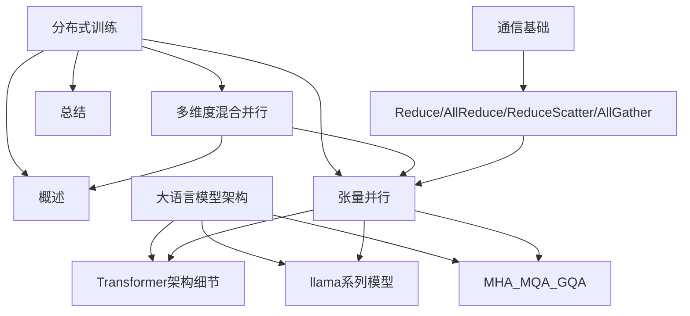
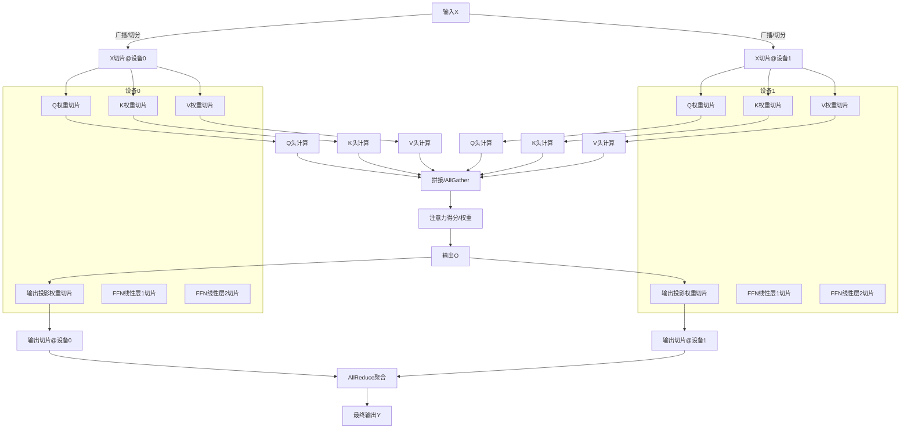
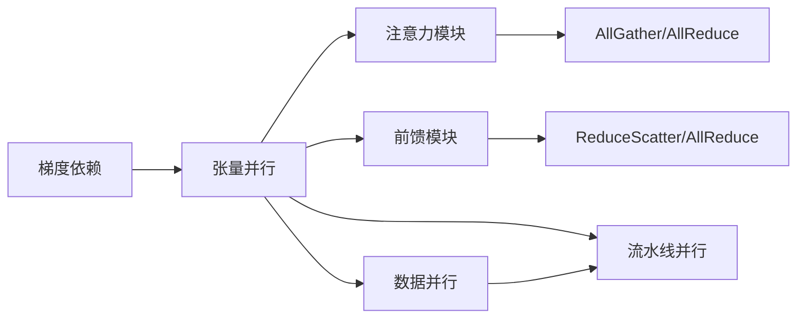

# 张量并行

<cite>
**本文引用的文件列表**
- [4.张量并行.md](file://04.分布式训练/4.张量并行/4.张量并行.md)
- [6.多维度混合并行.md](file://04.分布式训练/6.多维度混合并行/6.多维度混合并行.md)
- [9.总结.md](file://04.分布式训练/9.总结/9.总结.md)
- [1.概述.md](file://04.分布式训练/1.概述/1.概述.md)
- [Transformer架构细节.md](file://02.大语言模型架构/Transformer架构细节/Transformer架构细节.md)
- [llama系列模型.md](file://02.大语言模型架构/llama系列模型/llama系列模型.md)
- [MHA_MQA_GQA.md](file://02.大语言模型架构/MHA_MQA_GQA/MHA_MQA_GQA.md)
</cite>

## 更新摘要
**变更内容**
- 新增了详细的梯度跨卡依赖分析章节，深入解释行并行和列并行在梯度计算中的通信需求
- 增强了通信模式的说明，提供了具体的All-Reduce、All-Gather等操作在不同并行方式下的应用场景
- 更新了实际代码示例，增加了更多实用的实现细节
- 完善了张量并行在实际大模型训练中的应用指导

## 目录
1. [简介](#简介)
2. [项目结构](#项目结构)
3. [核心组件](#核心组件)
4. [架构总览](#架构总览)
5. [详细组件分析](#详细组件分析)
6. [依赖分析](#依赖分析)
7. [性能考量](#性能考量)
8. [故障排查指南](#故障排查指南)
9. [结论](#结论)
10. [附录](#附录)

## 简介
本文件围绕张量并行技术进行系统化梳理，目标是帮助读者从原理、实现、通信模式、内存与通信权衡、可扩展性，以及与模型并行（流水线并行、数据并行）的协同使用等方面，全面掌握张量并行在大模型训练中的关键要点。文档同时结合 Megatron-LM 的 1D 张量并行、Colossal-AI 的 2D/2.5D/3D 张量并行，以及 PyTorch 2.0 的 DTensor 抽象，给出可操作的参考路径与可视化图示。

**更新** 新增了详细的梯度跨卡依赖分析，帮助读者更好地理解不同并行方式在梯度计算中的通信需求。

## 项目结构
本仓库与张量并行相关的主要内容集中在"分布式训练"与"大语言模型架构"两大板块：
- 分布式训练：涵盖张量并行、流水线并行、数据并行、混合并行策略与业界实践。
- 大语言模型架构：涵盖 Transformer 结构、注意力机制（MHA/MQA/GQA）、前馈网络等，为张量并行在注意力与前馈模块中的切分提供背景知识。

**图表来源**
- [4.张量并行.md:1-476](file://04.分布式训练/4.张量并行/4.张量并行.md#L1-L476)
- [6.多维度混合并行.md:1-109](file://04.分布式训练/6.多维度混合并行/6.多维度混合并行.md#L1-L109)
- [9.总结.md:1-176](file://04.分布式训练/9.总结/9.总结.md#L1-L176)
- [1.概述.md:1-102](file://04.分布式训练/1.概述/1.概述.md#L1-L102)
- [Transformer架构细节.md:1-370](file://02.大语言模型架构/Transformer架构细节/Transformer架构细节.md#L1-L370)
- [llama系列模型.md:1-382](file://02.大语言模型架构/llama系列模型/llama系列模型.md#L1-L382)
- [MHA_MQA_GQA.md:1-225](file://02.大语言模型架构/MHA_MQA_GQA/MHA_MQA_GQA.md#L1-L225)

**章节来源**
- [4.张量并行.md:1-476](file://04.分布式训练/4.张量并行/4.张量并行.md#L1-L476)
- [6.多维度混合并行.md:1-109](file://04.分布式训练/6.多维度混合并行/6.多维度混合并行.md#L1-L109)
- [9.总结.md:1-176](file://04.分布式训练/9.总结/9.总结.md#L1-L176)
- [1.概述.md:1-102](file://04.分布式训练/1.概述/1.概述.md#L1-L102)

## 核心组件
- 张量并行基础：将模型权重矩阵按某一维度切分，分配到不同设备，配合通信实现等价的计算结果。
- 列切分（Column Parallel）与行切分（Row Parallel）：分别对应对权重按列切分与按行切分，以及对输入/输出的相应切分。
- 通信原语：All-Gather、Split、Reduce-Scatter、AllReduce 等，支撑跨设备的权重/激活聚合与梯度规约。
- 多维张量并行：2D/2.5D/3D 并行在激活切分、通信成本与内存占用之间的权衡。
- PyTorch DTensor：提供通用的张量并行抽象，便于与 DDP/FSDP 等策略组合。
- **梯度跨卡依赖**：详细分析不同并行方式在梯度计算中的通信需求，包括权重梯度和输入梯度的依赖关系。

**更新** 新增了梯度跨卡依赖分析，这是理解张量并行实现细节的关键内容。

**章节来源**
- [4.张量并行.md:13-102](file://04.分布式训练/4.张量并行/4.张量并行.md#L13-L102)
- [4.张量并行.md:444-476](file://04.分布式训练/4.张量并行/4.张量并行.md#L444-L476)
- [6.多维度混合并行.md:17-109](file://04.分布式训练/6.多维度混合并行/6.多维度混合并行.md#L17-L109)

## 架构总览
下图展示了张量并行在 Transformer 中的典型应用：注意力（MHA）与前馈（FFN）模块的权重切分与通信协作，以及与流水线并行、数据并行的组合。

**图表来源**
- [4.张量并行.md:63-91](file://04.分布式训练/4.张量并行/4.张量并行.md#L63-L91)
- [Transformer架构细节.md:245-256](file://02.大语言模型架构/Transformer架构细节/Transformer架构细节.md#L245-L256)

## 详细组件分析

### 原理与切分方式
- 列切分（Column Parallel）：对权重按列切分，输入按行广播/切分，适合注意力的 Q/K/V 投影与 FFN 的前向线性层。
- 行切分（Row Parallel）：对权重按行切分，输出按列拼接，适合注意力输出投影与 FFN 的后向线性层。
- 通信配合：在切分点前后使用 All-Gather/AllReduce/Reduce-Scatter/Split 等原语，保证计算等价性与梯度一致性。

**更新** 新增了梯度跨卡依赖分析，详细说明了不同并行方式在权重梯度和输入梯度计算中的通信需求。

**章节来源**
- [4.张量并行.md:13-91](file://04.分布式训练/4.张量并行/4.张量并行.md#L13-L91)
- [4.张量并行.md:444-476](file://04.分布式训练/4.张量并行/4.张量并行.md#L444-L476)

### Megatron-LM 的 1D 张量并行
- 针对 Transformer 的 MHA 与 FFN，采用列切分（Q/K/V）与行切分（输出投影）的组合。
- 前向/反向通信：MLP 层中 g 的 forward 使用 AllReduce 聚合 Z，f 的 backward 使用 AllReduce 聚合梯度。
- 注意力层：Q/K/V 按列切分，输出投影按行切分；头数与 GPU 数需整除，便于均匀分配。

**更新** 增强了对梯度通信的说明，特别是 MLP 层中 AllReduce 操作在不同阶段的应用。

**章节来源**
- [4.张量并行.md:63-91](file://04.分布式训练/4.张量并行/4.张量并行.md#L63-L91)

### Colossal-AI 的多维张量并行
- 2D 张量并行：对输入与权重同时沿两个维度切分，激活也被切分，降低激活内存，但通信成本上升。
- 2.5D 张量并行：在 2D 基础上引入第三个维度，通过更多设备减少通信开销。
- 3D 张量并行：进一步细化切分，减少激活冗余与通信成本，适合更大规模集群。

**更新** 新增了对 3D 张量并行中 Reduce-Scatter 和 All-Gather 操作的详细说明。

**章节来源**
- [4.张量并行.md:110-382](file://04.分布式训练/4.张量并行/4.张量并行.md#L110-L382)

### PyTorch DTensor 的张量并行抽象
- 通过 DeviceMesh 与并行策略（如 PairwiseParallel）对模块进行并行化，支持 eager 模式下的张量并行。
- 与 DDP/FSDP 等策略组合，提供统一的 checkpoint 与分布式训练布局抽象。

**更新** 增强了对 DTensor 在实际应用中的通信优化说明。

**章节来源**
- [4.张量并行.md:384-434](file://04.分布式训练/4.张量并行/4.张量并行.md#L384-L434)

### 注意力与前馈网络中的切分
- 注意力（MHA）：Q/K/V 按列切分，头独立计算，最后拼接；输出投影按行切分。
- 前馈（FFN）：线性层 A 按列切分，线性层 B 按行切分；激活在切分点前后进行 All-Gather/AllReduce。

**更新** 新增了对注意力层中 Q、K、V 三个参数矩阵切分的详细说明。

**章节来源**
- [4.张量并行.md:63-91](file://04.分布式训练/4.张量并行/4.张量并行.md#L63-L91)
- [Transformer架构细节.md:245-256](file://02.大语言模型架构/Transformer架构细节/Transformer架构细节.md#L245-L256)

### 通信原语与优化
- All-Gather：拼接各设备上的局部激活/权重，得到完整张量。
- Split：将完整张量切分为多份，广播到各设备。
- Reduce-Scatter：对局部梯度/激活进行规约后分发，降低通信带宽。
- AllReduce：对梯度进行全局规约，保证一致性。

**更新** 新增了对不同并行方式下通信原语使用场景的详细分析。

**章节来源**
- [4.张量并行.md:444-476](file://04.分布式训练/4.张量并行/4.张量并行.md#L444-L476)

### 与流水线并行、数据并行的组合
- 3D 并行（DP + PP + TP）：在节点内使用 TP，节点间使用 PP，数据并行用于扩大批大小。
- ZeRO-DP + PP + TP：在 PP 与 TP 基础上引入 ZeRO 阶段 1/2/3，减少优化器状态与梯度冗余。
- 业界实践：Bloom、GLM、OPT、Megatron-Turing NLG 等模型采用不同组合策略。

**更新** 增强了对混合并行策略中通信优化的说明。

**章节来源**
- [6.多维度混合并行.md:17-109](file://04.分布式训练/6.多维度混合并行/6.多维度混合并行.md#L17-L109)
- [9.总结.md:32-101](file://04.分布式训练/9.总结/9.总结.md#L32-L101)

### 梯度跨卡依赖分析

**更新** 这是新增的重要内容，详细分析了不同并行方式在梯度计算中的通信需求。

#### 行并行的梯度依赖
- **权重梯度**：∂L/∂A1 = X1^T · ∂L/∂Y，GPU0 有 X1 和 ∂L/∂Y（All-Reduce 后每卡都有），可以独立计算
- **输入梯度**：∂L/∂X = [∂L/∂X1  ∂L/∂X2]，每张卡只能算出一个分片，必须通过 All-Gather 拼接得到完整输入梯度

#### 列并行的梯度依赖
- **权重梯度**：∂L/∂A1 = X^T · ∂L/∂Y1，各卡独立计算
- **输入梯度**：∂L/∂X = ∂L/∂Y1 · A1^T + ∂L/∂Y2 · A2^T，必须 All-Reduce 求和

#### 完整通信模式对比
| 并行方式 | 前向通信 | 权重梯度通信 | 输入梯度通信 |
|---------|---------|------------|------------|
| 列并行 | 无 | 无 | All-Reduce（求和） |
| 行并行 | All-Reduce（求和） | 无 | All-Gather（拼接） |

**关键区分**：权重梯度无跨卡依赖（各卡只更新自己的参数分片）；输入梯度有跨卡依赖（传给前一层需要完整信息）。Megatron-LM 的 MLP 层（列并行+行并行组合）一个 Transformer 层共 4 次 All-Reduce。

**章节来源**
- [4.张量并行.md:444-476](file://04.分布式训练/4.张量并行/4.张量并行.md#L444-L476)

## 依赖分析
张量并行在大模型训练中的依赖关系如下：
- 模型结构依赖：Transformer 的注意力与前馈模块是切分与通信的关键对象。
- 通信依赖：All-Gather/AllReduce/Reduce-Scatter/Split 的组合决定了通信与内存的权衡。
- 并行策略依赖：与数据并行、流水线并行的组合影响整体吞吐与延迟。
- **梯度依赖**：不同并行方式在权重梯度和输入梯度计算中的通信需求不同。

**更新** 新增了梯度依赖分析，这是理解张量并行实现细节的关键。

**图表来源**
- [4.张量并行.md:63-91](file://04.分布式训练/4.张量并行/4.张量并行.md#L63-L91)
- [4.张量并行.md:444-476](file://04.分布式训练/4.张量并行/4.张量并行.md#L444-L476)
- [6.多维度混合并行.md:17-37](file://04.分布式训练/6.多维度混合并行/6.多维度混合并行.md#L17-L37)

**章节来源**
- [4.张量并行.md:63-91](file://04.分布式训练/4.张量并行/4.张量并行.md#L63-L91)
- [4.张量并行.md:444-476](file://04.分布式训练/4.张量并行/4.张量并行.md#L444-L476)
- [6.多维度混合并行.md:17-37](file://04.分布式训练/6.多维度混合并行/6.多维度混合并行.md#L17-L37)

## 性能考量
- 计算与内存：1D 张量并行在激活内存上无切分，通信成本随并行度上升；2D/3D 并行显著降低激活内存，但通信成本上升。
- 通信成本：Ring-based 算法下的通信带宽与时延与并行度呈非线性关系，需结合拓扑与网络带宽进行评估。
- 混合并行：在节点内使用 TP，节点间使用 PP 与 DP，可最大化吞吐并控制延迟。
- 精度与稳定性：BF16 相比 FP16 更稳定，适合超大规模模型训练。
- **通信优化**：不同并行方式的通信模式差异很大，需要根据具体应用场景选择最优的通信策略。

**更新** 新增了通信优化的相关内容，强调了不同并行方式在通信成本上的差异。

**章节来源**
- [4.张量并行.md:104-109](file://04.分布式训练/4.张量并行/4.张量并行.md#L104-L109)
- [4.张量并行.md:162-167](file://04.分布式训练/4.张量并行/4.张量并行.md#L162-L167)
- [4.张量并行.md:275-279](file://04.分布式训练/4.张量并行/4.张量并行.md#L275-L279)
- [4.张量并行.md:350-354](file://04.分布式训练/4.张量并行/4.张量并行.md#L350-L354)
- [4.张量并行.md:444-476](file://04.分布式训练/4.张量并行/4.张量并行.md#L444-L476)
- [9.总结.md:110-125](file://04.分布式训练/9.总结/9.总结.md#L110-L125)

## 故障排查指南
- 梯度不一致：检查是否在切分点使用 AllReduce 聚合梯度，避免仅在部分设备上计算。
- 激活内存不足：确认是否采用 2D/3D 并行对激活进行切分，或引入 ZeRO 阶段 1/2/3。
- 通信死锁：核对通信顺序与拓扑，确保 All-Gather/AllReduce/Reduce-Scatter 的配对使用。
- 头数与 GPU 数不整除：在注意力头切分时，确保头数能被 GPU 数整除，否则需调整切分策略。
- **梯度依赖问题**：确认不同并行方式下的梯度通信需求，避免遗漏必要的 All-Gather 或 All-Reduce 操作。

**更新** 新增了梯度依赖问题的排查指南。

**章节来源**
- [4.张量并行.md:70-78](file://04.分布式训练/4.张量并行/4.张量并行.md#L70-L78)
- [4.张量并行.md:444-476](file://04.分布式训练/4.张量并行/4.张量并行.md#L444-L476)
- [6.多维度混合并行.md:25-37](file://04.分布式训练/6.多维度混合并行/6.多维度混合并行.md#L25-L37)

## 结论
张量并行通过将权重与激活在设备间切分，显著降低单卡显存压力，并与流水线并行、数据并行结合形成高效的混合并行策略。Megatron-LM 的 1D 并行奠定了基础，Colossal-AI 的 2D/2.5D/3D 并行在内存与通信之间取得更优平衡，PyTorch DTensor 则提供了通用的并行抽象。在实践中，应结合模型结构、通信拓扑与硬件资源，选择合适的并行维度与通信原语，以实现更高的吞吐与稳定性。

**更新** 新增了对梯度跨卡依赖的深入分析，为理解张量并行的实现细节提供了重要指导。

## 附录
- 参考路径（代码片段路径）
  - [Colossal-AI 2D 张量并行示例:170-229](file://04.分布式训练/4.张量并行/4.张量并行.md#L170-L229)
  - [Colossal-AI 2.5D 张量并行示例:281-308](file://04.分布式训练/4.张量并行/4.张量并行.md#L281-L308)
  - [Colossal-AI 3D 张量并行示例:356-382](file://04.分布式训练/4.张量并行/4.张量并行.md#L356-L382)
  - [PyTorch DTensor 张量并行示例:384-434](file://04.分布式训练/4.张量并行/4.张量并行.md#L384-L434)
  - [注意力与前馈切分示意:63-91](file://04.分布式训练/4.张量并行/4.张量并行.md#L63-L91)
  - [梯度跨卡依赖分析:444-476](file://04.分布式训练/4.张量并行/4.张量并行.md#L444-L476)
  - [通信原语说明:94-116](file://98.相关课程/清华大模型公开课/5.高效训练&模型压缩/5.高效训练&模型压缩.md#L94-L116)

**更新** 新增了梯度跨卡依赖分析的代码示例路径。