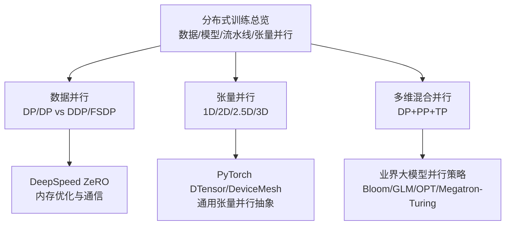
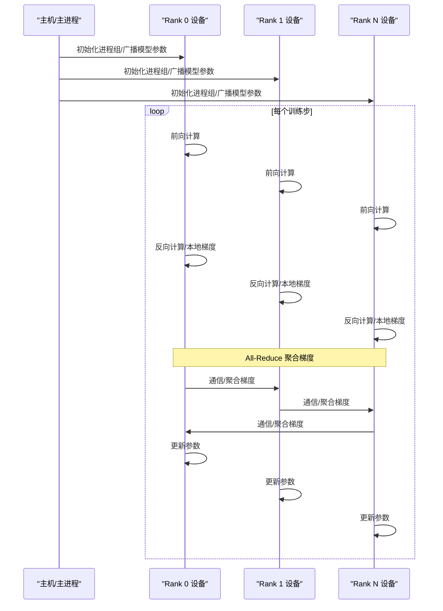
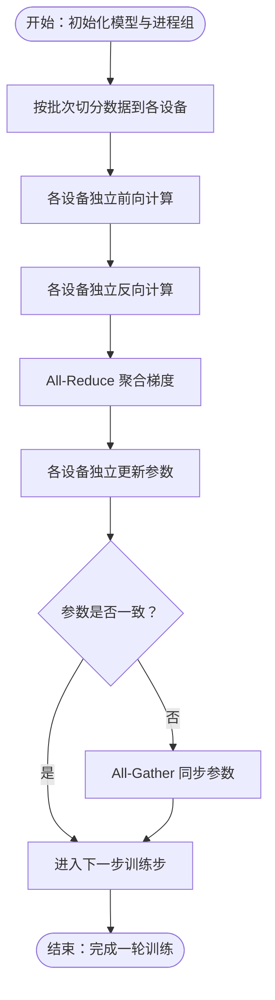
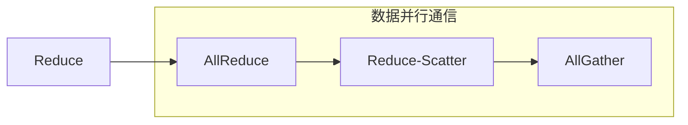
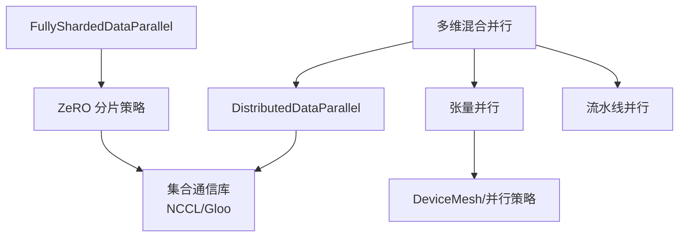

# 数据并行

<cite>
**本文引用的文件列表**
- [04.分布式训练/2.数据并行/2.数据并行.md](file://04.分布式训练/2.数据并行/2.数据并行.md)
- [04.分布式训练/1.概述/1.概述.md](file://04.分布式训练/1.概述/1.概述.md)
- [04.分布式训练/4.张量并行/4.张量并行.md](file://04.分布式训练/4.张量并行/4.张量并行.md)
- [04.分布式训练/6.多维度混合并行/6.多维度混合并行.md](file://04.分布式训练/6.多维度混合并行/6.多维度混合并行.md)
- [04.分布式训练/9.总结/9.总结.md](file://04.分布式训练/9.总结/9.总结.md)
- [04.分布式训练/deepspeed介绍/deepspeed介绍.md](file://04.分布式训练/deepspeed介绍/deepspeed介绍.md)
- [98.相关课程/清华大模型公开课/5.高效训练&模型压缩/5.高效训练&模型压缩.md](file://98.相关课程/清华大模型公开课/5.高效训练&模型压缩/5.高效训练&模型压缩.md)
</cite>

## 目录
1. [简介](#简介)
2. [项目结构](#项目结构)
3. [核心组件](#核心组件)
4. [架构总览](#架构总览)
5. [详细组件分析](#详细组件分析)
6. [依赖分析](#依赖分析)
7. [性能考量](#性能考量)
8. [故障排查指南](#故障排查指南)
9. [结论](#结论)
10. [附录](#附录)

## 简介
本文件围绕数据并行技术展开，系统阐述其核心原理、分片策略、梯度同步机制与收敛性保障，并对比同步数据并行与异步数据并行的优劣。同时给出实现示例与配置要点（批大小、学习率、梯度累积等），并讨论在不同硬件架构上的优化与故障恢复机制。内容以PyTorch数据并行发展为主线，覆盖DDP、FSDP与DeepSpeed ZeRO的实践路径，辅以张量并行、流水线并行与多维混合并行的背景知识，帮助读者建立从原理到工程落地的完整认知。

## 项目结构
本仓库中与数据并行相关的内容主要分布在“分布式训练”主题下的多个章节，涵盖：
- 数据并行原理与演进（DP/DP vs DDP/FSDP）
- 分布式训练概览（数据并行、模型并行、流水线并行）
- 张量并行与多维并行（1D/2D/2.5D/3D）
- 多维混合并行（DP+PP+TP组合）
- DeepSpeed ZeRO优化与配置
- 高校课程资料中的集合通信与数据并行要点

**图表来源**
- [04.分布式训练/1.概述/1.概述.md:1-102](file://04.分布式训练/1.概述/1.概述.md#L1-L102)
- [04.分布式训练/2.数据并行/2.数据并行.md:1-330](file://04.分布式训练/2.数据并行/2.数据并行.md#L1-L330)
- [04.分布式训练/4.张量并行/4.张量并行.md:1-441](file://04.分布式训练/4.张量并行/4.张量并行.md#L1-L441)
- [04.分布式训练/6.多维度混合并行/6.多维度混合并行.md:1-109](file://04.分布式训练/6.多维度混合并行/6.多维度混合并行.md#L1-L109)
- [04.分布式训练/deepspeed介绍/deepspeed介绍.md:1-765](file://04.分布式训练/deepspeed介绍/deepspeed介绍.md#L1-L765)

**章节来源**
- [04.分布式训练/1.概述/1.概述.md:1-102](file://04.分布式训练/1.概述/1.概述.md#L1-L102)
- [04.分布式训练/2.数据并行/2.数据并行.md:1-330](file://04.分布式训练/2.数据并行/2.数据并行.md#L1-L330)
- [04.分布式训练/4.张量并行/4.张量并行.md:1-441](file://04.分布式训练/4.张量并行/4.张向并行.md#L1-L441)
- [04.分布式训练/6.多维度混合并行/6.多维度混合并行.md:1-109](file://04.分布式训练/6.多维度混合并行/6.多维度混合并行.md#L1-L109)
- [04.分布式训练/9.总结/9.总结.md:1-125](file://04.分布式训练/9.总结/9.总结.md#L1-L125)
- [04.分布式训练/deepspeed介绍/deepspeed介绍.md:1-765](file://04.分布式训练/deepspeed介绍/deepspeed介绍.md#L1-L765)

## 核心组件
- 数据并行（DP/DP vs DDP/FSDP）
  - DP：单进程多线程，主卡聚合梯度并广播参数，易成瓶颈，不支持多机多卡与模型并行。
  - DDP：多进程多卡，梯度All-Reduce后各自更新，通信更高效，支持多机多卡与模型并行。
  - FSDP：在DDP基础上对参数、梯度、优化器状态进行分片，进一步降低显存占用，支持CPU卸载。
- 集合通信原语
  - Reduce/AllReduce/Reduce-Scatter/AllGather：数据并行中梯度聚合与参数同步的基础。
- DeepSpeed ZeRO
  - ZeRO-1/2/3：对优化器状态、梯度、参数进行分片，显著降低显存占用，配合通信优化策略。
- 张量并行与混合并行
  - 1D/2D/2.5D/3D张量并行在不同维度上平衡通信与内存；多维混合并行（DP+PP+TP）在超大规模模型训练中广泛应用。

**章节来源**
- [04.分布式训练/2.数据并行/2.数据并行.md:23-330](file://04.分布式训练/2.数据并行/2.数据并行.md#L23-L330)
- [98.相关课程/清华大模型公开课/5.高效训练&模型压缩/5.高效训练&模型压缩.md:94-133](file://98.相关课程/清华大模型公开课/5.高效训练&模型压缩/5.高效训练&模型压缩.md#L94-L133)
- [04.分布式训练/deepspeed介绍/deepspeed介绍.md:71-127](file://04.分布式训练/deepspeed介绍/deepspeed介绍.md#L71-L127)
- [04.分布式训练/4.张量并行/4.张量并行.md:47-84](file://04.分布式训练/4.张量并行/4.张量并行.md#L47-L84)

## 架构总览
数据并行的典型流程：将数据按批次切分到各设备，每个设备独立前向/反向计算得到梯度，随后通过All-Reduce聚合梯度，再各自更新参数，保持全局一致性。FSDP在此基础上进一步将参数、梯度、优化器状态分片，减少峰值显存占用。

**图表来源**
- [04.分布式训练/2.数据并行/2.数据并行.md:56-72](file://04.分布式训练/2.数据并行/2.数据并行.md#L56-L72)
- [98.相关课程/清华大模型公开课/5.高效训练&模型压缩/5.高效训练&模型压缩.md:100-131](file://98.相关课程/清华大模型公开课/5.高效训练&模型压缩/5.高效训练&模型压缩.md#L100-L131)

## 详细组件分析

### 数据并行（DP/DP vs DDP/FSDP）
- DP的局限
  - 单进程多线程，GIL与通信瓶颈导致效率低，主卡负载重，不支持多机多卡与模型并行。
- DDP的优势
  - 多进程多卡，梯度All-Reduce后各自更新，通信量更少，负载均衡更好，支持多机多卡与模型并行。
- FSDP的进一步优化
  - 将参数、梯度、优化器状态跨设备分片，结合CPU卸载，显著降低峰值显存占用，适合超大模型训练。

**图表来源**
- [04.分布式训练/2.数据并行/2.数据并行.md:56-72](file://04.分布式训练/2.数据并行/2.数据并行.md#L56-L72)
- [04.分布式训练/2.数据并行/2.数据并行.md:143-330](file://04.分布式训练/2.数据并行/2.数据并行.md#L143-L330)

**章节来源**
- [04.分布式训练/2.数据并行/2.数据并行.md:23-330](file://04.分布式训练/2.数据并行/2.数据并行.md#L23-L330)

### 集合通信与同步机制
- 基础原语
  - Reduce/AllReduce/Reduce-Scatter/AllGather：数据并行中梯度聚合与参数同步的基础。
- DDP/FSDP中的通信
  - DDP：反向后All-Reduce聚合梯度，随后各自更新。
  - FSDP：将All-Reduce分解为Reduce-Scatter与All-Gather，仅在必要时收集/分发参数，降低通信频次与峰值内存。

**图表来源**
- [98.相关课程/清华大模型公开课/5.高效训练&模型压缩/5.高效训练&模型压缩.md:94-116](file://98.相关课程/清华大模型公开课/5.高效训练&模型压缩/5.高效训练&模型压缩.md#L94-L116)
- [04.分布式训练/2.数据并行/2.数据并行.md:199-211](file://04.分布式训练/2.数据并行/2.数据并行.md#L199-L211)

**章节来源**
- [98.相关课程/清华大模型公开课/5.高效训练&模型压缩/5.高效训练&模型压缩.md:94-133](file://98.相关课程/清华大模型公开课/5.高效训练&模型压缩/5.高效训练&模型压缩.md#L94-L133)
- [04.分布式训练/2.数据并行/2.数据并行.md:199-211](file://04.分布式训练/2.数据并行/2.数据并行.md#L199-L211)

### DeepSpeed ZeRO 与内存优化
- ZeRO-1/2/3
  - ZeRO-1：对优化器状态分片，降低显存占用，通信量与数据并行相当。
  - ZeRO-2：在ZeRO-1基础上对梯度进行分片，进一步降低显存。
  - ZeRO-3：在ZeRO-2基础上对模型参数进行分片，显著降低显存，通信量略有增加。
- 通信与通信重叠
  - 通过Reduce-Scatter/All-Gather与优化器状态分片的动态调度，减少通信瓶颈。
- 配置要点
  - stage/offload_optimizer/offload_param/overlap_comm/contiguous_gradients等参数影响显存与通信开销。

**章节来源**
- [04.分布式训练/deepspeed介绍/deepspeed介绍.md:71-127](file://04.分布式训练/deepspeed介绍/deepspeed介绍.md#L71-L127)
- [04.分布式训练/deepspeed介绍/deepspeed介绍.md:211-239](file://04.分布式训练/deepspeed介绍/deepspeed介绍.md#L211-L239)
- [04.分布式训练/deepspeed介绍/deepspeed介绍.md:325-349](file://04.分布式训练/deepspeed介绍/deepspeed介绍.md#L325-L349)

### 张量并行与多维混合并行
- 张量并行
  - 1D（Megatron-LM）：对权重按列/行切分，前后向通过All-Reduce聚合。
  - 2D/2.5D/3D（Colossal-AI）：在多维上切分输入与权重，降低激活内存，平衡通信与内存。
- 多维混合并行
  - DP+PP+TP：在节点内使用张量并行，节点间使用数据并行与流水线并行，平衡通信与吞吐。
  - 业界案例：Bloom/GLM/OPT/Megatron-Turing等模型采用不同组合策略。

**章节来源**
- [04.分布式训练/4.张量并行/4.张量并行.md:47-84](file://04.分布式训练/4.张量并行/4.张量并行.md#L47-L84)
- [04.分布式训练/4.张量并行/4.张量并行.md:118-167](file://04.分布式训练/4.张量并行/4.张量并行.md#L118-L167)
- [04.分布式训练/6.多维度混合并行/6.多维度混合并行.md:17-38](file://04.分布式训练/6.多维度混合并行/6.多维度混合并行.md#L17-L38)

## 依赖分析
- 组件耦合
  - DDP/FSDP依赖集合通信库（NCCL/Gloo等）与进程组初始化。
  - ZeRO依赖优化器状态分片与动态通信调度，与训练循环紧密耦合。
  - 张量并行依赖设备网格与算子级并行策略，与模型结构强相关。
- 外部依赖
  - NCCL（GPU通信）、MPI/Gloo（CPU通信）、PyTorch分布式接口、DeepSpeed引擎。

**图表来源**
- [04.分布式训练/2.数据并行/2.数据并行.md:56-72](file://04.分布式训练/2.数据并行/2.数据并行.md#L56-L72)
- [04.分布式训练/deepspeed介绍/deepspeed介绍.md:42-51](file://04.分布式训练/deepspeed介绍/deepspeed介绍.md#L42-L51)
- [04.分布式训练/4.张量并行/4.张量并行.md:384-434](file://04.分布式训练/4.张量并行/4.张量并行.md#L384-L434)

**章节来源**
- [04.分布式训练/2.数据并行/2.数据并行.md:56-72](file://04.分布式训练/2.数据并行/2.数据并行.md#L56-L72)
- [04.分布式训练/deepspeed介绍/deepspeed介绍.md:42-51](file://04.分布式训练/deepspeed介绍/deepspeed介绍.md#L42-L51)
- [04.分布式训练/4.张量并行/4.张量并行.md:384-434](file://04.分布式训练/4.张量并行/4.张量并行.md#L384-L434)

## 性能考量
- 收敛性与同步性
  - 同步数据并行（DDP/FSDP/ZeRO）在每步使用全局梯度，收敛性稳定；异步并行可能加速但存在收敛偏差风险。
- 通信与内存权衡
  - All-Reduce通信与通信重叠策略（如overlap_comm）可降低瓶颈；ZeRO/FSDP通过分片降低显存，但可能增加通信频次。
- 批大小与学习率
  - 全局批大小=单卡批大小×世界大小；学习率可按根号缩放或线性缩放，需结合优化器与分片策略调试。
- 梯度累积
  - 当单卡显存不足时，可通过梯度累积扩大等效批大小，减少每步通信次数。
- 硬件优化
  - NVLink/NVSwitch环境下，PP/TP/DP性能相近；无高速互联时，PP可能更具优势；ZeRO-1在Adam类优化器上收益显著。

**章节来源**
- [04.分布式训练/9.总结/9.总结.md:52-125](file://04.分布式训练/9.总结/9.总结.md#L52-L125)
- [04.分布式训练/deepspeed介绍/deepspeed介绍.md:106-127](file://04.分布式训练/deepspeed介绍/deepspeed介绍.md#L106-L127)

## 故障排查指南
- 常见问题
  - 显存不足：启用ZeRO-2/3或FSDP分片；开启CPU卸载；减小单卡批大小并配合梯度累积。
  - 通信异常：检查进程组初始化、MASTER_ADDR/PORT、NCCL环境变量；确认网络拓扑与带宽。
  - 收敛不稳定：检查学习率缩放策略、混合精度配置（FP16/BF16）、梯度裁剪与动态损失缩放。
- 排查步骤
  - 逐步关闭优化项（如offload、overlap_comm）定位问题；记录每步通信与内存峰值；核对ZeRO/FSDP分片策略与设备网格。
- 恢复机制
  - 断点续训：保存优化器状态与分片参数；重启后按相同分片策略重建进程组与通信；必要时使用All-Gather恢复完整参数进行检查。

**章节来源**
- [04.分布式训练/deepspeed介绍/deepspeed介绍.md:26-62](file://04.分布式训练/deepspeed介绍/deepspeed介绍.md#L26-L62)
- [04.分布式训练/9.总结/9.总结.md:52-125](file://04.分布式训练/9.总结/9.总结.md#L52-L125)

## 结论
数据并行是分布式训练中最直观且广泛采用的技术。从DP到DDP再到FSDP，其核心在于通过All-Reduce实现梯度同步与参数一致性；结合ZeRO与张量/流水线并行，可在多维混合并行中实现更高效的超大规模模型训练。实践中需综合考虑通信、内存与收敛性，合理配置批大小、学习率与梯度累积策略，并在不同硬件环境下进行针对性优化与故障恢复。

## 附录
- 实现示例与配置要点
  - DDP/FSDP：参考PyTorch示例与自动/手动包装策略。
  - ZeRO：参考DeepSpeed配置文件中的stage/offload/overlap_comm等参数。
  - 张量并行：参考Megatron-LM与Colossal-AI的1D/2D/2.5D/3D实现思路与DeviceMesh抽象。
- 业界案例
  - Bloom/GLM/OPT/Megatron-Turing等模型采用的DP+PP+TP组合与ZeRO策略，体现多维混合并行在工程中的落地。

**章节来源**
- [04.分布式训练/2.数据并行/2.数据并行.md:74-118](file://04.分布式训练/2.数据并行/2.数据并行.md#L74-L118)
- [04.分布式训练/2.数据并行/2.数据并行.md:225-290](file://04.分布式训练/2.数据并行/2.数据并行.md#L225-L290)
- [04.分布式训练/deepspeed介绍/deepspeed介绍.md:293-410](file://04.分布式训练/deepspeed介绍/deepspeed介绍.md#L293-L410)
- [04.分布式训练/4.张量并行/4.张量并行.md:384-434](file://04.分布式训练/4.张量并行/4.张量并行.md#L384-L434)
- [04.分布式训练/6.多维度混合并行/6.多维度混合并行.md:39-109](file://04.分布式训练/6.多维度混合并行/6.多维度混合并行.md#L39-L109)