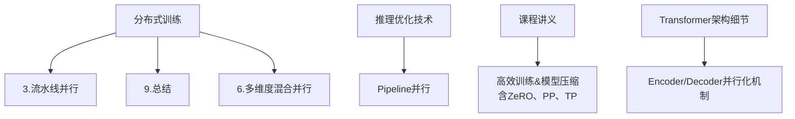
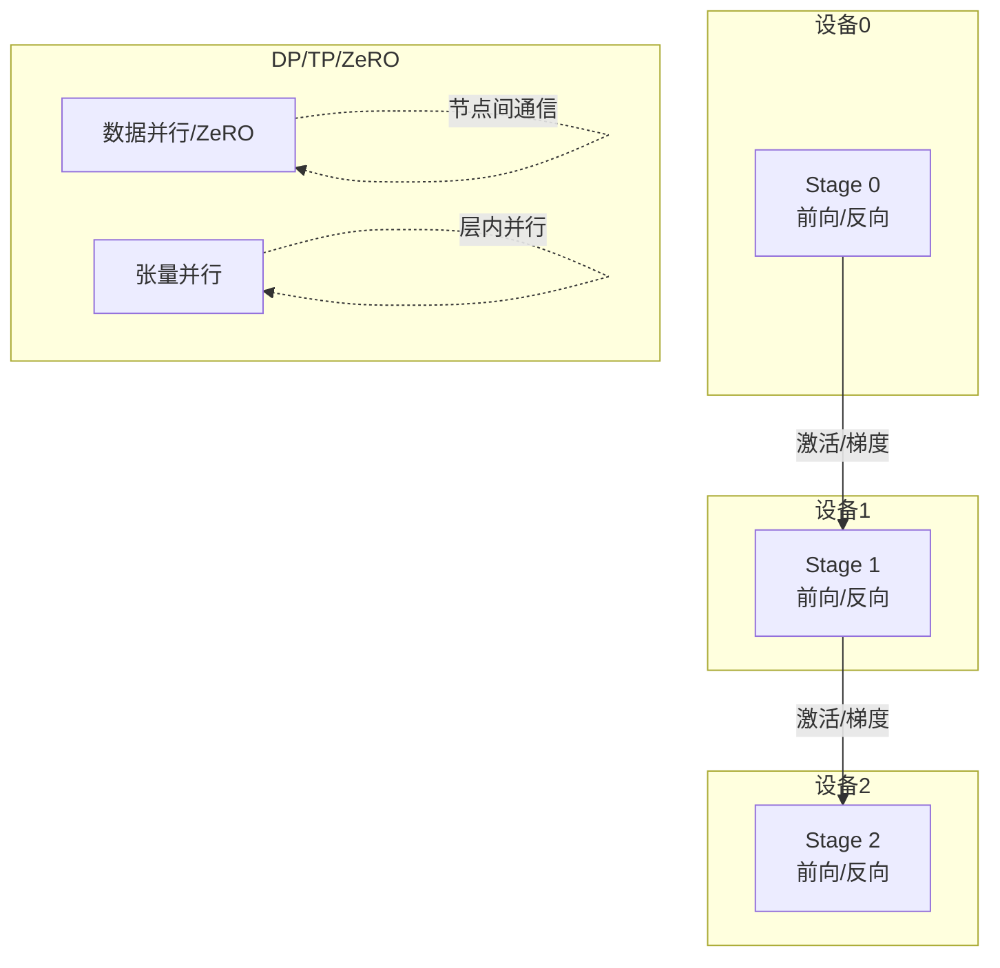
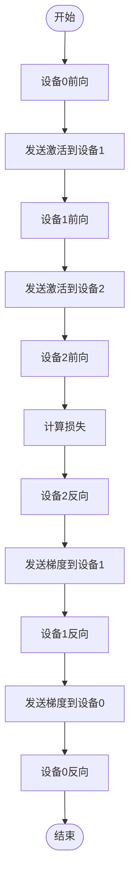
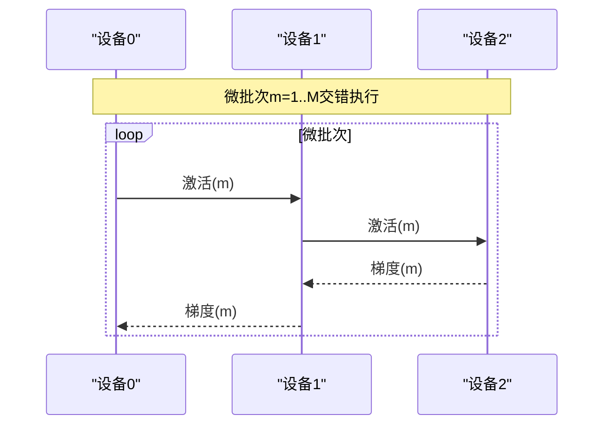
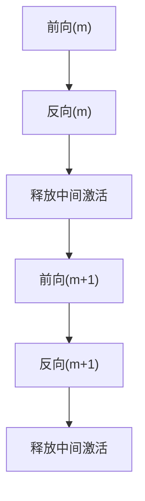
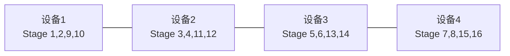
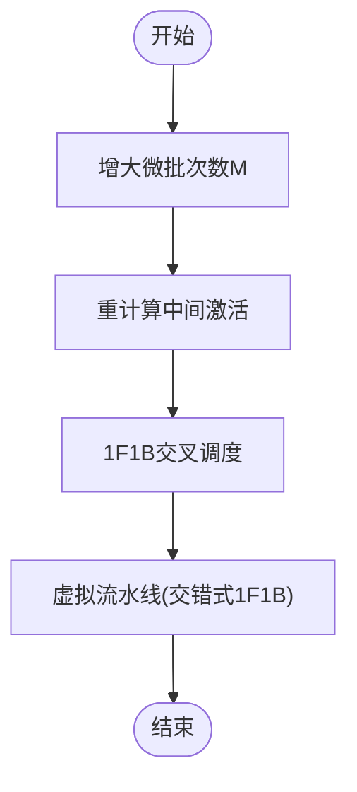
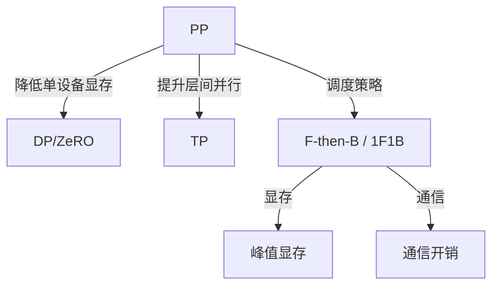

# 流水线并行

<cite>
**本文引用的文件列表**
- [3.流水线并行.md](file://04.分布式训练/3.流水线并行/3.流水线并行.md)
- [9.总结.md](file://04.分布式训练/9.总结/9.总结.md)
- [llm推理优化技术.md](file://06.推理/llm推理优化技术/llm推理优化技术.md)
- [5.高效训练&模型压缩.md](file://98.相关课程/清华大模型公开课/5.高效训练&模型压缩/5.高效训练&模型压缩.md)
- [6.多维度混合并行.md](file://04.分布式训练/6.多维度混合并行/6.多维度混合并行.md)
- [Transformer架构细节.md](file://02.大语言模型架构/Transformer架构细节/Transformer架构细节.md)
</cite>

## 目录
1. [引言](#引言)
2. [项目结构](#项目结构)
3. [核心组件](#核心组件)
4. [架构总览](#架构总览)
5. [详细组件分析](#详细组件分析)
6. [依赖关系分析](#依赖关系分析)
7. [性能考量](#性能考量)
8. [故障排查指南](#故障排查指南)
9. [结论](#结论)
10. [附录](#附录)

## 引言
本文件围绕“流水线并行（Pipeline Parallelism, PP）”展开，系统阐述其核心思想、调度策略、阶段划分与流水线长度选择，深入解析气泡（bubble）现象及其缓解手段（梯度检查点、微批次、流水线重排），并提供不同模型架构（尤其是Transformer类）的配置建议与与数据并行（DP）组合策略。内容来源于仓库中关于分布式训练、推理优化、课程讲义与混合并行实践的材料，力求以循序渐进的方式帮助读者掌握PP的设计与工程要点。

## 项目结构
本仓库中与流水线并行直接相关的内容主要集中在“分布式训练”“推理优化技术”“课程讲义”等章节，辅以“多维度混合并行”“Transformer架构细节”等材料，形成从原理到实践的完整知识体系。

**图表来源**
- [3.流水线并行.md:1-264](file://04.分布式训练/3.流水线并行/3.流水线并行.md#L1-L264)
- [9.总结.md:1-125](file://04.分布式训练/9.总结/9.总结.md#L1-L125)
- [6.多维度混合并行.md:1-109](file://04.分布式训练/6.多维度混合并行/6.多维度混合并行.md#L1-L109)
- [llm推理优化技术.md:74-106](file://06.推理/llm推理优化技术/llm推理优化技术.md#L74-L106)
- [5.高效训练&模型压缩.md:209-222](file://98.相关课程/清华大模型公开课/5.高效训练&模型压缩/5.高效训练&模型压缩.md#L209-L222)
- [Transformer架构细节.md:297-321](file://02.大语言模型架构/Transformer架构细节/Transformer架构细节.md#L297-L321)

**章节来源**
- [3.流水线并行.md:1-264](file://04.分布式训练/3.流水线并行/3.流水线并行.md#L1-L264)
- [9.总结.md:1-125](file://04.分布式训练/9.总结/9.总结.md#L1-L125)
- [llm推理优化技术.md:74-106](file://06.推理/llm推理优化技术/llm推理优化技术.md#L74-L106)
- [5.高效训练&模型压缩.md:209-222](file://98.相关课程/清华大模型公开课/5.高效训练&模型压缩/5.高效训练&模型压缩.md#L209-L222)
- [6.多维度混合并行.md:1-109](file://04.分布式训练/6.多维度混合并行/6.多维度混合并行.md#L1-L109)
- [Transformer架构细节.md:297-321](file://02.大语言模型架构/Transformer架构细节/Transformer架构细节.md#L297-L321)

## 核心组件
- 流水线并行（PP）：将模型层按“垂直”切分到不同设备，形成流水线阶段，通过微批次与重计算等手段提升设备利用率。
- 气泡（bubble）：由于阶段串行导致的空闲时间，PP中尤为突出。
- 调度策略：F-then-B（先前向后反向）与1F1B（前向与反向交叉）两类，1F1B可显著降低峰值显存并减少气泡。
- 微批次（micro-batch）：将小批量切分为微批次，交错执行前向与反向，缓解气泡。
- 重计算（re-materialization）：在反向时按需重算中间激活，降低峰值显存。
- 交错式1F1B（虚拟流水线）：在设备上划分更多虚拟阶段，进一步降低气泡，但增加通信。
- 与数据并行（DP）组合：在节点内优先PP/TP，节点间DP；或采用ZeRO-DP与PP/TP协同。

**章节来源**
- [3.流水线并行.md:110-264](file://04.分布式训练/3.流水线并行/3.流水线并行.md#L110-L264)
- [9.总结.md:11-15](file://04.分布式训练/9.总结/9.总结.md#L11-L15)
- [llm推理优化技术.md:80-87](file://06.推理/llm推理优化技术/llm推理优化技术.md#L80-L87)
- [5.高效训练&模型压缩.md:209-222](file://98.相关课程/清华大模型公开课/5.高效训练&模型压缩/5.高效训练&模型压缩.md#L209-L222)

## 架构总览
下图展示PP在训练中的典型阶段划分与通信模式，以及与DP/TP的组合关系。

**图表来源**
- [3.流水线并行.md:16-42](file://04.分布式训练/3.流水线并行/3.流水线并行.md#L16-L42)
- [6.多维度混合并行.md:17-37](file://04.分布式训练/6.多维度混合并行/6.多维度混合并行.md#L17-L37)

## 详细组件分析

### 1. 朴素流水线并行与气泡
- 核心思想：将模型按层切分到不同设备，前向逐级传递，反向逐级回传。
- 主要问题：同一时刻仅一个设备在计算，其余设备空闲，导致气泡严重，设备利用率低。
- 适用场景：调试友好，便于理解PP原理。

**图表来源**
- [3.流水线并行.md:18-55](file://04.分布式训练/3.流水线并行/3.流水线并行.md#L18-L55)

**章节来源**
- [3.流水线并行.md:18-55](file://04.分布式训练/3.流水线并行/3.流水线并行.md#L18-L55)

### 2. 微批次流水线并行（GPipe）
- 思想：将小批量切分为微批次，交错执行前向与反向，显著降低气泡。
- 关键点：F-then-B策略，微批次数M越大，气泡占比越小；但需注意BN等层的统计量处理。
- 显存优化：重计算（re-materialization）仅保存最后一层输出，降低峰值显存。

**图表来源**
- [3.流水线并行.md:56-107](file://04.分布式训练/3.流水线并行/3.流水线并行.md#L56-L107)

**章节来源**
- [3.流水线并行.md:56-107](file://04.分布式训练/3.流水线并行/3.流水线并行.md#L56-L107)

### 3. 1F1B调度与PipeDream
- 1F1B：每个微批次前向后立即反向，尽早释放中间激活，显著降低峰值显存。
- PipeDream-2BW：双缓冲权重版本，限制权重版本数至2，降低内存占用。
- PipeDream-Flush：定期流水线刷新，维持单权重版本，吞吐略降但内存更低。

**图表来源**
- [3.流水线并行.md:132-187](file://04.分布式训练/3.流水线并行/3.流水线并行.md#L132-L187)

**章节来源**
- [3.流水线并行.md:132-187](file://04.分布式训练/3.流水线并行/3.流水线并行.md#L132-L187)

### 4. 交错式1F1B与虚拟流水线（Megatron-LM）
- 在设备上划分更多虚拟阶段（virtual stages），进一步降低气泡，但通信增加。
- 要求微批次数为设备数的整数倍，以保证交错调度的稳定性。

**图表来源**
- [3.流水线并行.md:211-236](file://04.分布式训练/3.流水线并行/3.流水线并行.md#L211-L236)

**章节来源**
- [3.流水线并行.md:211-236](file://04.分布式训练/3.流水线并行/3.流水线并行.md#L211-L236)

### 5. 气泡缓解技术
- 梯度检查点（重计算）：在反向时重算中间激活，避免缓存过多激活，降低峰值显存。
- 微批次：增大M，缩短气泡窗口，提高设备利用率。
- 流水线重排（1F1B）：交叉前向与反向，尽早释放中间变量，降低显存峰值。
- 交错式1F1B：划分更多虚拟阶段，进一步降低气泡，但通信成本上升。

**图表来源**
- [3.流水线并行.md:90-107](file://04.分布式训练/3.流水线并行/3.流水线并行.md#L90-L107)
- [3.流水线并行.md:112-158](file://04.分布式训练/3.流水线并行/3.流水线并行.md#L112-L158)
- [3.流水线并行.md:209-236](file://04.分布式训练/3.流水线并行/3.流水线并行.md#L209-L236)

**章节来源**
- [3.流水线并行.md:90-107](file://04.分布式训练/3.流水线并行/3.流水线并行.md#L90-L107)
- [3.流水线并行.md:112-158](file://04.分布式训练/3.流水线并行/3.流水线并行.md#L112-L158)
- [3.流水线并行.md:209-236](file://04.分布式训练/3.流水线并行/3.流水线并行.md#L209-L236)

### 6. 不同模型架构下的配置建议
- Transformer类模型（Decoder-only）：PP常与TP/DP组合，典型做法是将层数均匀切分到多个设备，配合微批次与1F1B调度。
- 训练阶段：PP在训练中可与ZeRO/DP结合，以减少显存与通信开销。
- 推理阶段：PP在推理中常与KV缓存、分页KV管理等技术结合，以降低延迟与内存占用。

**章节来源**
- [llm推理优化技术.md:80-106](file://06.推理/llm推理优化技术/llm推理优化技术.md#L80-L106)
- [6.多维度混合并行.md:39-109](file://04.分布式训练/6.多维度混合并行/6.多维度混合并行.md#L39-L109)
- [Transformer架构细节.md:297-321](file://02.大语言模型架构/Transformer架构细节/Transformer架构细节.md#L297-L321)

### 7. 与数据并行的组合策略
- 节点内：优先PP/TP，节点间DP；或采用ZeRO-DP与PP/TP协同。
- 注意：ZeRO-2与PP组合可能引入额外通信开销，需谨慎评估；ZeRO-3可替代DP+PP+TP，简化工程。
- 实践建议：在硬件条件允许时，采用3D并行（DP+PP+TP），并在节点间使用DP，节点内使用PP/TP。

**章节来源**
- [6.多维度混合并行.md:25-37](file://04.分布式训练/6.多维度混合并行/6.多维度混合并行.md#L25-L37)
- [9.总结.md:86-101](file://04.分布式训练/9.总结/9.总结.md#L86-L101)

## 依赖关系分析
- PP与TP/DP/ZeRO存在互补关系：PP降低单设备显存压力，TP提升层内并行度，DP/ZeRO提升数据与状态并行度。
- 调度策略影响通信与显存：F-then-B易导致显存峰值高，1F1B可显著降低峰值显存；交错式1F1B进一步降低气泡，但通信增加。
- 框架实现：PyTorch采用GPipe（F-then-B），DeepSpeed采用PipeDream-Flush（非交错式1F1B），Megatron-LM采用交错式1F1B。

**图表来源**
- [3.流水线并行.md:237-252](file://04.分布式训练/3.流水线并行/3.流水线并行.md#L237-L252)
- [6.多维度混合并行.md:17-37](file://04.分布式训练/6.多维度混合并行/6.多维度混合并行.md#L17-L37)

**章节来源**
- [3.流水线并行.md:237-252](file://04.分布式训练/3.流水线并行/3.流水线并行.md#L237-L252)
- [6.多维度混合并行.md:17-37](file://04.分布式训练/6.多维度混合并行/6.多维度混合并行.md#L17-L37)

## 性能考量
- 气泡与设备利用率：气泡占比与设备数K、微批次数M相关，M越大，气泡占比越小。
- 显存与通信权衡：1F1B显著降低峰值显存，但可能增加通信；交错式1F1B进一步降低气泡，但通信成本上升。
- 混合精度与检查点：BF16/FP16可提升吞吐，结合重计算可降低显存峰值。
- 硬件与网络：在具备高速互联（如InfiniBand）的集群中，交错式1F1B的通信成本可被摊薄。

**章节来源**
- [3.流水线并行.md:90-107](file://04.分布式训练/3.流水线并行/3.流水线并行.md#L90-L107)
- [3.流水线并行.md:112-158](file://04.分布式训练/3.流水线并行/3.流水线并行.md#L112-L158)
- [9.总结.md:110-125](file://04.分布式训练/9.总结/9.总结.md#L110-L125)

## 故障排查指南
- 气泡过大导致设备利用率低：检查微批次数M是否过小；确认是否采用1F1B或交错式1F1B。
- 显存不足：启用重计算（re-materialization）；评估是否可采用PipeDream-2BW或PipeDream-Flush。
- 通信瓶颈：在节点内优先PP/TP，节点间DP；在高速网络环境下可采用交错式1F1B。
- 混合精度溢出：在FP16训练中采用损失缩放或切换BF16；确保优化器状态精度与权重精度匹配。
- 与ZeRO冲突：避免在ZeRO-2与PP组合中引入额外reduce-scatter；必要时采用ZeRO-3替代。

**章节来源**
- [3.流水线并行.md:132-187](file://04.分布式训练/3.流水线并行/3.流水线并行.md#L132-L187)
- [9.总结.md:86-101](file://04.分布式训练/9.总结/9.总结.md#L86-L101)

## 结论
流水线并行通过将模型层切分到不同设备，有效降低单设备显存压力，是训练超大规模模型的关键技术。朴素PP存在严重气泡，需通过微批次、重计算与1F1B等策略缓解。交错式1F1B进一步降低气泡，但通信成本上升。在工程实践中，PP常与TP/DP/ZeRO组合，形成3D并行或混合并行策略，以在吞吐、显存与通信之间取得平衡。针对不同模型架构（尤其是Transformer类），应结合微批次、调度策略与混合精度等手段进行系统优化。

## 附录
- 参考实现与框架：PyTorch（GPipe）、DeepSpeed（PipeDream-Flush）、Megatron-LM（交错式1F1B）。
- 实践案例：业界大模型普遍采用DP+PP+TP的3D并行策略，结合ZeRO或FSDP以进一步降低显存占用。

**章节来源**
- [3.流水线并行.md:237-252](file://04.分布式训练/3.流水线并行/3.流水线并行.md#L237-L252)
- [6.多维度混合并行.md:39-109](file://04.分布式训练/6.多维度混合并行/6.多维度混合并行.md#L39-L109)