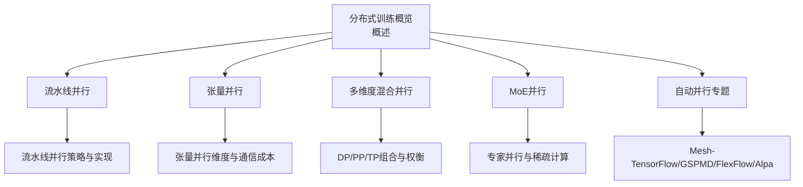
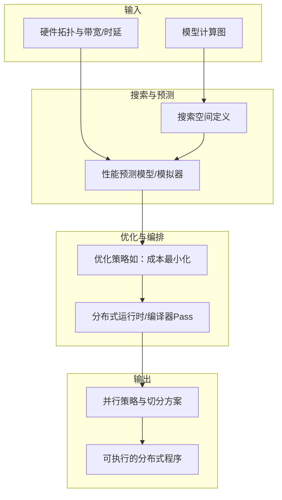
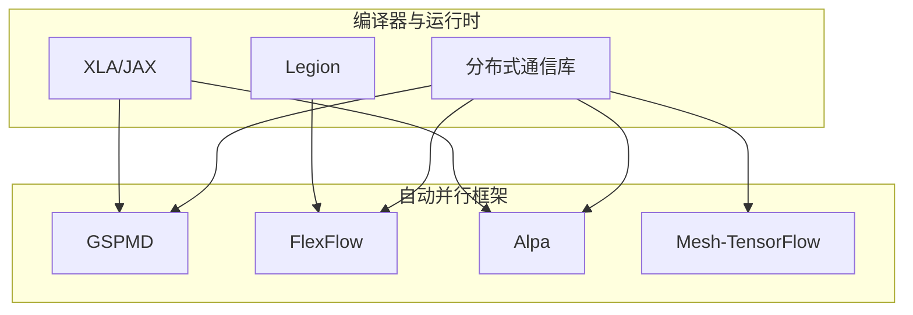

# 自动并行

<cite>
**本文引用的文件**
- [04.分布式训练/7.自动并行/7.自动并行.md](file://04.分布式训练/7.自动并行/7.自动并行.md)
- [04.分布式训练/1.概述/1.概述.md](file://04.分布式训练/1.概述/1.概述.md)
- [04.分布式训练/3.流水线并行/3.流水线并行.md](file://04.分布式训练/3.流水线并行/3.流水线并行.md)
- [04.分布式训练/4.张量并行/4.张量并行.md](file://04.分布式训练/4.张量并行/4.张量并行.md)
- [04.分布式训练/6.多维度混合并行/6.多维度混合并行.md](file://04.分布式训练/6.多维度混合并行/6.多维度混合并行.md)
- [04.分布式训练/8.moe并行/8.moe并行.md](file://04.分布式训练/8.moe并行/8.moe并行.md)
- [04.分布式训练/9.总结/9.总结.md](file://04.分布式训练/9.总结/9.总结.md)
</cite>

## 目录
1. [引言](#引言)
2. [项目结构](#项目结构)
3. [核心组件](#核心组件)
4. [架构总览](#架构总览)
5. [详细组件分析](#详细组件分析)
6. [依赖分析](#依赖分析)
7. [性能考量](#性能考量)
8. [故障排查指南](#故障排查指南)
9. [结论](#结论)
10. [附录](#附录)

## 引言
自动并行旨在通过算法自动确定最优的并行策略组合，减少人工调优的工作量，帮助用户在给定模型与硬件资源的前提下，自动选择高效可行的并行方案。本文围绕自动并行的决策机制、搜索空间、性能预测与优化策略展开，结合 Mesh-TensorFlow、GSPMD、FlexFlow、Alpa 等代表性方案，系统梳理自动并行的关键技术路径，并提供使用指南、局限性与适用场景分析，以及与手动并行策略的对比与实践建议。

## 项目结构
本仓库围绕分布式训练与并行策略组织内容，自动并行相关内容集中在“分布式训练”章节中，涵盖概述、流水线并行、张量并行、多维度混合并行、MoE 并行与总结等主题。自动并行作为“分布式训练”的专题，与其他并行技术形成互补关系，便于读者从整体视角理解自动并行在系统中的定位与价值。

图表来源
- [04.分布式训练/1.概述/1.概述.md:1-102](file://04.分布式训练/1.概述/1.概述.md#L1-L102)
- [04.分布式训练/3.流水线并行/3.流水线并行.md:1-264](file://04.分布式训练/3.流水线并行/3.流水线并行.md#L1-L264)
- [04.分布式训练/4.张量并行/4.张量并行.md:128-382](file://04.分布式训练/4.张量并行/4.张量并并行.md#L128-L382)
- [04.分布式训练/6.多维度混合并行/6.多维度混合并行.md:1-89](file://04.分布式训练/6.多维度混合并行/6.多维度混合并行.md#L1-L89)
- [04.分布式训练/8.moe并行/8.moe并行.md:1-317](file://04.分布式训练/8.moe并行/8.moe并行.md#L1-L317)
- [04.分布式训练/7.自动并行/7.自动并行.md:1-274](file://04.分布式训练/7.自动并行/7.自动并行.md#L1-L274)

章节来源
- [04.分布式训练/1.概述/1.概述.md:1-102](file://04.分布式训练/1.概述/1.概述.md#L1-L102)
- [04.分布式训练/7.自动并行/7.自动并行.md:1-274](file://04.分布式训练/7.自动并行/7.自动并行.md#L1-L274)

## 核心组件
- 自动并行目标与分类
  - 目标：在给定模型与机器资源条件下，自动选择较好或最优的并行策略，以提升吞吐与资源利用率。
  - 分类：半自动（用户指定部分切分）与全自动（框架自适应选择最优切分）。
- 典型方案
  - Mesh-TensorFlow：基于 SPMD 的通用并行抽象，强调维度命名与设备网格映射，适合语言模型领域，但缺乏卷积支持且需重写模型。
  - GSPMD：基于张量分片注解的统一表示，支持数据/模型/流水线/空间等多维并行组合，采用 SPMD 以支撑大规模分区。
  - FlexFlow：定义 SOAP 搜索空间，结合执行模拟器与优化器进行策略搜索，具备可移植性与可编程性。
  - Alpa：在系统多层使用不同并行技术，提出算子间/算子内并行的自动划分与组合，兼顾 inter-op/intra-op 优化。
- 与传统并行的关系
  - 自动并行并非替代数据并行、流水线并行、张量并行，而是将这些技术纳入统一的搜索与编排空间，自动选择最优组合与切分策略。

章节来源
- [04.分布式训练/7.自动并行/7.自动并行.md:3-14](file://04.分布式训练/7.自动并行/7.自动并行.md#L3-L14)
- [04.分布式训练/7.自动并行/7.自动并行.md:16-52](file://04.分布式训练/7.自动并行/7.自动并行.md#L16-L52)
- [04.分布式训练/7.自动并行/7.自动并行.md:53-100](file://04.分布式训练/7.自动并行/7.自动并行.md#L53-L100)
- [04.分布式训练/7.自动并行/7.自动并行.md:101-201](file://04.分布式训练/7.自动并行/7.自动并行.md#L101-L201)
- [04.分布式训练/7.自动并行/7.自动并行.md:205-274](file://04.分布式训练/7.自动并行/7.自动并行.md#L205-L274)

## 架构总览
自动并行系统通常由“搜索空间定义—性能预测—优化策略—执行编排”构成，不同方案在这些环节各有侧重。下图给出概念性架构示意，帮助理解自动并行的端到端流程。

说明
- 搜索空间：定义可选的并行维度（如样本、属性、参数、算子间/内）与切分方式。
- 性能预测：通过模拟器或编译器 Pass 预测执行时间与通信成本。
- 优化策略：以最小化总执行时间为目标，结合硬件拓扑与通信约束。
- 执行编排：将策略映射到分布式运行时或编译器 Pass，生成可执行程序。

## 详细组件分析

### Mesh-TensorFlow
- 背景与抽象
  - 将 SPMD 泛化到除 batch 维外的其他维度，通过张量维度命名与设备网格映射实现并行。
  - 支持逐元素、归约、爱因斯坦求和与 reshape 等操作的分布式实现。
- 优势与局限
  - 优势：统一 DSL 语法，自动将模型与数据分割到多设备；适合语言模型。
  - 局限：未实现卷积并行；需重写模型；不同布局的性能差异较大，但不支持自动搜索最优布局。
- 与自动并行的关系
  - 半自动：用户通过维度命名与布局注解参与切分；自动完成其余部分。
  - 适用场景：对语言模型的张量维度并行较为成熟，但对卷积等算子支持有限。

章节来源
- [04.分布式训练/7.自动并行/7.自动并行.md:16-52](file://04.分布式训练/7.自动并行/7.自动并行.md#L16-L52)

### GSPMD
- 统一表示与 SPMD
  - 基于张量分片注解，统一表达数据并行、模型并行、流水线并行与空间分片等策略。
  - 采用 SPMD（单程序多数据）以支撑大规模分区，避免 MPMD 的编译开销。
- 关键能力
  - 分片完成与算子级分区：用户可局部注解，编译器自动完成其余维度的分片。
  - 嵌套并行：在正交设备网格上对不同维度进行切分，支持递归方法。
- 与自动并行的关系
  - 半自动：用户在子图中指定手动分区，编译器在全图传播完成策略。
  - 适用场景：对多框架与多硬件平台的统一抽象，便于扩展到大规模并行。

章节来源
- [04.分布式训练/7.自动并行/7.自动并行.md:53-100](file://04.分布式训练/7.自动并行/7.自动并行.md#L53-L100)

### FlexFlow
- SOAP 搜索空间
  - 针对算子输出张量的维度进行切分，包括样本、属性、参数与算子间维度。
- 执行模拟器
  - 假设任务执行时间可预测、通信时间按数据大小/带宽估算、设备按 FIFO 执行。
  - 提供全模拟与增量模拟（Delta）两种算法，以加速策略评估。
- 执行优化器
  - 将并行优化问题抽象为成本最小化问题，避免显式平衡执行时间与通信时间。
- 运行时
  - 基于 Legion 的分布式运行时，支持高维分区与细粒度控制。
- 与自动并行的关系
  - 全自动：通过模拟器与优化器在 SOAP 空间中搜索最优策略，具备可移植性与可编程性。

章节来源
- [04.分布式训练/7.自动并行/7.自动并行.md:101-201](file://04.分布式训练/7.自动并行/7.自动并行.md#L101-L201)

### Alpa
- 技术原理
  - 将并行划分为算子内并行（intra-op，如数据/张量并行）与算子间并行（inter-op，如流水线并行）两类。
  - 利用集群非对称特性：在高带宽互联设备上映射 intra-op，在低带宽互联设备上映射 inter-op。
- 执行过程
  - 动态规划（DP）决定模型分层与每层卡分配；层内通过整数线性规划（ILP）决定算子切分。
  - 依赖 JAX/XLA 的 GSPMD，自动对算子进行切分并生成程序。
- 与自动并行的关系
  - 全自动：兼顾 inter-op 与 intra-op 的自动划分与组合，是当前自动并行的集大成者。

章节来源
- [04.分布式训练/7.自动并行/7.自动并行.md:205-274](file://04.分布式训练/7.自动并行/7.自动并行.md#L205-L274)

### 与传统并行的关系与对比
- 与流水线并行（PP）
  - 自动并行可自动选择微批次策略、1F1B/交错调度与 Flush 等变体，减少人工调参。
  - 在硬件拓扑与带宽约束下，自动选择最优的流水线深度与微批次数。
- 与张量并行（TP）
  - 自动并行可在 1D/2D/2.5D/3D 等多维张量并行之间自动选择，平衡通信与内存开销。
- 与数据并行（DP）
  - 自动并行可结合 ZeRO 等优化器并行策略，自动选择分片级别与通信模式。
- 与 MoE 并行
  - 自动并行可辅助选择专家并行与门控策略，结合稀疏路由与通信优化。

章节来源
- [04.分布式训练/3.流水线并行/3.流水线并行.md:1-264](file://04.分布式训练/3.流水线并行/3.流水线并行.md#L1-L264)
- [04.分布式训练/4.张量并行/4.张量并行.md:128-382](file://04.分布式训练/4.张量并行/4.张量并行.md#L128-L382)
- [04.分布式训练/6.多维度混合并行/6.多维度混合并行.md:1-89](file://04.分布式训练/6.多维度混合并行/6.多维度混合并行.md#L1-L89)
- [04.分布式训练/8.moe并行/8.moe并行.md:1-317](file://04.分布式训练/8.moe并行/8.moe并行.md#L1-L317)

## 依赖分析
自动并行方案在不同层次依赖编译器、分布式运行时与硬件抽象，形成如下依赖关系：

图表来源
- [04.分布式训练/7.自动并行/7.自动并行.md:53-100](file://04.分布式训练/7.自动并行/7.自动并行.md#L53-L100)
- [04.分布式训练/7.自动并行/7.自动并行.md:101-201](file://04.分布式训练/7.自动并行/7.自动并行.md#L101-L201)
- [04.分布式训练/7.自动并行/7.自动并行.md:205-274](file://04.分布式训练/7.自动并行/7.自动并行.md#L205-L274)

章节来源
- [04.分布式训练/7.自动并行/7.自动并行.md:53-100](file://04.分布式训练/7.自动并行/7.自动并行.md#L53-L100)
- [04.分布式训练/7.自动并行/7.自动并行.md:101-201](file://04.分布式训练/7.自动并行/7.自动并行.md#L101-L201)
- [04.分布式训练/7.自动并行/7.自动并行.md:205-274](file://04.分布式训练/7.自动并行/7.自动并行.md#L205-L274)

## 性能考量
- 搜索空间与策略组合
  - 自动并行在 SOAP 空间中定义算子输出张量的维度切分，结合硬件拓扑与通信成本进行组合搜索。
- 性能预测与模拟
  - FlexFlow 使用执行模拟器，基于任务图与通信时间模型进行快速评估；Alpa 依赖编译器成本模型与 DP/ILP 优化。
- 通信与计算平衡
  - 自动并行在不同并行技术之间权衡通信与计算，优先选择满足带宽约束且能最大化吞吐的策略。
- 可移植性与可编程性
  - FlexFlow 强调针对不同硬件配置自动选择策略，减少对应用的侵入性；Alpa 通过编译器 Pass 与分布式运行时实现可移植执行。

章节来源
- [04.分布式训练/7.自动并行/7.自动并行.md:101-201](file://04.分布式训练/7.自动并行/7.自动并行.md#L101-L201)
- [04.分布式训练/7.自动并行/7.自动并行.md:205-274](file://04.分布式训练/7.自动并行/7.自动并行.md#L205-L274)

## 故障排查指南
- 布局与切分不兼容
  - Mesh-TensorFlow 需要为张量维度命名并与设备网格映射，若布局不一致可能导致通信错误或性能下降。
- SPMD 编译开销
  - GSPMD 采用 SPMD 以避免 MPMD 的编译时间爆炸，但在大规模分区场景下仍需关注编译时长与内存占用。
- 模拟器假设误差
  - FlexFlow 的模拟器基于任务执行时间可预测与通信按带宽估算的假设，若实际硬件与假设偏差较大，可能导致策略选择偏离最优。
- 硬件拓扑与带宽约束
  - Alpa 在不同互联设备上分配 intra-op 与 inter-op，若拓扑信息不准确，可能导致通信瓶颈与吞吐下降。
- 与手动并行的冲突
  - 在混合并行中，需避免与数据并行（如 ZeRO）与流水线并行的不兼容组合，遵循已有兼容性建议。

章节来源
- [04.分布式训练/7.自动并行/7.自动并行.md:16-52](file://04.分布式训练/7.自动并行/7.自动并行.md#L16-L52)
- [04.分布式训练/7.自动并行/7.自动并行.md:53-100](file://04.分布式训练/7.自动并行/7.自动并行.md#L53-L100)
- [04.分布式训练/7.自动并行/7.自动并行.md:101-201](file://04.分布式训练/7.自动并行/7.自动并行.md#L101-L201)
- [04.分布式训练/7.自动并行/7.自动并行.md:205-274](file://04.分布式训练/7.自动并行/7.自动并行.md#L205-L274)
- [04.分布式训练/9.总结/9.总结.md:95-101](file://04.分布式训练/9.总结/9.总结.md#L95-L101)

## 结论
自动并行通过统一的搜索空间、性能预测与优化策略，将数据并行、流水线并行、张量并行与 MoE 并行等技术整合为可自动选择的策略组合，显著降低人工调优成本。Mesh-TensorFlow、GSPMD、FlexFlow、Alpa 分别在不同层面提供了半自动或全自动的实现路径。尽管目前自动并行在工业界的落地尚不普遍，但其在可移植性、可编程性与策略搜索方面的优势，使其成为未来大规模分布式训练的重要方向。

## 附录

### 使用指南与调优建议
- 选择方案
  - 若需强可移植性与统一抽象：优先考虑 GSPMD。
  - 若需端到端的策略搜索与模拟评估：优先考虑 FlexFlow。
  - 若需兼顾 inter-op 与 intra-op 的自动划分：优先考虑 Alpa。
  - 若仅需语言模型的张量维度并行且愿意重写模型：可考虑 Mesh-TensorFlow。
- 调优要点
  - 明确硬件拓扑与带宽/时延特性，确保模拟器与编译器 Pass 的输入准确。
  - 在 FlexFlow 中，合理设置微批次与调度策略，结合 1F1B/交错调度以降低内存峰值。
  - 在 Alpa 中，利用 DP/ILP 优化层内切分，结合高带宽/低带宽设备映射。
  - 在混合并行中，遵循已有兼容性建议，避免不兼容组合。

章节来源
- [04.分布式训练/7.自动并行/7.自动并行.md:16-52](file://04.分布式训练/7.自动并行/7.自动并行.md#L16-L52)
- [04.分布式训练/7.自动并行/7.自动并行.md:53-100](file://04.分布式训练/7.自动并行/7.自动并行.md#L53-L100)
- [04.分布式训练/7.自动并行/7.自动并行.md:101-201](file://04.分布式训练/7.自动并行/7.自动并行.md#L101-L201)
- [04.分布式训练/7.自动并行/7.自动并行.md:205-274](file://04.分布式训练/7.自动并行/7.自动并行.md#L205-L274)
- [04.分布式训练/9.总结/9.总结.md:95-101](file://04.分布式训练/9.总结/9.总结.md#L95-L101)