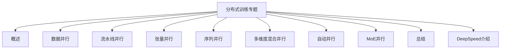
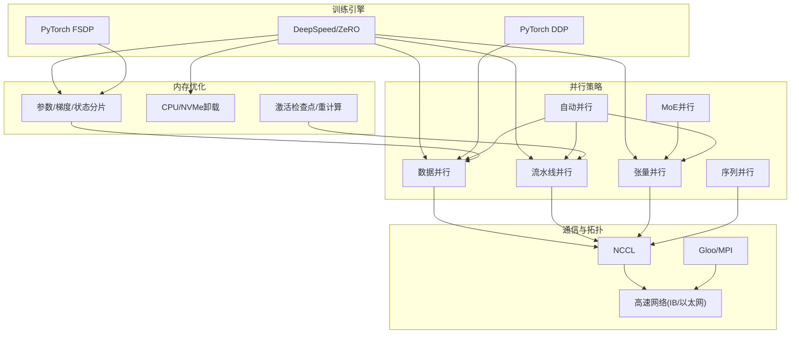
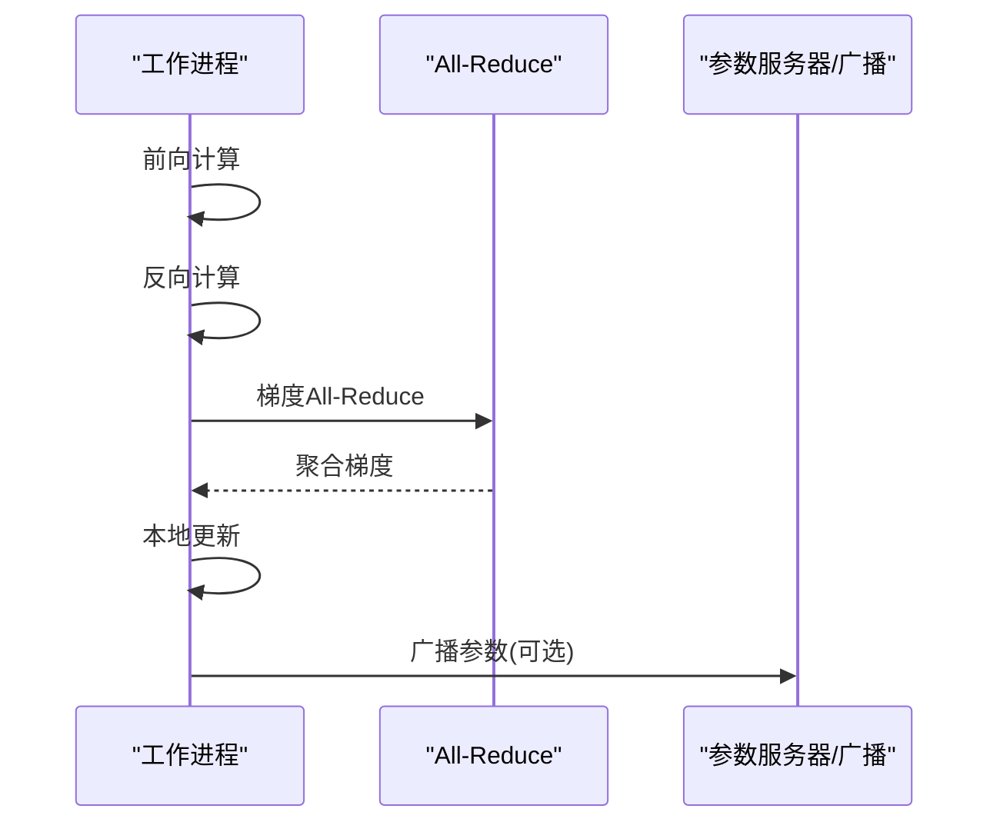
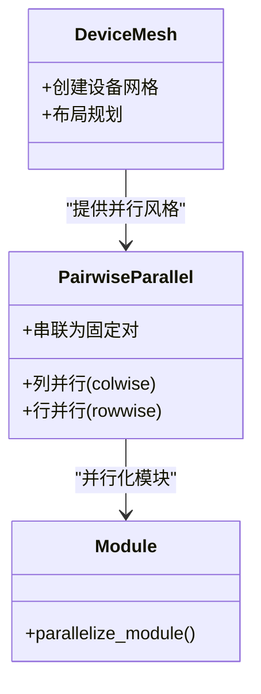
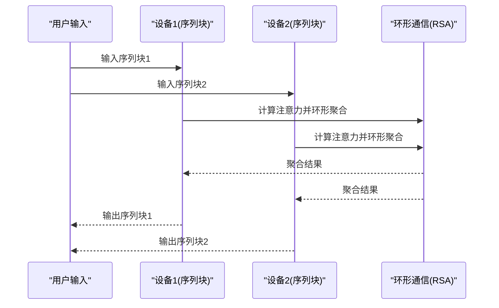
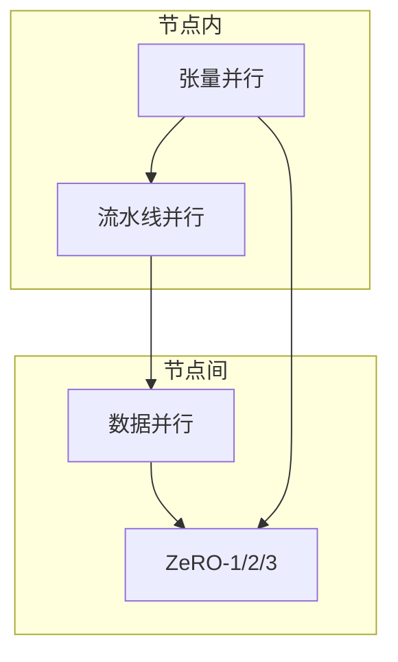
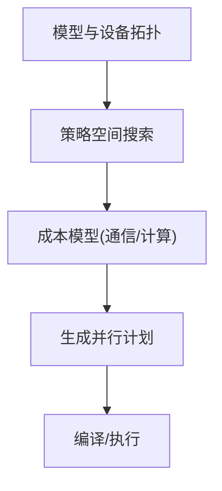
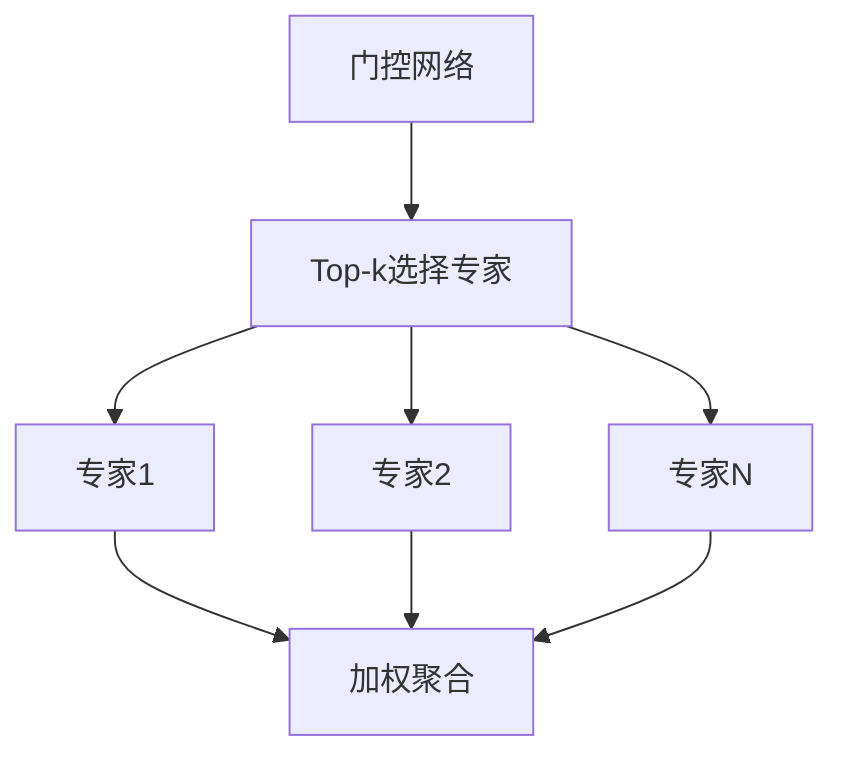
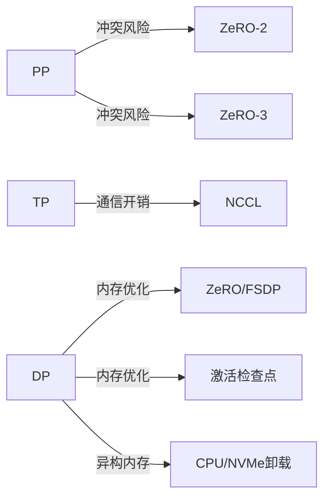

# 训练总结

<cite>
**本文引用的文件**
- [1.概述.md](file://04.分布式训练/1.概述/1.概述.md)
- [2.数据并行.md](file://04.分布式训练/2.数据并行/2.数据并行.md)
- [3.流水线并行.md](file://04.分布式训练/3.流水线并行/3.流水线并行.md)
- [4.张量并行.md](file://04.分布式训练/4.张量并行/4.张量并行.md)
- [5.序列并行.md](file://04.分布式训练/5.序列并行/5.序列并行.md)
- [6.多维度混合并行.md](file://04.分布式训练/6.多维度混合并行/6.多维度混合并行.md)
- [7.自动并行.md](file://04.分布式训练/7.自动并行/7.自动并行.md)
- [8.moe并行.md](file://04.分布式训练/8.moe并行/8.moe并行.md)
- [9.总结.md](file://04.分布式训练/9.总结/9.总结.md)
- [deepspeed介绍.md](file://04.分布式训练/deepspeed介绍/deepspeed介绍.md)
</cite>

## 目录
1. [引言](#引言)
2. [项目结构](#项目结构)
3. [核心组件](#核心组件)
4. [架构总览](#架构总览)
5. [详细组件分析](#详细组件分析)
6. [依赖分析](#依赖分析)
7. [性能考量](#性能考量)
8. [故障排查指南](#故障排查指南)
9. [结论](#结论)
10. [附录](#附录)

## 引言
本文件面向分布式训练的系统性回顾与总结，围绕数据并行、流水线并行、张量并行、序列并行、多维度混合并行、自动并行与MoE并行等主题，梳理各类并行策略的原理、适用场景、通信与内存开销、工程实现要点，并给出策略选择决策树与评估标准，覆盖硬件配置、模型规模、数据特征等关键因素。同时总结最佳实践与常见问题处理思路，展望自动化并行、异构计算与边缘训练等趋势。

## 项目结构
本仓库“分布式训练”专题涵盖从基础概念到工程实践的完整知识谱系，文件组织以“并行类型/技术要点/工程实现/总结”为主线，便于读者按需查阅与深入学习。

章节来源
- [1.概述.md:1-102](file://04.分布式训练/1.概述/1.概述.md#L1-L102)
- [2.数据并行.md:1-330](file://04.分布式训练/2.数据并行/2.数据并行.md#L1-L330)
- [3.流水线并行.md:1-264](file://04.分布式训练/3.流水线并行/3.流水线并行.md#L1-L264)
- [4.张量并行.md:1-441](file://04.分布式训练/4.张量并行/4.张量并平行.md#L1-L441)
- [5.序列并行.md:1-128](file://04.分布式训练/5.序列并行/5.序列并行.md#L1-L128)
- [6.多维度混合并行.md:1-109](file://04.分布式训练/6.多维度混合并行/6.多维度混合并行.md#L1-L109)
- [7.自动并行.md:1-274](file://04.分布式训练/7.自动并行/7.自动并行.md#L1-L274)
- [8.moe并行.md:1-317](file://04.分布式训练/8.moe并行/8.moe并行.md#L1-L317)
- [9.总结.md:1-125](file://04.分布式训练/9.总结/9.总结.md#L1-L125)
- [deepspeed介绍.md:1-765](file://04.分布式训练/deepspeed介绍/deepspeed介绍.md#L1-L765)

## 核心组件
- 数据并行：沿Batch维切分，多副本模型在各设备上计算梯度并All-Reduce聚合，适合显存紧张但算力充足场景；FSDP进一步将参数、梯度、优化器状态分片，降低峰值显存。
- 流水线并行：按层切分模型到不同设备，通过微批次与1F1B/交错调度提升设备利用率，降低Bubble，适合超大模型单卡显存不足。
- 张量并行：层内参数按维度切分，典型为行/列并行；Megatron-LM 1D、Colossal-AI 2D/2.5D/3D在通信与激活内存间权衡，适配Transformer结构。
- 序列并行：两类工作侧重点不同：长序列训练与显存摊薄，分别通过环自注意力与序列维切分实现，通信以All-Gather/Reduce-Scatter为主。
- 多维度混合并行：DP/PP/TP/ZeRO组合，形成3D/4D并行，兼顾吞吐与显存扩展，工程上需注意ZeRO-2与PP的兼容性。
- 自动并行：半自动（Mesh-TensorFlow、GSPMD）与全自动（FlexFlow、Alpa）探索策略空间，以成本模型与搜索策略自动选择最优切分与调度。
- MoE并行：专家并行与门控路由，结合数据/模型并行，实现稀疏计算与超大规模参数扩展。

章节来源
- [1.概述.md:3-87](file://04.分布式训练/1.概述/1.概述.md#L3-L87)
- [2.数据并行.md:3-330](file://04.分布式训练/2.数据并行/2.数据并行.md#L3-L330)
- [3.流水线并行.md:1-264](file://04.分布式训练/3.流水线并行/3.流水线并行.md#L1-L264)
- [4.张量并行.md:1-441](file://04.分布式训练/4.张量并行/4.张量并行.md#L1-L441)
- [5.序列并行.md:1-128](file://04.分布式训练/5.序列并行/5.序列并行.md#L1-L128)
- [6.多维度混合并行.md:1-109](file://04.分布式训练/6.多维度混合并行/6.多维度混合并行.md#L1-L109)
- [7.自动并行.md:1-274](file://04.分布式训练/7.自动并行/7.自动并行.md#L1-L274)
- [8.moe并行.md:1-317](file://04.分布式训练/8.moe并行/8.moe并行.md#L1-L317)

## 架构总览
分布式训练的工程实现通常由“并行策略 + 通信库 + 内存优化 + 调度/编排”构成。下图给出高层视图与关键交互：

图表来源
- [deepspeed介绍.md:1-765](file://04.分布式训练/deepspeed介绍/deepspeed介绍.md#L1-L765)
- [2.数据并行.md:143-330](file://04.分布式训练/2.数据并行/2.数据并行.md#L143-L330)
- [3.流水线并行.md:237-264](file://04.分布式训练/3.流水线并行/3.流水线并行.md#L237-L264)
- [4.张量并行.md:92-102](file://04.分布式训练/4.张量并行/4.张量并行.md#L92-L102)
- [5.序列并行.md:13-27](file://04.分布式训练/5.序列并行/5.序列并行.md#L13-L27)
- [7.自动并行.md:16-100](file://04.分布式训练/7.自动并行/7.自动并行.md#L16-L100)

## 详细组件分析

### 数据并行（DP）
- 原理：沿Batch维切分，各设备持有完整模型副本，反向后All-Reduce聚合梯度，保持参数一致性。
- 进化：DataParallel（单进程多线程，易受GIL与通信瓶颈）、DistributedDataParallel（多进程，消除主卡瓶颈）、FSDP（参数/梯度/优化器状态分片，峰值显存可控）。
- 适用：显存紧张、算力富余；FSDP适合超大模型与更大批量。
- 工程要点：DDP使用独立进程/设备ID；FSDP可配合CPU卸载与自动包装策略。

图表来源
- [2.数据并行.md:56-118](file://04.分布式训练/2.数据并行/2.数据并行.md#L56-L118)

章节来源
- [2.数据并行.md:3-330](file://04.分布式训练/2.数据并行/2.数据并行.md#L3-L330)

### 流水线并行（PP）
- 原理：将模型按层切分到不同设备，微批次与1F1B/交错调度降低Bubble，提升设备利用率。
- 关键技术：GPipe微批次、PipeDream Flush/2BW、Megatron虚拟流水线（交错式1F1B）。
- 通信：点对点传递激活/梯度，避免AllReduce；需注意权重版本一致性与flush策略。
- 适用：单卡显存不足的超大模型；需结合数据并行与张量并行。

图表来源
- [3.流水线并行.md:132-221](file://04.分布式训练/3.流水线并行/3.流水线并行.md#L132-L221)

章节来源
- [3.流水线并行.md:1-264](file://04.分布式训练/3.流水线并行/3.流水线并行.md#L1-L264)

### 张量并行（TP）
- 原理：对层内参数按维度切分（行/列并行），典型为Megatron-LM 1D与Colossal-AI 2D/2.5D/3D。
- 通信：涉及All-Reduce/All-Gather/Reduce-Scatter，2D及以上显著降低激活内存，但通信成本上升。
- 适用：Transformer结构的线性层/注意力头切分；长序列与高吞吐场景。
- PyTorch DTensor：提供统一的张量并行抽象，支持与DDP/FSDP组合。

图表来源
- [4.张量并行.md:384-434](file://04.分布式训练/4.张量并行/4.张量并行.md#L384-L434)

章节来源
- [4.张量并行.md:1-441](file://04.分布式训练/4.张量并行/4.张量并行.md#L1-L441)

### 序列并行（SP）
- Colossal-AI：按序列维切分，结合环自注意力（RSA）实现长序列训练，与PP/TP兼容。
- Megatron-LM：对LayerNorm/Dropout按序列维切分，降低激活内存，引入All-Gather/Reduce-Scatter，配合选择性重计算进一步降活。
- 适用：长序列训练与显存受限场景。

图表来源
- [5.序列并行.md:3-27](file://04.分布式训练/5.序列并行/5.序列并行.md#L3-L27)

章节来源
- [5.序列并行.md:1-128](file://04.分布式训练/5.序列并行/5.序列并行.md#L1-L128)

### 多维度混合并行（DP+PP+TP+ZeRO）
- 组合策略：在节点内用TP/PP，节点间用DP/ZeRO；ZeRO-1/2/3分别对优化器状态、梯度、参数分片。
- 兼容性：ZeRO-2与PP在工程上存在冲突，推荐ZeRO-1或ZeRO-3；不同框架实现略有差异。
- 工程实践：3D/4D并行需合理划分Stage与设备拓扑，结合通信库与网络带宽。

图表来源
- [6.多维度混合并行.md:17-37](file://04.分布式训练/6.多维度混合并行/6.多维度混合并行.md#L17-L37)

章节来源
- [6.多维度混合并行.md:1-109](file://04.分布式训练/6.多维度混合并行/6.多维度混合并行.md#L1-L109)
- [9.总结.md:86-109](file://04.分布式训练/9.总结/9.总结.md#L86-L109)

### 自动并行（半自动/全自动）
- 半自动：Mesh-TensorFlow、GSPMD，通过张量分片注解与SPMD统一表达DP/PP/TP/流水线组合。
- 全自动：FlexFlow（SOAP搜索空间+执行模拟器）、Alpa（动态规划+整数规划自动分层与切分）。
- 价值：降低人工调参成本，探索大规模策略空间。

图表来源
- [7.自动并行.md:16-100](file://04.分布式训练/7.自动并行/7.自动并行.md#L16-L100)
- [7.自动并行.md:101-274](file://04.分布式训练/7.自动并行/7.自动并行.md#L101-L274)

章节来源
- [7.自动并行.md:1-274](file://04.分布式训练/7.自动并行/7.自动并行.md#L1-L274)

### MoE并行
- 结构：门控网络选择少量专家计算，实现稀疏计算与超大规模参数扩展。
- 并行：数据并行+MoE、模型并行+MoE（专家并行），结合ZeRO增强。
- 工程：GShard/Switch Transformers/GLaM等方案在路由、容量平衡、辅助损失等方面优化。

图表来源
- [8.moe并行.md:25-50](file://04.分布式训练/8.moe并行/8.moe并行.md#L25-L50)

章节来源
- [8.moe并行.md:1-317](file://04.分布式训练/8.moe并行/8.moe并行.md#L1-L317)

## 依赖分析
- 并行策略耦合：PP与ZeRO-2/3存在兼容性问题；TP与PP在节点内/节点间需结合网络拓扑与通信库（NCCL/Gloo/MPI）。
- 内存优化：ZeRO/FSDP/激活检查点/卸载共同作用，需权衡通信与计算。
- 框架生态：DeepSpeed提供ZeRO/Offload/稀疏注意力；PyTorch提供DDP/FSDP/DTensor；Colossal-AI提供2D/2.5D/3D张量并行与流水线调度。

图表来源
- [6.多维度混合并行.md:25-37](file://04.分布式训练/6.多维度混合并行/6.多维度混合并行.md#L25-L37)
- [2.数据并行.md:143-330](file://04.分布式训练/2.数据并行/2.数据并行.md#L143-L330)
- [deepspeed介绍.md:71-130](file://04.分布式训练/deepspeed介绍/deepspeed介绍.md#L71-L130)

章节来源
- [6.多维度混合并行.md:1-109](file://04.分布式训练/6.多维度混合并行/6.多维度混合并行.md#L1-L109)
- [2.数据并行.md:143-330](file://04.分布式训练/2.数据并行/2.数据并行.md#L143-L330)
- [deepspeed介绍.md:1-765](file://04.分布式训练/deepspeed介绍/deepspeed介绍.md#L1-L765)

## 性能考量
- 通信与计算平衡：TP/PP/DP在不同硬件与网络条件下权衡；PP在高带宽IB下更优，TP在节点内更稳。
- 激活内存：激活检查点/重计算、FSDP分片、ZeRO状态分片、CPU/NVMe卸载协同降低峰值显存。
- 混合精度：FP16/BF16在稳定性与带宽间取舍；ZeRO-Offload与稀疏注意力可进一步提升吞吐。
- 调度与拓扑：交错式1F1B、虚拟流水线、设备网格布局影响吞吐与延迟。

## 故障排查指南
- 显存不足（OOM）：优先检查激活内存与优化器状态分片；启用ZeRO/FSDP/激活检查点；评估是否需要CPU/NVMe卸载。
- 通信瓶颈：核对通信库（NCCL/Gloo/MPI）与网络拓扑；确认All-Reduce/Reduce-Scatter/All-Gather路径；评估是否需要通信重叠与桶化。
- PP与ZeRO兼容：避免ZeRO-2/3与PP同时使用；若需组合，优先考虑ZeRO-1或ZeRO-3。
- 梯度/权重版本：1F1B策略需注意不同版本权重一致性；PipeDream-2BW/Flush在内存与吞吐间权衡。
- 混合精度稳定性：FP16易溢出，BF16更稳健；结合动态损失缩放与梯度裁剪。

章节来源
- [9.总结.md:86-125](file://04.分布式训练/9.总结/9.总结.md#L86-L125)
- [deepspeed介绍.md:106-180](file://04.分布式训练/deepspeed介绍/deepspeed介绍.md#L106-L180)

## 结论
分布式训练的关键在于“以通信换显存”的策略选择与工程落地。数据并行提供简单稳定的扩展，流水线并行突破单卡显存上限，张量并行在Transformer中高效分摊参数与计算，序列并行兼顾长序列与显存压力，多维度混合并行在吞吐与显存间取得平衡，自动并行降低人工成本，MoE并行以稀疏计算实现超大规模扩展。结合通信库、内存优化与调度策略，可在不同硬件与数据特征下取得最佳性价比。

## 附录

### 并行策略选择决策树（文字版）
- 场景判断
  - 单机单卡：显存足够则直接训练；否则启用ZeRO内存中心平铺（MCT）或Offload。
  - 单机多卡：显存足够选DDP或ZeRO-1；显存不足选PP/ZeRO-2/TP，优先考虑NVLINK/IB。
  - 多机多卡：网络快选ZeRO/PP+TP+DP；网络慢且显存不足选DP+PP+TP+ZeRO-1。
- 兼容性与稳定性
  - ZeRO-2与PP不推荐混用；ZeRO-3可替代ZeRO-2+PP。
  - PP+TP+DP组合需注意通信与拓扑匹配。
- 混合精度
  - FP16在大模型易溢出；BF16更稳健，优先考虑。

章节来源
- [9.总结.md:52-109](file://04.分布式训练/9.总结/9.总结.md#L52-L109)

### 评估标准（建议）
- 模型规模：参数量、层数、隐藏维度、序列长度。
- 硬件配置：GPU数量与型号、节点间网络带宽、CPU/NVMe内存。
- 数据特征：batch size、序列长度、稀疏性（MoE/稀疏注意力）。
- 性能指标：吞吐（samples/sec）、显存占用、通信开销、收敛稳定性。

章节来源
- [6.多维度混合并行.md:39-109](file://04.分布式训练/6.多维度混合并行/6.多维度混合并行.md#L39-L109)
- [deepspeed介绍.md:106-180](file://04.分布式训练/deepspeed介绍/deepspeed介绍.md#L106-L180)