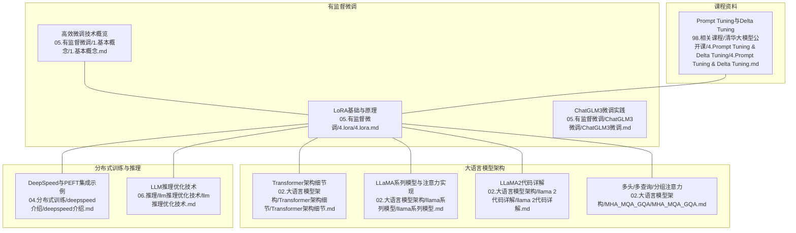
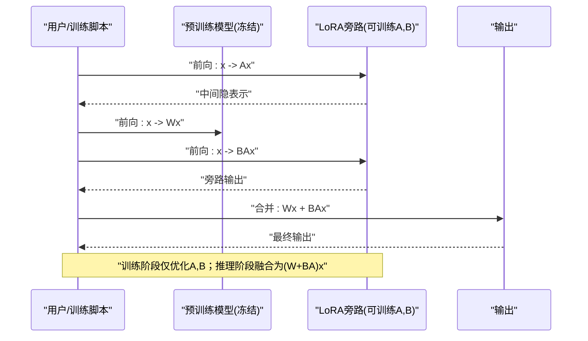
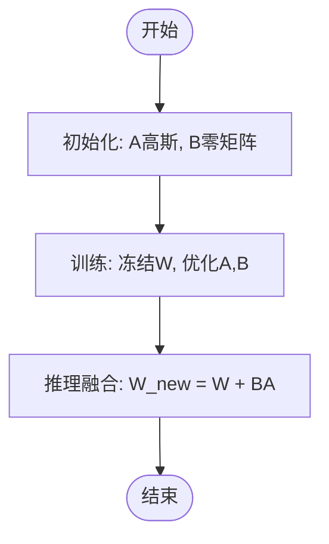
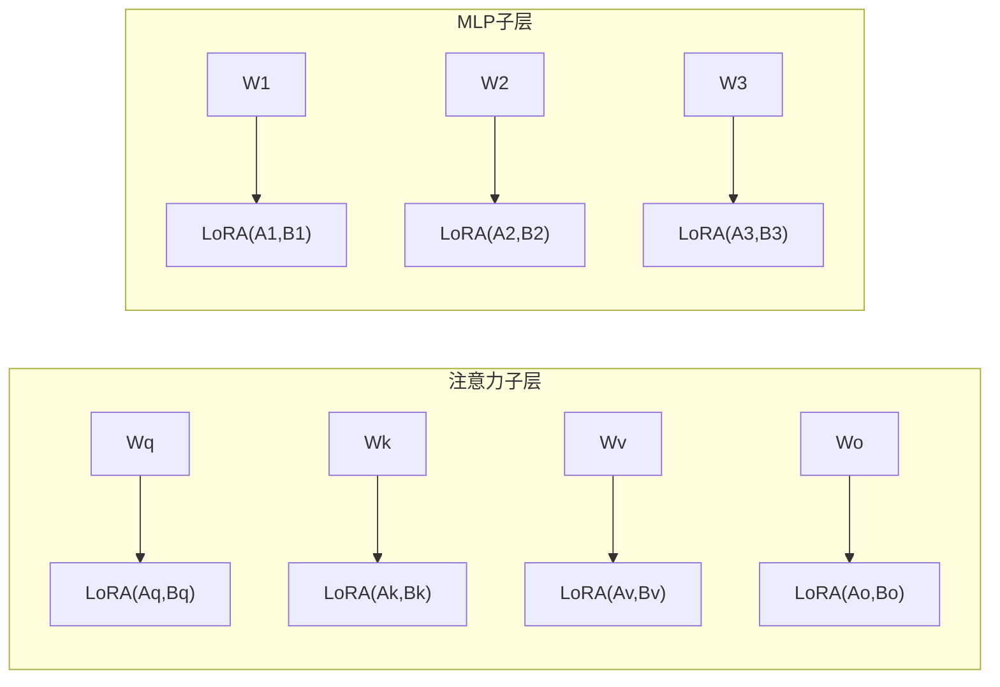
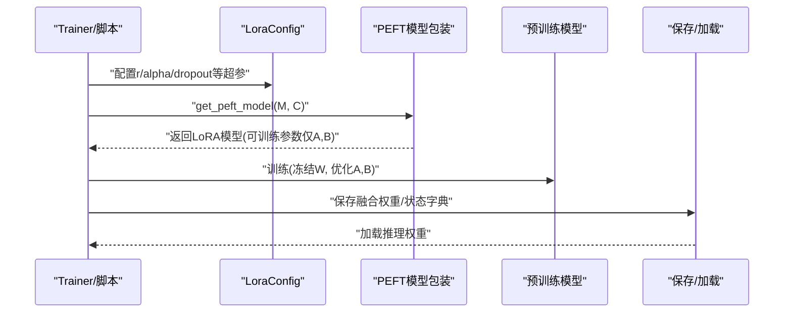
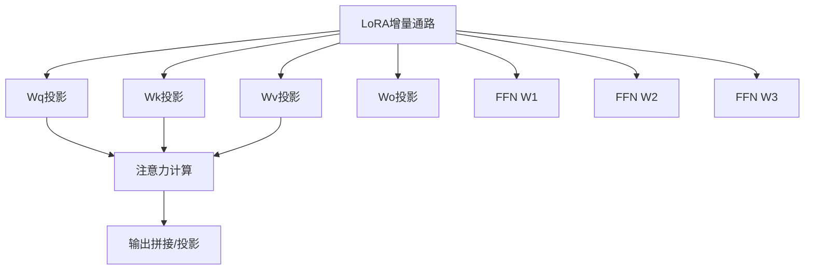

# LoRA低秩适配方法

<cite>
**本文引用的文件**   
- [LoRA基础与原理](file://05.有监督微调/4.lora/4.lora.md)
- [高效微调技术概览](file://05.有监督微调/1.基本概念/1.基本概念.md)
- [DeepSpeed与PEFT集成示例](file://04.分布式训练/deepspeed介绍/deepspeed介绍.md)
- [Transformer架构细节](file://02.大语言模型架构/Transformer架构细节/Transformer架构细节.md)
- [LLaMA系列模型与注意力实现](file://02.大语言模型架构/llama系列模型/llama系列模型.md)
- [LLaMA2代码详解](file://02.大语言模型架构/llama 2代码详解/llama 2代码详解.md)
- [多头/多查询/分组注意力](file://02.大语言模型架构/MHA_MQA_GQA/MHA_MQA_GQA.md)
- [LLM推理优化技术](file://06.推理/llm推理优化技术/llm推理优化技术.md)
- [清华大模型公开课：Prompt Tuning与Delta Tuning](file://98.相关课程/清华大模型公开课/4.Prompt Tuning & Delta Tuning/4.Prompt Tuning & Delta Tuning.md)
- [ChatGLM3微调实践](file://05.有监督微调/ChatGLM3微调/ChatGLM3微调.md)
</cite>

## 目录
1. [引言](#引言)
2. [项目结构](#项目结构)
3. [核心组件](#核心组件)
4. [架构总览](#架构总览)
5. [详细组件分析](#详细组件分析)
6. [依赖分析](#依赖分析)
7. [性能考量](#性能考量)
8. [故障排查指南](#故障排查指南)
9. [结论](#结论)
10. [附录](#附录)

## 引言
本文件围绕LoRA低秩适配方法，系统梳理其理论基础、实现要点、在不同模型架构中的应用、部署与推理优化策略，并与同类高效微调方法进行对比。LoRA通过低秩分解对权重增量进行参数化，仅训练少量可加性通路参数，即可在下游任务上取得与全量微调相当的性能，同时显著降低显存与存储开销，便于多任务并行部署与快速迭代。

## 项目结构
本仓库中与LoRA相关的内容主要分布在“有监督微调”“大语言模型架构”“分布式训练”“推理优化”“课程资料”等章节。下图给出与LoRA主题相关的知识组织关系：

**图表来源**
- [LoRA基础与原理:1-114](file://05.有监督微调/4.lora/4.lora.md#L1-L114)
- [高效微调技术概览:1-85](file://05.有监督微调/1.基本概念/1.基本概念.md#L1-L85)
- [DeepSpeed与PEFT集成示例:600-765](file://04.分布式训练/deepspeed介绍/deepspeed介绍.md#L600-L765)
- [Transformer架构细节:1-321](file://02.大语言模型架构/Transformer架构细节/Transformer架构细节.md#L1-L321)
- [LLaMA系列模型与注意力实现:187-255](file://02.大语言模型架构/llama系列模型/llama系列模型.md#L187-L255)
- [LLaMA2代码详解:258-522](file://02.大语言模型架构/llama 2代码详解/llama 2代码详解.md#L258-L522)
- [多头/多查询/分组注意力:31-225](file://02.大语言模型架构/MHA_MQA_GQA/MHA_MQA_GQA.md#L31-L225)
- [LLM推理优化技术:1-271](file://06.推理/llm推理优化技术/llm推理优化技术.md#L1-L271)
- [Prompt Tuning与Delta Tuning:430-494](file://98.相关课程/清华大模型公开课/4.Prompt Tuning & Delta Tuning/4.Prompt Tuning & Delta Tuning.md#L430-L494)
- [ChatGLM3微调实践:1-12](file://05.有监督微调/ChatGLM3微调/ChatGLM3微调.md#L1-L12)

**章节来源**
- [LoRA基础与原理:1-114](file://05.有监督微调/4.lora/4.lora.md#L1-L114)
- [高效微调技术概览:1-85](file://05.有监督微调/1.基本概念/1.基本概念.md#L1-L85)
- [DeepSpeed与PEFT集成示例:600-765](file://04.分布式训练/deepspeed介绍/deepspeed介绍.md#L600-L765)
- [Transformer架构细节:1-321](file://02.大语言模型架构/Transformer架构细节/Transformer架构细节.md#L1-L321)
- [LLaMA系列模型与注意力实现:187-255](file://02.大语言模型架构/llama系列模型/llama系列模型.md#L187-L255)
- [LLaMA2代码详解:258-522](file://02.大语言模型架构/llama 2代码详解/llama 2代码详解.md#L258-L522)
- [多头/多查询/分组注意力:31-225](file://02.大语言模型架构/MHA_MQA_GQA/MHA_MQA_GQA.md#L31-L225)
- [LLM推理优化技术:1-271](file://06.推理/llm推理优化技术/llm推理优化技术.md#L1-L271)
- [Prompt Tuning与Delta Tuning:430-494](file://98.相关课程/清华大模型公开课/4.Prompt Tuning & Delta Tuning/4.Prompt Tuning & Delta Tuning.md#L430-L494)
- [ChatGLM3微调实践:1-12](file://05.有监督微调/ChatGLM3微调/ChatGLM3微调.md#L1-L12)

## 核心组件
- 低秩增量参数化：以可训练的低秩矩阵A、B替代权重更新ΔW≈BA，仅在下游任务训练时更新A、B，冻结预训练权重。
- 初始化策略：A按高斯分布初始化，B初始化为零矩阵，保证训练初期不改变主路径输出。
- 推理融合：推理时将BA与原权重W相加形成新权重W+BA，不引入额外计算开销。
- 适用模块：主要面向注意力子层的投影矩阵（Wq、Wk、Wv、Wo）与MLP层权重，实验表明同时适配Wq与Wv效果更佳。
- 秩选择：典型取值为4、8、16，秩的选择需平衡子空间覆盖能力与参数量/显存约束。

**章节来源**
- [LoRA基础与原理:9-41](file://05.有监督微调/4.lora/4.lora.md#L9-L41)

## 架构总览
LoRA在预训练模型中以“旁路增量通路”的形式接入，训练时仅更新A、B，推理时将增量融合到原权重中，整体流程如下：

**图表来源**
- [LoRA基础与原理:21-27](file://05.有监督微调/4.lora/4.lora.md#L21-L27)

## 详细组件分析

### 理论基础与数学原理
- 低秩近似：将权重更新ΔW参数化为两个低秩矩阵的乘积BA，从而将d×d的权重更新近似为d×r与r×d两次仿射变换，参数量从d²降至2dr。
- 参数更新公式：h = (W0 + ΔW)x = W0x + ΔWx ≈ W0x + B(Ax)，其中ΔW ≈ BA。
- 推理融合：推理时直接将增量BA加到原权重W上，得到新权重(W + BA)，不引入额外计算。

**图表来源**
- [LoRA基础与原理:21-27](file://05.有监督微调/4.lora/4.lora.md#L21-L27)

**章节来源**
- [LoRA基础与原理:9-27](file://05.有监督微调/4.lora/4.lora.md#L9-L27)

### 权重更新机制与初始化策略
- 可训练矩阵A、B的设计：A负责降维至r，B负责升维回d；r<<d，典型r取4/8/16。
- 初始化策略：A按高斯分布初始化，B初始化为零矩阵，确保训练初期旁路贡献为零，避免破坏预训练表示。
- 更新规则：下游任务训练时，仅反向传播更新A、B，保持预训练权重W冻结。

**章节来源**
- [LoRA基础与原理:21-27](file://05.有监督微调/4.lora/4.lora.md#L21-L27)

### 秩大小选择与影响
- 秩r的选择：通常取4、8、16；秩越大，子空间覆盖能力越强，但参数量与显存随之增加。
- 实验观察：权重矩阵种类数量比单纯增大r更重要；在多数数据集上，LoRA仅训练极少量参数即可达到与全量微调相当甚至更优的性能。

**章节来源**
- [LoRA基础与原理:31-41](file://05.有监督微调/4.lora/4.lora.md#L31-L41)

### 在不同模型架构中的应用
- Transformer注意力子层：对Wq、Wk、Wv、Wo等投影矩阵施加LoRA，实验表明同时适配Wq与Wv效果更佳。
- MLP层：LoRA同样可应用于前馈网络权重矩阵。
- LLaMA/LLaMA2注意力实现：在Wq/Wk/Wv线性层处接入LoRA，推理时融合增量权重。
- 多头/多查询/分组注意力：在MHA/MQA/GQA中，LoRA可作用于各头的投影矩阵，结合KV缓存与注意力优化策略提升推理效率。

**图表来源**
- [LoRA基础与原理:29-31](file://05.有监督微调/4.lora/4.lora.md#L29-L31)
- [LLaMA系列模型与注意力实现:187-255](file://02.大语言模型架构/llama系列模型/llama系列模型.md#L187-L255)
- [LLaMA2代码详解:308-330](file://02.大语言模型架构/llama 2代码详解/llama 2代码详解.md#L308-L330)
- [多头/多查询/分组注意力:31-87](file://02.大语言模型架构/MHA_MQA_GQA/MHA_MQA_GQA.md#L31-L87)

**章节来源**
- [LoRA基础与原理:29-31](file://05.有监督微调/4.lora/4.lora.md#L29-L31)
- [LLaMA系列模型与注意力实现:187-255](file://02.大语言模型架构/llama系列模型/llama系列模型.md#L187-L255)
- [LLaMA2代码详解:308-330](file://02.大语言模型架构/llama 2代码详解/llama 2代码详解.md#L308-L330)
- [多头/多查询/分组注意力:31-87](file://02.大语言模型架构/MHA_MQA_GQA/MHA_MQA_GQA.md#L31-L87)

### AdaLoRA与QLoRA扩展
- AdaLoRA：根据重要性评分动态分配参数预算，对关键增量矩阵赋予更高秩，对不重要矩阵降低秩，训练中加入正交性惩罚项以稳定SVD近似。
- QLoRA：在4bit量化场景下进行高效微调，采用NF4与双量化降低存储开销，配合分页优化器缓解显存峰值，实现与16bit微调相当的性能。

**章节来源**
- [LoRA基础与原理:43-114](file://05.有监督微调/4.lora/4.lora.md#L43-L114)

### 训练与部署集成（以DeepSpeed/PEFT为例）
- 使用peft的LoraConfig配置r、alpha、dropout等超参，通过get_peft_model将LoRA注入模型，训练时仅打印可训练参数，推理时保存融合后的权重。
- DeepSpeed配置可与LoRA结合，实现多卡高效训练与检查点管理。

**图表来源**
- [DeepSpeed与PEFT集成示例:715-731](file://04.分布式训练/deepspeed介绍/deepspeed介绍.md#L715-L731)
- [LoRA基础与原理:21-27](file://05.有监督微调/4.lora/4.lora.md#L21-L27)

**章节来源**
- [DeepSpeed与PEFT集成示例:600-765](file://04.分布式训练/deepspeed介绍/deepspeed介绍.md#L600-L765)
- [LoRA基础与原理:21-27](file://05.有监督微调/4.lora/4.lora.md#L21-L27)

### 与其他高效微调方法的对比
- 适配器（Adapter）：在层间插入小型网络，推理引入额外延迟；LoRA以增量通路形式融合，推理无额外开销。
- Prompt/Prefix Tuning：直接优化软提示或前缀，收敛不稳定且消耗输入token；LoRA稳定可控。
- BitFit：仅微调偏置，参数量极少但效果有限；LoRA在保持低参数的同时覆盖更广的权重子空间。
- Diff Pruning/低秩近似：LoRA以低秩参数化实现增量更新，相较全量微调显著降低显存与存储成本。

**章节来源**
- [高效微调技术概览:56-85](file://05.有监督微调/1.基本概念/1.基本概念.md#L56-L85)
- [Prompt Tuning与Delta Tuning:430-494](file://98.相关课程/清华大模型公开课/4.Prompt Tuning & Delta Tuning/4.Prompt Tuning & Delta Tuning.md#L430-L494)

## 依赖分析
LoRA在不同模型架构中的应用依赖于注意力与前馈网络的线性层结构，其依赖关系如下：

**图表来源**
- [LoRA基础与原理:29-31](file://05.有监督微调/4.lora/4.lora.md#L29-L31)
- [Transformer架构细节:1-321](file://02.大语言模型架构/Transformer架构细节/Transformer架构细节.md#L1-L321)
- [LLaMA2代码详解:492-514](file://02.大语言模型架构/llama 2代码详解/llama 2代码详解.md#L492-L514)

**章节来源**
- [LoRA基础与原理:29-31](file://05.有监督微调/4.lora/4.lora.md#L29-L31)
- [Transformer架构细节:1-321](file://02.大语言模型架构/Transformer架构细节/Transformer架构细节.md#L1-L321)
- [LLaMA2代码详解:492-514](file://02.大语言模型架构/llama 2代码详解/llama 2代码详解.md#L492-L514)

## 性能考量
- 训练阶段：LoRA显著降低显存占用与优化器状态存储压力，适合多任务并行微调；在DeepSpeed等框架下可进一步优化梯度累积与混合精度。
- 推理阶段：融合后的权重仍为稠密矩阵，不引入额外算子；结合KV缓存、注意力优化（如FlashAttention、MQA/GQA）与分页KV管理，可进一步降低延迟与内存占用。
- 量化与存储：QLoRA在4bit量化下实现高效微调，配合分页优化器缓解内存峰值，适合资源受限场景。

**章节来源**
- [LoRA基础与原理:81-114](file://05.有监督微调/4.lora/4.lora.md#L81-L114)
- [LLM推理优化技术:168-271](file://06.推理/llm推理优化技术/llm推理优化技术.md#L168-L271)

## 故障排查指南
- 可训练参数异常：确认已正确使用PEFT包装模型并打印可训练参数，确保仅A、B被纳入优化器。
- 显存不足：检查是否开启混合精度、梯度累积与ZeRO优化；必要时降低r或batch size。
- 推理性能不达预期：检查是否启用KV缓存、注意力优化（如FlashAttention）与分页KV；评估是否采用MQA/GQA策略。
- 量化相关问题：若使用QLoRA，确认数据类型与分页优化器配置正确，避免OOM。

**章节来源**
- [DeepSpeed与PEFT集成示例:715-765](file://04.分布式训练/deepspeed介绍/deepspeed介绍.md#L715-L765)
- [LLM推理优化技术:168-271](file://06.推理/llm推理优化技术/llm推理优化技术.md#L168-L271)

## 结论
LoRA通过低秩增量参数化，以极少量可训练参数实现与全量微调相当的下游任务性能，同时显著降低显存与存储成本，便于多任务并行部署与快速迭代。结合注意力优化、KV缓存与量化策略，可在推理阶段进一步提升吞吐与降低延迟。AdaLoRA与QLoRA分别在参数预算分配与量化微调方面提供了扩展方案，为LoRA生态的持续演进奠定了基础。

## 附录
- 实践参考：结合DeepSpeed与PEFT进行LoRA训练与推理权重保存；在ChatGLM3等模型上进行LoRA微调实践。
- 进一步阅读：清华大模型公开课中关于Prompt Tuning与Delta Tuning的统一视角，有助于理解LoRA在低秩/低维空间中的共性。

**章节来源**
- [ChatGLM3微调实践:1-12](file://05.有监督微调/ChatGLM3微调/ChatGLM3微调.md#L1-L12)
- [Prompt Tuning与Delta Tuning:430-494](file://98.相关课程/清华大模型公开课/4.Prompt Tuning & Delta Tuning/4.Prompt Tuning & Delta Tuning.md#L430-L494)