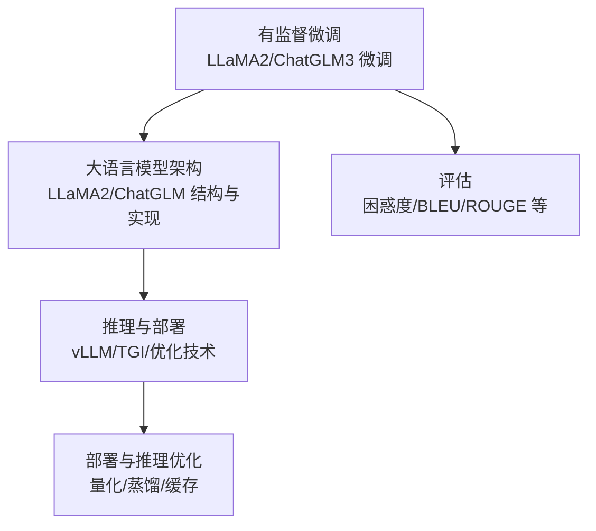
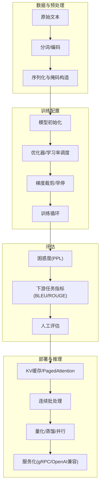
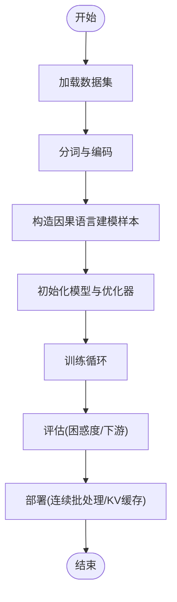
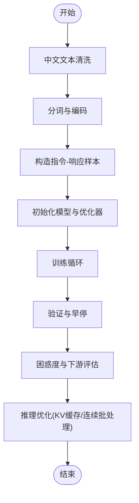
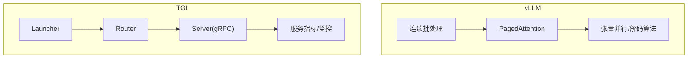
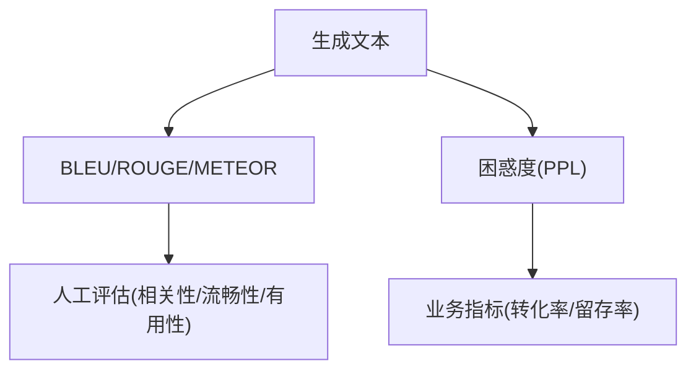
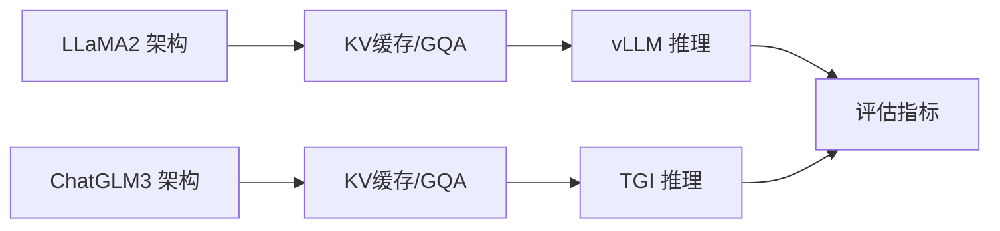

# 实践案例与部署

<cite>
**本文引用的文件**
- [llama2微调.md](file://05.有监督微调/llama2微调/llama2微调.md)
- [ChatGLM3微调.md](file://05.有监督微调/ChatGLM3微调/ChatGLM3微调.md)
- [llama 2代码详解.md](file://02.大语言模型架构/llama 2代码详解/llama 2代码详解.md)
- [chatglm系列模型.md](file://02.大语言模型架构/chatglm系列模型/chatglm系列模型.md)
- [llm推理优化技术.md](file://06.推理/llm推理优化技术/llm推理优化技术.md)
- [1.vllm.md](file://06.推理/1.vllm/1.vllm.md)
- [2.text_generation_inference.md](file://06.推理/2.text_generation_inference/2.text_generation_inference.md)
- [6.文本理解和生成大模型.md](file://98.相关课程/清华大模型公开课/6.文本理解和生成大模型/6.文本理解和生成大模型.md)
- [LLM推理常见参数.md](file://06.推理/LLM推理常见参数/LLM推理常见参数.md)
</cite>

## 目录
1. [引言](#引言)
2. [项目结构](#项目结构)
3. [核心组件](#核心组件)
4. [架构总览](#架构总览)
5. [详细组件分析](#详细组件分析)
6. [依赖分析](#依赖分析)
7. [性能考量](#性能考量)
8. [故障排查指南](#故障排查指南)
9. [结论](#结论)
10. [附录](#附录)

## 引言
本文件面向微调实践案例，围绕 LLaMA2 与 ChatGLM3 的微调流程、数据预处理、训练配置、超参数设置、评估方法与部署推理优化进行系统化梳理。内容既覆盖通用的训练与评估范式，也聚焦中文场景下的特殊考虑与优化策略，帮助读者从零到一完成高质量的微调与上线。

## 项目结构
本仓库以主题模块组织，与微调与部署密切相关的知识分布在以下目录：
- 有监督微调：包含 LLaMA2 与 ChatGLM3 的微调资料与链接
- 大语言模型架构：包含 LLaMA2 与 ChatGLM 系列的结构与实现要点
- 推理与部署：包含 vLLM、TGI 等推理框架与优化技术
- 评估：包含困惑度、BLEU、ROUGE 等评估指标与方法

**章节来源**
- [llama2微调.md:1-4](file://05.有监督微调/llama2微调/llama2微调.md#L1-L4)
- [ChatGLM3微调.md:1-12](file://05.有监督微调/ChatGLM3微调/ChatGLM3微调.md#L1-L12)
- [llama 2代码详解.md:1-527](file://02.大语言模型架构/llama 2代码详解/llama 2代码详解.md#L1-L527)
- [chatglm系列模型.md:1-214](file://02.大语言模型架构/chatglm系列模型/chatglm系列模型.md#L1-L214)
- [llm推理优化技术.md:1-271](file://06.推理/llm推理优化技术/llm推理优化技术.md#L1-L271)
- [1.vllm.md:1-220](file://06.推理/1.vllm/1.vllm.md#L1-L220)
- [2.text_generation_inference.md:1-140](file://06.推理/2.text_generation_inference/2.text_generation_inference.md#L1-L140)
- [6.文本理解和生成大模型.md:563-595](file://98.相关课程/清华大模型公开课/6.文本理解和生成大模型/6.文本理解和生成大模型.md#L563-L595)

## 核心组件
- 数据预处理与格式化：将文本转换为 token 序列，构造监督信号（如因果语言建模的滑动窗口）
- 训练配置与超参数：学习率、warmup、梯度裁剪、优化器、批大小、序列长度、早停策略
- 评估方法：困惑度（PPL）、下游任务指标（BLEU/ROUGE/人工评估）
- 部署与推理优化：KV 缓存、分页注意力（PagedAttention）、连续批处理、量化、蒸馏、张量并行

**章节来源**
- [llm推理优化技术.md:1-271](file://06.推理/llm推理优化技术/llm推理优化技术.md#L1-L271)
- [6.文本理解和生成大模型.md:563-595](file://98.相关课程/清华大模型公开课/6.文本理解和生成大模型/6.文本理解和生成大模型.md#L563-L595)

## 架构总览
下图展示从数据到训练再到推理部署的整体路径，强调数据预处理、训练配置、评估与部署优化的衔接。

## 详细组件分析

### LLaMA2 微调实践
- 数据预处理
  - 将对话或指令-响应对转换为 token 序列，构造因果语言建模的监督信号（右移标签）
  - 控制序列长度，必要时截断或拼接，确保上下文与生成长度合理
- 训练配置
  - 优化器与学习率：AdamW 为主，学习率调度建议余弦退火或线性 warmup
  - 梯度裁剪：梯度范数阈值（如 1.0）防止爆炸
  - 早停：基于验证集困惑度或下游任务指标
- 评估
  - 困惑度（PPL）：在验证集上计算交叉熵
  - 下游任务：构造任务特定的评估集，统计准确率、BLEU/ROUGE
- 部署
  - 推理阶段采用 KV 缓存与 GQA/MQA 降低显存占用
  - 连续批处理与 PagedAttention 提升吞吐

**章节来源**
- [llama 2代码详解.md:1-527](file://02.大语言模型架构/llama 2代码详解/llama 2代码详解.md#L1-L527)
- [llm推理优化技术.md:1-271](file://06.推理/llm推理优化技术/llm推理优化技术.md#L1-L271)

### ChatGLM3 微调实践（中文场景）
- 数据预处理
  - 中文文本清洗与分词，注意特殊符号与标点处理
  - 构造指令-响应格式，确保上下文与回答分离明确
- 训练配置
  - 优化器与学习率：与 LLaMA2 类似，注意中文任务的收敛特性
  - 梯度裁剪与早停：结合验证集指标
- 评估
  - 困惑度（PPL）与中文下游任务（如抽取、分类、阅读理解）
  - 人工评估：流畅性、相关性、一致性
- 部署
  - ChatGLM3 采用 RMSNorm、RoPE、GQA 等优化，推理阶段同样受益于 KV 缓存与连续批处理

**章节来源**
- [chatglm系列模型.md:1-214](file://02.大语言模型架构/chatglm系列模型/chatglm系列模型.md#L1-L214)
- [llm推理优化技术.md:1-271](file://06.推理/llm推理优化技术/llm推理优化技术.md#L1-L271)

### 推理框架与优化（vLLM/TGI）
- vLLM
  - 连续批处理（Continuous Batching）提升 GPU 利用率
  - PagedAttention 以分页方式管理 KV 缓存，降低内存碎片与浪费
  - 支持张量并行与多种解码算法（贪心/Top-k/Top-p/束搜索等）
- Text Generation Inference (TGI)
  - 提供 Launcher/Router/Server 三层架构，支持 HuggingFace 生态模型
  - 内置服务评估与指标导出，支持 OpenTelemetry/Prometheus
  - 支持 FlashAttention、PagedAttention、量化（LLM.int8/GPT-Q）

**章节来源**
- [1.vllm.md:1-220](file://06.推理/1.vllm/1.vllm.md#L1-L220)
- [2.text_generation_inference.md:1-140](file://06.推理/2.text_generation_inference/2.text_generation_inference.md#L1-L140)

### 评估方法与指标
- 自动化指标
  - 困惑度（PPL）：衡量模型对测试集的拟合度
  - BLEU/ROUGE/METEOR：文本生成质量的通用指标
- 人工评估
  - 相关性、流畅性、有用性评分
  - A/B 测试与用户满意度调查
- 下游任务
  - 分类、抽取、阅读理解等任务的准确率、F1 等

**章节来源**
- [6.文本理解和生成大模型.md:563-595](file://98.相关课程/清华大模型公开课/6.文本理解和生成大模型/6.文本理解和生成大模型.md#L563-L595)

## 依赖分析
- 模型架构依赖
  - LLaMA2：RMSNorm、RoPE、GQA/MQA、KV 缓存
  - ChatGLM3：RMSNorm、RoPE、GQA、GLU MLP
- 推理优化依赖
  - KV 缓存与 PagedAttention 依赖于注意力实现与内存管理
  - 连续批处理依赖于调度器与请求生命周期管理
- 评估依赖
  - 评估指标依赖于生成文本与参考文本的对齐与计算

**章节来源**
- [llama 2代码详解.md:1-527](file://02.大语言模型架构/llama 2代码详解/llama 2代码详解.md#L1-L527)
- [chatglm系列模型.md:1-214](file://02.大语言模型架构/chatglm系列模型/chatglm系列模型.md#L1-L214)
- [1.vllm.md:1-220](file://06.推理/1.vllm/1.vllm.md#L1-L220)
- [2.text_generation_inference.md:1-140](file://06.推理/2.text_generation_inference/2.text_generation_inference.md#L1-L140)

## 性能考量
- 显存与吞吐
  - KV 缓存大小与序列长度呈线性关系，可通过 GQA/MQA 降低 KV 存储
  - PagedAttention 降低内存碎片，提升连续批处理的吞吐
- 计算效率
  - FlashAttention 优化内存访问与融合计算，减少 I/O 开销
  - 张量并行与流水线并行提升大规模模型的吞吐
- 服务化
  - 连续批处理与动态调度提升 GPU 利用率
  - 量化与蒸馏降低模型大小与推理延迟

**章节来源**
- [llm推理优化技术.md:1-271](file://06.推理/llm推理优化技术/llm推理优化技术.md#L1-L271)

## 故障排查指南
- 显存不足
  - 降低批大小、序列长度或使用 GQA/MQA
  - 启用 PagedAttention，减少 KV 缓存碎片
- 推理延迟高
  - 检查是否启用连续批处理与 KV 缓存
  - 评估是否使用 FlashAttention 与张量并行
- 评估偏差
  - 确认评估集与训练/验证集分布一致
  - 人工评估补充自动化指标的主观维度
- 参数与采样
  - 温度、Top-k/Top-p、终止符等参数影响生成稳定性与多样性
  - 通过网格搜索或贝叶斯优化确定最优超参数

**章节来源**
- [LLM推理常见参数.md:59-81](file://06.推理/LLM推理常见参数/LLM推理常见参数.md#L59-L81)
- [1.vllm.md:1-220](file://06.推理/1.vllm/1.vllm.md#L1-L220)
- [2.text_generation_inference.md:1-140](file://06.推理/2.text_generation_inference/2.text_generation_inference.md#L1-L140)

## 结论
本文件系统梳理了 LLaMA2 与 ChatGLM3 的微调实践与部署优化路径，强调数据预处理、训练配置、评估与推理优化的闭环。中文场景下需关注分词与指令格式，结合 KV 缓存、PagedAttention、连续批处理与量化等技术，实现高效稳定的上线部署。

## 附录
- 参考资料与链接
  - LLaMA2 微调资料：[llama2微调.md:1-4](file://05.有监督微调/llama2微调/llama2微调.md#L1-L4)
  - ChatGLM3 微调资料：[ChatGLM3微调.md:1-12](file://05.有监督微调/ChatGLM3微调/ChatGLM3微调.md#L1-L12)
  - LLaMA2 架构与实现要点：[llama 2代码详解.md:1-527](file://02.大语言模型架构/llama 2代码详解/llama 2代码详解.md#L1-L527)
  - ChatGLM 系列模型结构：[chatglm系列模型.md:1-214](file://02.大语言模型架构/chatglm系列模型/chatglm系列模型.md#L1-L214)
  - 推理优化技术：[llm推理优化技术.md:1-271](file://06.推理/llm推理优化技术/llm推理优化技术.md#L1-L271)
  - vLLM 框架：[1.vllm.md:1-220](file://06.推理/1.vllm/1.vllm.md#L1-L220)
  - TGI 框架：[2.text_generation_inference.md:1-140](file://06.推理/2.text_generation_inference/2.text_generation_inference.md#L1-L140)
  - 评估指标：[6.文本理解和生成大模型.md:563-595](file://98.相关课程/清华大模型公开课/6.文本理解和生成大模型/6.文本理解和生成大模型.md#L563-L595)