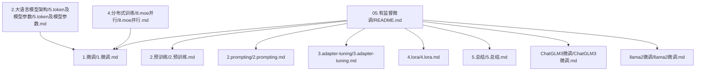
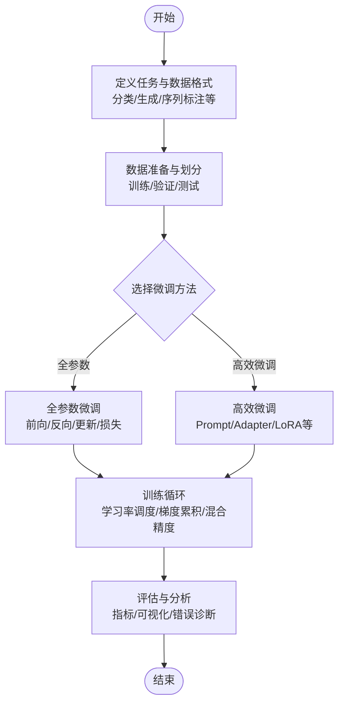
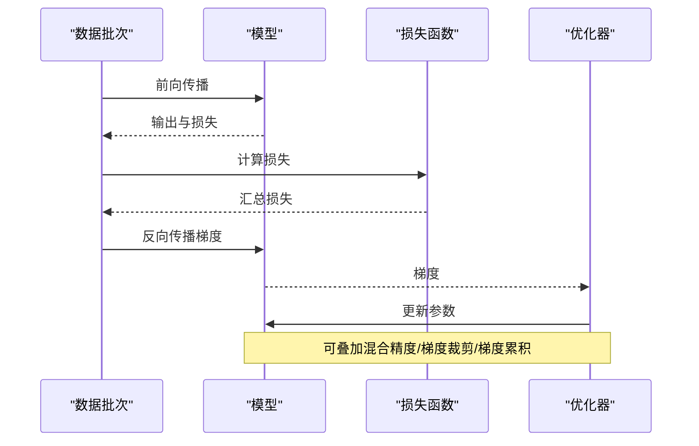
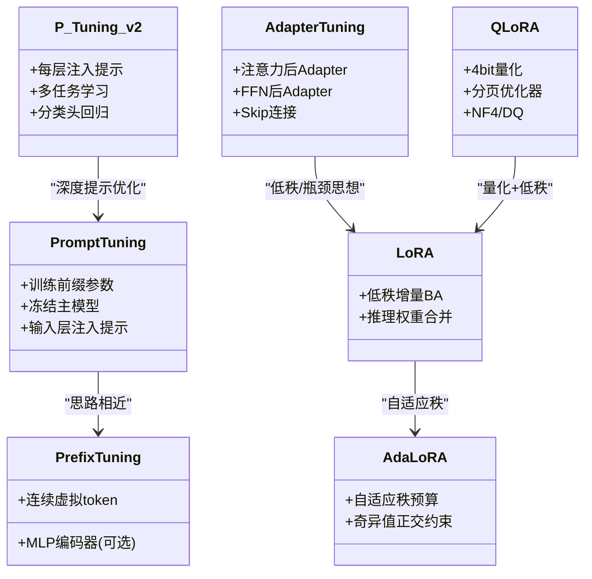

# 微调基础理论

<cite>
**本文引用的文件**
- [05.有监督微调/README.md](file://05.有监督微调/README.md)
- [05.有监督微调/1.微调/1.微调.md](file://05.有监督微调/1.微调/1.微调.md)
- [05.有监督微调/2.预训练/2.预训练.md](file://05.有监督微调/2.预训练/2.预训练.md)
- [05.有监督微调/2.prompting/2.prompting.md](file://05.有监督微调/2.prompting/2.prompting.md)
- [05.有监督微调/3.adapter-tuning/3.adapter-tuning.md](file://05.有监督微调/3.adapter-tuning/3.adapter-tuning.md)
- [05.有监督微调/4.lora/4.lora.md](file://05.有监督微调/4.lora/4.lora.md)
- [05.有监督微调/5.总结/5.总结.md](file://05.有监督微调/5.总结/5.总结.md)
- [05.有监督微调/ChatGLM3微调/ChatGLM3微调.md](file://05.有监督微调/ChatGLM3微调/ChatGLM3微调.md)
- [05.有监督微调/llama2微调/llama2微调.md](file://05.有监督微调/llama2微调/llama2微调.md)
- [02.大语言模型架构/5.token及模型参数/5.token及模型参数.md](file://02.大语言模型架构/5.token及模型参数/5.token及模型参数.md)
- [04.分布式训练/8.moe并行/8.moe并行.md](file://04.分布式训练/8.moe并行/8.moe并行.md)
</cite>

## 目录
1. [简介](#简介)
2. [项目结构](#项目结构)
3. [核心组件](#核心组件)
4. [架构总览](#架构总览)
5. [详细组件分析](#详细组件分析)
6. [依赖分析](#依赖分析)
7. [性能考量](#性能考量)
8. [故障排查指南](#故障排查指南)
9. [结论](#结论)
10. [附录](#附录)

## 简介
本文件围绕“有监督微调（Supervised Fine-Tuning, SFT）”的基础理论与实践展开，系统阐述微调的定义、目的、在大语言模型中的作用，以及全参数微调的完整训练流程（前向传播、反向传播、梯度更新、损失计算）。同时，结合仓库中的高效微调方法（Prompt Tuning、Adapter Tuning、LoRA、QLoRA 等）与预训练/指令微调的关系，给出关键参数设置建议（学习率调度、批次大小、训练轮数等），并提供常见问题与解决方案（过拟合、欠拟合、收敛问题、灾难性遗忘等）。

## 项目结构
本仓库与“微调基础理论”相关的主要内容集中在“05.有监督微调”目录下，辅以“2.预训练”“2.prompting”“3.adapter-tuning”“4.lora”“5.总结”等专题文件，以及与训练过程相关的“5.token及模型参数”“8.moe并并行”等资料。这些文件共同构成了从理论到实践、从全参数到高效微调的完整知识体系。

图表来源
- [05.有监督微调/README.md:1-30](file://05.有监督微调/README.md#L1-L30)
- [05.有监督微调/1.微调/1.微调.md:1-280](file://05.有监督微调/1.微调/1.微调.md#L1-L280)
- [05.有监督微调/2.预训练/2.预训练.md:1-37](file://05.有监督微调/2.预训练/2.预训练.md#L1-L37)
- [05.有监督微调/2.prompting/2.prompting.md:1-173](file://05.有监督微调/2.prompting/2.prompting.md#L1-L173)
- [05.有监督微调/3.adapter-tuning/3.adapter-tuning.md:1-165](file://05.有监督微调/3.adapter-tuning/3.adapter-tuning.md#L1-L165)
- [05.有监督微调/4.lora/4.lora.md:1-114](file://05.有监督微调/4.lora/4.lora.md#L1-L114)
- [05.有监督微调/5.总结/5.总结.md:1-135](file://05.有监督微调/5.总结/5.总结.md#L1-L135)
- [05.有监督微调/ChatGLM3微调/ChatGLM3微调.md:1-12](file://05.有监督微调/ChatGLM3微调/ChatGLM3微调.md#L1-L12)
- [05.有监督微调/llama2微调/llama2微调.md:1-4](file://05.有监督微调/llama2微调/llama2微调.md#L1-L4)
- [02.大语言模型架构/5.token及模型参数/5.token及模型参数.md:89-183](file://02.大语言模型架构/5.token及模型参数/5.token及模型参数.md#L89-L183)
- [04.分布式训练/8.moe并行/8.moe并行.md:188-312](file://04.分布式训练/8.moe并行/8.moe并行.md#L188-L312)

章节来源
- [05.有监督微调/README.md:1-30](file://05.有监督微调/README.md#L1-L30)

## 核心组件
- 微调定义与目的：在预训练语言模型基础上，使用带标注的下游任务数据进行有监督训练，使模型适配特定任务或领域，提升任务性能与可控性。
- 全参数微调流程：前向传播计算输出与损失，反向传播计算梯度，使用优化器更新参数，重复直至收敛。
- 关键参数设置：学习率调度（Warmup、余弦退火、阶梯衰减等）、批次大小（Batch Size）、训练轮数（Epochs 或 Steps）、梯度累积、混合精度、梯度裁剪等。
- 高效微调方法：Prompt Tuning、Prefix Tuning、P-Tuning v2、Adapter Tuning、LoRA、AdaLoRA、QLoRA 等，各有参数高效、可插拔、低推理开销等特点。
- 预训练与SFT的区别：预训练通过自监督任务学习通用语言表示；SFT使用标注数据进行有监督学习，注入任务相关知识。
- 何时选择微调而非从头训练：SFT成本低、效果好、部署灵活；从头训练成本高、周期长，除非有特殊需求或数据极度稀缺。

章节来源
- [05.有监督微调/1.微调/1.微调.md:16-34](file://05.有监督微调/1.微调/1.微调.md#L16-L34)
- [05.有监督微调/1.微调/1.微调.md:216-236](file://05.有监督微调/1.微调/1.微调.md#L216-L236)
- [05.有监督微调/2.预训练/2.预训练.md:5-37](file://05.有监督微调/2.预训练/2.预训练.md#L5-L37)
- [05.有监督微调/2.prompting/2.prompting.md:1-173](file://05.有监督微调/2.prompting/2.prompting.md#L1-L173)
- [05.有监督微调/3.adapter-tuning/3.adapter-tuning.md:1-165](file://05.有监督微调/3.adapter-tuning/3.adapter-tuning.md#L1-L165)
- [05.有监督微调/4.lora/4.lora.md:1-114](file://05.有监督微调/4.lora/4.lora.md#L1-L114)

## 架构总览
下图展示从“数据与任务定义”到“模型训练与评估”的整体流程，涵盖全参数微调与高效微调路径。

图表来源
- [05.有监督微调/1.微调/1.微调.md:106-114](file://05.有监督微调/1.微调/1.微调.md#L106-L114)
- [05.有监督微调/2.prompting/2.prompting.md:75-173](file://05.有监督微调/2.prompting/2.prompting.md#L75-L173)
- [05.有监督微调/3.adapter-tuning/3.adapter-tuning.md:1-165](file://05.有监督微调/3.adapter-tuning/3.adapter-tuning.md#L1-L165)
- [05.有监督微调/4.lora/4.lora.md:1-114](file://05.有监督微调/4.lora/4.lora.md#L1-L114)

## 详细组件分析

### 全参数微调训练流程
- 前向传播：输入经嵌入、多头注意力、前馈网络、层归一化等模块，输出任务相关表示（分类/生成/标注）。
- 损失计算：根据任务类型选择交叉熵、CTC、序列标注损失等，计算样本级损失并汇总为批次损失。
- 反向传播：对损失关于模型参数求梯度，使用链式法则逐层回传。
- 参数更新：优化器（Adam/AdamW/SGD等）依据学习率与梯度更新参数；可配合梯度裁剪、混合精度、梯度累积等技术。
- 训练循环：按批次迭代，周期性在验证集评估，调整学习率与超参数。

图表来源
- [05.有监督微调/1.微调/1.微调.md:188-192](file://05.有监督微调/1.微调/1.微调.md#L188-L192)
- [04.分布式训练/8.moe并行/8.moe并并行.md:258-306](file://04.分布式训练/8.moe并行/8.moe并行.md#L258-L306)

章节来源
- [05.有监督微调/1.微调/1.微调.md:188-192](file://05.有监督微调/1.微调/1.微调.md#L188-L192)
- [04.分布式训练/8.moe并行/8.moe并行.md:258-306](file://04.分布式训练/8.moe并行/8.moe并行.md#L258-L306)

### 关键参数设置与调度
- 学习率调度：Warmup（前若干步线性增长）、余弦退火、阶梯衰减、按验证指标退火等。
- 批次大小：根据显存与吞吐选择，必要时使用梯度累积扩大等效批次。
- 训练轮数：以步数（Steps）为主，结合早停与验证指标；避免过多Epoch导致过拟合。
- 混合精度与梯度裁剪：降低显存占用、提升稳定性。
- 优化器与权重衰减：AdamW常用于大模型；权重衰减抑制过拟合。

章节来源
- [05.有监督微调/1.微调/1.微调.md:270-278](file://05.有监督微调/1.微调/1.微调.md#L270-L278)
- [04.分布式训练/8.moe并行/8.moe并行.md:273-282](file://04.分布式训练/8.moe并行/8.moe并行.md#L273-L282)

### 高效微调方法概览
- Prompt Tuning/P-Tuning v2：在输入层或各层注入可学习的连续提示，实现参数高效与多任务能力。
- Prefix Tuning：在输入前添加任务特定前缀，冻结主模型，仅训练前缀参数。
- Adapter Tuning：在注意力与FFN后插入低秩瓶颈结构，冻结主模型，仅训练Adapter。
- LoRA：通过低秩矩阵增量更新权重，推理时可合并权重，无额外推理开销。
- AdaLoRA：自适应分配秩预算，按重要性动态调整不同层的秩。
- QLoRA：4bit量化+低秩适配器，显著降低显存占用，支持在单机微调大模型。

图表来源
- [05.有监督微调/2.prompting/2.prompting.md:75-173](file://05.有监督微调/2.prompting/2.prompting.md#L75-L173)
- [05.有监督微调/3.adapter-tuning/3.adapter-tuning.md:13-31](file://05.有监督微调/3.adapter-tuning/3.adapter-tuning.md#L13-L31)
- [05.有监督微调/4.lora/4.lora.md:9-32](file://05.有监督微调/4.lora/4.lora.md#L9-L32)
- [05.有监督微调/4.lora/4.lora.md:64-77](file://05.有监督微调/4.lora/4.lora.md#L64-L77)
- [05.有监督微调/4.lora/4.lora.md:91-114](file://05.有监督微调/4.lora/4.lora.md#L91-L114)

章节来源
- [05.有监督微调/2.prompting/2.prompting.md:1-173](file://05.有监督微调/2.prompting/2.prompting.md#L1-L173)
- [05.有监督微调/3.adapter-tuning/3.adapter-tuning.md:1-165](file://05.有监督微调/3.adapter-tuning/3.adapter-tuning.md#L1-L165)
- [05.有监督微调/4.lora/4.lora.md:1-114](file://05.有监督微调/4.lora/4.lora.md#L1-L114)

### 预训练与SFT的关系与选择
- 预训练：通过自监督任务（如MLM/NSP/对比学习）学习通用语言表示。
- SFT：使用标注数据进行有监督学习，注入任务相关知识，提升可控性与任务性能。
- 何时选择SFT：任务数据充足、需要可控生成或特定格式输出；从头训练仅在极端场景（无可用预训练模型、数据极度稀缺）考虑。

章节来源
- [05.有监督微调/1.微调/1.微调.md:216-236](file://05.有监督微调/1.微调/1.微调.md#L216-L236)
- [05.有监督微调/2.预训练/2.预训练.md:5-37](file://05.有监督微调/2.预训练/2.预训练.md#L5-L37)

### 常见问题与解决方案
- 过拟合：数据量不足、模型容量过大、训练轮数过多。对策：正则（权重衰减、Dropout）、早停、数据增强、减少模型容量、降低学习率。
- 欠拟合：学习率过高/过低、模型容量不足、优化器不合适。对策：调整学习率与调度、增大模型容量、更换优化器。
- 收敛问题：学习率不当、梯度爆炸/消失、数据分布漂移。对策：Warmup、梯度裁剪、混合精度、数据清洗与平衡。
- 灾难性遗忘：新任务覆盖旧知识。对策：经验回放、弹性权重共享、增量学习、多任务学习、适配器融合。

章节来源
- [05.有监督微调/1.微调/1.微调.md:198-214](file://05.有监督微调/1.微调/1.微调.md#L198-L214)
- [05.有监督微调/1.微调/1.微调.md:237-249](file://05.有监督微调/1.微调/1.微调.md#L237-L249)
- [02.大语言模型架构/5.token及模型参数/5.token及模型参数.md:89-183](file://02.大语言模型架构/5.token及模型参数/5.token及模型参数.md#L89-L183)

## 依赖分析
- 数据与任务依赖：数据格式（文本/JSON/CSV）、标签类型（分类/生成/标注）、划分比例（训练/验证/测试）。
- 模型与方法依赖：不同高效微调方法对模型结构（注意力/FFN）与参数冻结策略有差异。
- 训练框架依赖：优化器配置、学习率调度、混合精度、梯度累积、分布式并行策略。

图表来源
- [05.有监督微调/1.微调/1.微调.md:106-114](file://05.有监督微调/1.微调/1.微调.md#L106-L114)
- [05.有监督微调/2.prompting/2.prompting.md:75-173](file://05.有监督微调/2.prompting/2.prompting.md#L75-L173)
- [05.有监督微调/3.adapter-tuning/3.adapter-tuning.md:13-31](file://05.有监督微调/3.adapter-tuning/3.adapter-tuning.md#L13-L31)
- [05.有监督微调/4.lora/4.lora.md:9-32](file://05.有监督微调/4.lora/4.lora.md#L9-L32)

章节来源
- [05.有监督微调/1.微调/1.微调.md:106-114](file://05.有监督微调/1.微调/1.微调.md#L106-L114)
- [05.有监督微调/2.prompting/2.prompting.md:75-173](file://05.有监督微调/2.prompting/2.prompting.md#L75-L173)
- [05.有监督微调/3.adapter-tuning/3.adapter-tuning.md:13-31](file://05.有监督微调/3.adapter-tuning/3.adapter-tuning.md#L13-L31)
- [05.有监督微调/4.lora/4.lora.md:9-32](file://05.有监督微调/4.lora/4.lora.md#L9-L32)

## 性能考量
- 显存与吞吐：全参数微调显存压力大；高效微调（LoRA/QLoRA/Adapter）显著降低显存占用；分布式并行（ZeRO/张量并行/MoE）提升可扩展性。
- 训练速度：高效微调训练更快；推理时LoRA/QLoRA可合并权重，无额外开销；Adapter在推理时有额外延迟。
- 泛化与可控性：SFT提升任务性能与可控性；Prompt/Adapter/LoRA等方法在可控生成与多任务场景表现优异。

章节来源
- [05.有监督微调/1.微调/1.微调.md:5-14](file://05.有监督微调/1.微调/1.微调.md#L5-L14)
- [05.有监督微调/4.lora/4.lora.md:71-114](file://05.有监督微调/4.lora/4.lora.md#L71-L114)
- [05.有监督微调/3.adapter-tuning/3.adapter-tuning.md:52-71](file://05.有监督微调/3.adapter-tuning/3.adapter-tuning.md#L52-L71)
- [04.分布式训练/8.moe并行/8.moe并行.md:258-306](file://04.分布式训练/8.moe并行/8.moe并行.md#L258-L306)

## 故障排查指南
- OOM（显存不足）：减小Batch Size、使用梯度累积、混合精度、梯度检查点、分布式并行、LoRA/QLoRA等高效微调。
- 收敛缓慢/震荡：调整学习率与Warmup、使用AdamW、梯度裁剪、数据清洗与平衡。
- 过拟合：早停、权重衰减、Dropout、数据增强、减少模型容量。
- 灾难性遗忘：经验回放、弹性权重共享、增量学习、多任务学习、Adapter融合。

章节来源
- [05.有监督微调/1.微调/1.微调.md:237-249](file://05.有监督微调/1.微调/1.微调.md#L237-L249)
- [05.有监督微调/1.微调/1.微调.md:198-214](file://05.有监督微调/1.微调/1.微调.md#L198-L214)
- [02.大语言模型架构/5.token及模型参数/5.token及模型参数.md:89-183](file://02.大语言模型架构/5.token及模型参数/5.token及模型参数.md#L89-L183)

## 结论
微调是将预训练语言模型迁移到下游任务的关键步骤。全参数微调在任务性能上通常最优，但成本高；高效微调（Prompt/Adapter/LoRA等）在参数高效、可插拔与部署灵活性方面优势明显。合理设置学习率调度、批次大小、训练轮数与正则技术，结合分布式与混合精度，可在保证性能的同时提升效率。针对过拟合、欠拟合与灾难性遗忘等问题，应采用早停、权重衰减、数据增强、经验回放等策略进行系统性治理。

## 附录
- 实战参考：ChatGLM3/LLaMA2微调实践链接（仓库提供外部教程入口）。
- 相关资料：预训练增量策略、高效微调方法对比与最佳实践。

章节来源
- [05.有监督微调/ChatGLM3微调/ChatGLM3微调.md:1-12](file://05.有监督微调/ChatGLM3微调/ChatGLM3微调.md#L1-L12)
- [05.有监督微调/llama2微调/llama2微调.md:1-4](file://05.有监督微调/llama2微调/llama2微调.md#L1-L4)
- [05.有监督微调/5.总结/5.总结.md:111-135](file://05.有监督微调/5.总结/5.总结.md#L111-L135)