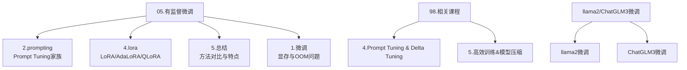
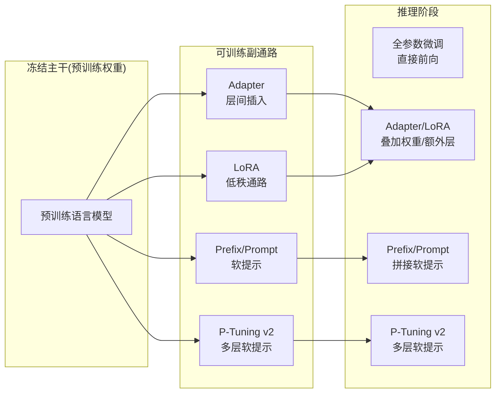
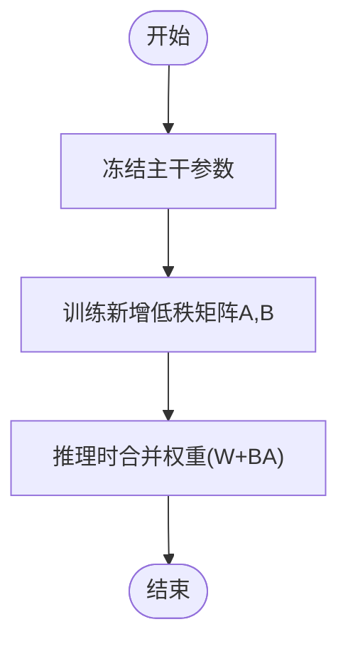
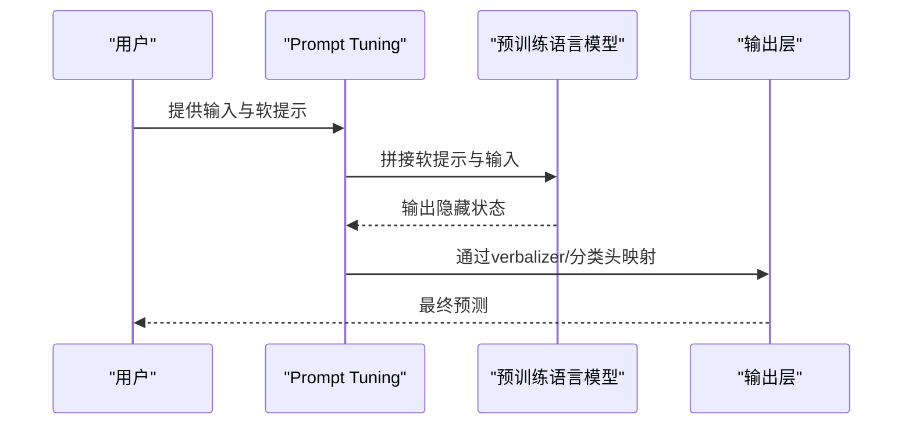
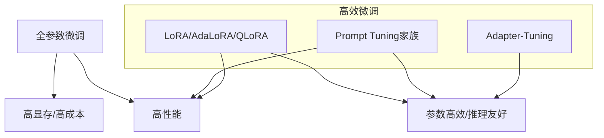

# 微调技术总结与对比

<cite>
**本文引用的文件**
- [05.有监督微调/README.md](file://05.有监督微调/README.md)
- [05.有监督微调/2.prompting/2.prompting.md](file://05.有监督微调/2.prompting/2.prompting.md)
- [05.有监督微调/4.lora/4.lora.md](file://05.有监督微调/4.lora/4.lora.md)
- [05.有监督微调/5.总结/5.总结.md](file://05.有监督微调/5.总结/5.总结.md)
- [05.有监督微调/1.微调/1.微调.md](file://05.有监督微调/1.微调/1.微调.md)
- [98.相关课程/清华大模型公开课/4.Prompt Tuning & Delta Tuning/4.Prompt Tuning & Delta Tuning.md](file://98.相关课程/清华大模型公开课/4.Prompt Tuning & Delta Tuning/4.Prompt Tuning & Delta Tuning.md)
- [98.相关课程/清华大模型公开课/5.高效训练&模型压缩/5.高效训练&模型压缩.md](file://98.相关课程/清华大模型公开课/5.高效训练&模型压缩/5.高效训练&模型压缩.md)
- [05.有监督微调/llama2微调/llama2微调.md](file://05.有监督微调/llama2微调/llama2微调.md)
- [05.有监督微调/ChatGLM3微调/ChatGLM3微调.md](file://05.有监督微调/ChatGLM3微调/ChatGLM3微调.md)
</cite>

## 目录
1. [引言](#引言)
2. [项目结构](#项目结构)
3. [核心组件](#核心组件)
4. [架构总览](#架构总览)
5. [详细组件分析](#详细组件分析)
6. [依赖分析](#依赖分析)
7. [性能考量](#性能考量)
8. [故障排查指南](#故障排查指南)
9. [结论](#结论)
10. [附录](#附录)

## 引言
本文件系统性梳理与对比主流高效微调方法，包括全参数微调、Adapter-Tuning、LoRA、Prompt Tuning（含Prefix Tuning、P-Tuning、P-Tuning v2）等，从参数效率、训练成本、性能表现与适用场景四个维度进行横向比较，并给出选择指南、计算复杂度与内存占用分析、最佳实践与常见陷阱、问题诊断与解决方案，以及发展趋势展望。文档内容严格基于仓库中已有资料整理而成，避免臆造信息。

## 项目结构
本仓库围绕“大语言模型”主题，形成“基础—架构—训练—推理—强化学习—RAG—评估—应用—课程—参考资料”的知识体系。与本主题密切相关的知识分布在：
- 05.有监督微调：系统讲解微调范式、Prompt Tuning家族、LoRA与总结
- 98.相关课程：清华大模型公开课中关于Prompt Tuning与Delta Tuning、高效训练与模型压缩的专题
- 其他模块：为微调实践提供背景知识与工程支撑

**图表来源**
- [05.有监督微调/README.md:1-30](file://05.有监督微调/README.md#L1-L30)
- [98.相关课程/清华大模型公开课/4.Prompt Tuning & Delta Tuning/4.Prompt Tuning & Delta Tuning.md:1-120](file://98.相关课程/清华大模型公开课/4.Prompt Tuning & Delta Tuning/4.Prompt Tuning & Delta Tuning.md#L1-L120)
- [98.相关课程/清华大模型公开课/5.高效训练&模型压缩/5.高效训练&模型压缩.md:1-120](file://98.相关课程/清华大模型公开课/5.高效训练&模型压缩/5.高效训练&模型压缩.md#L1-L120)

**章节来源**
- [05.有监督微调/README.md:1-30](file://05.有监督微调/README.md#L1-L30)
- [98.相关课程/清华大模型公开课/4.Prompt Tuning & Delta Tuning/4.Prompt Tuning & Delta Tuning.md:1-120](file://98.相关课程/清华大模型公开课/4.Prompt Tuning & Delta Tuning/4.Prompt Tuning & Delta Tuning.md#L1-L120)
- [98.相关课程/清华大模型公开课/5.高效训练&模型压缩/5.高效训练&模型压缩.md:1-120](file://98.相关课程/清华大模型公开课/5.高效训练&模型压缩/5.高效训练&模型压缩.md#L1-L120)

## 核心组件
- 全参数微调：对预训练模型参数进行端到端更新，追求最优性能但显存与计算成本高
- Adapter-Tuning：在Transformer层间插入小型适配模块，推理时引入额外延迟
- LoRA：通过低秩分解模拟权重更新，推理时可合并权重，参数量极少
- Prompt Tuning家族：冻结预训练权重，仅训练软提示（soft prompts），按位置与结构分为Prefix Tuning、P-Tuning、P-Tuning v2
- AdaLoRA：在LoRA基础上按重要性自适应分配秩预算
- QLoRA：在4-bit量化下进行高效微调，显著降低显存占用

**章节来源**
- [05.有监督微调/5.总结/5.总结.md:1-135](file://05.有监督微调/5.总结/5.总结.md#L1-L135)
- [05.有监督微调/4.lora/4.lora.md:1-114](file://05.有监督微调/4.lora/4.lora.md#L1-L114)
- [05.有监督微调/2.prompting/2.prompting.md:1-173](file://05.有监督微调/2.prompting/2.prompting.md#L1-L173)

## 架构总览
下图展示高效微调方法在“冻结主干+可训练副通路”的统一视角下的关系与差异。

**图表来源**
- [05.有监督微调/2.prompting/2.prompting.md:36-173](file://05.有监督微调/2.prompting/2.prompting.md#L36-L173)
- [05.有监督微调/4.lora/4.lora.md:1-114](file://05.有监督微调/4.lora/4.lora.md#L1-L114)
- [05.有监督微调/5.总结/5.总结.md:1-135](file://05.有监督微调/5.总结/5.总结.md#L1-L135)

## 详细组件分析

### 全参数微调
- 特点：参数全量更新，性能上限高，但显存与训练成本高
- 训练成本：显存占用与批次大小、序列长度、框架优化密切相关
- 适用场景：资源充足、追求极致性能的评测与生产环境
- 常见问题：OOM、灾难性遗忘、数据偏移导致性能退化

**章节来源**
- [05.有监督微调/1.微调/1.微调.md:5-33](file://05.有监督微调/1.微调/1.微调.md#L5-L33)
- [05.有监督微调/1.微调/1.微调.md:198-214](file://05.有监督微调/1.微调/1.微调.md#L198-L214)

### Adapter-Tuning
- 特点：在Transformer层中嵌入Adapter结构，推理时引入额外延迟
- 参数效率：训练参数量约为0.5%~8%
- 适用场景：需在不破坏主干的前提下引入轻量模块的场景

**章节来源**
- [05.有监督微调/5.总结/5.总结.md:52-71](file://05.有监督微调/5.总结/5.总结.md#L52-L71)

### LoRA
- 核心思想：通过低秩分解BA≈ΔW，冻结主干，仅训练新增的低秩矩阵
- 推理友好：可将BA合并到W，推理无额外延迟
- 参数量：训练参数极少，可插拔切换任务
- 适用场景：资源受限、需快速切换任务的部署

**图表来源**
- [05.有监督微调/4.lora/4.lora.md:9-32](file://05.有监督微调/4.lora/4.lora.md#L9-L32)

**章节来源**
- [05.有监督微调/4.lora/4.lora.md:1-114](file://05.有监督微调/4.lora/4.lora.md#L1-L114)

### AdaLoRA
- 改进点：按重要性评分自适应分配秩预算，SVD正交性约束稳定训练
- 优势：在相同预算下取得更优性能，减少不重要模块的冗余参数

**章节来源**
- [05.有监督微调/4.lora/4.lora.md:43-79](file://05.有监督微调/4.lora/4.lora.md#L43-L79)

### QLoRA
- 背景：在4-bit量化下进行高效微调，显著降低显存占用
- 技术要点：NF4/双量化、分页优化器、BFloat16计算
- 适用场景：单机显存受限但需保持性能的微调

**章节来源**
- [05.有监督微调/4.lora/4.lora.md:81-114](file://05.有监督微调/4.lora/4.lora.md#L81-L114)

### Prompt Tuning家族
- BitFit：仅训练bias，参数量极小，效果有限
- Prefix Tuning：在每层隐藏状态前加入软提示，线性插值复杂
- Prompt Tuning：输入层加入软提示，参数量更小，对硬序列标注效果欠佳
- P-Tuning：引入prompt encoder（LSTM+MLP）建模软提示相互依赖
- P-Tuning v2：每层加入软提示，多任务学习、可选分类头范式、更通用

**图表来源**
- [05.有监督微调/2.prompting/2.prompting.md:75-96](file://05.有监督微调/2.prompting/2.prompting.md#L75-L96)
- [98.相关课程/清华大模型公开课/4.Prompt Tuning & Delta Tuning/4.Prompt Tuning & Delta Tuning.md:347-406](file://98.相关课程/清华大模型公开课/4.Prompt Tuning & Delta Tuning/4.Prompt Tuning & Delta Tuning.md#L347-L406)

**章节来源**
- [05.有监督微调/2.prompting/2.prompting.md:1-173](file://05.有监督微调/2.prompting/2.prompting.md#L1-L173)
- [98.相关课程/清华大模型公开课/4.Prompt Tuning & Delta Tuning/4.Prompt Tuning & Delta Tuning.md:1-800](file://98.相关课程/清华大模型公开课/4.Prompt Tuning & Delta Tuning/4.Prompt Tuning & Delta Tuning.md#L1-L800)

## 依赖分析
- 统一视角：高效微调均可视为“固定主干+可训练副通路”，差异在于副通路结构与训练策略
- 训练成本与显存：LoRA/AdaLoRA/QLoRA在训练阶段显著降低显存；Prompt Tuning家族在推理阶段引入软提示拼接
- 任务适配：P-Tuning v2在NLU与序列标注任务上表现更均衡

**图表来源**
- [05.有监督微调/5.总结/5.总结.md:111-135](file://05.有监督微调/5.总结/5.总结.md#L111-L135)
- [05.有监督微调/4.lora/4.lora.md:1-114](file://05.有监督微调/4.lora/4.lora.md#L1-L114)
- [05.有监督微调/2.prompting/2.prompting.md:1-173](file://05.有监督微调/2.prompting/2.prompting.md#L1-L173)

**章节来源**
- [05.有监督微调/5.总结/5.总结.md:111-135](file://05.有监督微调/5.总结/5.总结.md#L111-L135)

## 性能考量
- 参数效率
  - LoRA/AdaLoRA/QLoRA：训练参数极少，推理可合并权重
  - Prompt Tuning家族：参数量小，但需占用序列长度
  - Adapter-Tuning：训练参数量中等，推理引入额外延迟
  - 全参数微调：参数全量更新，性能上限高
- 训练成本
  - 显存占用：QLoRA显著降低；LoRA/AdaLoRA次之；Prompt Tuning家族因软提示拼接带来额外开销；全参数微调最高
  - 训练时间：LoRA/AdaLoRA/QLoRA通常更快收敛；Prompt Tuning家族受软提示优化稳定性影响
- 推理延迟
  - 全参数微调：无额外延迟
  - LoRA/AdaLoRA：推理时合并权重，无额外延迟
  - Prompt Tuning家族：推理时需拼接软提示，序列长度增加
  - Adapter-Tuning：推理引入额外层，延迟上升
- 适用场景
  - 资源受限/快速切换：LoRA/AdaLoRA/QLoRA
  - 多任务/少样本：Prompt Tuning家族
  - 需要稳定主干：Adapter-Tuning
  - 追求极致性能：全参数微调

**章节来源**
- [05.有监督微调/5.总结/5.总结.md:111-135](file://05.有监督微调/5.总结/5.总结.md#L111-L135)
- [05.有监督微调/4.lora/4.lora.md:81-114](file://05.有监督微调/4.lora/4.lora.md#L81-L114)
- [05.有监督微调/2.prompting/2.prompting.md:1-173](file://05.有监督微调/2.prompting/2.prompting.md#L1-L173)

## 故障排查指南
- OOM（显存不足）
  - 降低batch size、使用混合精度、梯度累积、ZeRO/流水线并行等分布式优化
  - 采用LoRA/AdaLoRA/QLoRA等高效微调方法
- 灾难性遗忘
  - 使用经验回放、弹性权重共享、增量学习或多任务学习
- 数据偏移与标注错误
  - 增大数据多样性、检查标注质量、正则化与数据增强
- 推理延迟过高
  - 优先选择LoRA/AdaLoRA/QLoRA；若用Prompt Tuning，考虑减少提示长度或采用P-Tuning v2

**章节来源**
- [05.有监督微调/1.微调/1.微调.md:18-33](file://05.有监督微调/1.微调/1.微调.md#L18-L33)
- [05.有监督微调/1.微调/1.微调.md:237-248](file://05.有监督微调/1.微调/1.微调.md#L237-L248)
- [98.相关课程/清华大模型公开课/5.高效训练&模型压缩/5.高效训练&模型压缩.md:165-209](file://98.相关课程/清华大模型公开课/5.高效训练&模型压缩/5.高效训练&模型压缩.md#L165-L209)

## 结论
- 若资源充足且追求极致性能，全参数微调仍是首选
- 若需参数高效与快速切换，LoRA/AdaLoRA/QLoRA是优选
- 若需多任务与少样本能力，Prompt Tuning家族（尤其P-Tuning v2）更具通用性
- 若需在不破坏主干的前提下引入模块化能力，Adapter-Tuning值得考虑
- 工程落地建议：先以LoRA/AdaLoRA/QLoRA快速验证，再根据任务特性与资源约束选择其他方法

## 附录
- 实践参考
  - llama2微调：参考链接
  - ChatGLM3微调：参考链接
- 课程参考
  - Prompt Tuning与Delta Tuning专题
  - 高效训练与模型压缩专题

**章节来源**
- [05.有监督微调/llama2微调/llama2微调.md:1-4](file://05.有监督微调/llama2微调/llama2微调.md#L1-L4)
- [05.有监督微调/ChatGLM3微调/ChatGLM3微调.md:1-12](file://05.有监督微调/ChatGLM3微调/ChatGLM3微调.md#L1-L12)
- [98.相关课程/清华大模型公开课/4.Prompt Tuning & Delta Tuning/4.Prompt Tuning & Delta Tuning.md:1-120](file://98.相关课程/清华大模型公开课/4.Prompt Tuning & Delta Tuning/4.Prompt Tuning & Delta Tuning.md#L1-L120)
- [98.相关课程/清华大模型公开课/5.高效训练&模型压缩/5.高效训练&模型压缩.md:1-120](file://98.相关课程/清华大模型公开课/5.高效训练&模型压缩/5.高效训练&模型压缩.md#L1-L120)