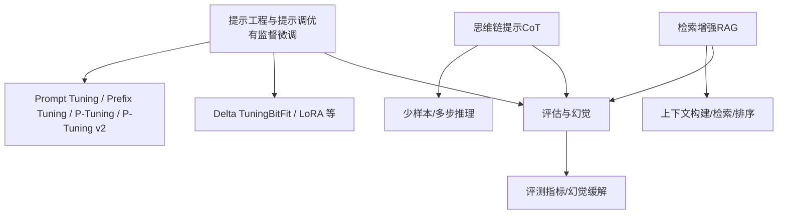
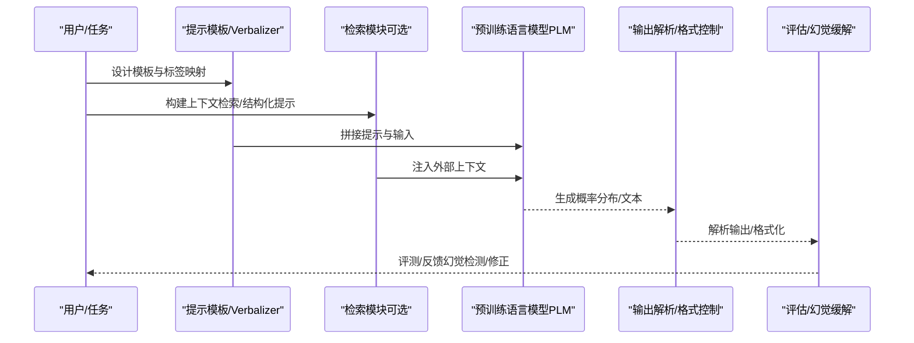
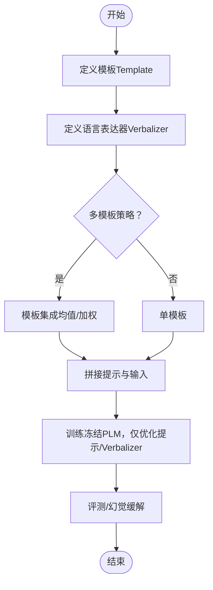
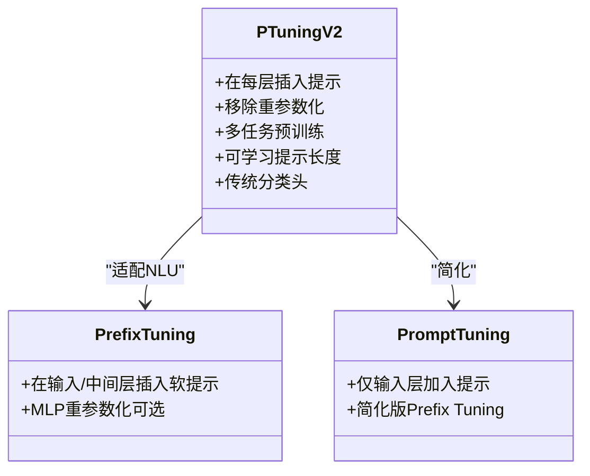
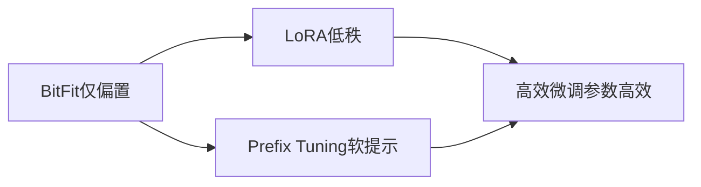
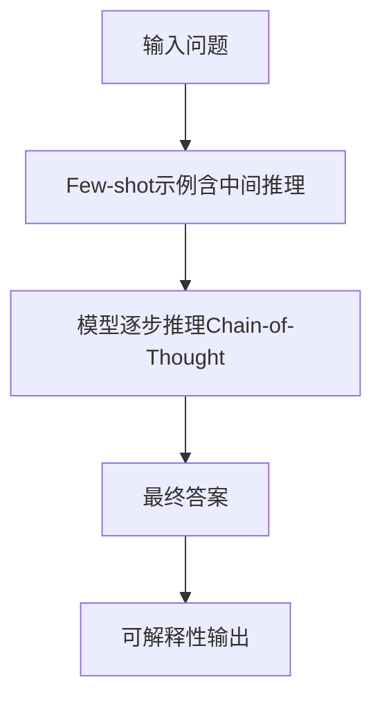
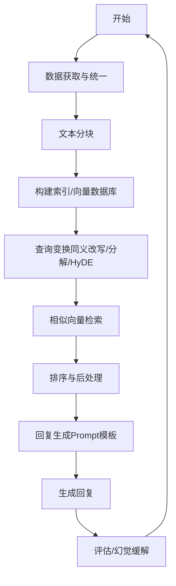
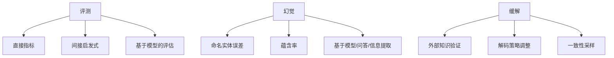
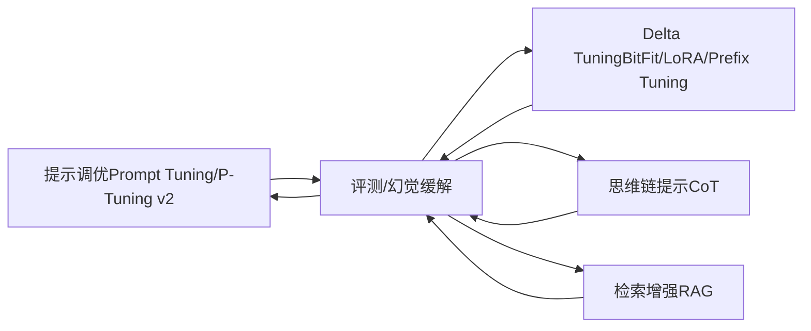

# 提示工程与提示调优

<cite>
**本文引用的文件**
- [提示学习与提示调优（清华大模型公开课）](file://98.相关课程/清华大模型公开课/4.Prompt Tuning & Delta Tuning/4.Prompt Tuning & Delta Tuning.md)
- [提示工程与提示调优（有监督微调）](file://05.有监督微调/2.prompting/2.prompting.md)
- [思维链提示（CoT）](file://10.大语言模型应用/1.思维链（cot）/1.思维链（cot）.md)
- [RAG与检索增强](file://08.检索增强rag/检索增强llm/检索增强llm.md)
- [大模型评估与评测](file://09.大语言模型评估/1.评测/1.评测.md)
- [大模型幻觉与缓解](file://09.大语言模型评估/1.大模型幻觉/1.大模型幻觉.md)
- [有监督微调总览](file://05.有监督微调/README.md)
- [RAG总览](file://08.检索增强rag/README.md)
- [评估总览](file://09.大语言模型评估/README.md)
</cite>

## 目录
1. [简介](#简介)
2. [项目结构](#项目结构)
3. [核心组件](#核心组件)
4. [架构总览](#架构总览)
5. [详细组件分析](#详细组件分析)
6. [依赖关系分析](#依赖关系分析)
7. [性能与效率考量](#性能与效率考量)
8. [故障排查与调试指南](#故障排查与调试指南)
9. [结论](#结论)
10. [附录](#附录)

## 简介
本文件围绕提示工程与提示调优技术，系统梳理提示学习范式、提示模板设计、上下文构建、指令明确性与输出格式控制，以及零样本/少样本/思维链提示策略。结合仓库中的提示调优方法（Prompt Tuning、Prefix Tuning、P-Tuning、P-Tuning v2）与Delta Tuning理念，给出提示设计案例（问答、摘要、翻译等），并讨论提示调优的计算效率、内存占用与与全参数微调的权衡，以及提示效果评估与迭代优化策略。

## 项目结构
本仓库与提示工程/提示调优相关的内容主要分布在以下模块：
- 有监督微调与提示调优：包含Prompt Tuning、Prefix Tuning、P-Tuning、P-Tuning v2、BitFit、LoRA等高效微调范式
- 思维链提示（Chain-of-Thought）：少样本/多步推理的提示策略
- 检索增强（RAG）：通过外部知识增强提示与生成
- 评估与幻觉：提示效果评估与幻觉缓解方法

**图表来源**
- [提示学习与提示调优（清华大模型公开课）](file://98.相关课程/清华大模型公开课/4.Prompt Tuning & Delta Tuning/4.Prompt Tuning & Delta Tuning.md)
- [提示工程与提示调优（有监督微调）](file://05.有监督微调/2.prompting/2.prompting.md)
- [思维链提示（CoT）](file://10.大语言模型应用/1.思维链（cot）/1.思维链（cot）.md)
- [RAG与检索增强](file://08.检索增强rag/检索增强llm/检索增强llm.md)
- [大模型评估与评测](file://09.大语言模型评估/1.评测/1.评测.md)
- [大模型幻觉与缓解](file://09.大语言模型评估/1.大模型幻觉/1.大模型幻觉.md)

**章节来源**
- [有监督微调总览](file://05.有监督微调/README.md)
- [RAG总览](file://08.检索增强rag/README.md)
- [评估总览](file://09.大语言模型评估/README.md)

## 核心组件
- 提示学习范式与模板（Template）与语言表达器（Verbalizer）
- 连续提示（Soft Prompt）与深度提示优化（P-Tuning v2）
- Delta Tuning（BitFit、LoRA、Prefix Tuning等）
- 思维链提示（Chain-of-Thought）
- 检索增强（RAG）与上下文构建
- 评测与幻觉缓解

**章节来源**
- [提示学习与提示调优（清华大模型公开课）](file://98.相关课程/清华大模型公开课/4.Prompt Tuning & Delta Tuning/4.Prompt Tuning & Delta Tuning.md)
- [提示工程与提示调优（有监督微调）](file://05.有监督微调/2.prompting/2.prompting.md)
- [思维链提示（CoT）](file://10.大语言模型应用/1.思维链（cot）/1.思维链（cot）.md)
- [RAG与检索增强](file://08.检索增强rag/检索增强llm/检索增强llm.md)
- [大模型评估与评测](file://09.大语言模型评估/1.评测/1.评测.md)
- [大模型幻觉与缓解](file://09.大语言模型评估/1.大模型幻觉/1.大模型幻觉.md)

## 架构总览
提示工程与提示调优的整体流程可概括为：任务建模（Template/Verbalizer）、上下文构建（Prompt/检索）、模型推理（PLM）、输出解析（Verbalizer/格式控制）、评估与迭代（评测/幻觉缓解）。

**图表来源**
- [提示学习与提示调优（清华大模型公开课）](file://98.相关课程/清华大模型公开课/4.Prompt Tuning & Delta Tuning/4.Prompt Tuning & Delta Tuning.md)
- [RAG与检索增强](file://08.检索增强rag/检索增强llm/检索增强llm.md)
- [大模型评估与评测](file://09.大语言模型评估/1.评测/1.评测.md)
- [大模型幻觉与缓解](file://09.大语言模型评估/1.大模型幻觉/1.大模型幻觉.md)

## 详细组件分析

### 组件A：提示学习范式与模板/语言表达器
- 模板（Template）：将输入包装为与预训练任务一致的形式（如MLM掩码），以弥补预训练与微调之间的差距
- 语言表达器（Verbalizer）：将标签映射为词表上的词或词块，支持手工/自动/外部知识扩展/虚拟词
- 多模板策略：多个模板的均匀/加权平均，稳定性能
- 连续提示优化：P-Tuning v1（输入层+重参数化）、P-Tuning v2（每层加入提示，移除重参数化）

**图表来源**
- [提示学习与提示调优（清华大模型公开课）](file://98.相关课程/清华大模型公开课/4.Prompt Tuning & Delta Tuning/4.Prompt Tuning & Delta Tuning.md)
- [提示工程与提示调优（有监督微调）](file://05.有监督微调/2.prompting/2.prompting.md)

**章节来源**
- [提示学习与提示调优（清华大模型公开课）](file://98.相关课程/清华大模型公开课/4.Prompt Tuning & Delta Tuning/4.Prompt Tuning & Delta Tuning.md)
- [提示工程与提示调优（有监督微调）](file://05.有监督微调/2.prompting/2.prompting.md)

### 组件B：连续提示与深度提示优化（P-Tuning v2）
- P-Tuning v2在每一层加入提示，提升可学习参数规模与对预测的直接影响，适配NLU与序列标注任务
- 移除重参数化编码器，针对不同任务采用不同提示长度，引入多任务学习，回归传统分类头范式

**图表来源**
- [提示工程与提示调优（有监督微调）](file://05.有监督微调/2.prompting/2.prompting.md)

**章节来源**
- [提示工程与提示调优（有监督微调）](file://05.有监督微调/2.prompting/2.prompting.md)

### 组件C：Delta Tuning（BitFit、LoRA、Prefix Tuning）
- BitFit：仅训练偏置，简单高效，适合简单任务
- LoRA：低秩适应，参数高效，广泛用于大模型微调
- Prefix Tuning：在每层隐藏状态前增加软提示，训练稳定

**图表来源**
- [提示学习与提示调优（清华大模型公开课）](file://98.相关课程/清华大模型公开课/4.Prompt Tuning & Delta Tuning/4.Prompt Tuning & Delta Tuning.md)
- [提示工程与提示调优（有监督微调）](file://05.有监督微调/2.prompting/2.prompting.md)

**章节来源**
- [提示学习与提示调优（清华大模型公开课）](file://98.相关课程/清华大模型公开课/4.Prompt Tuning & Delta Tuning/4.Prompt Tuning & Delta Tuning.md)
- [提示工程与提示调优（有监督微调）](file://05.有监督微调/2.prompting/2.prompting.md)

### 组件D：思维链提示（Chain-of-Thought）
- 通过少量示例展示中间推理步骤，引导模型逐步推理，显著提升算术、常识、符号推理任务表现
- 优势：分解复杂问题、提供步骤示范、引导组织语言、加强逻辑思维、提供解释性、少样本学习

**图表来源**
- [思维链提示（CoT）](file://10.大语言模型应用/1.思维链（cot）/1.思维链（cot）.md)

**章节来源**
- [思维链提示（CoT）](file://10.大语言模型应用/1.思维链（cot）/1.思维链（cot）.md)

### 组件E：检索增强（RAG）与上下文构建
- 数据与索引：多源数据统一、文本分块、向量索引、相似向量检索、向量数据库
- 查询与检索：查询变换（同义改写、查询分解、HyDE）、排序与后处理
- 回复生成：Prompt模板（结合上下文与自有知识）、逐步修正策略

**图表来源**
- [RAG与检索增强](file://08.检索增强rag/检索增强llm/检索增强llm.md)

**章节来源**
- [RAG与检索增强](file://08.检索增强rag/检索增强llm/检索增强llm.md)

### 组件F：评测与幻觉缓解
- 评测：直接指标（准确率/F1）、间接启发式（小模型评估）、基于模型的评估
- 幻觉：内在/外在幻觉、命名实体误差、蕴含率、基于模型的评估、问答系统、信息提取系统
- 幻觉缓解：外部知识验证、解码策略调整、一致性采样（SelfCheckGPT、事实核心采样）

**图表来源**
- [大模型评估与评测](file://09.大语言模型评估/1.评测/1.评测.md)
- [大模型幻觉与缓解](file://09.大语言模型评估/1.大模型幻觉/1.大模型幻觉.md)

**章节来源**
- [大模型评估与评测](file://09.大语言模型评估/1.评测/1.评测.md)
- [大模型幻觉与缓解](file://09.大语言模型评估/1.大模型幻觉/1.大模型幻觉.md)

## 依赖关系分析
- 提示学习与Delta Tuning在参数效率与部署成本上互补：提示调优适合多任务共享同一PLM，Delta Tuning适合在大模型上以极小参数更新驱动性能
- CoT与RAG可与提示调优结合：CoT强调推理链，RAG强调外部知识注入，两者均可通过模板/提示与Verbalizer进行统一建模
- 评测与幻觉缓解贯穿全流程：提示设计→上下文构建→模型推理→输出解析→评估与迭代

**图表来源**
- [提示工程与提示调优（有监督微调）](file://05.有监督微调/2.prompting/2.prompting.md)
- [提示学习与提示调优（清华大模型公开课）](file://98.相关课程/清华大模型公开课/4.Prompt Tuning & Delta Tuning/4.Prompt Tuning & Delta Tuning.md)
- [思维链提示（CoT）](file://10.大语言模型应用/1.思维链（cot）/1.思维链（cot）.md)
- [RAG与检索增强](file://08.检索增强rag/检索增强llm/检索增强llm.md)
- [大模型评估与评测](file://09.大语言模型评估/1.评测/1.评测.md)
- [大模型幻觉与缓解](file://09.大语言模型评估/1.大模型幻觉/1.大模型幻觉.md)

**章节来源**
- [提示工程与提示调优（有监督微调）](file://05.有监督微调/2.prompting/2.prompting.md)
- [提示学习与提示调优（清华大模型公开课）](file://98.相关课程/清华大模型公开课/4.Prompt Tuning & Delta Tuning/4.Prompt Tuning & Delta Tuning.md)
- [思维链提示（CoT）](file://10.大语言模型应用/1.思维链（cot）/1.思维链（cot）.md)
- [RAG与检索增强](file://08.检索增强rag/检索增强llm/检索增强llm.md)
- [大模型评估与评测](file://09.大语言模型评估/1.评测/1.评测.md)
- [大模型幻觉与缓解](file://09.大语言模型评估/1.大模型幻觉/1.大模型幻觉.md)

## 性能与效率考量
- 参数效率与部署成本
  - 提示调优：冻结PLM，仅优化提示/Verbalizer，参数量极小，适合多任务共享同一PLM
  - Delta Tuning：BitFit仅偏置、LoRA低秩、Prefix Tuning软提示，参数高效，适合大模型
- 计算与内存
  - 提示调优：训练时仅更新提示嵌入，推理时与常规输入拼接，内存开销小
  - Delta Tuning：LoRA低秩分解显著降低计算与显存占用
- 与全参数微调的权衡
  - 提示调优在大规模模型上逼近全参微调效果，小模型上差距明显
  - Delta Tuning在超大规模模型上高效，结构随模型规模趋于不重要

**章节来源**
- [提示工程与提示调优（有监督微调）](file://05.有监督微调/2.prompting/2.prompting.md)
- [提示学习与提示调优（清华大模型公开课）](file://98.相关课程/清华大模型公开课/4.Prompt Tuning & Delta Tuning/4.Prompt Tuning & Delta Tuning.md)

## 故障排查与调试指南
- 幻觉问题
  - 评测：命名实体误差、蕴含率、基于模型/问答/信息提取评估
  - 缓解：外部知识验证、解码策略调整、一致性采样（SelfCheckGPT、事实核心采样）
- 上下文与提示稳定性
  - 模板与Verbalizer设计不当导致输出不稳定，建议多模板集成与外部知识扩展
- 检索增强（RAG）
  - 文本分块策略影响检索质量，需根据嵌入模型与问题长度选择合适块大小与重叠
  - 查询变换（同义改写/分解/HyDE）提升召回与相关性
- 评测与迭代
  - 自动评测与人工评测结合，持续迭代提示与上下文

**章节来源**
- [大模型评估与评测](file://09.大语言模型评估/1.评测/1.评测.md)
- [大模型幻觉与缓解](file://09.大语言模型评估/1.大模型幻觉/1.大模型幻觉.md)
- [RAG与检索增强](file://08.检索增强rag/检索增强llm/检索增强llm.md)

## 结论
提示工程与提示调优通过模板/语言表达器、连续提示与深度提示优化、Delta Tuning等范式，实现了参数高效、部署友好、可多任务共享的模型适配路径。结合思维链提示与检索增强，可在少样本/零样本场景下显著提升复杂推理与事实性表现。评测与幻觉缓解贯穿全流程，确保提示设计的可靠性与可解释性。未来可在提示泛化、小模型推理提升、提示自动生成与验证器结合等方面持续演进。

## 附录
- 提示设计案例（任务导向）
  - 问答：模板+Verbalizer，结合检索增强（RAG）提供外部上下文
  - 摘要：结构化提示（Format/Task/Domain/Question/Passage），逐步修正策略
  - 翻译：思维链提示（逐词翻译→整合），结合检索增强（术语库/平行语料）
- 迭代优化策略
  - 多模板集成（均值/加权）
  - 查询变换（同义改写/分解/HyDE）
  - 评测与幻觉缓解闭环（外部知识验证、解码策略调整、一致性采样）

**章节来源**
- [提示学习与提示调优（清华大模型公开课）](file://98.相关课程/清华大模型公开课/4.Prompt Tuning & Delta Tuning/4.Prompt Tuning & Delta Tuning.md)
- [RAG与检索增强](file://08.检索增强rag/检索增强llm/检索增强llm.md)
- [思维链提示（CoT）](file://10.大语言模型应用/1.思维链（cot）/1.思维链（cot）.md)
- [大模型评估与评测](file://09.大语言模型评估/1.评测/1.评测.md)
- [大模型幻觉与缓解](file://09.大语言模型评估/1.大模型幻觉/1.大模型幻觉.md)