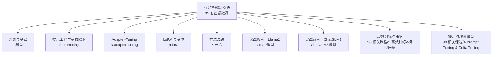
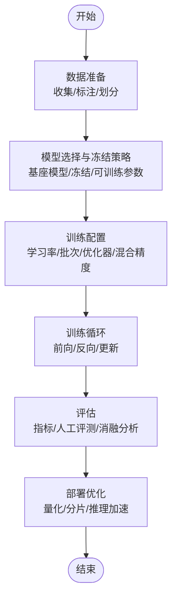
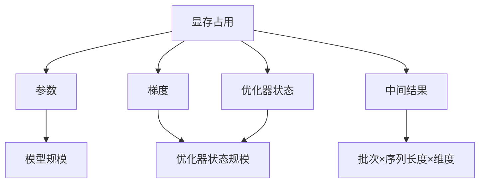
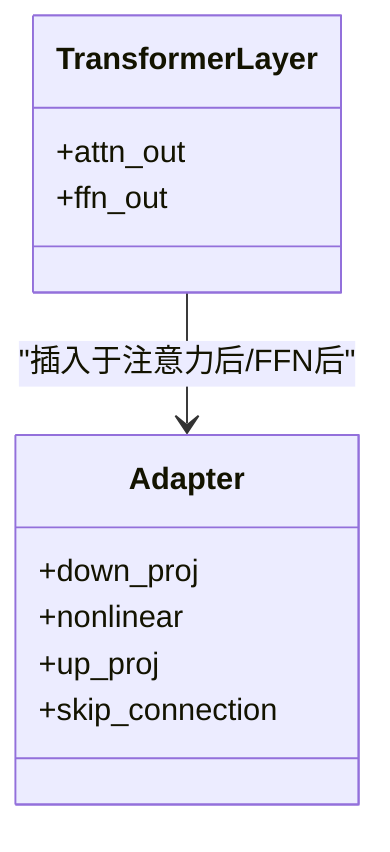
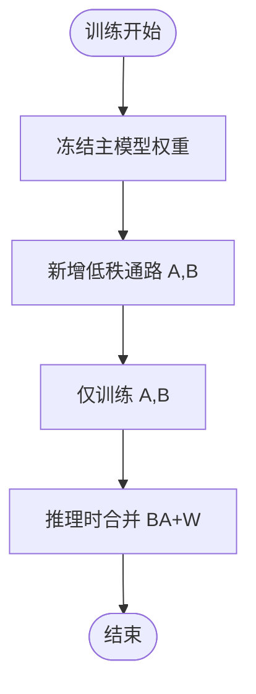
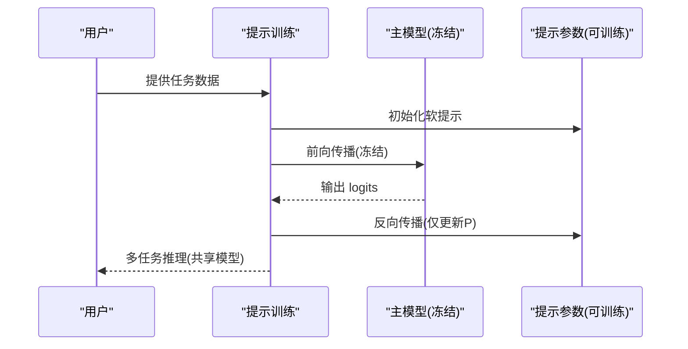
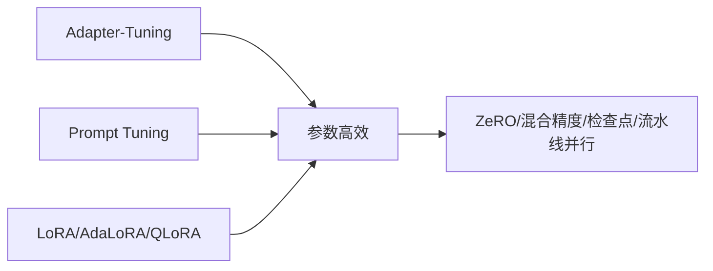

# 有监督微调

<cite>
**本文引用的文件**
- [05.有监督微调/README.md](file://05.有监督微调/README.md)
- [05.有监督微调/1.微调/1.微调.md](file://05.有监督微调/1.微调/1.微调.md)
- [05.有监督微调/2.prompting/2.prompting.md](file://05.有监督微调/2.prompting/2.prompting.md)
- [05.有监督微调/3.adapter-tuning/3.adapter-tuning.md](file://05.有监督微调/3.adapter-tuning/3.adapter-tuning.md)
- [05.有监督微调/4.lora/4.lora.md](file://05.有监督微调/4.lora/4.lora.md)
- [05.有监督微调/5.总结/5.总结.md](file://05.有监督微调/5.总结/5.总结.md)
- [05.有监督微调/llama2微调/llama2微调.md](file://05.有监督微调/llama2微调/llama2微调.md)
- [05.有监督微调/ChatGLM3微调/ChatGLM3微调.md](file://05.有监督微调/ChatGLM3微调/ChatGLM3微调.md)
- [98.相关课程/清华大模型公开课/5.高效训练&模型压缩/5.高效训练&模型压缩.md](file://98.相关课程/清华大模型公开课/5.高效训练&模型压缩/5.高效训练&模型压缩.md)
- [98.相关课程/清华大模型公开课/4.Prompt Tuning & Delta Tuning/4.Prompt Tuning & Delta Tuning.md](file://98.相关课程/清华大模型公开课/4.Prompt Tuning & Delta Tuning/4.Prompt Tuning & Delta Tuning.md)
</cite>

## 目录
1. [引言](#引言)
2. [项目结构](#项目结构)
3. [核心组件](#核心组件)
4. [架构总览](#架构总览)
5. [详细组件分析](#详细组件分析)
6. [依赖分析](#依赖分析)
7. [性能考量](#性能考量)
8. [故障排查指南](#故障排查指南)
9. [结论](#结论)
10. [附录](#附录)

## 引言
本技术文档围绕“有监督微调（Supervised Fine-Tuning, SFT）”展开，系统梳理全参数微调的训练流程与计算开销，深入解析高效微调方法（Adapter-Tuning、LoRA、Prompt Tuning 等）的原理与实践要点，并结合 ChatGLM3 与 Llama2 的微调案例，给出数据准备、训练配置、评估与部署优化的实操建议。同时，提供方法对比与选择标准，帮助读者在不同场景下做出合理决策。

## 项目结构
本仓库将“有监督微调”作为独立主题模块，配套理论、方法与实战案例，形成从概念到落地的完整知识体系。

图表来源
- [05.有监督微调/README.md:1-30](file://05.有监督微调/README.md#L1-L30)
- [05.有监督微调/1.微调/1.微调.md:1-280](file://05.有监督微调/1.微调/1.微调.md#L1-L280)
- [05.有监督微调/2.prompting/2.prompting.md:1-173](file://05.有监督微调/2.prompting/2.prompting.md#L1-L173)
- [05.有监督微调/3.adapter-tuning/3.adapter-tuning.md:1-165](file://05.有监督微调/3.adapter-tuning/3.adapter-tuning.md#L1-L165)
- [05.有监督微调/4.lora/4.lora.md:1-114](file://05.有监督微调/4.lora/4.lora.md#L1-L114)
- [05.有监督微调/5.总结/5.总结.md:1-135](file://05.有监督微调/5.总结/5.总结.md#L1-L135)
- [05.有监督微调/llama2微调/llama2微调.md:1-4](file://05.有监督微调/llama2微调/llama2微调.md#L1-L4)
- [05.有监督微调/ChatGLM3微调/ChatGLM3微调.md:1-12](file://05.有监督微调/ChatGLM3微调/ChatGLM3微调.md#L1-L12)
- [98.相关课程/清华大模型公开课/5.高效训练&模型压缩/5.高效训练&模型压缩.md:1-564](file://98.相关课程/清华大模型公开课/5.高效训练&模型压缩/5.高效训练&模型压缩.md#L1-L564)
- [98.相关课程/清华大模型公开课/4.Prompt Tuning & Delta Tuning/4.Prompt Tuning & Delta Tuning.md:430-462](file://98.相关课程/清华大模型公开课/4.Prompt Tuning & Delta Tuning/4.Prompt Tuning & Delta Tuning.md#L430-L462)

章节来源
- [05.有监督微调/README.md:1-30](file://05.有监督微调/README.md#L1-L30)

## 核心组件
- 全参数微调：冻结/更新策略、显存与计算开销、灾难性遗忘与缓解策略。
- 高效微调方法：Adapter-Tuning（适配器模块设计与参数效率）、LoRA（低秩适配与秩选择）、Prompt Tuning（提示工程与可调参数设计）。
- 实战案例：ChatGLM3 与 Llama2 的微调路径与最佳实践链接。
- 性能与部署：显存优化、混合精度、梯度检查点、分布式并行与量化。

章节来源
- [05.有监督微调/1.微调/1.微调.md:1-280](file://05.有监督微调/1.微调/1.微调.md#L1-L280)
- [05.有监督微调/2.prompting/2.prompting.md:1-173](file://05.有监督微调/2.prompting/2.prompting.md#L1-L173)
- [05.有监督微调/3.adapter-tuning/3.adapter-tuning.md:1-165](file://05.有监督微调/3.adapter-tuning/3.adapter-tuning.md#L1-L165)
- [05.有监督微调/4.lora/4.lora.md:1-114](file://05.有监督微调/4.lora/4.lora.md#L1-L114)
- [05.有监督微调/5.总结/5.总结.md:1-135](file://05.有监督微调/5.总结/5.总结.md#L1-L135)
- [05.有监督微调/llama2微调/llama2微调.md:1-4](file://05.有监督微调/llama2微调/llama2微调.md#L1-L4)
- [05.有监督微调/ChatGLM3微调/ChatGLM3微调.md:1-12](file://05.有监督微调/ChatGLM3微调/ChatGLM3微调.md#L1-L12)

## 架构总览
下图展示有监督微调的总体流程与关键环节：数据准备、模型选择与冻结策略、训练配置、评估与部署优化。

图表来源
- [05.有监督微调/1.微调/1.微调.md:35-46](file://05.有监督微调/1.微调/1.微调.md#L35-L46)
- [05.有监督微调/1.微调/1.微调.md:216-235](file://05.有监督微调/1.微调/1.微调.md#L216-L235)
- [98.相关课程/清华大模型公开课/5.高效训练&模型压缩/5.高效训练&模型压缩.md:223-276](file://98.相关课程/清华大模型公开课/5.高效训练&模型压缩/5.高效训练&模型压缩.md#L223-L276)

## 详细组件分析

### 全参数微调：原理与计算开销
- 显存占用构成：参数、梯度、中间结果、优化器状态。显存压力与模型规模、批次大小、序列长度、优化器状态密切相关。
- 训练过程：前向传播计算损失，反向传播累积梯度，优化器更新参数。分布式并行（数据/模型/流水线/ZeRO）与混合精度、梯度检查点可显著降低显存占用。
- 灾难性遗忘：新任务训练覆盖旧知识，可通过经验回放、弹性权重共享、增量学习、多任务学习缓解。
- 适用场景：数据充足、资源充裕、追求极致性能；否则优先考虑高效微调。

图表来源
- [98.相关课程/清华大模型公开课/5.高效训练&模型压缩/5.高效训练&模型压缩.md:25-51](file://98.相关课程/清华大模型公开课/5.高效训练&模型压缩/5.高效训练&模型压缩.md#L25-L51)
- [05.有监督微调/1.微调/1.微调.md:16-14](file://05.有监督微调/1.微调/1.微调.md#L16-L14)

章节来源
- [05.有监督微调/1.微调/1.微调.md:1-280](file://05.有监督微调/1.微调/1.微调.md#L1-L280)
- [98.相关课程/清华大模型公开课/5.高效训练&模型压缩/5.高效训练&模型压缩.md:1-564](file://98.相关课程/清华大模型公开课/5.高效训练&模型压缩/5.高效训练&模型压缩.md#L1-L564)

### Adapter-Tuning：适配器模块设计与参数效率
- 结构设计：在 Transformer 的注意力后与前馈层后插入适配器（双层前馈 + 非线性 + 上采样 + 残差），通过低秩投影控制参数量（m << d）。
- 参数效率：仅训练新增适配器与 LayerNorm，冻结主模型，参数量占比约 0.5%~8%。
- 扩展能力：支持多任务学习与知识融合（AdapterFusion），通过注意力聚合多任务信息；可结合 AdapterDrop 动态移除低层适配器以提速推理。
- 适用场景：需快速扩展下游任务、避免灾难性遗忘、保持主模型稳定。

图表来源
- [05.有监督微调/3.adapter-tuning/3.adapter-tuning.md:13-31](file://05.有监督微调/3.adapter-tuning/3.adapter-tuning.md#L13-L31)
- [98.相关课程/清华大模型公开课/4.Prompt Tuning & Delta Tuning/4.Prompt Tuning & Delta Tuning.md:430-446](file://98.相关课程/清华大模型公开课/4.Prompt Tuning & Delta Tuning/4.Prompt Tuning & Delta Tuning.md#L430-L446)

章节来源
- [05.有监督微调/3.adapter-tuning/3.adapter-tuning.md:1-165](file://05.有监督微调/3.adapter-tuning/3.adapter-tuning.md#L1-L165)
- [98.相关课程/清华大模型公开课/4.Prompt Tuning & Delta Tuning/4.Prompt Tuning & Delta Tuning.md:430-462](file://98.相关课程/清华大模型公开课/4.Prompt Tuning & Delta Tuning/4.Prompt Tuning & Delta Tuning.md#L430-L462)

### LoRA：低秩适配与秩选择策略
- 矩阵分解原理：将权重增量 ΔW 近似为低秩矩阵 BA（r ≪ d），训练时仅更新 A、B，推理时将 BA 加到原权重上，不增加推理开销。
- 秩选择：通常 r=4/8/16 即可覆盖多数任务；AdaLoRA 根据重要性评分自适应分配秩预算，提升效果与效率。
- 适用模块：主要针对注意力模块（Wq/Wk/Wv/Wo）；消融实验显示同时调整 Wq 与 Wv 效果更佳。
- 量化微调：QLoRA 在 4bit 下仍可复刻 16bit 全参数微调性能，结合 NF4、双量化与分页优化器降低显存峰值。

图表来源
- [05.有监督微调/4.lora/4.lora.md:9-32](file://05.有监督微调/4.lora/4.lora.md#L9-L32)
- [05.有监督微调/4.lora/4.lora.md:64-78](file://05.有监督微调/4.lora/4.lora.md#L64-L78)
- [05.有监督微调/4.lora/4.lora.md:81-114](file://05.有监督微调/4.lora/4.lora.md#L81-L114)

章节来源
- [05.有监督微调/4.lora/4.lora.md:1-114](file://05.有监督微调/4.lora/4.lora.md#L1-L114)

### Prompt Tuning：提示工程与可调参数设计
- Prompt Tuning：在输入层加入可学习的软提示（soft prompt），冻结主模型，仅训练提示参数，支持多任务推理。
- Prefix Tuning：在每层隐藏状态前加入 virtual tokens，训练时仅更新前缀参数；可配合 MLP 提升稳定性。
- P-Tuning/P-Tuning v2：引入 prompt encoder（LSTM+MLP）或深度提示优化，解决小模型与序列标注任务的挑战。
- 适用场景：显存受限、需多任务推理、提示工程可解释性强。

图表来源
- [05.有监督微调/2.prompting/2.prompting.md:75-91](file://05.有监督微调/2.prompting/2.prompting.md#L75-L91)
- [05.有监督微调/2.prompting/2.prompting.md:36-74](file://05.有监督微调/2.prompting/2.prompting.md#L36-L74)
- [05.有监督微调/2.prompting/2.prompting.md:97-126](file://05.有监督微调/2.prompting/2.prompting.md#L97-L126)

章节来源
- [05.有监督微调/2.prompting/2.prompting.md:1-173](file://05.有监督微调/2.prompting/2.prompting.md#L1-L173)

### 实战案例：ChatGLM3 微调
- 参考资料：提供 ChatGLM3 微调与部署的实战教程链接，涵盖函数调用、代码解释器、Agent 等场景。
- 建议：结合 LoRA/QLoRA 降低显存占用；使用量化与分页优化器应对大模型微调内存压力。

章节来源
- [05.有监督微调/ChatGLM3微调/ChatGLM3微调.md:1-12](file://05.有监督微调/ChatGLM3微调/ChatGLM3微调.md#L1-L12)

### 实战案例：Llama2 微调
- 参考资料：提供 Llama2 系列微调的入门教程链接，便于从模型下载与准备开始实践。
- 建议：结合混合精度、梯度检查点与分布式并行；在数据与评估上遵循 SFT 标准流程。

章节来源
- [05.有监督微调/llama2微调/llama2微调.md:1-4](file://05.有监督微调/llama2微调/llama2微调.md#L1-L4)

## 依赖分析
- 方法间关系：Adapter-Tuning 与 Prompt Tuning 属于“增加额外参数”的高效微调；LoRA/AdaLoRA/QLoRA 属于“重参数化”方法；P-Tuning v2 在深度提示与多任务学习上进一步提升。
- 与训练优化的耦合：高效微调与 ZeRO、混合精度、梯度检查点、流水线并行等训练优化技术协同，可显著降低显存与吞吐开销。

图表来源
- [05.有监督微调/5.总结/5.总结.md:111-135](file://05.有监督微调/5.总结/5.总结.md#L111-L135)
- [98.相关课程/清华大模型公开课/5.高效训练&模型压缩/5.高效训练&模型压缩.md:165-223](file://98.相关课程/清华大模型公开课/5.高效训练&模型压缩/5.高效训练&模型压缩.md#L165-L223)

章节来源
- [05.有监督微调/5.总结/5.总结.md:1-135](file://05.有监督微调/5.总结/5.总结.md#L1-L135)
- [98.相关课程/清华大模型公开课/5.高效训练&模型压缩/5.高效训练&模型压缩.md:1-564](file://98.相关课程/清华大模型公开课/5.高效训练&模型压缩/5.高效训练&模型压缩.md#L1-L564)

## 性能考量
- 显存优化：混合精度、梯度检查点、ZeRO 阶段、Offloading、流水线并行。
- 计算效率：LoRA 合并权重不增加推理开销；Adapter-Drop 动态移除低层适配器；P-Tuning v2 深度提示提升小模型与序列标注任务性能。
- 量化与压缩：QLoRA 在 4bit 下复刻 16bit 性能；知识蒸馏、剪枝、低秩近似辅助部署。

章节来源
- [98.相关课程/清华大模型公开课/5.高效训练&模型压缩/5.高效训练&模型压缩.md:223-276](file://98.相关课程/清华大模型公开课/5.高效训练&模型压缩/5.高效训练&模型压缩.md#L223-L276)
- [05.有监督微调/4.lora/4.lora.md:81-114](file://05.有监督微调/4.lora/4.lora.md#L81-L114)
- [05.有监督微调/3.adapter-tuning/3.adapter-tuning.md:69-96](file://05.有监督微调/3.adapter-tuning/3.adapter-tuning.md#L69-L96)
- [05.有监督微调/2.prompting/2.prompting.md:127-173](file://05.有监督微调/2.prompting/2.prompting.md#L127-L173)

## 故障排查指南
- OOM（显存不足）：减小 batch size、启用梯度累积、混合精度、梯度检查点、ZeRO、Offloading；必要时使用量化（如 QLoRA）。
- 灾难性遗忘：采用经验回放、弹性权重共享、增量学习、多任务学习；在 Adapter 场景使用 AdapterFusion。
- 训练不稳定：Prefix Tuning 前加 MLP；Prompt Tuning/P-Tuning 使用 prompt encoder；LoRA 初始化 A 为高斯、B 为零矩阵。
- 评估偏差：构建领域评测集，划分训练/验证/测试；使用多指标与人工评测；进行消融分析。

章节来源
- [05.有监督微调/1.微调/1.微调.md:198-248](file://05.有监督微调/1.微调/1.微调.md#L198-L248)
- [05.有监督微调/2.prompting/2.prompting.md:63-73](file://05.有监督微调/2.prompting/2.prompting.md#L63-L73)
- [05.有监督微调/4.lora/4.lora.md:21-27](file://05.有监督微调/4.lora/4.lora.md#L21-L27)

## 结论
- 全参数微调在资源充足时可达到最优性能，但成本高；高效微调在参数量、显存与部署效率上更具优势。
- Adapter-Tuning 适合快速扩展任务与知识融合；LoRA/AdaLoRA/QLoRA 在低秩近似与量化微调上表现优异；Prompt Tuning 系列在提示工程与多任务推理上具备可解释性与灵活性。
- 实践中应结合数据规模、资源预算与任务特性，选择合适的方法并配合训练优化技术，以获得最佳性价比与性能。

## 附录
- 选择标准与适用场景速查：
  - 显存紧张且需多任务：Prompt Tuning/P-Tuning v2 或 LoRA。
  - 需要稳定扩展与知识融合：Adapter-Tuning/AdapterFusion。
  - 大模型微调且追求极致性能：全参数微调（配合高效训练技术）。
  - 4bit 微调与部署：QLoRA。
- 参考资料与实战链接：
  - [ChatGLM3 微调与部署:1-12](file://05.有监督微调/ChatGLM3微调/ChatGLM3微调.md#L1-L12)
  - [Llama2 微调入门:1-4](file://05.有监督微调/llama2微调/llama2微调.md#L1-L4)