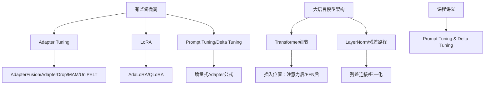
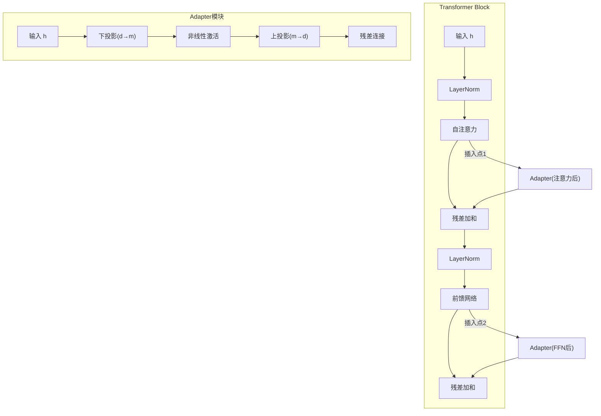
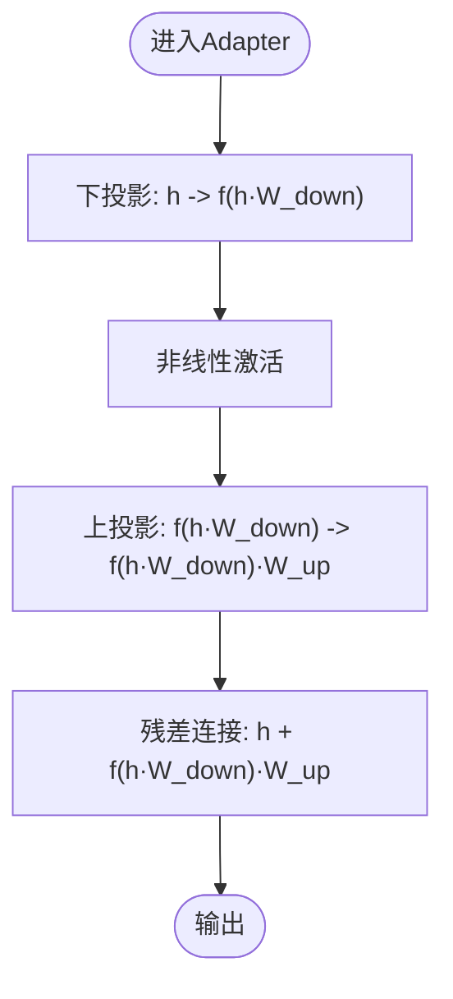
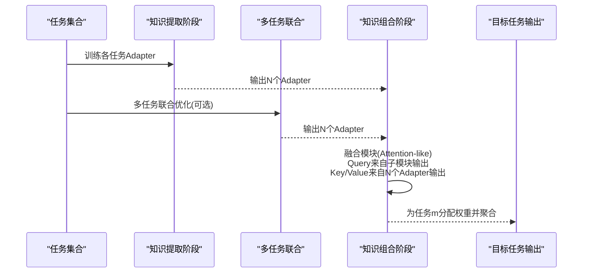
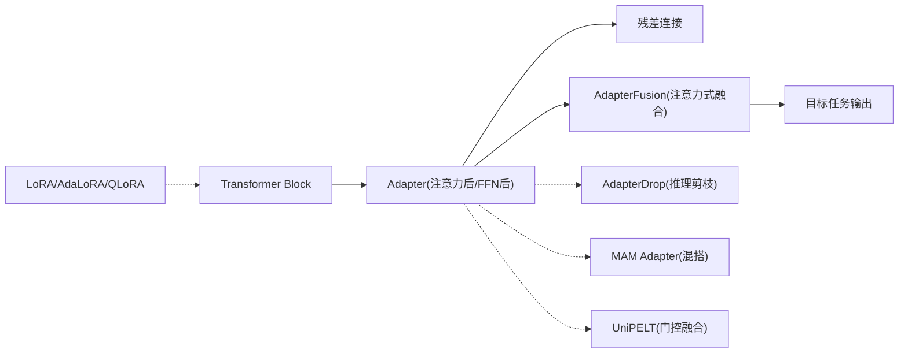

# 适配器调优技术

<cite>
**本文引用的文件列表**
- [05.有监督微调/3.adapter-tuning/3.adapter-tuning.md](file://05.有监督微调/3.adapter-tuning/3.adapter-tuning.md)
- [05.有监督微调/1.基本概念/1.基本概念.md](file://05.有监督微调/1.基本概念/1.基本概念.md)
- [98.相关课程/清华大模型公开课/4.Prompt Tuning & Delta Tuning/4.Prompt Tuning & Delta Tuning.md](file://98.相关课程/清华大模型公开课/4.Prompt Tuning & Delta Tuning/4.Prompt Tuning & Delta Tuning.md)
- [05.有监督微调/4.lora/4.lora.md](file://05.有监督微调/4.lora/4.lora.md)
- [02.大语言模型架构/Transformer架构细节/Transformer架构细节.md](file://02.大语言模型架构/Transformer架构细节/Transformer架构细节.md)
- [02.大语言模型架构/1.attention/BN VS LN.md](file://02.大语言模型架构/1.attention/BN VS LN.md)
</cite>

## 目录
1. [引言](#引言)
2. [项目结构](#项目结构)
3. [核心组件](#核心组件)
4. [架构总览](#架构总览)
5. [组件详细分析](#组件详细分析)
6. [依赖关系分析](#依赖关系分析)
7. [性能考量](#性能考量)
8. [故障排查指南](#故障排查指南)
9. [结论](#结论)
10. [附录](#附录)

## 引言
本文件围绕适配器调优技术（Adapter Tuning）及其变体展开系统化技术文档，重点阐述：
- 适配器模块在Transformer中的插入位置与网络结构
- 两层网络设计（瓶颈层）的理念与维度选择策略
- 参数效率优势（可训练参数大幅减少、内存占用降低）
- 适配器模块的具体实现细节（线性变换、激活函数、残差连接）
- 不同变体的性能差异（AdapterFusion、AdapterDrop、MAM Adapter、UniPELT）
- 训练策略、超参数设置与效果评估方法

## 项目结构
本仓库与适配器调优相关的内容主要分布在“有监督微调”“大模型架构”“课程讲义”等目录中。核心资料包括：
- 适配器调优原理与变体综述
- 参数高效微调方法的分类与对比
- 增量式Delta Tuning（含Adapter）的公式与结构
- LoRA与相关高效微调方法的对比
- Transformer架构与残差/归一化路径

**图表来源**
- [05.有监督微调/3.adapter-tuning/3.adapter-tuning.md:1-165](file://05.有监督微调/3.adapter-tuning/3.adapter-tuning.md#L1-L165)
- [05.有监督微调/4.lora/4.lora.md:1-114](file://05.有监督微调/4.lora/4.lora.md#L1-L114)
- [98.相关课程/清华大模型公开课/4.Prompt Tuning & Delta Tuning/4.Prompt Tuning & Delta Tuning.md:407-496](file://98.相关课程/清华大模型公开课/4.Prompt Tuning & Delta Tuning/4.Prompt Tuning & Delta Tuning.md#L407-L496)
- [02.大语言模型架构/Transformer架构细节/Transformer架构细节.md:1-58](file://02.大语言模型架构/Transformer架构细节/Transformer架构细节.md#L1-L58)
- [02.大语言模型架构/1.attention/BN VS LN.md:81-107](file://02.大语言模型架构/1.attention/BN VS LN.md#L81-L107)

**章节来源**
- [05.有监督微调/3.adapter-tuning/3.adapter-tuning.md:1-165](file://05.有监督微调/3.adapter-tuning/3.adapter-tuning.md#L1-L165)
- [05.有监督微调/1.基本概念/1.基本概念.md:1-85](file://05.有监督微调/1.基本概念/1.基本概念.md#L1-L85)
- [98.相关课程/清华大模型公开课/4.Prompt Tuning & Delta Tuning/4.Prompt Tuning & Delta Tuning.md:407-496](file://98.相关课程/清华大模型公开课/4.Prompt Tuning & Delta Tuning/4.Prompt Tuning & Delta Tuning.md#L407-L496)

## 核心组件
- 适配器模块（Adapter）：在Transformer每层中插入的小型两层前馈网络，包含下投影（down-project）与上投影（up-project），中间通过非线性激活，最终与输入做残差连接。
- AdapterFusion：两阶段学习，先在各任务上训练独立Adapter，再在第二阶段引入融合模块（类似注意力）对多个Adapter输出进行加权聚合。
- AdapterDrop：在推理阶段动态移除部分Adapter，以降低计算与内存开销。
- MAM Adapter：统一视角，将Adapter、Prefix Tuning、LoRA在“插入位置/结构形式/组合函数”上进行映射与混搭，强调并行放置的Adapter更优。
- UniPELT：门控机制组合LoRA、Prefix Tuning、Adapter，按任务/数据自适应选择最优子模块。

**章节来源**
- [05.有监督微调/3.adapter-tuning/3.adapter-tuning.md:13-67](file://05.有监督微调/3.adapter-tuning/3.adapter-tuning.md#L13-L67)
- [98.相关课程/清华大模型公开课/4.Prompt Tuning & Delta Tuning/4.Prompt Tuning & Delta Tuning.md:430-446](file://98.相关课程/清华大模型公开课/4.Prompt Tuning & Delta Tuning/4.Prompt Tuning & Delta Tuning.md#L430-L446)

## 架构总览
适配器调优在Transformer中的典型插入位置与整体流程如下：
- 插入位置：多头注意力投影之后、第二层前馈（FFN）之后
- 结构：两层前馈（down-project → 激活 → up-project），残差连接
- 训练：冻结预训练权重，仅训练Adapter与LayerNorm参数
- 变体：AdapterFusion（知识提取+知识组合）、AdapterDrop（推理剪枝）、MAM（混搭统一）、UniPELT（门控融合）

**图表来源**
- [05.有监督微调/3.adapter-tuning/3.adapter-tuning.md:13-31](file://05.有监督微调/3.adapter-tuning/3.adapter-tuning.md#L13-L31)
- [02.大语言模型架构/Transformer架构细节/Transformer架构细节.md:7-22](file://02.大语言模型架构/Transformer架构细节/Transformer架构细节.md#L7-L22)
- [02.大语言模型架构/1.attention/BN VS LN.md:81-107](file://02.大语言模型架构/1.attention/BN VS LN.md#L81-L107)

## 组件详细分析

### 适配器模块（Adapter Tuning）
- 插入位置：每层Transformer块中，注意力投影之后与FFN之后
- 网络结构：两层前馈（down-project → 激活 → up-project），维度从高维d降至低维m（m<<d），再升维回d
- 残差连接：输出与输入相加，保证恒等映射的稳定性
- 训练策略：冻结预训练权重，仅训练Adapter与LayerNorm参数，参数量仅占全模型的0.5%~8%

**图表来源**
- [05.有监督微调/3.adapter-tuning/3.adapter-tuning.md:21-31](file://05.有监督微调/3.adapter-tuning/3.adapter-tuning.md#L21-L31)
- [98.相关课程/清华大模型公开课/4.Prompt Tuning & Delta Tuning/4.Prompt Tuning & Delta Tuning.md:430-436](file://98.相关课程/清华大模型公开课/4.Prompt Tuning & Delta Tuning/4.Prompt Tuning & Delta Tuning.md#L430-L436)

**章节来源**
- [05.有监督微调/3.adapter-tuning/3.adapter-tuning.md:13-31](file://05.有监督微调/3.adapter-tuning/3.adapter-tuning.md#L13-L31)
- [98.相关课程/清华大模型公开课/4.Prompt Tuning & Delta Tuning/4.Prompt Tuning & Delta Tuning.md:430-436](file://98.相关课程/清华大模型公开课/4.Prompt Tuning & Delta Tuning/4.Prompt Tuning & Delta Tuning.md#L430-L436)

### AdapterFusion（知识提取与组合）
- 知识提取阶段：在不同任务下各自训练独立Adapter（ST-A）或联合优化（MT-A）
- 知识组合阶段：固定预训练模型与N个Adapter参数，引入融合模块（类似注意力）对N个Adapter输出进行加权聚合，学习特定任务m的融合参数
- 目标：缓解灾难性遗忘、任务间干扰，提升下游任务表现

**图表来源**
- [05.有监督微调/3.adapter-tuning/3.adapter-tuning.md:33-67](file://05.有监督微调/3.adapter-tuning/3.adapter-tuning.md#L33-L67)

**章节来源**
- [05.有监督微调/3.adapter-tuning/3.adapter-tuning.md:33-67](file://05.有监督微调/3.adapter-tuning/3.adapter-tuning.md#L33-L67)

### AdapterDrop（推理效率优化）
- 动机：与全量微调相比，Adapter在训练时更快，但在推理时较慢
- 策略：在较低层动态移除Adapter，减少推理时的计算与内存开销；对AdapterFusion也可进行剪枝，保留关键Adapter仍可保持性能
- 效果：多任务推理时速度显著提升，且可保持良好结果

**章节来源**
- [05.有监督微调/3.adapter-tuning/3.adapter-tuning.md:69-96](file://05.有监督微调/3.adapter-tuning/3.adapter-tuning.md#L69-L96)

### MAM Adapter（统一视角与混搭）
- 统一框架：将Adapter、Prefix Tuning、LoRA在“插入形式（串联/并联）”“修改位置（Attention/FFN）”“组合函数”上进行映射
- 设计维度：沿不同维度变化，形成新变体（如并行Adapter、缩放的并行适配器）
- 结论：并行放置优于顺序放置；FFN并行优于MHA并行；通过混搭可显著提升性能

**章节来源**
- [05.有监督微调/3.adapter-tuning/3.adapter-tuning.md:97-137](file://05.有监督微调/3.adapter-tuning/3.adapter-tuning.md#L97-L137)
- [98.相关课程/清华大模型公开课/4.Prompt Tuning & Delta Tuning/4.Prompt Tuning & Delta Tuning.md:430-446](file://98.相关课程/清华大模型公开课/4.Prompt Tuning & Delta Tuning/4.Prompt Tuning & Delta Tuning.md#L430-L446)

### UniPELT（门控融合）
- 门控组合：将LoRA、Prefix Tuning、Adapter作为子模块，通过门控机制（线性层）学习激活最适合当前任务/数据的方法
- 参数构成：LoRA的WA/WB、Prefix的Pk/Pv、Adapter参数、门函数权重
- 优势：在低数据场景显著优于单项方法，推理时间增加可控，通常优于单项子模块

**章节来源**
- [05.有监督微调/3.adapter-tuning/3.adapter-tuning.md:138-165](file://05.有监督微调/3.adapter-tuning/3.adapter-tuning.md#L138-L165)

### 与LoRA的对比与联系
- LoRA：低秩增量更新，通过两个低秩矩阵AB模拟权重变化，训练时冻结原权重，推理时可直接加和
- 适配器：两层前馈+残差，插入位置在Transformer层内，参数量更小但结构更复杂
- AdaLoRA/QLoRA：自适应预算分配、4bit高效微调，进一步降低显存与存储开销

**章节来源**
- [05.有监督微调/4.lora/4.lora.md:1-114](file://05.有监督微调/4.lora/4.lora.md#L1-L114)
- [98.相关课程/清华大模型公开课/4.Prompt Tuning & Delta Tuning/4.Prompt Tuning & Delta Tuning.md:454-462](file://98.相关课程/清华大模型公开课/4.Prompt Tuning & Delta Tuning/4.Prompt Tuning & Delta Tuning.md#L454-L462)

## 依赖关系分析
- 适配器依赖于Transformer的两层前馈结构与残差路径，插入位置需与归一化顺序（pre-Norm/post-Norm）兼容
- AdapterFusion依赖于多任务Adapter的输出，融合模块在每层Transformer中存在
- AdapterDrop依赖于层深度与任务数量，越靠后的层对推理速度影响越小
- MAM/UniPELT依赖于对不同插入位置与组合函数的统一建模

**图表来源**
- [05.有监督微调/3.adapter-tuning/3.adapter-tuning.md:13-165](file://05.有监督微调/3.adapter-tuning/3.adapter-tuning.md#L13-L165)
- [05.有监督微调/4.lora/4.lora.md:1-114](file://05.有监督微调/4.lora/4.lora.md#L1-L114)
- [02.大语言模型架构/1.attention/BN VS LN.md:81-107](file://02.大语言模型架构/1.attention/BN VS LN.md#L81-L107)

**章节来源**
- [05.有监督微调/3.adapter-tuning/3.adapter-tuning.md:13-165](file://05.有监督微调/3.adapter-tuning/3.adapter-tuning.md#L13-L165)
- [05.有监督微调/4.lora/4.lora.md:1-114](file://05.有监督微调/4.lora/4.lora.md#L1-L114)
- [02.大语言模型架构/1.attention/BN VS LN.md:81-107](file://02.大语言模型架构/1.attention/BN VS LN.md#L81-L107)

## 性能考量
- 参数效率：Adapter仅引入0.5%~8%的可训练参数，显著低于全量微调
- 推理效率：Adapter在推理时引入额外计算，AdapterDrop可在多任务场景下显著提速
- 训练效率：Adapter在训练时更快，AdapterFusion在知识组合阶段引入额外参数，但收益明显
- 内存占用：AdapterFusion引入融合参数，QLoRA等方法可进一步降低存储与显存占用
- 任务迁移：MAM/UniPELT通过混搭与门控提升跨任务泛化能力

[本节为通用性能讨论，不直接分析具体文件]

## 故障排查指南
- 训练不收敛或性能不佳
  - 检查Adapter的残差连接是否正确接入，确保初始化接近恒等映射
  - 调整下投影维度m与激活函数，避免过拟合或欠拟合
- 推理速度慢
  - 使用AdapterDrop在较低层移除Adapter，或对AdapterFusion进行剪枝
- 多任务表现不稳定
  - 采用AdapterFusion的多任务联合训练（MT-A），或使用UniPELT的门控机制
- 与LoRA对比
  - 若关注更低的存储与显存占用，可考虑QLoRA；若追求结构简单与可解释性，可优先Adapter

**章节来源**
- [05.有监督微调/3.adapter-tuning/3.adapter-tuning.md:69-165](file://05.有监督微调/3.adapter-tuning/3.adapter-tuning.md#L69-L165)
- [05.有监督微调/4.lora/4.lora.md:1-114](file://05.有监督微调/4.lora/4.lora.md#L1-L114)

## 结论
适配器调优通过在Transformer层内插入小型两层前馈网络，实现了参数高效微调与稳定的训练过程。其变体（AdapterFusion、AdapterDrop、MAM、UniPELT）在知识迁移、推理效率与跨任务泛化方面各有侧重。结合LoRA/AdaLoRA/QLoRA等方法，可在不同场景下实现更优的参数效率与推理性能。

[本节为总结性内容，不直接分析具体文件]

## 附录
- 术语
  - Adapter：适配器模块，两层前馈+残差
  - AdapterFusion：两阶段学习，知识提取+知识组合
  - AdapterDrop：推理剪枝，移除部分Adapter
  - MAM：混搭统一框架，映射不同高效微调方法
  - UniPELT：门控融合，自适应选择最优子模块
  - LoRA/AdaLoRA/QLoRA：低秩增量更新与高效微调方法

[本节为概念性内容，不直接分析具体文件]