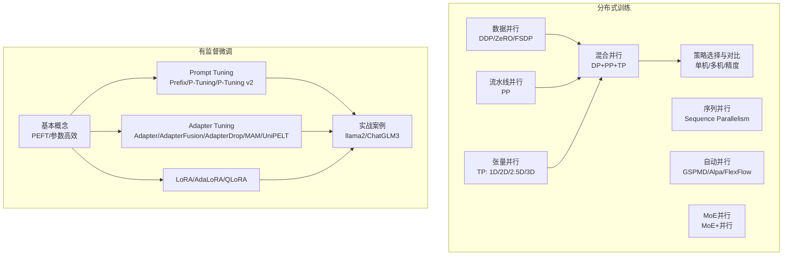
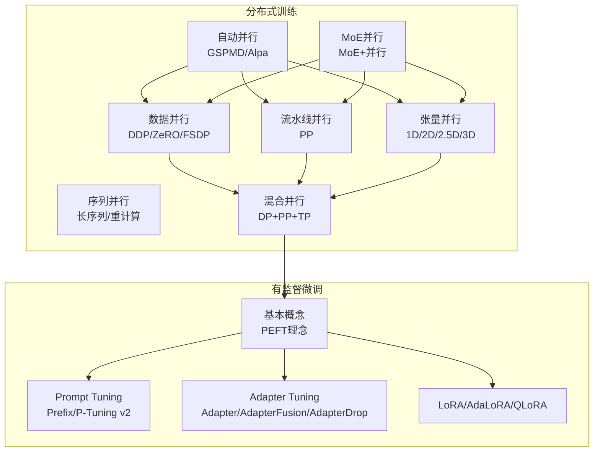
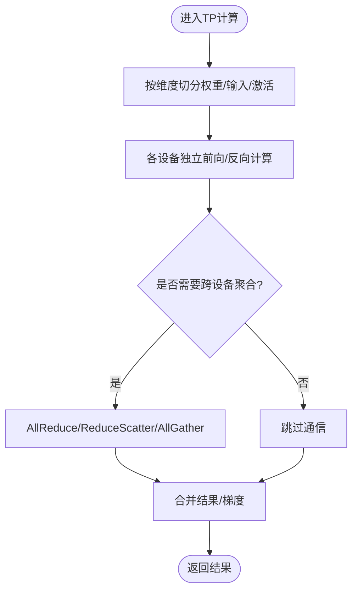
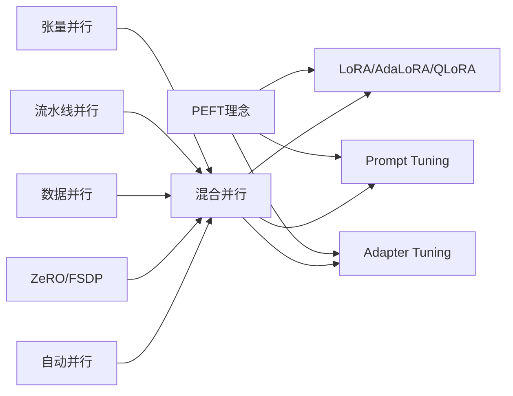

# 训练方法

<cite>
**本文引用的文件**
- [04.分布式训练/4.张量并行/4.张量并行.md](file://04.分布式训练/4.张量并行/4.张量并行.md)
- [04.分布式训练/6.多维度混合并行/6.多维度混合并行.md](file://04.分布式训练/6.多维度混合并行/6.多维度混合并行.md)
- [04.分布式训练/9.总结/9.总结.md](file://04.分布式训练/9.总结/9.总结.md)
- [05.有监督微调/README.md](file://05.有监督微调/README.md)
- [05.有监督微调/1.基本概念/1.基本概念.md](file://05.有监督微调/1.基本概念/1.基本概念.md)
- [05.有监督微调/2.prompting/2.prompting.md](file://05.有监督微调/2.prompting/2.prompting.md)
- [05.有监督微调/3.adapter-tuning/3.adapter-tuning.md](file://05.有监督微调/3.adapter-tuning/3.adapter-tuning.md)
- [05.有监督微调/4.lora/4.lora.md](file://05.有监督微调/4.lora/4.lora.md)
- [05.有监督微调/5.总结/5.总结.md](file://05.有监督微调/5.总结/5.总结.md)
- [05.有监督微调/llama2微调/llama2微调.md](file://05.有监督微调/llama2微调/llama2微调.md)
- [05.有监督微调/ChatGLM3微调/ChatGLM3微调.md](file://05.有监督微调/ChatGLM3微调/ChatGLM3微调.md)
</cite>

## 目录
1. [引言](#引言)
2. [项目结构](#项目结构)
3. [核心组件](#核心组件)
4. [架构总览](#架构总览)
5. [详细组件分析](#详细组件分析)
6. [依赖关系分析](#依赖关系分析)
7. [性能考量](#性能考量)
8. [故障排查指南](#故障排查指南)
9. [结论](#结论)
10. [附录](#附录)

## 引言
本文件面向“训练方法”主题，系统梳理分布式训练与有监督微调两大板块。内容涵盖：
- 分布式训练：数据并行、流水线并行、张量并行、序列并行、多维度混合并行、自动并行、MoE并行等策略的原理、适用场景与工程要点。
- 有监督微调：LoRA低秩适配、Adapter-Tuning、Prompt Tuning/P-Tuning v2、BitFit、AdaLoRA、QLoRA 等方法的原理、实现要点与实践建议。

目标是帮助读者在不同资源约束与任务需求下，做出合理的并行与微调策略选择，并提供可操作的实践路径。

## 项目结构
围绕训练方法主题，仓库中与之直接相关的主要文件如下：
- 分布式训练
  - 张量并行：Megatron-LM 1D、Colossal-AI 2D/2.5D/3D、PyTorch DTensor
  - 多维度混合并行：DP+PP、DP+TP、PP+TP、ZeRO-DP+PP+TP、业界案例
  - 总结：策略选择、FP16/BF16对比、自动并行、MoE并行
- 有监督微调
  - 基本概念、Prompting、Adapter-Tuning、LoRA、总结与实战链接

**章节来源**
- [04.分布式训练/6.多维度混合并行/6.多维度混合并行.md:1-109](file://04.分布式训练/6.多维度混合并行/6.多维度混合并行.md#L1-L109)
- [05.有监督微调/README.md:1-30](file://05.有监督微调/README.md#L1-L30)

## 核心组件
- 分布式训练策略
  - 数据并行：以梯度/权重/优化器状态为对象进行并行，典型代表 DDP、ZeRO、FSDP。
  - 流水线并行：将模型层切分到不同设备，降低单卡显存占用，典型有 GPipe、PipeDream 及变体。
  - 张量并行：对层内张量进行分片，典型有 Megatron-LM 1D、Colossal-AI 2D/2.5D/3D，PyTorch DTensor。
  - 序列并行：两类工作，分别针对长序列训练与激活重计算优化。
  - 多维度混合并行：DP+PP、DP+TP、PP+TP、ZeRO-DP+PP+TP 等组合。
  - 自动并行：半自动（Mesh-TensorFlow、GSPMD）与全自动（FlexFlow、Alpa）。
  - MoE并行：MoE与并行策略的协同。
- 有监督微调
  - PEFT理念与方法族：Prompt Tuning、Prefix Tuning、P-Tuning v2、Adapter Tuning、LoRA/AdaLoRA/QLoRA、BitFit、MAM Adapter、UniPELT。
  - 实战：llama2微调、ChatGLM3微调。

**章节来源**
- [04.分布式训练/4.张量并行/4.张量并行.md:1-441](file://04.分布式训练/4.张量并parallel.md#L1-L441)
- [04.分布式训练/6.多维度混合并行/6.多维度混合并行.md:1-109](file://04.分布式训练/6.多维度混合并行/6.多维度混合并行.md#L1-L109)
- [04.分布式训练/9.总结/9.总结.md:1-125](file://04.分布式训练/9.总结/9.总结.md#L1-L125)
- [05.有监督微调/1.基本概念/1.基本概念.md:1-85](file://05.有监督微调/1.基本概念/1.基本概念.md#L1-L85)
- [05.有监督微调/2.prompting/2.prompting.md:1-173](file://05.有监督微调/2.prompting/2.prompting.md#L1-L173)
- [05.有监督微调/3.adapter-tuning/3.adapter-tuning.md:1-165](file://05.有监督微调/3.adapter-tuning/3.adapter-tuning.md#L1-L165)
- [05.有监督微调/4.lora/4.lora.md:1-114](file://05.有监督微调/4.lora/4.lora.md#L1-L114)
- [05.有监督微调/5.总结/5.总结.md:1-135](file://05.有监督微调/5.总结/5.总结.md#L1-L135)

## 架构总览
下图给出分布式训练与有监督微调的整体关系与交互：

**图表来源**
- [04.分布式训练/6.多维度混合并行/6.多维度混合并行.md:1-109](file://04.分布式训练/6.多维度混合并行/6.多维度混合并行.md#L1-L109)
- [05.有监督微调/1.基本概念/1.基本概念.md:1-85](file://05.有监督微调/1.基本概念/1.基本概念.md#L1-L85)

## 详细组件分析

### 分布式训练策略

#### 数据并行（DDP/ZeRO/FSDP）
- 原理要点
  - 将同一模型副本分发到多卡，梯度/权重/优化器状态在设备间同步。
  - ZeRO（阶段1/2/3）通过分片优化器状态、梯度与参数，显著降低显存占用。
  - FSDP（完全分片数据并行）在框架层面实现参数分片，适合超大模型。
- 适用场景
  - 单机多卡：优先 DDP 或 ZeRO；若显存紧张，优先 ZeRO。
  - 多机多卡：ZeRO 或 FSDP；若节点间通信快，ZeRO/PP+TP+DP更优。
- 选择建议
  - 单机单卡：直接训练。
  - 单机多卡：若模型可放入单卡，DDP/ZeRO任选；否则结合 PP/TP。
  - 多机多卡：优先 ZeRO 或 PP+TP+DP；若节点间通信慢，考虑 DP+PP+TP+ZeRO-1。

**章节来源**
- [04.分布式训练/9.总结/9.总结.md:52-101](file://04.分布式训练/9.总结/9.总结.md#L52-L101)

#### 流水线并行（Pipeline Parallelism, PP）
- 原理要点
  - 将模型层切分到不同设备，通过微批次（micro-batch）流水线推进，降低单卡显存。
  - 朴素 PP 存在气泡（bubble）导致利用率低；GPipe、PipeDream 及变体（PipeDream-2BW、PipeDream-Flush）缓解。
- 适用场景
  - 超大模型无法放入单卡显存；需与 ZeRO/TP 组合以提升稳定性与效率。
- 注意事项
  - PP 与 ZeRO-2/3 组合存在兼容性问题，通常推荐 ZeRO-1 或 FSDP。

**章节来源**
- [04.分布式训练/9.总结/9.总结.md:11-38](file://04.分布式训练/9.总结/9.总结.md#L11-L38)

#### 张量并行（Tensor Parallelism, TP）
- 原理要点
  - 对层内张量进行分片（行并行/列并行），典型有：
    - Megatron-LM 1D：对权重按列/行切分，MHA/MLP 层分别处理。
    - Colossal-AI 2D/2.5D/3D：同时切分输入与激活，降低激活内存，减少通信。
    - PyTorch DTensor：通用抽象，支持 TP、DDP、FSDP 的组合。
- 适用场景
  - 大模型单卡显存不足；TP 通常在节点内使用，大小不超过每节点 GPU 数。
- 通信与内存权衡
  - 1D TP 通信成本高；2D/3D 在内存与通信间取得平衡；3D 进一步降低冗余。

**图表来源**
- [04.分布式训练/4.张量并行/4.张量并行.md:47-84](file://04.分布式训练/4.张量并行/4.张量并行.md#L47-L84)
- [04.分布式训练/4.张量并行/4.张量并行.md:118-168](file://04.分布式训练/4.张量并行/4.张量并行.md#L118-L168)
- [04.分布式训练/4.张量并行/4.张量并行.md:312-355](file://04.分布式训练/4.张量并行/4.张量并行.md#L312-L355)

**章节来源**
- [04.分布式训练/4.张量并行/4.张量并行.md:1-441](file://04.分布式训练/4.张量并行/4.张量并行.md#L1-L441)

#### 序列并行（Sequence Parallelism）
- 两类工作
  - 面向长序列训练的系统视角工作。
  - 减少激活重计算的重计算优化工作。
- 现状
  - PyTorch 2.0 提供序列并行支持，但尚未发布。

**章节来源**
- [04.分布式训练/9.总结/9.总结.md:21-31](file://04.分布式训练/9.总结/9.总结.md#L21-L31)

#### 多维度混合并行（DP+PP+TP）
- 组合策略
  - DP（数据并行）+ PP（流水线并行）+ TP（张量并行）构成 3D 并行。
  - ZeRO-DP 可与 PP、TP 组合，但 ZeRO-2/3 与 PP 组合需谨慎。
- 业界案例
  - Bloom、CodeGeeX、GLM、OPT、Bloom、Megatron-Turing NLG 等采用不同组合。

**章节来源**
- [04.分布式训练/6.多维度混合并行/6.多维度混合并行.md:1-109](file://04.分布式训练/6.多维度混合并行/6.多维度混合并行.md#L1-L109)
- [04.分布式训练/9.总结/9.总结.md:95-101](file://04.分布式训练/9.总结/9.总结.md#L95-L101)

#### 自动并行（Auto Parallel）
- 半自动：Mesh-TensorFlow、GSPMD。
- 全自动：FlexFlow、Alpa。
- 现状：工业落地尚不广泛。

**章节来源**
- [04.分布式训练/9.总结/9.总结.md:42-45](file://04.分布式训练/9.总结/9.总结.md#L42-L45)

#### MoE并行（Mixture-of-Experts）
- MoE 与并行策略协同，以百倍/千倍扩大模型规模。
- 业界案例：Switch-Transformer、GLaM。

**章节来源**
- [04.分布式训练/9.总结/9.总结.md:46-51](file://04.分布式训练/9.总结/9.总结.md#L46-L51)

### 有监督微调方法

#### 基本概念与PEFT
- PEFT目标：仅训练少量参数，降低计算与存储成本，缓解灾难性遗忘，提升可移植性。
- 方法分类：增加额外参数（Adapter-like、Soft prompts）、选择性层调整、低秩近似、正则化、任务特定头。
- 最佳实践：明确参数统计口径、多模型规模评估、标准化测量基准、重视代码可读性。

**章节来源**
- [05.有监督微调/1.基本概念/1.基本概念.md:1-85](file://05.有监督微调/1.基本概念/1.基本概念.md#L1-L85)

#### Prompt Tuning 与变体
- BitFit：仅训练 bias，参数量极小，效果略逊于 Adapter/LoRA。
- Prefix Tuning：在输入前添加可训练的虚拟 token（前缀），可选 MLP 稳定训练。
- Prompt Tuning：输入层加入 soft prompt，简化结构；对硬序列标注任务效果有限。
- P-Tuning/P-Tuning v2：将提示转为可学习 Embedding，P-Tuning v2 在每层加入提示，引入多任务学习与更直接的预测影响。

**章节来源**
- [05.有监督微调/2.prompting/2.prompting.md:1-173](file://05.有监督微调/2.prompting/2.prompting.md#L1-L173)

#### Adapter Tuning 与变体
- Adapter：在注意力与 FFN 后插入低秩前馈子层，训练时冻结主干，仅训练 Adapter 与 LN。
- AdapterFusion：两阶段学习，先提取各任务 Adapter，再融合聚合。
- AdapterDrop：动态移除低层 Adapter，提升推理效率。
- MAM Adapter：统一框架，将 Adapter、Prefix Tuning、LoRA 重新构建为对隐藏状态的修改。
- UniPELT：门控机制组合 LoRA、Prefix Tuning、Adapter，自适应激活。

**章节来源**
- [05.有监督微调/3.adapter-tuning/3.adapter-tuning.md:1-165](file://05.有监督微调/3.adapter-tuning/3.adapter-tuning.md#L1-L165)

#### LoRA/AdaLoRA/QLoRA
- LoRA：通过低秩分解 BA 近似权重增量，训练时仅更新 A、B，推理时可加到原权重。
- AdaLoRA：自适应预算分配，按重要性评分动态调整秩，保留奇异向量并稳定训练。
- QLoRA：4bit 量化 + 高精度计算（BFloat16），结合低秩适配器，显著降低显存占用。

**章节来源**
- [05.有监督微调/4.lora/4.lora.md:1-114](file://05.有监督微调/4.lora/4.lora.md#L1-L114)

#### 实战案例
- llama2微调：提供从模型下载到微调的实践链接。
- ChatGLM3微调：提供部署与微调实战教程与视频资料。

**章节来源**
- [05.有监督微调/llama2微调/llama2微调.md:1-4](file://05.有监督微调/llama2微调/llama2微调.md#L1-L4)
- [05.有监督微调/ChatGLM3微调/ChatGLM3微调.md:1-12](file://05.有监督微调/ChatGLM3微调/ChatGLM3微调.md#L1-L12)

## 依赖关系分析
- 分布式训练侧
  - TP 与 PP/DP 组合构成混合并行；ZeRO/FSDP 与 PP/TP 的兼容性需谨慎。
  - 自动并行可桥接不同并行策略，但落地尚浅。
  - MoE 并行与 DP/PP/TP 协同，扩大模型规模。
- 微调侧
  - PEFT 方法与分布式训练可叠加：在混合并行下冻结主干，仅训练适配器/提示/低秩矩阵。
  - 实战案例与框架生态（如 LoRA/QLoRA）紧密相关。

**图表来源**
- [04.分布式训练/6.多维度混合并行/6.多维度混合并行.md:1-109](file://04.分布式训练/6.多维度混合并行/6.多维度混合并行.md#L1-L109)
- [05.有监督微调/1.基本概念/1.基本概念.md:1-85](file://05.有监督微调/1.基本概念/1.基本概念.md#L1-L85)

**章节来源**
- [04.分布式训练/6.多维度混合并行/6.多维度混合并行.md:1-109](file://04.分布式训练/6.多维度混合并行/6.多维度混合并行.md#L1-L109)
- [05.有监督微调/1.基本概念/1.基本概念.md:1-85](file://05.有监督微调/1.基本概念/1.基本概念.md#L1-L85)

## 性能考量
- 精度选择
  - FP16 在巨型 LLM 训练中易溢出，BF16 动态范围与 FP32 相当，配合优化器 FP32 更新更稳健。
- 通信与内存
  - TP 1D 通信成本高；2D/3D 降低激活内存，但引入更多通信；需结合硬件拓扑与网络带宽权衡。
- 推理效率
  - Adapter 在推理时引入额外计算；LoRA/QLoRA 可在推理时合并权重，避免额外开销。
- 数据与任务规模
  - 小模型：Prompt Tuning/P-Tuning v2、LoRA 均可；大模型：QLoRA 与 LoRA/AdaLoRA 表现接近。

**章节来源**
- [04.分布式训练/9.总结/9.总结.md:110-125](file://04.分布式训练/9.总结/9.总结.md#L110-L125)
- [05.有监督微调/5.总结/5.总结.md:72-135](file://05.有监督微调/5.总结/5.总结.md#L72-L135)

## 故障排查指南
- 分布式训练
  - 显存不足：优先 ZeRO/FSDP；若模型层过大，考虑 PP 或 TP；必要时启用内存为中心平铺（MCT）。
  - 通信瓶颈：评估节点内 NVLink/NVSwitch；若无高速互联，PP 可优于 TP；TP 通常在节点内使用。
  - PP+ZeRO 兼容性：避免 PP 与 ZeRO-2/3 直接组合；可采用 ZeRO-1 或 FSDP。
- 微调
  - 训练不稳定：尝试 Prefix Tuning 的 MLP 稳定、或 P-Tuning v2 的多任务学习与更深层提示。
  - 推理延迟：Adapter Drop 移除低层 Adapter；或采用 LoRA/QLoRA 在推理时合并权重。
  - 参数统计口径不一致：明确可训练参数、变更参数、差异等级，避免误导比较。

**章节来源**
- [04.分布式训练/9.总结/9.总结.md:67-101](file://04.分布式训练/9.总结/9.总结.md#L67-L101)
- [05.有监督微调/1.基本概念/1.基本概念.md:67-85](file://05.有监督微调/1.基本概念/1.基本概念.md#L67-L85)

## 结论
- 分布式训练
  - 针对不同资源与网络条件，合理选择并组合 DP/PP/TP；在超大模型场景下，TP 2D/3D 与 ZeRO/FSDP 是主流。
  - 自动并行与 MoE 并行为未来扩展提供可能。
- 有监督微调
  - PEFT 在参数高效与部署可移植性上具备优势；Prompt Tuning/P-Tuning v2、Adapter Tuning、LoRA/AdaLoRA/QLoRA 各具特色，应结合任务与资源选择。
  - 实践中建议遵循最佳实践，统一评估口径，重视代码可读性与可复用性。

## 附录
- 实战链接
  - llama2微调：[链接:1-4](file://05.有监督微调/llama2微调/llama2微调.md#L1-L4)
  - ChatGLM3微调：[链接:1-12](file://05.有监督微调/ChatGLM3微调/ChatGLM3微调.md#L1-L12)