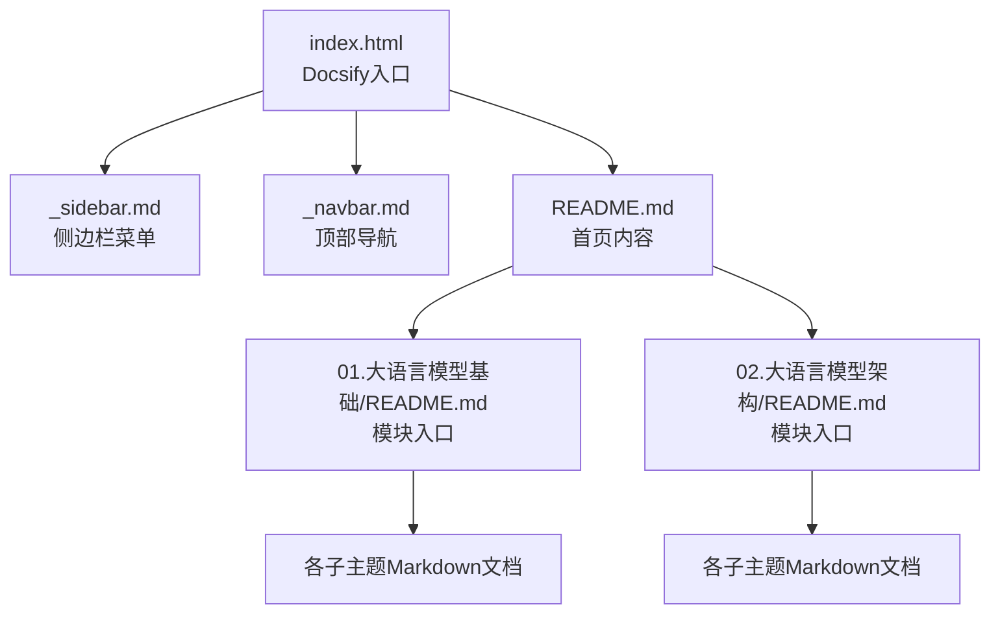
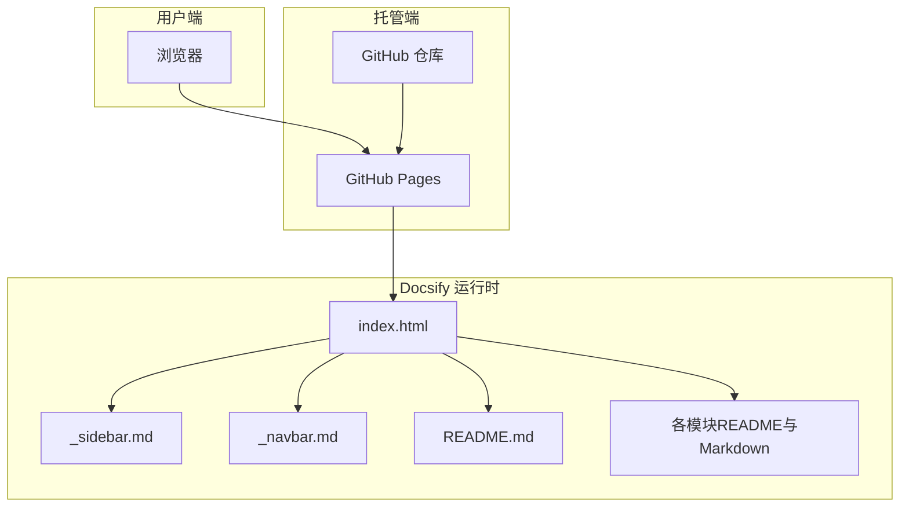
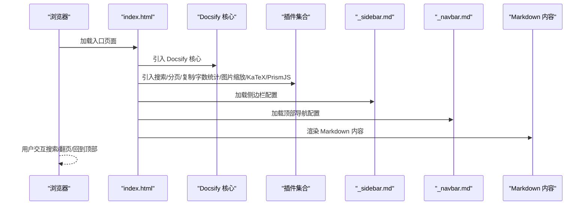

# 在线访问

<cite>
**本文引用的文件**
- [README.md](file://README.md)
- [index.html](file://index.html)
- [_sidebar.md](file://_sidebar.md)
- [_navbar.md](file://_navbar.md)
- [01.大语言模型基础/README.md](file://01.大语言模型基础/README.md)
- [02.大语言模型架构/README.md](file://02.大语言模型架构/README.md)
</cite>

## 目录
1. [简介](#简介)
2. [项目结构](#项目结构)
3. [核心组件](#核心组件)
4. [架构总览](#架构总览)
5. [详细组件分析](#详细组件分析)
6. [依赖关系分析](#依赖关系分析)
7. [性能考虑](#性能考虑)
8. [故障排查指南](#故障排查指南)
9. [结论](#结论)
10. [附录](#附录)

## 简介
本指南面向希望在线阅读“LLM面试知识库”项目的用户，提供通过 GitHub Pages 部署的 Docsify 静态站点的完整使用说明。内容涵盖：
- 在线访问链接与导航方式
- 搜索功能使用方法
- Docsify 静态站点的特点与优势
- 离线下载与本地部署选项
- 不同设备（桌面、移动设备）的最佳实践
- 常见访问问题的解决方案

## 项目结构
该仓库采用 Docsify 静态站点方案，通过 GitHub Pages 发布。核心入口为根目录下的 HTML 页面，配合侧边栏、导航栏配置文件，以及各主题模块的 Markdown 文档，形成完整的在线知识库。

图表来源
- [index.html:14-66](file://index.html#L14-L66)
- [_sidebar.md:1-130](file://_sidebar.md#L1-L130)
- [_navbar.md:1-5](file://_navbar.md#L1-L5)
- [README.md:23-161](file://README.md#L23-L161)
- [01.大语言模型基础/README.md:1-36](file://01.大语言模型基础/README.md#L1-L36)
- [02.大语言模型架构/README.md:1-52](file://02.大语言模型架构/README.md#L1-L52)

章节来源
- [README.md:23-161](file://README.md#L23-L161)
- [index.html:14-66](file://index.html#L14-L66)
- [_sidebar.md:1-130](file://_sidebar.md#L1-L130)
- [_navbar.md:1-5](file://_navbar.md#L1-L5)
- [01.大语言模型基础/README.md:1-36](file://01.大语言模型基础/README.md#L1-L36)
- [02.大语言模型架构/README.md:1-52](file://02.大语言模型架构/README.md#L1-L52)

## 核心组件
- Docsify 入口页面（index.html）
  - 负责加载 Docsify 核心与插件，启用侧边栏、导航栏、搜索、字数统计、分页、回到顶部、页脚等特性。
- 侧边栏配置（_sidebar.md）
  - 定义全站导航树，包含模块与子主题的层级关系与跳转链接。
- 导航栏配置（_navbar.md）
  - 提供快捷链接，如外部仓库与体验地址。
- 首页与模块入口（README.md、各模块 README）
  - 首页提供在线阅读链接与目录；模块 README 作为子主题入口，组织具体知识点。

章节来源
- [index.html:14-66](file://index.html#L14-L66)
- [_sidebar.md:1-130](file://_sidebar.md#L1-L130)
- [_navbar.md:1-5](file://_navbar.md#L1-L5)
- [README.md:23-161](file://README.md#L23-L161)
- [01.大语言模型基础/README.md:1-36](file://01.大语言模型基础/README.md#L1-L36)
- [02.大语言模型架构/README.md:1-52](file://02.大语言模型架构/README.md#L1-L52)

## 架构总览
Docsify 将 Markdown 文档转换为静态网页，无需构建过程，适合知识库类项目。GitHub Pages 自动托管，用户通过浏览器直接访问。

图表来源
- [index.html:14-66](file://index.html#L14-L66)
- [_sidebar.md:1-130](file://_sidebar.md#L1-L130)
- [_navbar.md:1-5](file://_navbar.md#L1-L5)
- [README.md:23-161](file://README.md#L23-L161)
- [01.大语言模型基础/README.md:1-36](file://01.大语言模型基础/README.md#L1-L36)
- [02.大语言模型架构/README.md:1-52](file://02.大语言模型架构/README.md#L1-L52)

## 详细组件分析

### 在线访问入口与链接
- 在线阅读链接：项目在 README 中提供了在线访问链接，可直接打开。
- 访问方式：在任意现代浏览器中输入在线链接即可访问 Docsify 站点。

章节来源
- [README.md:23-25](file://README.md#L23-L25)

### 页面导航方式
- 侧边栏导航
  - 启用侧边栏后，左侧显示完整的目录树，支持展开/折叠与层级跳转。
  - 通过点击条目可快速进入对应模块或子主题。
- 顶部导航栏
  - 显示快捷链接，便于快速跳转至外部仓库或体验地址。
- 模块入口
  - 每个一级模块（如“01.大语言模型基础”、“02.大语言模型架构”）均提供 README 作为入口，组织子主题内容。

章节来源
- [index.html:18-27](file://index.html#L18-L27)
- [_sidebar.md:1-130](file://_sidebar.md#L1-L130)
- [_navbar.md:1-5](file://_navbar.md#L1-L5)
- [01.大语言模型基础/README.md:1-36](file://01.大语言模型基础/README.md#L1-L36)
- [02.大语言模型架构/README.md:1-52](file://02.大语言模型架构/README.md#L1-L52)

### 搜索功能使用
- 全文搜索
  - Docsify 内置搜索插件，支持在页面顶部输入关键词进行全文检索。
  - 搜索框占位符与无结果提示可自定义。
- 使用建议
  - 输入关键词时注意大小写不敏感，建议使用简洁明确的术语。
  - 若无结果，尝试更换关键词或扩大范围。

章节来源
- [index.html:34-38](file://index.html#L34-L38)

### 分页与阅读体验
- 分页导航
  - 支持跨章节翻页，提供“上一章节/下一章节”按钮，提升连续阅读体验。
- 回到顶部
  - 支持滚动到顶部的便捷按钮，减少长文档阅读的滚动成本。
- 字数统计
  - 可选的字数统计功能，帮助了解文档长度与阅读节奏。

章节来源
- [index.html:28-33](file://index.html#L28-L33)
- [index.html:50-57](file://index.html#L50-L57)
- [index.html:39-49](file://index.html#L39-L49)

### 数学公式与代码高亮
- 数学公式
  - 通过 KaTeX 插件支持 LaTeX 数学公式渲染。
- 代码高亮
  - 通过 PrismJS 支持多种编程语言的语法高亮。

章节来源
- [index.html:73-95](file://index.html#L73-L95)

### Docsify 静态站点的特点与优势
- 零构建成本
  - 基于 Markdown 的纯前端渲染，无需编译或打包。
- 易维护
  - 文档即代码，修改 Markdown 即可更新页面。
- 丰富的插件生态
  - 搜索、分页、复制、字数统计、图片缩放、KaTeX、PrismJS 等插件可按需启用。
- GitHub Pages 托管
  - 免费、稳定、全球加速，适合知识库与文档站点。

章节来源
- [index.html:14-66](file://index.html#L14-L66)

### 离线下载与本地部署
- 离线下载
  - 可将 Docsify 站点打包为静态文件包，保存到本地磁盘，离线查看。
  - 建议保留所有资源（HTML、CSS、JS、图片、字体），确保样式与交互正常。
- 本地部署
  - 在本地使用静态服务器（如 Python 的 http.server、Live Server 等）启动 index.html。
  - 或将打包后的静态包上传至内网服务器/NAS，实现局域网共享。

章节来源
- [index.html:14-66](file://index.html#L14-L66)

### 不同设备的访问建议与最佳实践
- 桌面端
  - 使用 Chrome/Firefox/Edge 等现代浏览器，开启侧边栏与搜索，利用分页与回到顶部提升效率。
- 移动端
  - 侧边栏在窄屏下可能被折叠，建议优先使用顶部导航与搜索定位内容。
  - 长文档阅读时，利用“回到顶部”按钮减少滚动距离。
  - 如需复制代码，使用“复制到剪贴板”插件提供的按钮。

章节来源
- [index.html:18-27](file://index.html#L18-L27)
- [index.html:50-57](file://index.html#L50-L57)
- [index.html:97-100](file://index.html#L97-L100)

## 依赖关系分析
Docsify 通过入口页面动态加载核心与插件脚本，形成轻量级运行时环境。下图展示关键依赖与加载顺序。

图表来源
- [index.html:70-120](file://index.html#L70-L120)
- [_sidebar.md:1-130](file://_sidebar.md#L1-L130)
- [_navbar.md:1-5](file://_navbar.md#L1-L5)

章节来源
- [index.html:70-120](file://index.html#L70-L120)

## 性能考虑
- 资源加载
  - 所有脚本与样式均通过 CDN 引入，加载速度快但受网络影响较大。
- 文档体积
  - Markdown 文件体量适中，侧边栏与导航配置较小，整体加载时间短。
- 浏览器缓存
  - 首次访问后，浏览器会缓存静态资源，后续访问更快。
- 图片与公式
  - 大量图片与 KaTeX 公式会增加渲染时间，建议在弱网环境下耐心等待。

## 故障排查指南
- 无法打开在线链接
  - 检查网络连接是否正常，尝试刷新页面或更换浏览器。
  - 若 GitHub Pages 临时不可用，稍后再试。
- 侧边栏不显示或空白
  - 确认已启用侧边栏配置，并检查路径是否正确。
  - 清除浏览器缓存后重试。
- 搜索无结果
  - 确认已启用搜索插件，尝试简化关键词或切换到其他浏览器。
- 分页/回到顶部无效
  - 检查对应插件是否正确引入，确认页面内容足够长以触发分页。
- 数学公式未渲染
  - 确认 KaTeX 插件已加载，检查公式语法是否符合 LaTeX 规范。
- 代码高亮异常
  - 确认 PrismJS 对应语言组件已加载，检查代码块语言标识是否正确。

章节来源
- [index.html:34-38](file://index.html#L34-L38)
- [index.html:28-33](file://index.html#L28-L33)
- [index.html:50-57](file://index.html#L50-L57)
- [index.html:73-95](file://index.html#L73-L95)

## 结论
通过 GitHub Pages 与 Docsify 的组合，本项目实现了低成本、易维护的知识库在线阅读体验。用户可通过统一入口访问全站内容，借助侧边栏、搜索、分页与阅读增强功能高效获取所需信息。同时，项目支持离线下载与本地部署，满足不同场景需求。

## 附录
- 在线访问链接：请参阅项目首页提供的在线阅读链接。
- 快捷链接：顶部导航栏提供外部仓库与体验地址，便于扩展阅读与实践。

章节来源
- [README.md:23-25](file://README.md#L23-L25)
- [_navbar.md:1-5](file://_navbar.md#L1-L5)