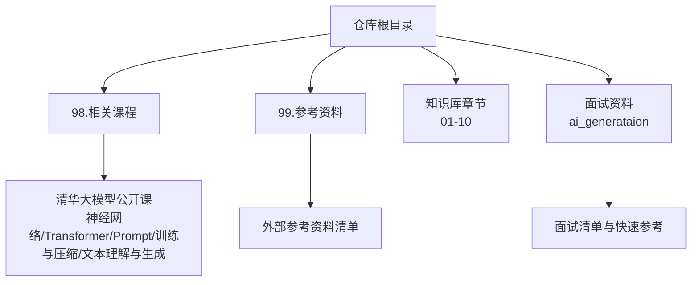
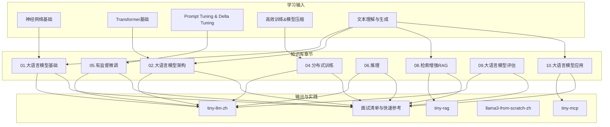
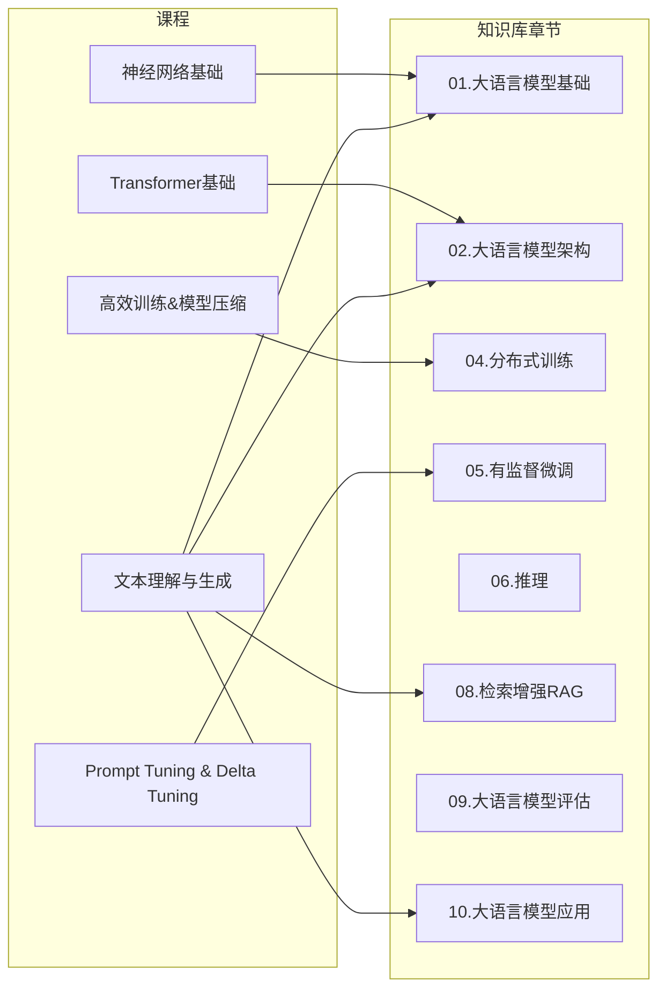

# 学习资源

<cite>
**本文引用的文件**
- [README.md](file://README.md)
- [98.相关课程/README.md](file://98.相关课程/README.md)
- [98.相关课程/清华大模型公开课/2.神经网络基础/2.神经网络基础.md](file://98.相关课程/清华大模型公开课/2.神经网络基础/2.神经网络基础.md)
- [98.相关课程/清华大模型公开课/3.Transformer基础/3.Transformer基础.md](file://98.相关课程/清华大模型公开课/3.Transformer基础/3.Transformer基础.md)
- [98.相关课程/清华大模型公开课/4.Prompt Tuning & Delta Tuning/4.Prompt Tuning & Delta Tuning.md](file://98.相关课程/清华大模型公开课/4.Prompt Tuning & Delta Tuning/4.Prompt Tuning & Delta Tuning.md)
- [98.相关课程/清华大模型公开课/5.高效训练&模型压缩/5.高效训练&模型压缩.md](file://98.相关课程/清华大模型公开课/5.高效训练&模型压缩/5.高效训练&模型压缩.md)
- [98.相关课程/清华大模型公开课/6.文本理解和生成大模型/6.文本理解和生成大模型.md](file://98.相关课程/清华大模型公开课/6.文本理解和生成大模型/6.文本理解和生成大模型.md)
- [99.参考资料/README.md](file://99.参考资料/README.md)
- [ai_generataion/中级LLM_Agent工程师面试QA清单.md](file://ai_generataion/中级LLM_Agent工程师面试QA清单.md)
- [ai_generataion/中级LLM_Agent工程师面试_快速参考.md](file://ai_generataion/中级LLM_Agent工程师面试_快速参考.md)
</cite>

## 目录
1. [简介](#简介)
2. [项目结构](#项目结构)
3. [核心组件](#核心组件)
4. [架构总览](#架构总览)
5. [详细组件分析](#详细组件分析)
6. [依赖分析](#依赖分析)
7. [性能考量](#性能考量)
8. [故障排查指南](#故障排查指南)
9. [结论](#结论)
10. [附录](#附录)

## 简介
本仓库聚焦于大模型面试与知识体系，配套动手实践项目与参考资料。为帮助读者系统学习与巩固知识，本文梳理并推荐以下学习资源：
- 清华大学公开课（大模型与NLP基础）
- AI工程师八股（通用知识与面试清单）
- 参考资料与延伸阅读
- 面试准备与学习计划建议

这些资源覆盖从基础神经网络、Transformer、Prompt Tuning、高效训练与模型压缩，到文本理解与生成、检索增强与推理优化等关键主题，可与本知识库内容形成互补与联动。

## 项目结构
本仓库围绕“知识库 + 实践项目 + 面试资料”的主线组织，学习资源主要分布在“相关课程”“参考资料”“面试资料”三大板块，便于按主题与难度梯度学习。

图表来源
- [README.md](file://README.md)
- [98.相关课程/README.md](file://98.相关课程/README.md)
- [99.参考资料/README.md](file://99.参考资料/README.md)
- [ai_generataion/中级LLM_Agent工程师面试QA清单.md](file://ai_generataion/中级LLM_Agent工程师面试QA清单.md)
- [ai_generataion/中级LLM_Agent工程师面试_快速参考.md](file://ai_generataion/中级LLM_Agent工程师面试_快速参考.md)

章节来源
- [README.md](file://README.md)
- [98.相关课程/README.md](file://98.相关课程/README.md)
- [99.参考资料/README.md](file://99.参考资料/README.md)

## 核心组件
- 清华大模型公开课：系统讲解神经网络、Transformer、Prompt Tuning、高效训练与模型压缩、文本理解与生成等主题，适合作为知识体系的“主干教材”。
- AI工程师八股：覆盖深度学习、机器学习、推荐与搜索系统等通用知识，补充工程实践视角。
- 参考资料：提供外部博客、教程与论文链接，便于拓展阅读与深入研究。
- 面试资料：包含面试清单与快速参考，帮助梳理高频考点与答题思路。

章节来源
- [README.md](file://README.md)
- [98.相关课程/清华大模型公开课/2.神经网络基础/2.神经网络基础.md](file://98.相关课程/清华大模型公开课/2.神经网络基础/2.神经网络基础.md)
- [98.相关课程/清华大模型公开课/3.Transformer基础/3.Transformer基础.md](file://98.相关课程/清华大模型公开课/3.Transformer基础/3.Transformer基础.md)
- [98.相关课程/清华大模型公开课/4.Prompt Tuning & Delta Tuning/4.Prompt Tuning & Delta Tuning.md](file://98.相关课程/清华大模型公开课/4.Prompt Tuning & Delta Tuning/4.Prompt Tuning & Delta Tuning.md)
- [98.相关课程/清华大模型公开课/5.高效训练&模型压缩/5.高效训练&模型压缩.md](file://98.相关课程/清华大模型公开课/5.高效训练&模型压缩/5.高效训练&模型压缩.md)
- [98.相关课程/清华大模型公开课/6.文本理解和生成大模型/6.文本理解和生成大模型.md](file://98.相关课程/清华大模型公开课/6.文本理解和生成大模型/6.文本理解和生成大模型.md)
- [99.参考资料/README.md](file://99.参考资料/README.md)
- [ai_generataion/中级LLM_Agent工程师面试QA清单.md](file://ai_generataion/中级LLM_Agent工程师面试QA清单.md)
- [ai_generataion/中级LLM_Agent工程师面试_快速参考.md](file://ai_generataion/中级LLM_Agent工程师面试_快速参考.md)

## 架构总览
学习资源与知识库的结合路径如下：以“课程”为输入，通过“知识库章节”进行对照与深化，辅以“面试资料”进行能力检验与输出训练，最终形成“实践项目”的闭环验证。

图表来源
- [README.md](file://README.md)
- [98.相关课程/清华大模型公开课/2.神经网络基础/2.神经网络基础.md](file://98.相关课程/清华大模型公开课/2.神经网络基础/2.神经网络基础.md)
- [98.相关课程/清华大模型公开课/3.Transformer基础/3.Transformer基础.md](file://98.相关课程/清华大模型公开课/3.Transformer基础/3.Transformer基础.md)
- [98.相关课程/清华大模型公开课/4.Prompt Tuning & Delta Tuning/4.Prompt Tuning & Delta Tuning.md](file://98.相关课程/清华大模型公开课/4.Prompt Tuning & Delta Tuning/4.Prompt Tuning & Delta Tuning.md)
- [98.相关课程/清华大模型公开课/5.高效训练&模型压缩/5.高效训练&模型压缩.md](file://98.相关课程/清华大模型公开课/5.高效训练&模型压缩/5.高效训练&模型压缩.md)
- [98.相关课程/清华大模型公开课/6.文本理解和生成大模型/6.文本理解和生成大模型.md](file://98.相关课程/清华大模型公开课/6.文本理解和生成大模型/6.文本理解和生成大模型.md)
- [ai_generataion/中级LLM_Agent工程师面试QA清单.md](file://ai_generataion/中级LLM_Agent工程师面试QA清单.md)
- [ai_generataion/中级LLM_Agent工程师面试_快速参考.md](file://ai_generataion/中级LLM_Agent工程师面试_快速参考.md)

## 详细组件分析

### 清华大学公开课
- 神经网络基础：涵盖神经元、激活函数、训练目标、反向传播与链式法则等，为后续Transformer与大模型训练打下基础。
- Transformer基础：系统讲解注意力机制、自注意力、多头注意力、位置编码、Encoder-Decoder结构与PLM范式。
- Prompt Tuning与Delta Tuning：介绍模板与语义映射、连续提示优化、参数高效微调（LoRA、Adapter、Prefix Tuning）等。
- 高效训练与模型压缩：覆盖数据/模型/流水线并行、ZeRO、混合精度、Offloading、Checkpointing、知识蒸馏、剪枝、量化等。
- 文本理解与生成：讲解IR、QA、生成式与非自回归生成、解码策略、可控生成与评估指标。

学习建议
- 以“先基础、后架构、再工程实践”的顺序推进，先完成神经网络与Transformer，再进入Prompt Tuning与训练优化。
- 结合知识库章节进行对位学习：如Transformer对应“02.大语言模型架构”，训练优化对应“04.分布式训练”，Prompt对应“05.有监督微调”。
- 通过实践项目验证：如在“tiny-llm-zh”中复现Transformer与训练流程，在“tiny-rag”中实践检索与生成。

章节来源
- [98.相关课程/清华大模型公开课/2.神经网络基础/2.神经网络基础.md](file://98.相关课程/清华大模型公开课/2.神经网络基础/2.神经网络基础.md)
- [98.相关课程/清华大模型公开课/3.Transformer基础/3.Transformer基础.md](file://98.相关课程/清华大模型公开课/3.Transformer基础/3.Transformer基础.md)
- [98.相关课程/清华大模型公开课/4.Prompt Tuning & Delta Tuning/4.Prompt Tuning & Delta Tuning.md](file://98.相关课程/清华大模型公开课/4.Prompt Tuning & Delta Tuning/4.Prompt Tuning & Delta Tuning.md)
- [98.相关课程/清华大模型公开课/5.高效训练&模型压缩/5.高效训练&模型压缩.md](file://98.相关课程/清华大模型公开课/5.高效训练&模型压缩/5.高效训练&模型压缩.md)
- [98.相关课程/清华大模型公开课/6.文本理解和生成大模型/6.文本理解和生成大模型.md](file://98.相关课程/清华大模型公开课/6.文本理解和生成大模型/6.文本理解和生成大模型.md)

### AI工程师八股（通用知识）
- 内容范围：深度学习、机器学习、推荐系统、搜索系统等，补充工程与系统设计视角。
- 适用人群：需要系统梳理通用知识、准备综合性面试的工程师。
- 学习建议：与“01.大语言模型基础”“02.大语言模型架构”“04.分布式训练”“05.有监督微调”“06.推理”“08.检索增强RAG”“09.大语言模型评估”“10.大语言模型应用”形成交叉阅读，强化跨模块整合能力。

章节来源
- [README.md](file://README.md)

### 参考资料
- 提供外部博客、教程与论文链接，便于深入专题研究与追踪前沿。
- 建议按主题筛选：如“大模型训练入门实战”“大模型训练避坑指南”“算法工程师笔记”“深度学习自然语言处理”等。

章节来源
- [99.参考资料/README.md](file://99.参考资料/README.md)

### 面试资料（面试清单与快速参考）
- 面试清单：覆盖基础理论、系统设计、编码实践、项目经验与行为问题，提供答题要点与追问示例。
- 快速参考：提炼核心知识点、编码模板与行为问题准备要点，便于冲刺阶段回顾与演练。
- 与知识库结合：将清单中的问题与知识库章节对齐，如“Transformer架构”“推理优化”“RAG系统”“微调技术”等，形成“知识—面试—实践”的闭环。

章节来源
- [ai_generataion/中级LLM_Agent工程师面试QA清单.md](file://ai_generataion/中级LLM_Agent工程师面试QA清单.md)
- [ai_generataion/中级LLM_Agent工程师面试_快速参考.md](file://ai_generataion/中级LLM_Agent工程师面试_快速参考.md)

## 依赖分析
学习资源与知识库章节的依赖关系如下：

图表来源
- [98.相关课程/清华大模型公开课/2.神经网络基础/2.神经网络基础.md](file://98.相关课程/清华大模型公开课/2.神经网络基础/2.神经网络基础.md)
- [98.相关课程/清华大模型公开课/3.Transformer基础/3.Transformer基础.md](file://98.相关课程/清华大模型公开课/3.Transformer基础/3.Transformer基础.md)
- [98.相关课程/清华大模型公开课/4.Prompt Tuning & Delta Tuning/4.Prompt Tuning & Delta Tuning.md](file://98.相关课程/清华大模型公开课/4.Prompt Tuning & Delta Tuning/4.Prompt Tuning & Delta Tuning.md)
- [98.相关课程/清华大模型公开课/5.高效训练&模型压缩/5.高效训练&模型压缩.md](file://98.相关课程/清华大模型公开课/5.高效训练&模型压缩/5.高效训练&模型压缩.md)
- [98.相关课程/清华大模型公开课/6.文本理解和生成大模型/6.文本理解和生成大模型.md](file://98.相关课程/清华大模型公开课/6.文本理解和生成大模型/6.文本理解和生成大模型.md)
- [README.md](file://README.md)

## 性能考量
- 学习节奏：建议以“每周2-3个主题”推进，结合知识库章节与实践项目进行阶段性复盘。
- 资源优先级：优先掌握Transformer与Prompt Tuning，再深入训练优化与RAG系统。
- 输出导向：通过面试清单与快速参考进行自我测评，查漏补缺。

## 故障排查指南
- 知识断层：若在某主题（如注意力机制）理解困难，回看“神经网络基础”与“Transformer基础”，并结合知识库对应章节。
- 实践卡壳：在“tiny-llm-zh”“tiny-rag”“tiny-mcp”中遇到问题，对照“分布式训练”“推理”“有监督微调”“检索增强RAG”等章节，逐项排查。
- 面试不稳：通过“面试清单”进行自测，针对薄弱环节回看课程与知识库，强化表达与逻辑。

章节来源
- [README.md](file://README.md)
- [98.相关课程/清华大模型公开课/3.Transformer基础/3.Transformer基础.md](file://98.相关课程/清华大模型公开课/3.Transformer基础/3.Transformer基础.md)
- [98.相关课程/清华大模型公开课/5.高效训练&模型压缩/5.高效训练&模型压缩.md](file://98.相关课程/清华大模型公开课/5.高效训练&模型压缩/5.高效训练&模型压缩.md)
- [ai_generataion/中级LLM_Agent工程师面试QA清单.md](file://ai_generataion/中级LLM_Agent工程师面试QA清单.md)

## 结论
通过将“清华大学公开课”“AI工程师八股”“参考资料”与“面试资料”与知识库章节进行系统化对齐，可形成“输入—消化—输出—实践—反馈”的闭环学习路径。建议以课程为主线，以知识库为骨架，以面试资料为标尺，以实践项目为验证，持续迭代与优化。

## 附录

### 学习资源清单与获取方式
- 清华大学公开课
  - 神经网络基础：[2.神经网络基础.md](file://98.相关课程/清华大模型公开课/2.神经网络基础/2.神经网络基础.md)
  - Transformer基础：[3.Transformer基础.md](file://98.相关课程/清华大模型公开课/3.Transformer基础/3.Transformer基础.md)
  - Prompt Tuning与Delta Tuning：[4.Prompt Tuning & Delta Tuning.md](file://98.相关课程/清华大模型公开课/4.Prompt Tuning & Delta Tuning/4.Prompt Tuning & Delta Tuning.md)
  - 高效训练与模型压缩：[5.高效训练&模型压缩.md](file://98.相关课程/清华大模型公开课/5.高效训练&模型压缩/5.高效训练&模型压缩.md)
  - 文本理解与生成：[6.文本理解和生成大模型.md](file://98.相关课程/清华大模型公开课/6.文本理解和生成大模型/6.文本理解和生成大模型.md)
- AI工程师八股
  - 仓库地址：[AI 工程师八股](https://github.com/wdndev/ai_interview_note)
- 参考资料
  - 清单：[99.参考资料/README.md](file://99.参考资料/README.md)
- 面试资料
  - 面试清单：[中级LLM_Agent工程师面试QA清单.md](file://ai_generataion/中级LLM_Agent工程师面试QA清单.md)
  - 快速参考：[中级LLM_Agent工程师面试_快速参考.md](file://ai_generataion/中级LLM_Agent工程师面试_快速参考.md)

### 学习计划制定建议
- 基础阶段（2-3周）
  - 目标：掌握神经网络与Transformer核心概念
  - 资源：神经网络基础、Transformer基础
  - 输出：完成知识库“01.大语言模型基础”“02.大语言模型架构”对应章节
- 进阶阶段（3-4周）
  - 目标：理解Prompt Tuning与高效微调、训练优化与模型压缩
  - 资源：Prompt Tuning与Delta Tuning、高效训练与模型压缩
  - 输出：完成知识库“04.分布式训练”“05.有监督微调”
- 应用阶段（3-4周）
  - 目标：掌握文本理解与生成、RAG与推理优化
  - 资源：文本理解与生成
  - 输出：完成知识库“06.推理”“08.检索增强RAG”“09.大语言模型评估”“10.大语言模型应用”
- 实践阶段（持续）
  - 项目：tiny-llm-zh、tiny-rag、tiny-mcp、llama3-from-scratch-zh
  - 面试：以面试清单与快速参考进行自测与复盘

### 资源更新频率与质量评价
- 更新频率：课程内容以讲义与课件为主，建议结合GitHub提交记录与课程公告确认更新；参考资料与外部链接以时效性为准，建议定期回访。
- 质量评价：课程内容系统性强、循序渐进；面试资料覆盖全面、示例丰富；实践项目与知识库章节紧密衔接，便于学以致用。

### 与知识库内容结合使用建议
- 对位学习：将课程主题与知识库章节一一对应，形成“课程—知识库—实践—面试”的闭环。
- 项目驱动：以实践项目为载体，验证与巩固所学，如在“tiny-llm-zh”中复现Transformer与训练流程，在“tiny-rag”中实践检索与生成。
- 面试导向：以面试清单为标尺，查漏补缺，强化表达与逻辑，提升综合能力。