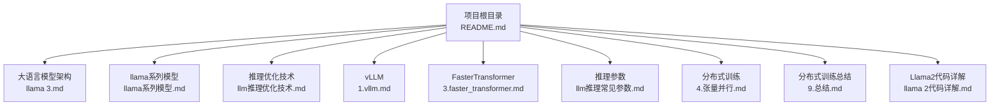
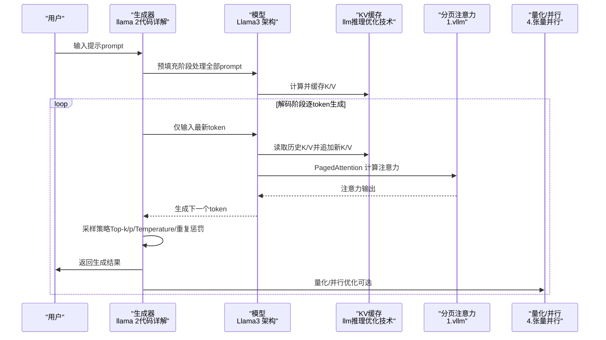
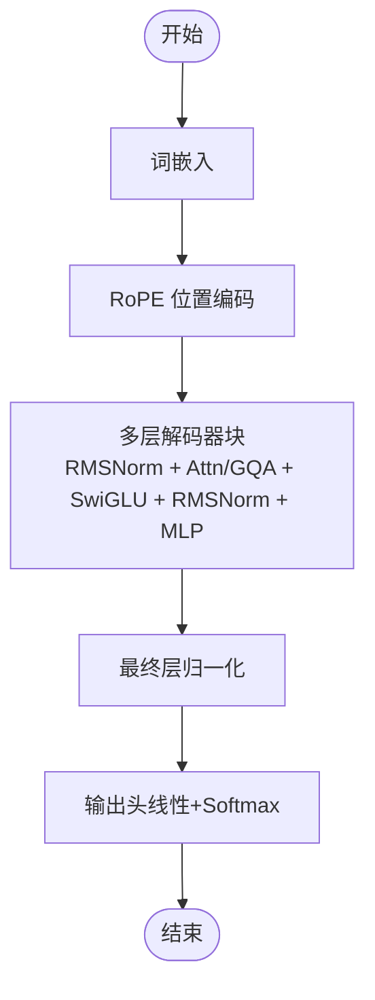
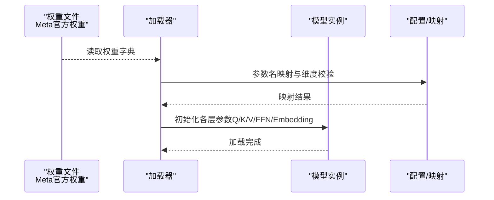
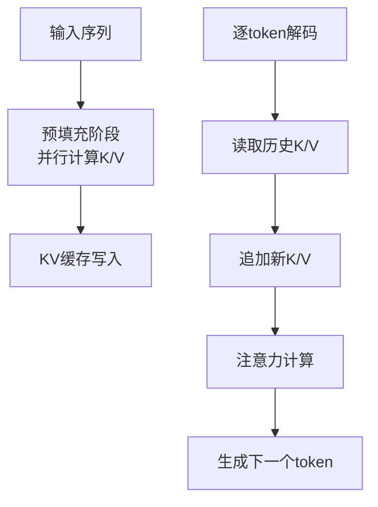
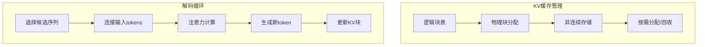
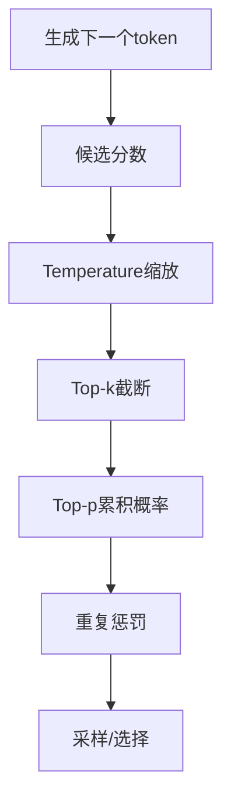
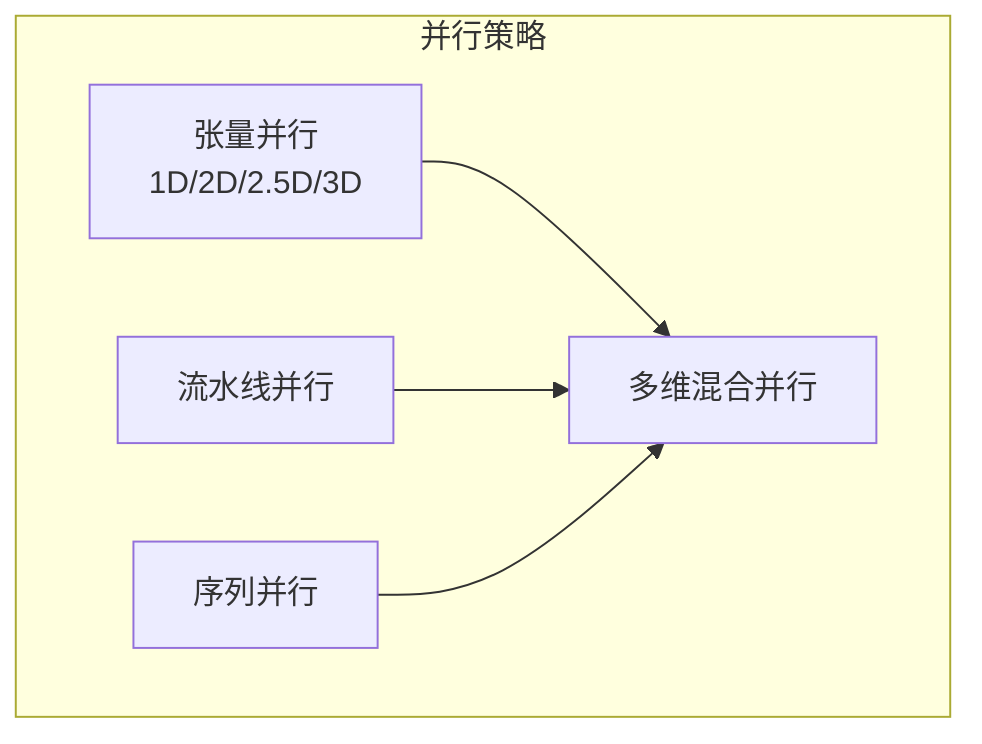
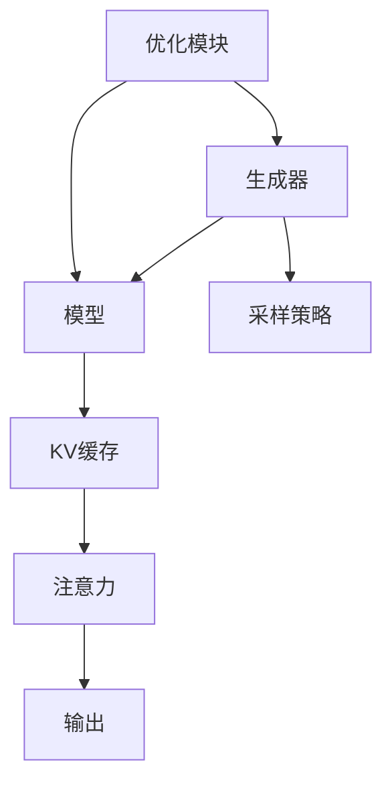

# llama3-from-scratch 项目

<cite>
**本文引用的文件**
- [README.md](file://README.md)
- [llama 3.md](file://02.大语言模型架构/llama 3/llama 3.md)
- [llama系列模型.md](file://02.大语言模型架构/llama系列模型/llama系列模型.md)
- [llm推理优化技术.md](file://06.推理/llm推理优化技术/llm推理优化技术.md)
- [1.vllm.md](file://06.推理/1.vllm/1.vllm.md)
- [3.faster_transformer.md](file://06.推理/3.faster_transformer/3.faster_transformer.md)
- [llm推理常见参数.md](file://06.推理/LLM推理常见参数/LLM推理常见参数.md)
- [4.张量并行.md](file://04.分布式训练/4.张量并行/4.张量并行.md)
- [9.总结.md](file://04.分布式训练/9.总结/9.总结.md)
- [llama 2代码详解.md](file://02.大语言模型架构/llama 2代码详解/llama 2代码详解.md)
</cite>

## 目录
1. [简介](#简介)
2. [项目结构](#项目结构)
3. [核心组件](#核心组件)
4. [架构概览](#架构概览)
5. [详细组件分析](#详细组件分析)
6. [依赖分析](#依赖分析)
7. [性能考虑](#性能考虑)
8. [故障排查指南](#故障排查指南)
9. [结论](#结论)
10. [附录](#附录)

## 简介
本项目旨在从零实现 Llama3，提供完整的架构实现、权重加载机制、推理优化与性能调优方案，帮助开发者在本地笔记本（16G 内存）环境下运行与调试。项目强调：
- 完整的 Llama3 架构实现（解码器-only、RMSNorm、SwiGLU、RoPE、GQA）
- Meta 官方权重兼容与加载策略
- 轻量级部署与推理优化（KV 缓存、分页注意力、连续批处理、量化等）
- 教育价值与实践意义：深入理解 Llama3 内部机制与实现细节

项目仓库与在线阅读链接详见根目录 README。

**章节来源**
- [README.md:1-169](file://README.md#L1-L169)

## 项目结构
本仓库为知识与面试题集合，包含 LLM 基础、架构、训练、推理、强化学习、RAG、评估与应用等主题。与本项目直接相关的知识分布在以下文档中：
- Llama3 架构与改进点
- 推理优化技术（KV 缓存、分页注意力、连续批处理、量化等）
- 分布式训练与并行策略（张量并行、流水线并行、序列并行）
- Llama2 代码详解（注意力、RoPE、GQA、KV 缓存等实现思路）

**图表来源**
- [README.md:1-169](file://README.md#L1-L169)
- [llama 3.md:1-110](file://02.大语言模型架构/llama 3/llama 3.md#L1-L110)
- [llm推理优化技术.md:1-271](file://06.推理/llm推理优化技术/llm推理优化技术.md#L1-L271)
- [1.vllm.md:1-220](file://06.推理/1.vllm/1.vllm.md#L1-L220)
- [3.faster_transformer.md:1-73](file://06.推理/3.faster_transformer/3.faster_transformer.md#L1-L73)
- [llm推理常见参数.md:1-183](file://06.推理/LLM推理常见参数/LLM推理常见参数.md#L1-L183)
- [4.张量并行.md:1-441](file://04.分布式训练/4.张量并行/4.张量并行.md#L1-L441)
- [9.总结.md:1-125](file://04.分布式训练/9.总结/9.总结.md#L1-L125)
- [llama 2代码详解.md:1-527](file://02.大语言模型架构/llama 2代码详解/llama 2代码详解.md#L1-L527)

**章节来源**
- [README.md:1-169](file://README.md#L1-L169)

## 核心组件
- Llama3 架构实现
  - 解码器-only 结构、RMSNorm、SwiGLU、RoPE、GQA
  - 词表大小与上下文长度、预训练数据与扩展法则
- 权重加载与兼容
  - Meta 官方权重格式适配、参数映射与加载流程
- 推理优化
  - KV 缓存、分页注意力（PagedAttention）、连续批处理（In-flight Batching）
  - 量化（INT8/FP16）、层融合、张量并行、流水线并行
- 性能调优
  - 采样策略（Top-k、Top-p、Temperature、重复惩罚）
  - 内存与带宽优化、激活重计算与共享

**章节来源**
- [llama 3.md:22-52](file://02.大语言模型架构/llama 3/llama 3.md#L22-L52)
- [llm推理优化技术.md:116-271](file://06.推理/llm推理优化技术/llm推理优化技术.md#L116-L271)
- [1.vllm.md:55-151](file://06.推理/1.vllm/1.vllm.md#L55-L151)
- [llm推理常见参数.md:99-183](file://06.推理/LLM推理常见参数/LLM推理常见参数.md#L99-L183)
- [4.张量并行.md:47-110](file://04.分布式训练/4.张量并行/4.张量并行.md#L47-L110)

## 架构概览
下图展示 Llama3 推理阶段的核心流程与优化点：

**图表来源**
- [llama 2代码详解.md:108-158](file://02.大语言模型架构/llama 2代码详解/llama 2代码详解.md#L108-L158)
- [llm推理优化技术.md:17-27](file://06.推理/llm推理优化技术/llm推理优化技术.md#L17-L27)
- [1.vllm.md:61-151](file://06.推理/1.vllm/1.vllm.md#L61-L151)
- [4.张量并行.md:47-110](file://04.分布式训练/4.张量并行/4.张量并行.md#L47-L110)

## 详细组件分析

### Llama3 架构与实现
- 解码器-only、RMSNorm、SwiGLU、RoPE、GQA
- 词表大小与上下文长度、预训练数据与扩展法则
- 与 Llama2 的差异（GQA、FFN 缩放、上下文长度翻倍）

**图表来源**
- [llama 3.md:22-52](file://02.大语言模型架构/llama 3/llama 3.md#L22-L52)
- [llama系列模型.md:100-156](file://02.大语言模型架构/llama系列模型/llama系列模型.md#L100-L156)

**章节来源**
- [llama 3.md:22-52](file://02.大语言模型架构/llama 3/llama 3.md#L22-L52)
- [llama系列模型.md:100-156](file://02.大语言模型架构/llama系列模型/llama系列模型.md#L100-L156)

### 权重加载与 Meta 兼容
- 适配官方权重格式、参数映射与加载流程
- 关键参数维度与缩放（hidden_dim、num_layers、num_heads、head_dim）
- 与 Llama2 代码中的 KV 缓存与 GQA 实现思路对照

**图表来源**
- [llama 2代码详解.md:413-481](file://02.大语言模型架构/llama 2代码详解/llama 2代码详解.md#L413-L481)
- [llama系列模型.md:17-96](file://02.大语言模型架构/llama系列模型/llama系列模型.md#L17-L96)

**章节来源**
- [llama 2代码详解.md:413-481](file://02.大语言模型架构/llama 2代码详解/llama 2代码详解.md#L413-L481)
- [llama系列模型.md:17-96](file://02.大语言模型架构/llama系列模型/llama系列模型.md#L17-L96)

### 推理优化与 KV 缓存
- 预填充阶段与解码阶段的差异（并行 vs 内存受限）
- KV 缓存的大小估算与内存瓶颈
- GQA 与 MQA 在 KV 缓存上的权衡

**图表来源**
- [llm推理优化技术.md:17-73](file://06.推理/llm推理优化技术/llm推理优化技术.md#L17-L73)
- [llama 2代码详解.md:333-481](file://02.大语言模型架构/llama 2代码详解/llama 2代码详解.md#L333-L481)

**章节来源**
- [llm推理优化技术.md:17-73](file://06.推理/llm推理优化技术/llm推理优化技术.md#L17-L73)
- [llama 2代码详解.md:333-481](file://02.大语言模型架构/llama 2代码详解/llama 2代码详解.md#L333-L481)

### 分页注意力（PagedAttention）与连续批处理
- PagedAttention 将 KV 缓存分块存储，提升内存使用效率
- 连续批处理（In-flight Batching）提升 GPU 利用率

**图表来源**
- [1.vllm.md:61-151](file://06.推理/1.vllm/1.vllm.md#L61-L151)

**章节来源**
- [1.vllm.md:61-151](file://06.推理/1.vllm/1.vllm.md#L61-L151)

### 采样策略与参数调优
- Greedy、Beam Search、Top-k、Top-p、Temperature、重复惩罚
- 参数对输出多样性与稳定性的影响

**图表来源**
- [llm推理常见参数.md:99-183](file://06.推理/LLM推理常见参数/LLM推理常见参数.md#L99-L183)

**章节来源**
- [llm推理常见参数.md:99-183](file://06.推理/LLM推理常见参数/LLM推理常见参数.md#L99-L183)

### 分布式训练与并行策略
- 张量并行（1D/2D/2.5D/3D）、流水线并行、序列并行
- 多维混合并行与自动并行

**图表来源**
- [4.张量并行.md:47-110](file://04.分布式训练/4.张量并行/4.张量并行.md#L47-L110)
- [9.总结.md:32-51](file://04.分布式训练/9.总结/9.总结.md#L32-L51)

**章节来源**
- [4.张量并行.md:47-110](file://04.分布式训练/4.张量并行/4.张量并行.md#L47-L110)
- [9.总结.md:32-51](file://04.分布式训练/9.总结/9.总结.md#L32-L51)

## 依赖分析
- 组件耦合
  - 生成器与模型：紧密耦合（预填充与解码阶段）
  - KV 缓存与注意力：强耦合（读取/追加/分页）
  - 采样策略与生成器：弱耦合（可插拔）
  - 并行与优化：模块化（量化、层融合、张量并行）
- 外部依赖
  - CUDA/cuDNN、NCCL、MPI（分布式）
  - vLLM、FasterTransformer（推理优化）
  - PyTorch/TensorRT（框架与编译器）

**图表来源**
- [llama 2代码详解.md:108-158](file://02.大语言模型架构/llama 2代码详解/llama 2代码详解.md#L108-L158)
- [1.vllm.md:89-151](file://06.推理/1.vllm/1.vllm.md#L89-L151)
- [3.faster_transformer.md:24-65](file://06.推理/3.faster_transformer/3.faster_transformer.md#L24-L65)

**章节来源**
- [llama 2代码详解.md:108-158](file://02.大语言模型架构/llama 2代码详解/llama 2代码详解.md#L108-L158)
- [1.vllm.md:89-151](file://06.推理/1.vllm/1.vllm.md#L89-L151)
- [3.faster_transformer.md:24-65](file://06.推理/3.faster_transformer/3.faster_transformer.md#L24-L65)

## 性能考虑
- 内存瓶颈与 KV 缓存
  - KV 缓存大小与批大小、序列长度线性相关
  - PagedAttention 降低内存浪费与碎片
- 计算瓶颈与优化
  - 层融合减少数据搬运
  - 量化（INT8/FP16）降低带宽与存储压力
  - 张量并行与流水线并行提升吞吐
- 推理吞吐与延迟
  - 连续批处理提升 GPU 利用率
  - 采样策略影响生成多样性与稳定性

**章节来源**
- [llm推理优化技术.md:47-115](file://06.推理/llm推理优化技术/llm推理优化技术.md#L47-L115)
- [1.vllm.md:55-151](file://06.推理/1.vllm/1.vllm.md#L55-L151)
- [3.faster_transformer.md:24-65](file://06.推理/3.faster_transformer/3.faster_transformer.md#L24-L65)

## 故障排查指南
- 显存不足
  - 降低批大小、序列长度或使用 PagedAttention
  - 启用量化（INT8/FP16）
- 生成重复或缺乏多样性
  - 调整 Temperature、Top-k、Top-p、重复惩罚
- 推理吞吐低
  - 启用连续批处理、层融合、张量并行
  - 检查注意力实现（FlashAttention、GQA）
- 权重加载失败
  - 校验参数映射与维度一致性
  - 确认权重文件格式与路径

**章节来源**
- [llm推理常见参数.md:99-183](file://06.推理/LLM推理常见参数/LLM推理常见参数.md#L99-L183)
- [1.vllm.md:55-151](file://06.推理/1.vllm/1.vllm.md#L55-L151)
- [llama 2代码详解.md:413-481](file://02.大语言模型架构/llama 2代码详解/llama 2代码详解.md#L413-L481)

## 结论
本项目通过完整实现 Llama3 架构、Meta 权重兼容与推理优化技术，为开发者在本地低资源环境下提供了深入理解与实践 Llama3 的路径。结合 KV 缓存、分页注意力、连续批处理、量化与并行策略，能够在 16G 内存笔记本上实现轻量级部署与高效推理。项目具备显著的教育价值与实践意义。

## 附录
- 项目仓库与在线阅读链接：见根目录 README
- 相关文档导航：见根目录 README 的目录结构

**章节来源**
- [README.md:1-169](file://README.md#L1-L169)