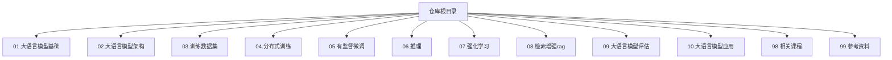
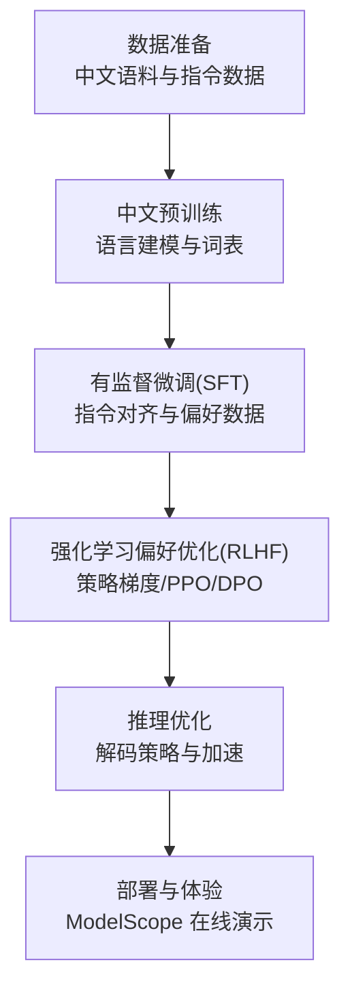
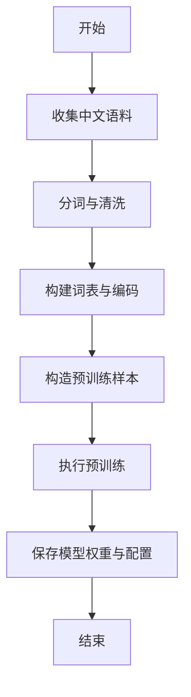
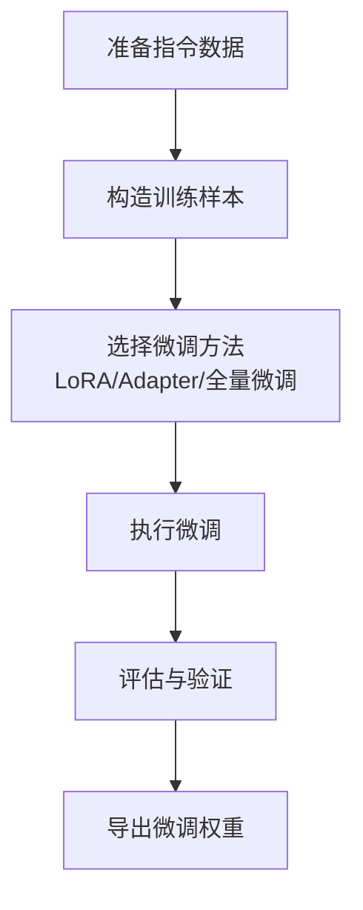
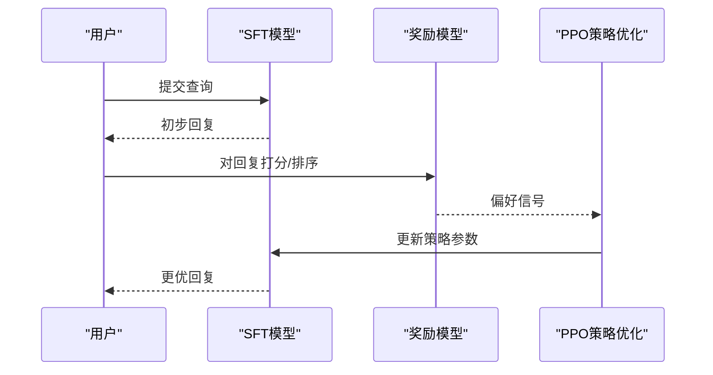
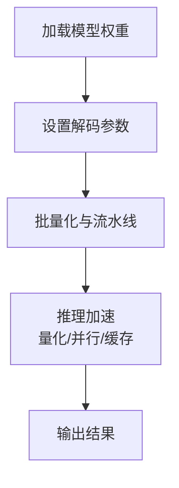
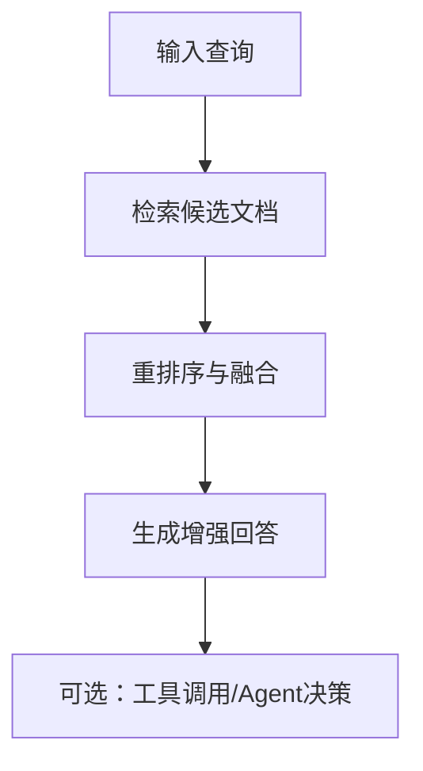
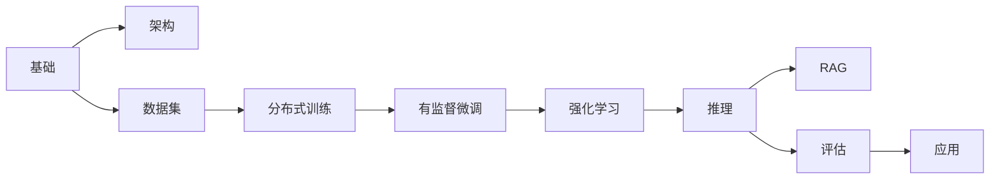

# tiny-llm-zh 项目

<cite>
**本文引用的文件**
- [README.md](file://README.md)
- [_navbar.md](file://_navbar.md)
- [01.大语言模型基础/README.md](file://01.大语言模型基础/README.md)
- [02.大语言模型架构/README.md](file://02.大语言模型架构/README.md)
- [03.训练数据集/README.md](file://03.训练数据集/README.md)
- [04.分布式训练/README.md](file://04.分布式训练/README.md)
- [05.有监督微调/README.md](file://05.有监督微调/README.md)
- [06.推理/README.md](file://06.推理/README.md)
- [07.强化学习/README.md](file://07.强化学习/README.md)
- [08.检索增强rag/README.md](file://08.检索增强rag/README.md)
- [09.大语言模型评估/README.md](file://09.大语言模型评估/README.md)
- [10.大语言模型应用/README.md](file://10.大语言模型应用/README.md)
- [98.相关课程/README.md](file://98.相关课程/README.md)
- [99.参考资料/README.md](file://99.参考资料/README.md)
</cite>

## 目录
1. [简介](#简介)
2. [项目结构](#项目结构)
3. [核心组件](#核心组件)
4. [架构总览](#架构总览)
5. [详细组件分析](#详细组件分析)
6. [依赖关系分析](#依赖关系分析)
7. [性能考量](#性能考量)
8. [故障排查指南](#故障排查指南)
9. [结论](#结论)
10. [附录](#附录)

## 简介
本项目为“tiny-llm-zh”实践仓库的配套知识体系，围绕小参数量中文大语言模型的完整训练与部署路径展开，目标是帮助在低资源环境下完成从零到一的大模型训练实践，涵盖中文预训练、有监督微调（SFT）、以及强化学习偏好优化（RLHF）的关键环节。项目已在 ModelScope 平台提供在线体验，同时提供 GitHub 仓库链接，便于学习者跟踪与复现。

- 在线体验地址：[ModelScope Tiny LLM](https://www.modelscope.cn/studios/wdndev/tiny_llm_92m_demo/summary)
- GitHub 仓库链接：[tiny-llm-zh](https://github.com/wdndev/tiny-llm-zh)

本知识库以章节形式组织，覆盖大模型基础、架构、数据集、分布式训练、有监督微调、推理、强化学习、检索增强、评估与应用等主题，便于初学者循序渐进地理解大模型训练全流程。

**章节来源**
- [README.md:1-32](file://README.md#L1-L32)
- [_navbar.md:1-5](file://_navbar.md#L1-L5)

## 项目结构
本仓库采用按主题分层的知识组织方式，每个主题下包含若干子章节与文档，便于系统学习与查阅。核心主题包括：
- 大语言模型基础
- 大语言模型架构
- 训练数据集
- 分布式训练
- 有监督微调
- 推理
- 强化学习
- 检索增强RAG
- 大语言模型评估
- 大语言模型应用
- 相关课程
- 参考资料

**图表来源**
- [README.md:37-169](file://README.md#L37-L169)

**章节来源**
- [README.md:37-169](file://README.md#L37-L169)

## 核心组件
本知识库围绕以下关键能力模块组织内容，适配 tiny-llm-zh 的完整训练与部署流程：
- 中文预训练：涵盖中文分词、词表构建、数据格式与预训练策略
- 有监督微调（SFT）：指令微调、prompt 工程、LoRA/Adapter 等高效微调方法
- 强化学习偏好优化（RLHF）：策略梯度、PPO、DPO 等方法
- 推理优化：解码策略、推理框架与加速技术
- 检索增强（RAG）：多路召回、重排序与 Agent 应用
- 评估与应用：评测指标、幻觉缓解与思维链提示等

这些模块在各主题文档中逐步展开，形成从理论到实践的闭环。

**章节来源**
- [01.大语言模型基础/README.md:1-36](file://01.大语言模型基础/README.md#L1-L36)
- [02.大语言模型架构/README.md:1-52](file://02.大语言模型架构/README.md#L1-L52)
- [03.训练数据集/README.md:1-8](file://03.训练数据集/README.md#L1-L8)
- [04.分布式训练/README.md:1-106](file://04.分布式训练/README.md#L1-L106)
- [05.有监督微调/README.md:1-119](file://05.有监督微调/README.md#L1-L119)
- [06.推理/README.md:1-133](file://06.推理/README.md#L1-L133)
- [07.强化学习/README.md:1-143](file://07.强化学习/README.md#L1-L143)
- [08.检索增强rag/README.md:1-149](file://08.检索增强rag/README.md#L1-L149)
- [09.大语言模型评估/README.md:1-155](file://09.大语言模型评估/README.md#L1-L155)
- [10.大语言模型应用/README.md:1-159](file://10.大语言模型应用/README.md#L1-L159)

## 架构总览
下图展示了 tiny-llm-zh 从数据准备到模型上线的总体流程，包括中文预训练、SFT、RLHF、推理与部署等阶段。该流程图用于帮助初学者建立全局视角，理解各阶段之间的衔接关系。

[此图为概念性流程示意，不直接映射具体源文件，故无图表来源]

## 详细组件分析

### 中文预训练
- 中文分词与词表：jieba 分词用法与原理、中文词性标注、句法分析等基础能力
- 预训练策略：语言模型训练、位置编码、注意力机制、激活函数等
- 数据格式：统一的数据格式规范，确保训练一致性

[此图为概念性流程示意，不直接映射具体源文件，故无图表来源]

**章节来源**
- [01.大语言模型基础/README.md:1-36](file://01.大语言模型基础/README.md#L1-L36)
- [02.大语言模型架构/README.md:1-52](file://02.大语言模型架构/README.md#L1-L52)

### 有监督微调（SFT）
- 指令微调：通过指令-响应对提升模型对齐能力
- prompt 工程：高质量 prompt 设计与模板化
- 高效微调：LoRA、Adapter 等参数高效微调方法
- 实战案例：llama2/ChatGLM3 等模型的微调实践

[此图为概念性流程示意，不直接映射具体源文件，故无图表来源]

**章节来源**
- [05.有监督微调/README.md:1-119](file://05.有监督微调/README.md#L1-L119)

### 强化学习偏好优化（RLHF）
- 策略梯度与 PPO：策略优化与偏好建模
- DPO：直接偏好优化方法
- 人类反馈：偏好数据采集与标注

[此图为概念性流程示意，不直接映射具体源文件，故无图表来源]

**章节来源**
- [07.强化学习/README.md:1-143](file://07.强化学习/README.md#L1-L143)

### 推理与部署
- 解码策略：Top-k、Top-p、Temperature 等
- 推理框架：vLLM、text-generation-inference、faster-transformer、TRT-LLM 等
- 量化与加速：模型压缩与推理优化技术

[此图为概念性流程示意，不直接映射具体源文件，故无图表来源]

**章节来源**
- [06.推理/README.md:1-133](file://06.推理/README.md#L1-L133)

### 检索增强（RAG）与应用
- RAG 技术：多路召回、重排序与检索增强生成
- Agent 应用：基于工具调用与思维链的智能体
- LangChain 框架：提示工程与链式编排

[此图为概念性流程示意，不直接映射具体源文件，故无图表来源]

**章节来源**
- [08.检索增强rag/README.md:1-149](file://08.检索增强rag/README.md#L1-L149)
- [10.大语言模型应用/README.md:1-159](file://10.大语言模型应用/README.md#L1-L159)

## 依赖关系分析
本知识库以主题为单位组织，主题之间存在递进与交叉关系：
- 基础先行：大语言模型基础与架构为后续训练与应用奠定理论基础
- 训练支撑：数据集、分布式训练、有监督微调、强化学习构成训练闭环
- 应用落地：推理、RAG、评估与应用体现模型的实际价值

[此图为概念性依赖示意，不直接映射具体源文件，故无图表来源]

## 性能考量
- 显存与吞吐：分布式训练中的数据并行、流水线并行、张量并行等策略
- 推理加速：解码策略、推理框架与量化技术
- 数据质量：中文语料清洗、指令数据构造与偏好标注的一致性
- 模型规模：在满足任务需求的前提下控制参数规模，降低资源消耗

[本节为通用指导，不直接分析具体文件，故无章节来源]

## 故障排查指南
- 数据问题：检查数据格式是否符合规范，确认中文分词与词表构建正确
- 训练问题：核对分布式训练配置、批次大小与学习率设置
- 微调问题：确认指令数据质量与微调方法选择
- 推理问题：检查解码参数与推理框架版本兼容性
- 评估问题：明确评测指标与基准数据集

[本节为通用指导，不直接分析具体文件，故无章节来源]

## 结论
tiny-llm-zh 实践项目通过系统化的知识组织与循序渐进的学习路径，帮助初学者在低资源条件下完成中文大模型的预训练、微调与 RLHF 全流程实践，并结合在线体验与实战案例，提升对大模型训练与部署的理解与动手能力。

[本节为总结性内容，不直接分析具体文件，故无章节来源]

## 附录
- 在线阅读链接：[LLMs Interview Note](http://wdndev.github.io/llm_interview_note)
- ModelScope 在线体验：[ModelScope Tiny LLM](https://www.modelscope.cn/studios/wdndev/tiny_llm_92m_demo/summary)
- GitHub 仓库：[tiny-llm-zh](https://github.com/wdndev/tiny-llm-zh)

**章节来源**
- [README.md:23-32](file://README.md#L23-L32)
- [_navbar.md:3-5](file://_navbar.md#L3-L5)