# tiny-mcp 项目

<cite>
**本文档引用的文件**
- [README.md](file://README.md)
- [大模型agent技术.md](file://08.检索增强rag/大模型agent技术/大模型agent技术.md)
- [检索增强llm.md](file://08.检索增强rag/检索增强llm/检索增强llm.md)
- [2.prompting.md](file://05.有监督微调/2.prompting/2.prompting.md)
- [119:119-153](file://07.强化学习/1.rlhf相关/1.rlhf相关.md#L119-L153)
</cite>

## 目录
1. [项目简介](#项目简介)
2. [项目结构](#项目结构)
3. [核心组件](#核心组件)
4. [架构概览](#架构概览)
5. [详细组件分析](#详细组件分析)
6. [MCP协议实现](#mcp协议实现)
7. [Function Calling应用](#function-calling应用)
8. [Agent智能体构建](#agent智能体构建)
9. [技术亮点](#技术亮点)
10. [使用示例](#使用示例)
11. [性能考虑](#性能考虑)
12. [故障排除指南](#故障排除指南)
13. [结论](#结论)

## 项目简介

tiny-mcp是一个基于MCP（模型上下文协议）的Agent项目实现，专注于使用Prompt和Function Calling技术构建智能体。该项目由wdndev开发，旨在提供一个轻量级但功能完整的MCP协议实现，帮助开发者快速搭建基于MCP的智能体应用。

### 项目特色

- **轻量级实现**：基于MCP协议的精简实现，易于理解和扩展
- **Prompt工程**：充分利用Prompt技术进行智能体行为控制
- **Function Calling**：集成Function Calling能力，实现外部工具调用
- **Agent构建**：提供完整的Agent开发框架和最佳实践

**章节来源**
- [README.md:10-13](file://README.md#L10-L13)

## 项目结构

tiny-mcp项目采用模块化设计，主要包含以下核心模块：

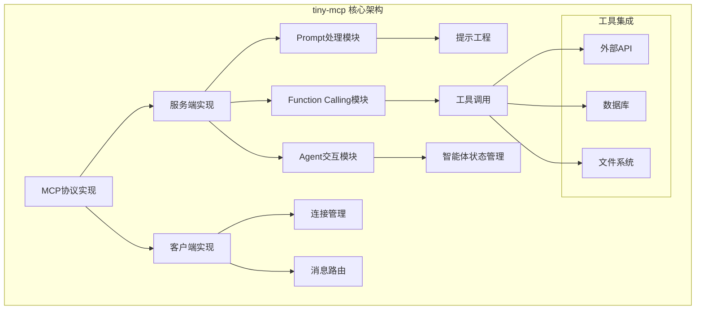
```mermaid
graph TB
subgraph "tiny-mcp 核心架构"
A[MCP协议实现] --> B[服务端实现]
A --> C[客户端实现]
B --> D[Prompt处理模块]
B --> E[Function Calling模块]
B --> F[Agent交互模块]
C --> G[连接管理]
C --> H[消息路由]
D --> I[提示工程]
E --> J[工具调用]
F --> K[智能体状态管理]
subgraph "工具集成"
L[外部API]
M[数据库]
N[文件系统]
end
J --> L
J --> M
J --> N
end
```

**图表来源**
- [README.md:10-13](file://README.md#L10-L13)

### 核心模块说明

1. **MCP协议实现**：提供标准的MCP协议支持
2. **服务端实现**：处理智能体请求和响应
3. **客户端实现**：管理智能体连接和通信
4. **Prompt处理模块**：优化和管理提示工程
5. **Function Calling模块**：实现外部工具调用
6. **Agent交互模块**：管理智能体生命周期

## 核心组件

### MCP协议实现

MCP（模型上下文协议）是tiny-mcp项目的核心基础，提供标准化的智能体通信接口。

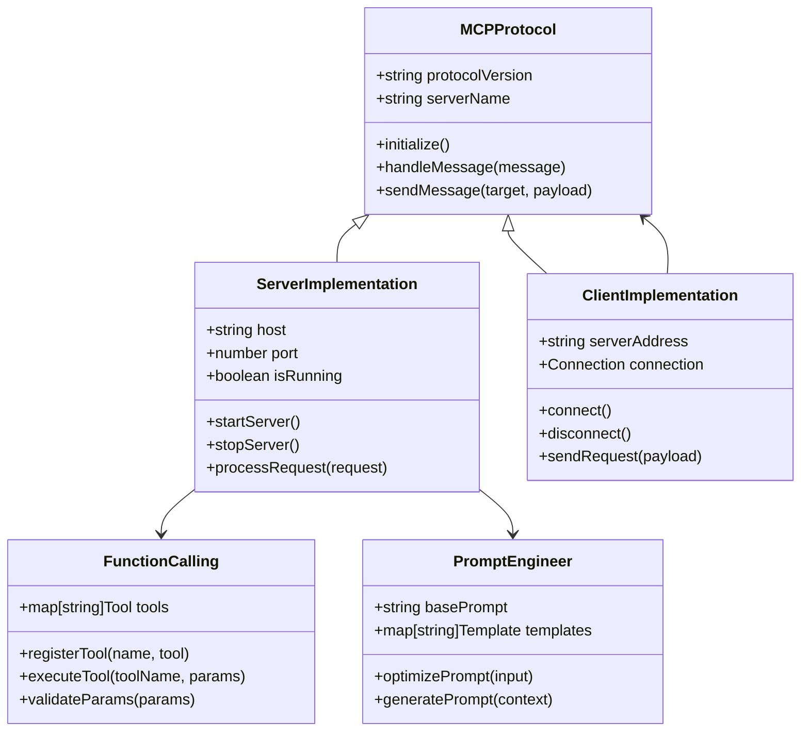
```mermaid
classDiagram
class MCPProtocol {
+string protocolVersion
+string serverName
+initialize()
+handleMessage(message)
+sendMessage(target, payload)
}
class ServerImplementation {
+string host
+number port
+boolean isRunning
+startServer()
+stopServer()
+processRequest(request)
}
class ClientImplementation {
+string serverAddress
+Connection connection
+connect()
+disconnect()
+sendRequest(payload)
}
class FunctionCalling {
+map[string]Tool tools
+registerTool(name, tool)
+executeTool(toolName, params)
+validateParams(params)
}
class PromptEngineer {
+string basePrompt
+map[string]Template templates
+optimizePrompt(input)
+generatePrompt(context)
}
MCPProtocol <|-- ServerImplementation
MCPProtocol <|-- ClientImplementation
ServerImplementation --> FunctionCalling
ServerImplementation --> PromptEngineer
ClientImplementation --> MCPProtocol
```

**图表来源**
- [README.md:10-13](file://README.md#L10-L13)

### 服务端架构

服务端实现负责处理来自客户端的请求，管理智能体状态，并协调各种功能调用。

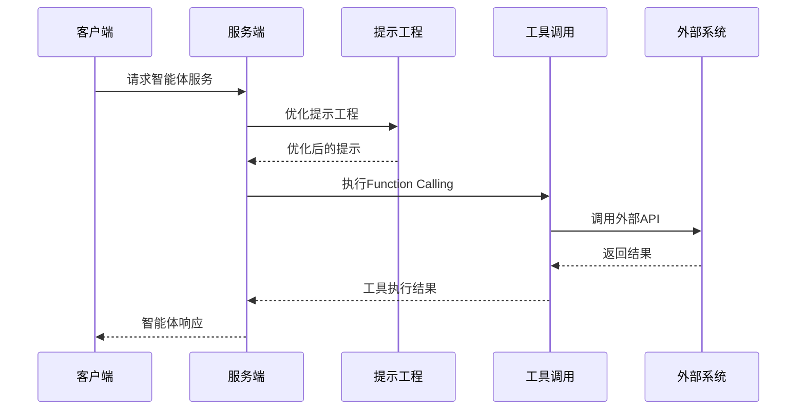
```mermaid
sequenceDiagram
participant Client as 客户端
participant Server as 服务端
participant Prompt as 提示工程
participant Tool as 工具调用
participant External as 外部系统
Client->>Server : 请求智能体服务
Server->>Prompt : 优化提示工程
Prompt-->>Server : 优化后的提示
Server->>Tool : 执行Function Calling
Tool->>External : 调用外部API
External-->>Tool : 返回结果
Tool-->>Server : 工具执行结果
Server-->>Client : 智能体响应
```

**图表来源**
- [大模型agent技术.md:118](file://08.检索增强rag/大模型agent技术/大模型agent技术.md#L118)

**章节来源**
- [README.md:10-13](file://README.md#L10-L13)

## 架构概览

tiny-mcp采用分层架构设计，确保系统的可扩展性和可维护性。

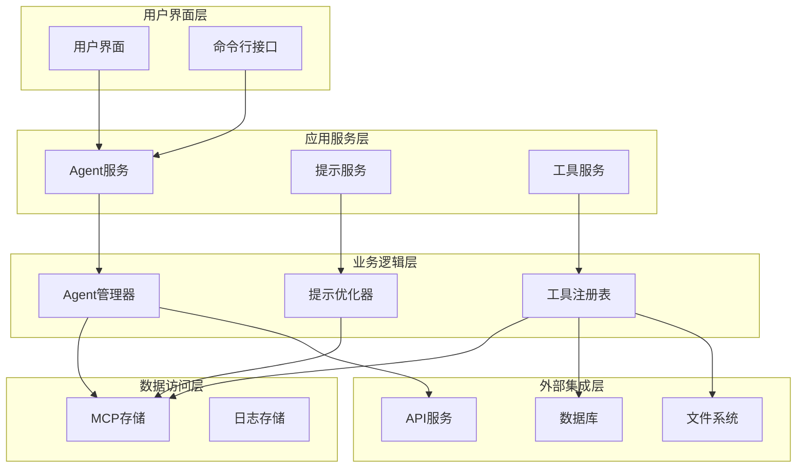
```mermaid
graph TB
subgraph "用户界面层"
UI[用户界面]
CLI[命令行接口]
end
subgraph "应用服务层"
AgentService[Agent服务]
PromptService[提示服务]
ToolService[工具服务]
end
subgraph "业务逻辑层"
AgentManager[Agent管理器]
PromptOptimizer[提示优化器]
ToolRegistry[工具注册表]
end
subgraph "数据访问层"
MCPStorage[MCP存储]
LogStorage[日志存储]
end
subgraph "外部集成层"
APIServices[API服务]
Database[数据库]
Filesystem[文件系统]
end
UI --> AgentService
CLI --> AgentService
AgentService --> AgentManager
PromptService --> PromptOptimizer
ToolService --> ToolRegistry
AgentManager --> MCPStorage
PromptOptimizer --> MCPStorage
ToolRegistry --> MCPStorage
AgentManager --> APIServices
ToolRegistry --> Database
ToolRegistry --> Filesystem
```

**图表来源**
- [大模型agent技术.md:118](file://08.检索增强rag/大模型agent技术/大模型agent技术.md#L118)

## 详细组件分析

### Prompt工程模块

Prompt工程是tiny-mcp项目的核心技术之一，通过精心设计的提示模板来控制智能体的行为。

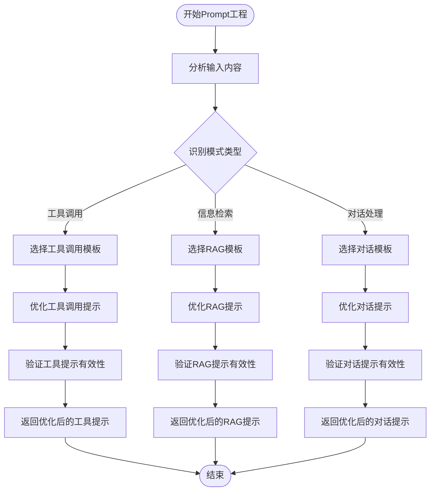
```mermaid
flowchart TD
Start([开始Prompt工程]) --> AnalyzeInput["分析输入内容"]
AnalyzeInput --> IdentifyPattern{"识别模式类型"}
IdentifyPattern --> |工具调用| SelectToolTemplate["选择工具调用模板"]
IdentifyPattern --> |信息检索| SelectRAGTemplate["选择RAG模板"]
IdentifyPattern --> |对话处理| SelectChatTemplate["选择对话模板"]
SelectToolTemplate --> OptimizeToolPrompt["优化工具调用提示"]
SelectRAGTemplate --> OptimizeRAGPrompt["优化RAG提示"]
SelectChatTemplate --> OptimizeChatPrompt["优化对话提示"]
OptimizeToolPrompt --> ValidateToolPrompt["验证工具提示有效性"]
OptimizeRAGPrompt --> ValidateRAGPrompt["验证RAG提示有效性"]
OptimizeChatPrompt --> ValidateChatPrompt["验证对话提示有效性"]
ValidateToolPrompt --> ReturnToolPrompt["返回优化后的工具提示"]
ValidateRAGPrompt --> ReturnRAGPrompt["返回优化后的RAG提示"]
ValidateChatPrompt --> ReturnChatPrompt["返回优化后的对话提示"]
ReturnToolPrompt --> End([结束])
ReturnRAGPrompt --> End
ReturnChatPrompt --> End
```

**图表来源**
- [2.prompting.md:75-173](file://05.有监督微调/2.prompting/2.prompting.md#L75-L173)

### Function Calling实现

Function Calling是tiny-mcp项目的关键特性，允许智能体调用外部工具和API。

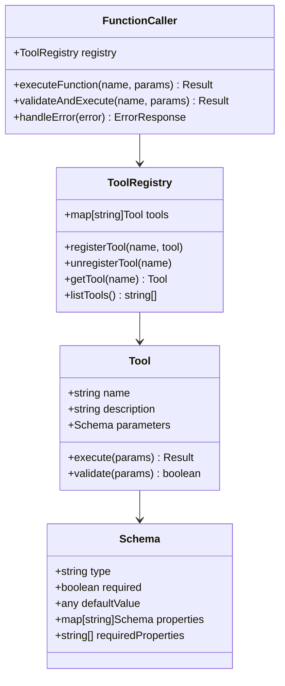
```mermaid
classDiagram
class Tool {
+string name
+string description
+Schema parameters
+execute(params) Result
+validate(params) boolean
}
class ToolRegistry {
+map[string]Tool tools
+registerTool(name, tool)
+unregisterTool(name)
+getTool(name) Tool
+listTools() string[]
}
class FunctionCaller {
+ToolRegistry registry
+executeFunction(name, params) Result
+validateAndExecute(name, params) Result
+handleError(error) ErrorResponse
}
class Schema {
+string type
+boolean required
+any defaultValue
+map[string]Schema properties
+string[] requiredProperties
}
ToolRegistry --> Tool
FunctionCaller --> ToolRegistry
Tool --> Schema
```

**图表来源**
- [大模型agent技术.md:118](file://08.检索增强rag/大模型agent技术/大模型agent技术.md#L118)

**章节来源**
- [2.prompting.md:75-173](file://05.有监督微调/2.prompting/2.prompting.md#L75-L173)
- [大模型agent技术.md:118](file://08.检索增强rag/大模型agent技术/大模型agent技术.md#L118)

### Agent交互机制

Agent交互机制是tiny-mcp项目的核心，实现了智能体与外部世界的交互。

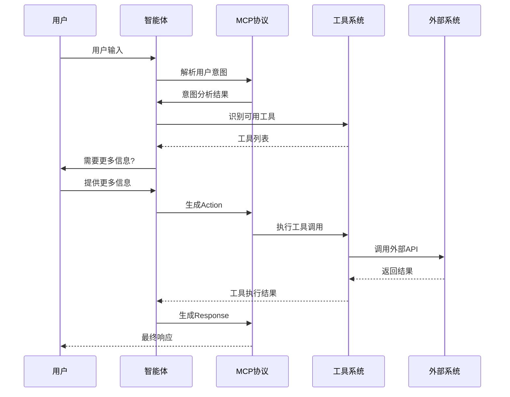
```mermaid
sequenceDiagram
participant User as 用户
participant Agent as 智能体
participant MCP as MCP协议
participant Tools as 工具系统
participant External as 外部系统
User->>Agent : 用户输入
Agent->>MCP : 解析用户意图
MCP->>Agent : 意图分析结果
Agent->>Tools : 识别可用工具
Tools-->>Agent : 工具列表
Agent->>User : 需要更多信息?
User->>Agent : 提供更多信息
Agent->>MCP : 生成Action
MCP->>Tools : 执行工具调用
Tools->>External : 调用外部API
External-->>Tools : 返回结果
Tools-->>Agent : 工具执行结果
Agent->>MCP : 生成Response
MCP-->>User : 最终响应
```

**图表来源**
- [大模型agent技术.md:108-118](file://08.检索增强rag/大模型agent技术/大模型agent技术.md#L108-L118)

**章节来源**
- [大模型agent技术.md:108-118](file://08.检索增强rag/大模型agent技术/大模型agent技术.md#L108-L118)

## MCP协议实现

### 协议规范

MCP协议为智能体提供了标准化的通信接口，确保不同组件之间的互操作性。

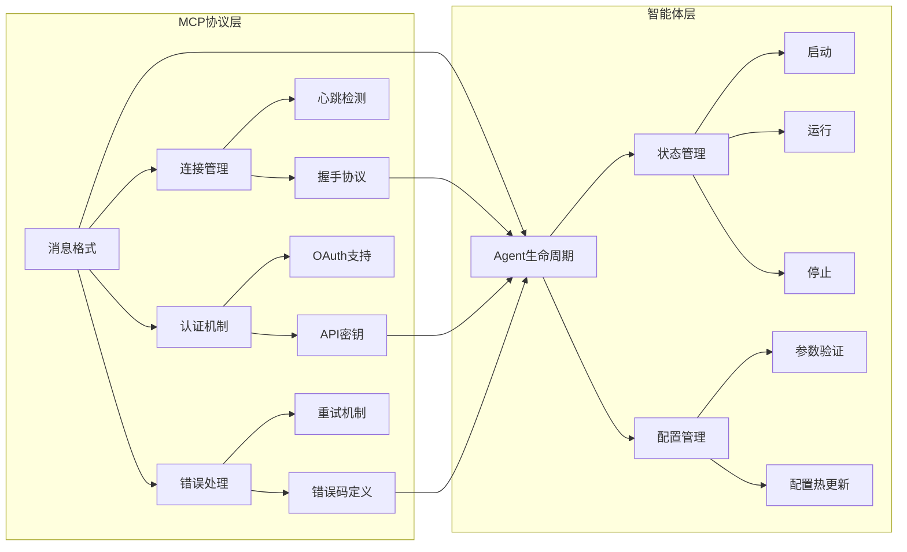
```mermaid
graph LR
subgraph "MCP协议层"
A[消息格式] --> B[连接管理]
A --> C[认证机制]
A --> D[错误处理]
B --> E[握手协议]
B --> F[心跳检测]
C --> G[API密钥]
C --> H[OAuth支持]
D --> I[错误码定义]
D --> J[重试机制]
end
subgraph "智能体层"
K[Agent生命周期] --> L[状态管理]
K --> M[配置管理]
L --> N[启动]
L --> O[运行]
L --> P[停止]
M --> Q[参数验证]
M --> R[配置热更新]
end
A --> K
E --> K
G --> K
I --> K
```

**图表来源**
- [README.md:10-13](file://README.md#L10-L13)

### 服务端实现

服务端实现负责处理来自客户端的请求，管理智能体状态，并协调各种功能调用。

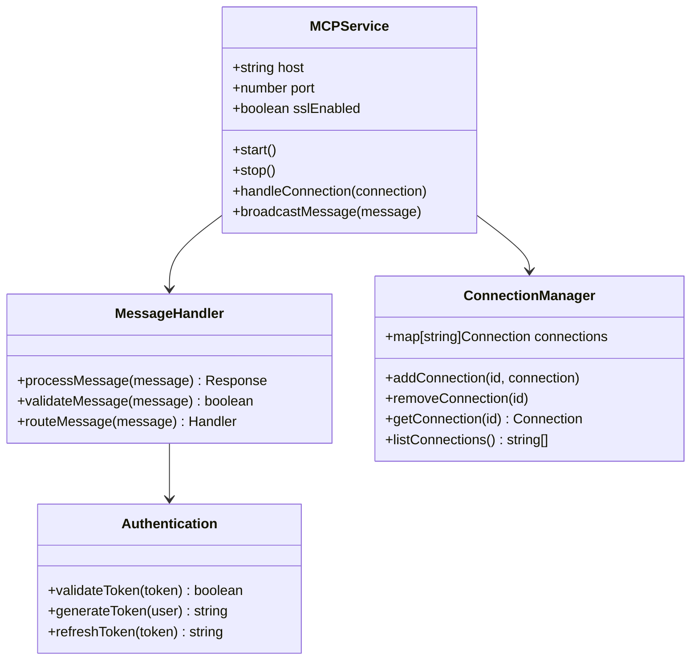
```mermaid
classDiagram
class MCPService {
+string host
+number port
+boolean sslEnabled
+start()
+stop()
+handleConnection(connection)
+broadcastMessage(message)
}
class MessageHandler {
+processMessage(message) Response
+validateMessage(message) boolean
+routeMessage(message) Handler
}
class ConnectionManager {
+map[string]Connection connections
+addConnection(id, connection)
+removeConnection(id)
+getConnection(id) Connection
+listConnections() string[]
}
class Authentication {
+validateToken(token) boolean
+generateToken(user) string
+refreshToken(token) string
}
MCPService --> MessageHandler
MCPService --> ConnectionManager
MessageHandler --> Authentication
```

**图表来源**
- [README.md:10-13](file://README.md#L10-L13)

**章节来源**
- [README.md:10-13](file://README.md#L10-L13)

## Function Calling应用

### 工具注册与管理

Function Calling功能通过工具注册表实现，支持动态工具管理和调用。

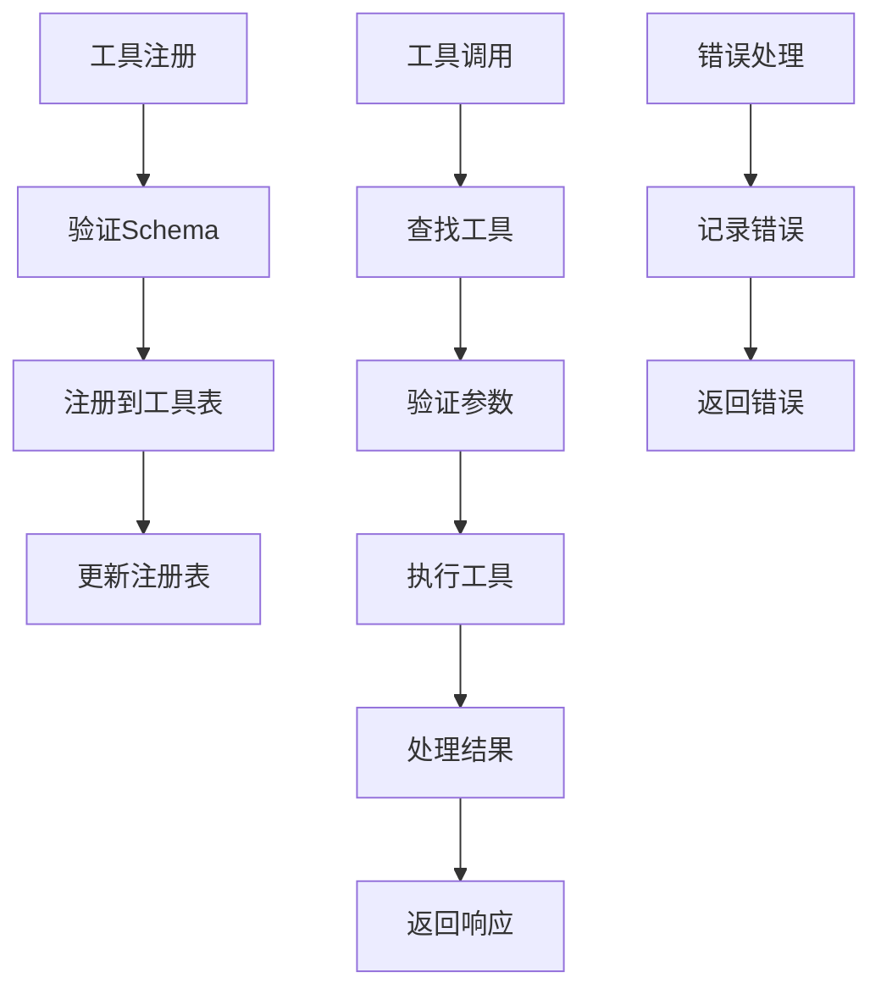
```mermaid
flowchart TD
ToolRegistration[工具注册] --> ValidateSchema[验证Schema]
ValidateSchema --> RegisterTool[注册到工具表]
RegisterTool --> UpdateRegistry[更新注册表]
ToolCall[工具调用] --> LookupTool[查找工具]
LookupTool --> ValidateParams[验证参数]
ValidateParams --> ExecuteTool[执行工具]
ExecuteTool --> HandleResult[处理结果]
HandleResult --> ReturnResponse[返回响应]
ErrorHandling[错误处理] --> LogError[记录错误]
LogError --> ReturnError[返回错误]
```

**图表来源**
- [大模型agent技术.md:118](file://08.检索增强rag/大模型agent技术/大模型agent技术.md#L118)

### 工具调用流程

工具调用流程确保了智能体与外部系统的安全交互。

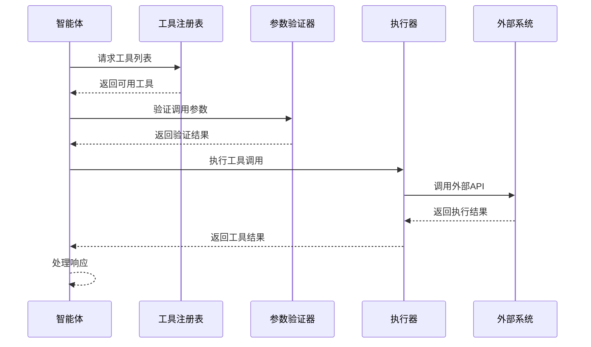
```mermaid
sequenceDiagram
participant Agent as 智能体
participant Registry as 工具注册表
participant Validator as 参数验证器
participant Executor as 执行器
participant External as 外部系统
Agent->>Registry : 请求工具列表
Registry-->>Agent : 返回可用工具
Agent->>Validator : 验证调用参数
Validator-->>Agent : 返回验证结果
Agent->>Executor : 执行工具调用
Executor->>External : 调用外部API
External-->>Executor : 返回执行结果
Executor-->>Agent : 返回工具结果
Agent-->>Agent : 处理响应
```

**图表来源**
- [大模型agent技术.md:118](file://08.检索增强rag/大模型agent技术/大模型agent技术.md#L118)

**章节来源**
- [大模型agent技术.md:118](file://08.检索增强rag/大模型agent技术/大模型agent技术.md#L118)

## Agent智能体构建

### Agent生命周期管理

智能体的生命周期管理确保了智能体的稳定运行和状态一致性。

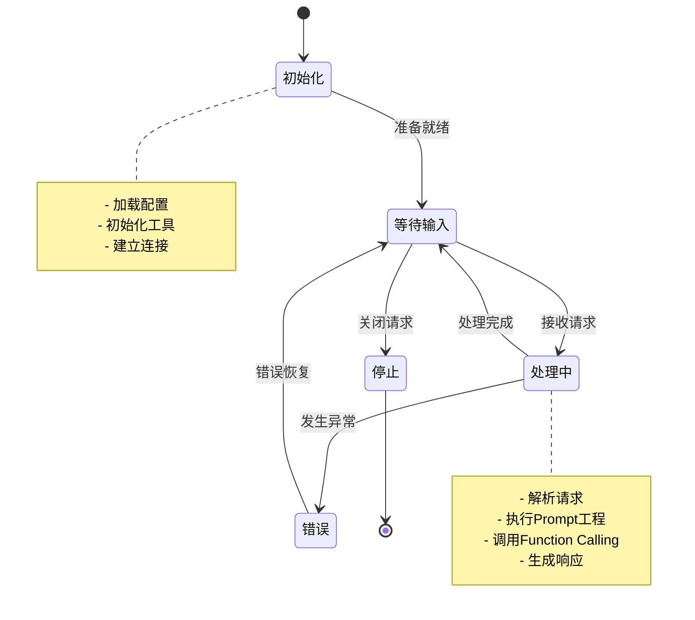
```mermaid
stateDiagram-v2
[*] --> 初始化
初始化 --> 等待输入 : 准备就绪
等待输入 --> 处理中 : 接收请求
处理中 --> 等待输入 : 处理完成
处理中 --> 错误 : 发生异常
错误 --> 等待输入 : 错误恢复
等待输入 --> 停止 : 关闭请求
停止 --> [*]
note right of 初始化
- 加载配置
- 初始化工具
- 建立连接
end note
note right of 处理中
- 解析请求
- 执行Prompt工程
- 调用Function Calling
- 生成响应
end note
```

**图表来源**
- [大模型agent技术.md:122-176](file://08.检索增强rag/大模型agent技术/大模型agent技术.md#L122-L176)

### 智能体状态管理

智能体状态管理确保了智能体在不同操作之间的状态一致性。

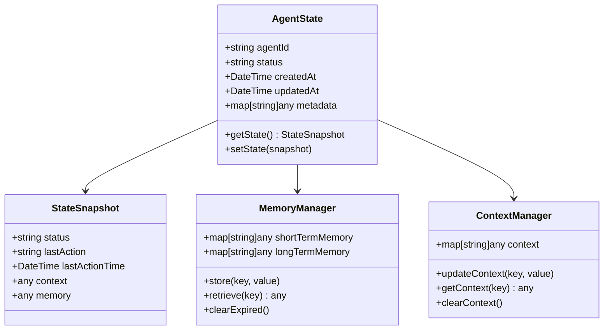
```mermaid
classDiagram
class AgentState {
+string agentId
+string status
+DateTime createdAt
+DateTime updatedAt
+map[string]any metadata
+getState() StateSnapshot
+setState(snapshot)
}
class StateSnapshot {
+string status
+string lastAction
+DateTime lastActionTime
+any context
+any memory
}
class MemoryManager {
+map[string]any shortTermMemory
+map[string]any longTermMemory
+store(key, value)
+retrieve(key) any
+clearExpired()
}
class ContextManager {
+map[string]any context
+updateContext(key, value)
+getContext(key) any
+clearContext()
}
AgentState --> StateSnapshot
AgentState --> MemoryManager
AgentState --> ContextManager
```

**图表来源**
- [大模型agent技术.md:122-176](file://08.检索增强rag/大模型agent技术/大模型agent技术.md#L122-L176)

**章节来源**
- [大模型agent技术.md:122-176](file://08.检索增强rag/大模型agent技术/大模型agent技术.md#L122-L176)

## 技术亮点

### 1. MCP协议实现

tiny-mcp项目的核心技术亮点之一是其对MCP协议的完整实现，提供了标准化的智能体通信接口。

**技术创新点**：
- 标准化的消息格式和协议规范
- 完整的连接管理和认证机制
- 高效的消息路由和处理系统
- 健壮的错误处理和恢复机制

### 2. Function Calling应用

项目实现了先进的Function Calling功能，允许智能体调用外部工具和API。

**技术优势**：
- 动态工具注册和管理
- 参数验证和类型检查
- 异步工具执行和结果处理
- 错误处理和重试机制

### 3. Prompt工程优化

通过精心设计的Prompt工程模块，tiny-mcp能够优化智能体的行为和响应质量。

**优化策略**：
- 多种提示模板和策略
- 动态提示生成和优化
- 上下文感知的提示处理
- 性能监控和调优

### 4. Agent智能体构建

项目提供了完整的Agent智能体构建框架，支持复杂的智能体应用场景。

**构建特性**：
- 生命周期管理
- 状态持久化
- 内存和上下文管理
- 多智能体协调

**章节来源**
- [大模型agent技术.md:118](file://08.检索增强rag/大模型agent技术/大模型agent技术.md#L118)

## 使用示例

### 基础Agent创建

以下是一个简单的Agent创建示例：

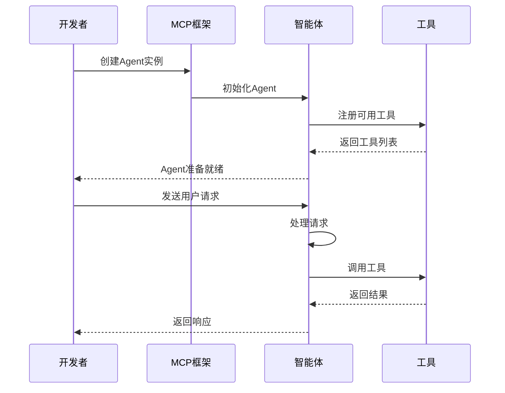
```mermaid
sequenceDiagram
participant Dev as 开发者
participant MCP as MCP框架
participant Agent as 智能体
participant Tool as 工具
Dev->>MCP : 创建Agent实例
MCP->>Agent : 初始化Agent
Agent->>Tool : 注册可用工具
Tool-->>Agent : 返回工具列表
Agent-->>Dev : Agent准备就绪
Dev->>Agent : 发送用户请求
Agent->>Agent : 处理请求
Agent->>Tool : 调用工具
Tool-->>Agent : 返回结果
Agent-->>Dev : 返回响应
```

### Function Calling集成

工具调用的完整流程：

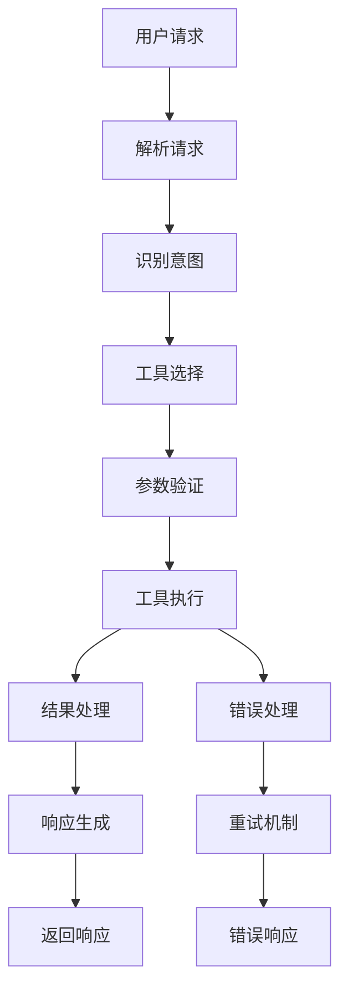
```mermaid
flowchart TD
Request[用户请求] --> Parse[解析请求]
Parse --> Identify[识别意图]
Identify --> ToolSelection[工具选择]
ToolSelection --> ParamValidation[参数验证]
ParamValidation --> ToolExecution[工具执行]
ToolExecution --> ResultProcessing[结果处理]
ResultProcessing --> ResponseGeneration[响应生成]
ResponseGeneration --> Response[返回响应]
ToolExecution --> ErrorHandling[错误处理]
ErrorHandling --> Retry[重试机制]
Retry --> ErrorResponse[错误响应]
```

**图表来源**
- [大模型agent技术.md:118](file://08.检索增强rag/大模型agent技术/大模型agent技术.md#L118)

## 性能考虑

### 1. 并发处理

tiny-mcp项目采用异步并发处理机制，支持高并发的智能体请求处理。

**性能优化**：
- 异步I/O操作
- 连接池管理
- 资源池化
- 内存优化

### 2. 缓存策略

通过合理的缓存策略提升系统性能和响应速度。

**缓存机制**：
- 工具调用结果缓存
- 提示模板缓存
- 配置信息缓存
- 预计算结果缓存

### 3. 监控和调优

实时监控系统性能，及时发现和解决性能瓶颈。

**监控指标**：
- 请求延迟
- 并发连接数
- 工具调用成功率
- 内存使用率
- CPU使用率

## 故障排除指南

### 常见问题诊断

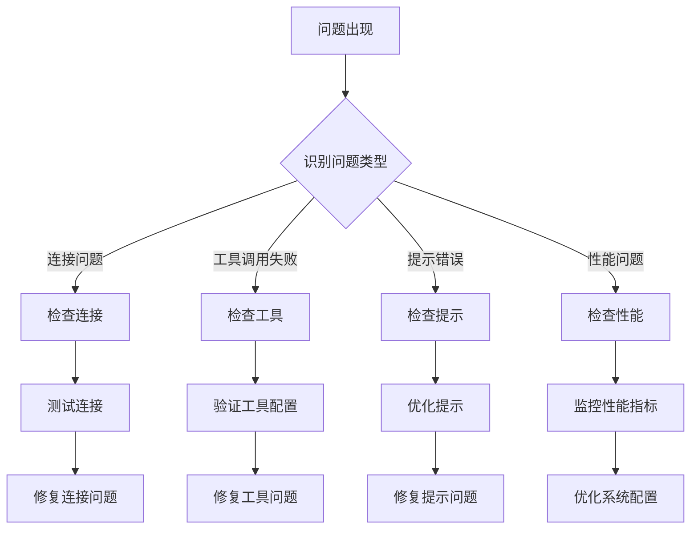
```mermaid
flowchart TD
Issue[问题出现] --> IdentifyIssue{识别问题类型}
IdentifyIssue --> |连接问题| CheckConnection[检查连接]
IdentifyIssue --> |工具调用失败| CheckTool[检查工具]
IdentifyIssue --> |提示错误| CheckPrompt[检查提示]
IdentifyIssue --> |性能问题| CheckPerformance[检查性能]
CheckConnection --> TestConnection[测试连接]
TestConnection --> FixConnection[修复连接问题]
CheckTool --> ValidateTool[验证工具配置]
ValidateTool --> FixTool[修复工具问题]
CheckPrompt --> OptimizePrompt[优化提示]
OptimizePrompt --> FixPrompt[修复提示问题]
CheckPerformance --> MonitorMetrics[监控性能指标]
MonitorMetrics --> OptimizeSystem[优化系统配置]
```

### 错误处理机制

系统提供了完善的错误处理和恢复机制：

**错误分类**：
- 连接错误
- 工具调用错误
- 提示工程错误
- 系统资源错误

**恢复策略**：
- 自动重试机制
- 错误降级处理
- 状态回滚
- 资源清理

**章节来源**
- [大模型agent技术.md:118](file://08.检索增强rag/大模型agent技术/大模型agent技术.md#L118)

## 结论

tiny-mcp项目为开发者提供了一个完整、高效、易用的MCP协议实现，专注于智能体开发的最佳实践。通过结合Prompt工程和Function Calling技术，该项目为现代Agent开发提供了坚实的基础。

### 项目价值

1. **技术价值**：提供了MCP协议的完整实现，推动了智能体技术的发展
2. **实用价值**：简化了智能体开发流程，降低了开发门槛
3. **教育价值**：为开发者提供了学习和实践智能体技术的优秀案例
4. **生态价值**：促进了MCP协议生态系统的发展和完善

### 发展前景

随着AI技术的不断发展，tiny-mcp项目将继续演进，为智能体技术的发展做出更大贡献。项目的核心理念和实现方式为未来的智能体开发奠定了坚实基础。

**章节来源**
- [README.md:10-13](file://README.md#L10-L13)