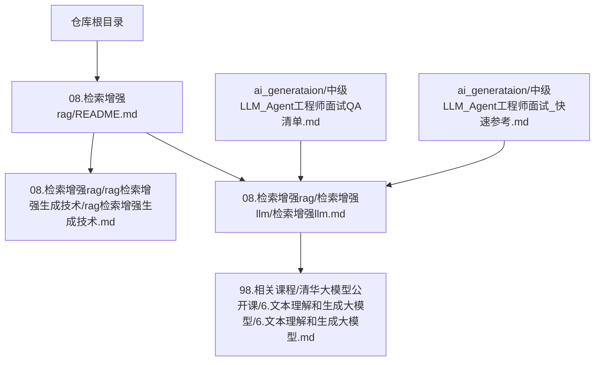
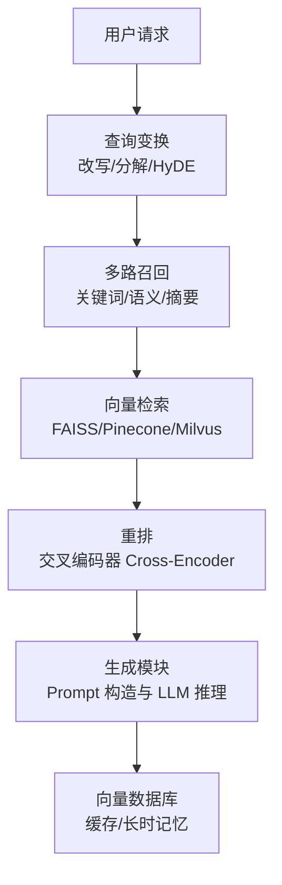
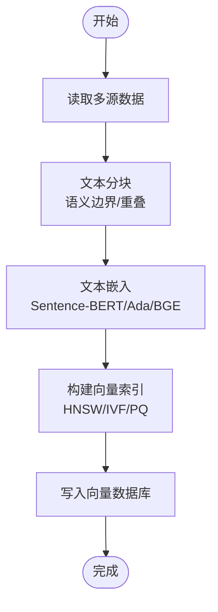
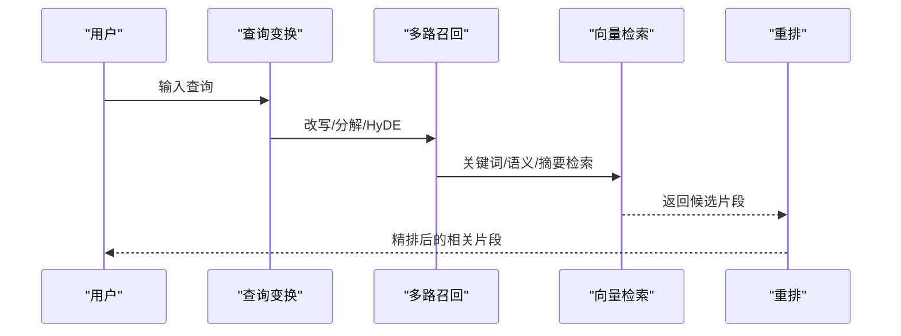
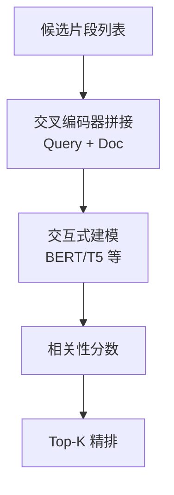
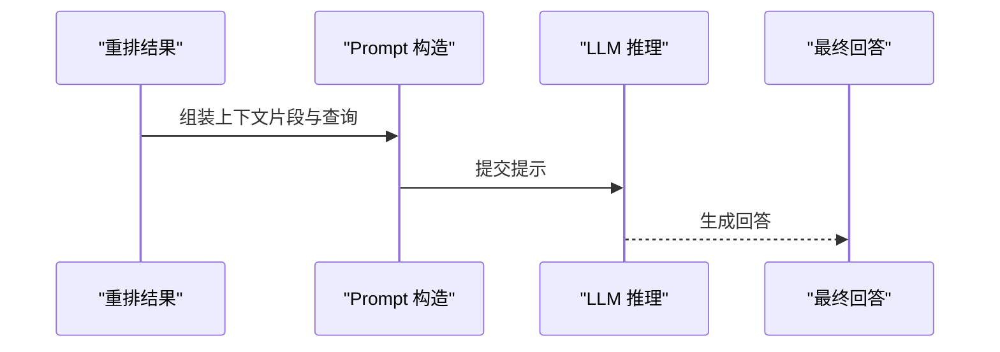
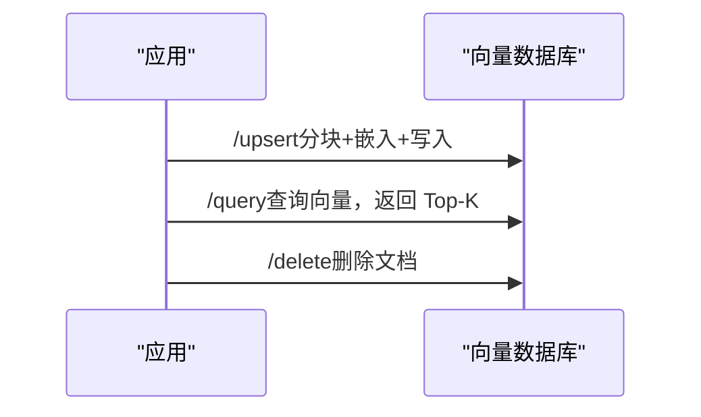
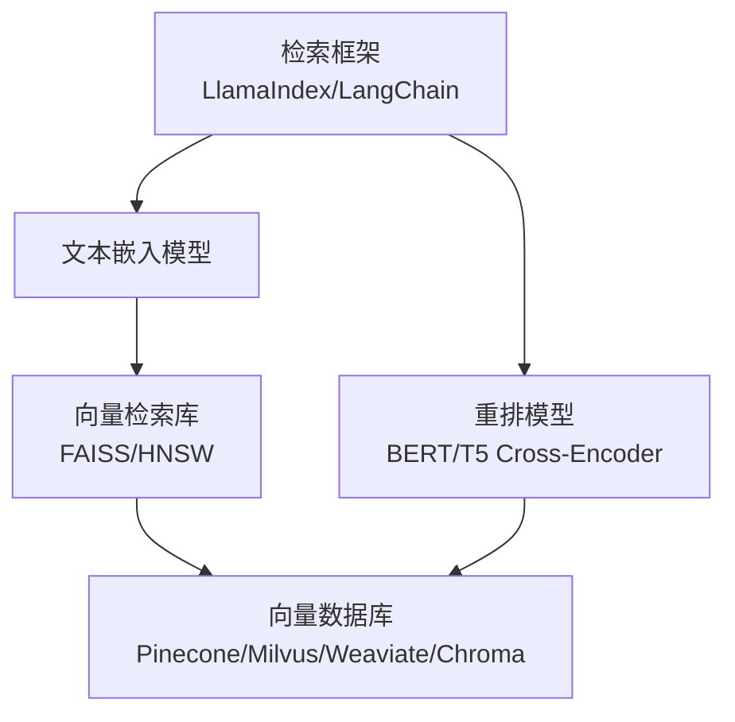

# tiny-rag 项目

<cite>
**本文引用的文件**   
- [README.md](file://README.md)
- [08.检索增强rag/README.md](file://08.检索增强rag/README.md)
- [08.检索增强rag/rag（检索增强生成）技术/rag（检索增强生成）技术.md](file://08.检索增强rag/rag（检索增强生成）技术/rag（检索增强生成）技术.md)
- [08.检索增强rag/检索增强llm/检索增强llm.md](file://08.检索增强rag/检索增强llm/检索增强llm.md)
- [98.相关课程/清华大模型公开课/6.文本理解和生成大模型/6.文本理解和生成大模型.md](file://98.相关课程/清华大模型公开课/6.文本理解和生成大模型/6.文本理解和生成大模型.md)
- [ai_generataion/中级LLM_Agent工程师面试QA清单.md](file://ai_generataion/中级LLM_Agent工程师面试QA清单.md)
- [ai_generataion/中级LLM_Agent工程师面试_快速参考.md](file://ai_generataion/中级LLM_Agent工程师面试_快速参考.md)
</cite>

## 目录
1. [简介](#简介)
2. [项目结构](#项目结构)
3. [核心组件](#核心组件)
4. [架构总览](#架构总览)
5. [详细组件分析](#详细组件分析)
6. [依赖分析](#依赖分析)
7. [性能考量](#性能考量)
8. [故障排查指南](#故障排查指南)
9. [结论](#结论)
10. [附录](#附录)

## 简介
本项目为“tiny-rag”实践项目文档，面向希望快速理解并落地检索增强生成（RAG）系统的开发者。tiny-rag 旨在以最小实现展示 RAG 的关键流程：数据与索引、查询与检索、重排与生成，并强调多路召回、重排算法与向量数据库集成等技术亮点，帮助读者在低资源环境下掌握现代 RAG 的实现原理与优化策略。

项目 GitHub 仓库链接：https://github.com/wdndev/tiny-rag

## 项目结构
本仓库为知识笔记与文档集合，tiny-rag 的实现并非以独立代码仓库形式呈现于此。但通过检索增强 RAG 的相关文档与课程材料，可以清晰梳理出 RAG 的系统性知识体系与工程化落地要点。下图给出与 tiny-rag 相关的文档组织关系概览：

图表来源
- [08.检索增强rag/README.md:1-14](file://08.检索增强rag/README.md#L1-L14)
- [08.检索增强rag/rag（检索增强生成）技术/rag（检索增强生成）技术.md:1-73](file://08.检索增强rag/rag（检索增强生成）技术/rag（检索增强生成）技术.md#L1-L73)
- [08.检索增强rag/检索增强llm/检索增强llm.md:1-526](file://08.检索增强rag/检索增强llm/检索增强llm.md#L1-L526)
- [98.相关课程/清华大模型公开课/6.文本理解和生成大模型/6.文本理解和生成大模型.md:150-349](file://98.相关课程/清华大模型公开课/6.文本理解和生成大模型/6.文本理解和生成大模型.md#L150-L349)
- [ai_generataion/中级LLM_Agent工程师面试QA清单.md:1-133](file://ai_generataion/中级LLM_Agent工程师面试QA清单.md#L1-L133)
- [ai_generataion/中级LLM_Agent工程师面试_快速参考.md:1-50](file://ai_generataion/中级LLM_Agent工程师面试_快速参考.md#L1-L50)

章节来源
- [README.md:1-169](file://README.md#L1-L169)
- [08.检索增强rag/README.md:1-14](file://08.检索增强rag/README.md#L1-L14)

## 核心组件
tiny-rag 的实现目标与技术特点可归纳为以下核心模块与能力：
- 数据与索引模块：统一多源异构数据，构建文档对象与元信息，执行文本分块与向量索引，支撑高效检索。
- 查询与检索模块：支持查询变换（改写、分解、HyDE），多路召回策略，相似向量检索与过滤。
- 重排与排序模块：采用交叉编码器（Cross-Encoder）进行精排，提升相关性排序质量。
- 响应生成模块：将检索到的相关片段与查询组合为提示，驱动 LLM 生成最终回答。
- 向量数据库集成：对接向量数据库（如 FAISS、Pinecone、Milvus 等），实现高维向量的高效存储与检索。
- 多路召回机制：结合多种检索策略（标题+内容+摘要、关键词、语义向量等）扩大召回覆盖面，提升召回质量。

章节来源
- [08.检索增强rag/rag（检索增强生成）技术/rag（检索增强生成）技术.md:39-57](file://08.检索增强rag/rag（检索增强生成）技术/rag（检索增强生成）技术.md#L39-L57)
- [08.检索增强rag/检索增强llm/检索增强llm.md:81-87](file://08.检索增强rag/检索增强llm/检索增强llm.md#L81-L87)
- [98.相关课程/清华大模型公开课/6.文本理解和生成大模型/6.文本理解和生成大模型.md:150-195](file://98.相关课程/清华大模型公开课/6.文本理解和生成大模型/6.文本理解和生成大模型.md#L150-L195)
- [ai_generataion/中级LLM_Agent工程师面试QA清单.md:40-51](file://ai_generataion/中级LLM_Agent工程师面试QA清单.md#L40-L51)

## 架构总览
下图展示 tiny-rag 的端到端架构：用户请求经由查询变换与多路召回，随后进入重排阶段，最终将精选上下文交给 LLM 生成回答，并可选地写入向量数据库以支持缓存与长时记忆。

图表来源
- [08.检索增强rag/rag（检索增强生成）技术/rag（检索增强生成）技术.md:47-57](file://08.检索增强rag/rag（检索增强生成）技术/rag（检索增强生成）技术.md#L47-L57)
- [08.检索增强rag/检索增强llm/检索增强llm.md:213-287](file://08.检索增强rag/检索增强llm/检索增强llm.md#L213-L287)
- [98.相关课程/清华大模型公开课/6.文本理解和生成大模型/6.文本理解和生成大模型.md:159-176](file://98.相关课程/清华大模型公开课/6.文本理解和生成大模型/6.文本理解和生成大模型.md#L159-L176)

## 详细组件分析

### 数据与索引模块
- 文档对象与元信息：统一多源数据（Web、API、本地文件、PDF、Markdown 等），抽取时间、标题、关键词、摘要、分类等元信息，便于检索与过滤。
- 文本分块策略：按语义边界（段落/句子）切分，控制块大小与重叠，兼顾上下文连贯与上下文窗口限制。
- 向量索引与嵌入：使用文本嵌入模型（如 Sentence Transformers、text-embedding-ada-002、BGE 等）生成向量，构建向量索引（HNSW、IVF、Product Quantization 等），支持大规模相似向量检索。
- 向量数据库：对接 Pinecone、Milvus、Weaviate、Chroma 等，提供 upsert/query/delete 等标准接口，支撑数据托管、管理与查询。

图表来源
- [08.检索增强rag/rag（检索增强生成）技术/rag（检索增强生成）技术.md:122-148](file://08.检索增强rag/rag（检索增强生成）技术/rag（检索增强生成）技术.md#L122-L148)
- [08.检索增强rag/检索增强llm/检索增强llm.md:213-287](file://08.检索增强rag/检索增强llm/检索增强llm.md#L213-L287)

章节来源
- [08.检索增强rag/rag（检索增强生成）技术/rag（检索增强生成）技术.md:89-148](file://08.检索增强rag/rag（检索增强生成）技术/rag（检索增强生成）技术.md#L89-L148)
- [08.检索增强rag/检索增强llm/检索增强llm.md:181-287](file://08.检索增强rag/检索增强llm/检索增强llm.md#L181-L287)

### 查询与检索模块
- 查询变换：同义改写、查询分解（单步/多步）、HyDE（假设文档嵌入）等，扩大检索覆盖面与鲁棒性。
- 多路召回：结合关键词过滤、语义向量检索、标题/摘要联合检索，提升召回质量与覆盖率。
- 相似向量检索：余弦相似度、点积、欧式距离等度量；小规模场景可用 NumPy，大规模场景使用 FAISS 等库实现高效近似最近邻检索。

图表来源
- [08.检索增强rag/rag（检索增强生成）技术/rag（检索增强生成）技术.md:334-375](file://08.检索增强rag/rag（检索增强生成）技术/rag（检索增强生成）技术.md#L334-L375)
- [08.检索增强rag/检索增强llm/检索增强llm.md:241-267](file://08.检索增强rag/检索增强llm/检索增强llm.md#L241-L267)

章节来源
- [08.检索增强rag/rag（检索增强生成）技术/rag（检索增强生成）技术.md:332-375](file://08.检索增强rag/rag（检索增强生成）技术/rag（检索增强生成）技术.md#L332-L375)
- [08.检索增强rag/检索增强llm/检索增强llm.md:332-375](file://08.检索增强rag/检索增强llm/检索增强llm.md#L332-L375)

### 重排与排序模块
- 交叉编码器（Cross-Encoder）：将查询与候选文档进行词汇级拼接，通过大模型交互式建模，生成细粒度相关性分数，显著提升排序精度。
- 双塔架构（Dual-Encoder）：用于第一阶段粗排，独立编码查询与文档，计算向量相似度，具备高效性，常与重排阶段配合使用。
- 负例增强与预训练：在训练阶段挖掘更难负例（In-batch/Random/BM25 负例），或通过弱监督数据与去噪学习提升检索性能。

图表来源
- [98.相关课程/清华大模型公开课/6.文本理解和生成大模型/6.文本理解和生成大模型.md:159-176](file://98.相关课程/清华大模型公开课/6.文本理解和生成大模型/6.文本理解和生成大模型.md#L159-L176)
- [98.相关课程/清华大模型公开课/6.文本理解和生成大模型/6.文本理解和生成大模型.md:183-202](file://98.相关课程/清华大模型公开课/6.文本理解和生成大模型/6.文本理解和生成大模型.md#L183-L202)

章节来源
- [98.相关课程/清华大模型公开课/6.文本理解和生成大模型/6.文本理解和生成大模型.md:150-202](file://98.相关课程/清华大模型公开课/6.文本理解和生成大模型/6.文本理解和生成大模型.md#L150-L202)

### 响应生成模块
- Prompt 模板：将检索到的相关片段与查询组合，指示 LLM 结合上下文与自身知识生成回答；支持逐步修正策略。
- 生成策略：逐片段增量生成并修正，或一次性在 Prompt 中拼接多片段，结合上下文长度与调用次数进行权衡。

图表来源
- [08.检索增强rag/rag（检索增强生成）技术/rag（检索增强生成）技术.md:376-412](file://08.检索增强rag/rag（检索增强生成）技术/rag（检索增强生成）技术.md#L376-L412)
- [08.检索增强rag/检索增强llm/检索增强llm.md:376-412](file://08.检索增强rag/检索增强llm/检索增强llm.md#L376-L412)

章节来源
- [08.检索增强rag/rag（检索增强生成）技术/rag（检索增强生成）技术.md:376-412](file://08.检索增强rag/rag（检索增强生成）技术/rag（检索增强生成）技术.md#L376-L412)
- [08.检索增强rag/检索增强llm/检索增强llm.md:376-412](file://08.检索增强rag/检索增强llm/检索增强llm.md#L376-L412)

### 向量数据库集成
- 向量数据库能力：数据托管、备份、插入/删除/更新、元数据存储、可扩展性（垂直/水平）。
- 常见向量数据库：Pinecone、Vespa、Weaviate、Milvus、Chroma、Tencent Cloud VectorDB 等。
- 典型接口：/upsert（文档入库，分块+嵌入+存储）、/query（相似向量检索，支持 filter/top_k）、/delete（删除文档）。

图表来源
- [08.检索增强rag/rag（检索增强生成）技术/rag（检索增强生成）技术.md:50-57](file://08.检索增强rag/rag（检索增强生成）技术/rag（检索增强生成）技术.md#L50-L57)
- [08.检索增强rag/检索增强llm/检索增强llm.md:269-330](file://08.检索增强rag/检索增强llm/检索增强llm.md#L269-L330)
- [08.检索增强rag/检索增强llm/检索增强llm.md:416-427](file://08.检索增强rag/检索增强llm/检索增强llm.md#L416-L427)

章节来源
- [08.检索增强rag/rag（检索增强生成）技术/rag（检索增强生成）技术.md:50-57](file://08.检索增强rag/rag（检索增强生成）技术/rag（检索增强生成）技术.md#L50-L57)
- [08.检索增强rag/检索增强llm/检索增强llm.md:269-330](file://08.检索增强rag/检索增强llm/检索增强llm.md#L269-L330)
- [08.检索增强rag/检索增强llm/检索增强llm.md:416-427](file://08.检索增强rag/检索增强llm/检索增强llm.md#L416-L427)

## 依赖分析
tiny-rag 的实现依赖于以下关键技术栈与生态：
- 文本嵌入模型：Sentence Transformers、text-embedding-ada-002、BGE 等。
- 向量检索库：FAISS（Facebook）、Hnswlib 等。
- 向量数据库：Pinecone、Milvus、Weaviate、Chroma、Tencent Cloud VectorDB 等。
- 检索框架：LlamaIndex、LangChain（用于概念与流程参考）。
- 重排模型：BERT/T5 等预训练语言模型作为交叉编码器。

图表来源
- [08.检索增强rag/rag（检索增强生成）技术/rag（检索增强生成）技术.md:223-237](file://08.检索增强rag/rag（检索增强生成）技术/rag（检索增强生成）技术.md#L223-L237)
- [08.检索增强rag/检索增强llm/检索增强llm.md:223-287](file://08.检索增强rag/检索增强llm/检索增强llm.md#L223-L287)
- [98.相关课程/清华大模型公开课/6.文本理解和生成大模型/6.文本理解和生成大模型.md:159-176](file://98.相关课程/清华大模型公开课/6.文本理解和生成大模型/6.文本理解和生成大模型.md#L159-L176)

章节来源
- [08.检索增强rag/rag（检索增强生成）技术/rag（检索增强生成）技术.md:223-237](file://08.检索增强rag/rag（检索增强生成）技术/rag（检索增强生成）技术.md#L223-L237)
- [08.检索增强rag/检索增强llm/检索增强llm.md:223-287](file://08.检索增强rag/检索增强llm/检索增强llm.md#L223-L287)
- [98.相关课程/清华大模型公开课/6.文本理解和生成大模型/6.文本理解和生成大模型.md:159-176](file://98.相关课程/清华大模型公开课/6.文本理解和生成大模型/6.文本理解和生成大模型.md#L159-L176)

## 性能考量
- 检索阶段：优先采用双塔（Dual-Encoder）进行粗排，结合 FAISS 等库实现高效近似最近邻检索，降低计算开销。
- 重排阶段：在候选集较小（如 Top-K）时使用交叉编码器（Cross-Encoder）进行精排，显著提升相关性排序质量。
- 文本分块：合理设置块大小与重叠，平衡上下文连贯性与上下文窗口限制；依据嵌入模型与问题长度选择最优分块策略。
- 向量数据库：根据数据规模与查询频率选择合适索引类型（HNSW/IVF/PQ），并结合缓存与元数据管理提升吞吐与稳定性。
- 生成阶段：控制 Prompt 长度与调用次数，采用逐步修正策略或批量拼接策略，权衡生成质量与延迟。

## 故障排查指南
- 检索质量不佳
  - 检查分块策略是否合理，是否存在语义断裂；适当增加重叠或调整分块大小。
  - 确认嵌入模型是否适配任务与领域，必要时更换模型或引入多模态嵌入。
  - 评估相似度度量与检索算法，小规模场景可尝试 NumPy 实现，大规模场景使用 FAISS。
- 重排效果不理想
  - 确认交叉编码器训练数据质量与负例挖掘策略；尝试 In-batch/Random/BM25 负例组合。
  - 检查重排模型是否过拟合或欠拟合，调整训练策略与损失函数。
- 向量数据库异常
  - 核对 upsert/query/delete 接口参数与索引配置；检查维度、度量与索引类型是否匹配。
  - 关注数据一致性与元数据存储，确保插入/更新/删除操作的原子性与可见性。
- 生成阶段问题
  - 检查 Prompt 模板是否明确指示 LLM 结合上下文与自身知识；避免过度提示导致幻觉。
  - 控制上下文长度与调用次数，必要时采用逐步修正策略以提升稳定性。

章节来源
- [08.检索增强rag/rag（检索增强生成）技术/rag（检索增强生成）技术.md:122-148](file://08.检索增强rag/rag（检索增强生成）技术/rag（检索增强生成）技术.md#L122-L148)
- [08.检索增强rag/rag（检索增强生成）技术/rag（检索增强生成）技术.md:241-267](file://08.检索增强rag/rag（检索增强生成）技术/rag（检索增强生成）技术.md#L241-L267)
- [08.检索增强rag/rag（检索增强生成）技术/rag（检索增强生成）技术.md:269-330](file://08.检索增强rag/rag（检索增强生成）技术/rag（检索增强生成）技术.md#L269-L330)
- [08.检索增强rag/rag（检索增强生成）技术/rag（检索增强生成）技术.md:376-412](file://08.检索增强rag/rag（检索增强生成）技术/rag（检索增强生成）技术.md#L376-L412)

## 结论
tiny-rag 通过最小实现聚焦 RAG 的关键流程与技术要点：多路召回、重排、向量检索与生成优化。依托统一的数据与索引、高效的相似向量检索、交叉编码器精排与向量数据库集成，tiny-rag 能在低资源条件下快速落地并验证现代 RAG 的实现原理与优化策略。建议在实践中结合业务场景，持续优化分块策略、嵌入模型与重排模型，以获得更优的检索质量与生成效果。

## 附录
- 项目 GitHub 仓库：https://github.com/wdndev/tiny-rag
- 相关文档与课程：检索增强 RAG 技术综述、清华大模型公开课中的神经 IR 与重排方法、面试题与快速参考等。