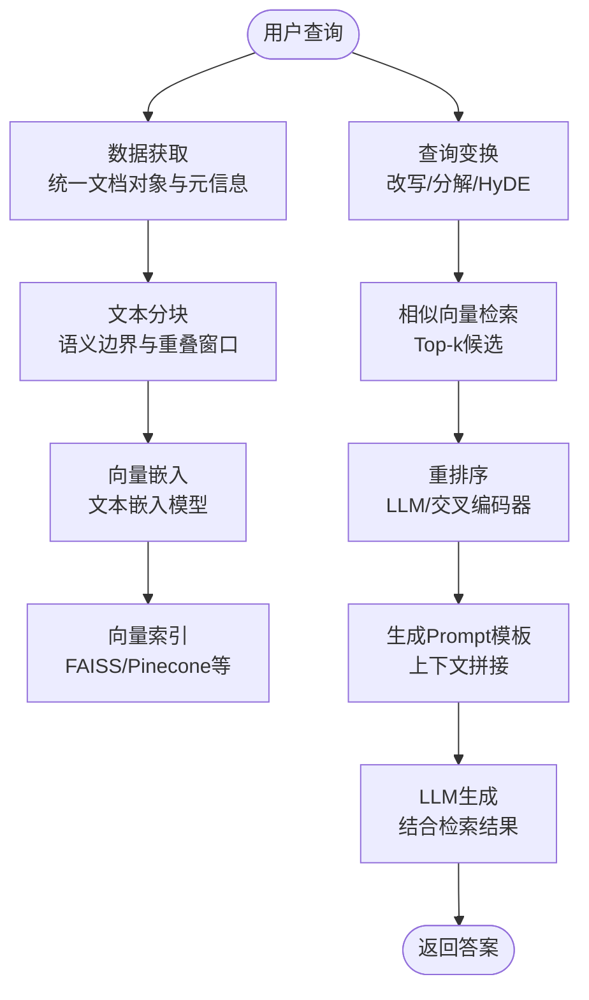
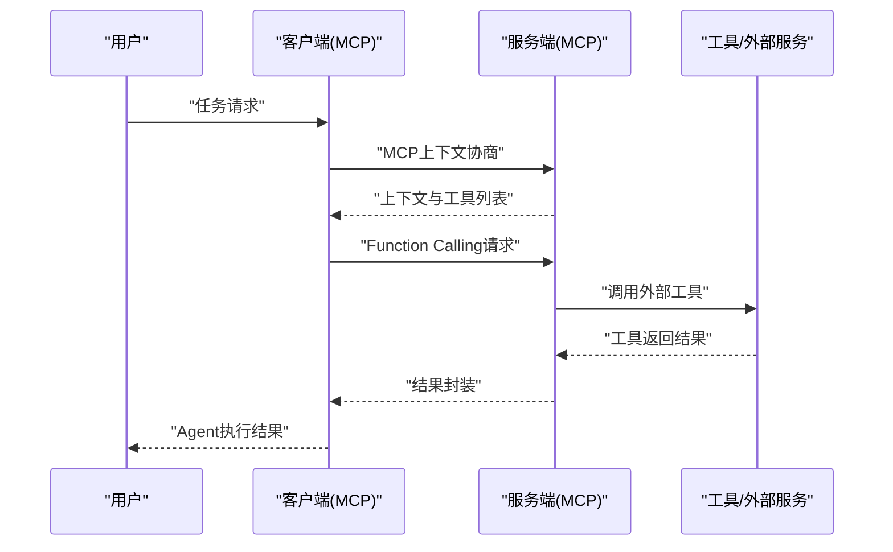
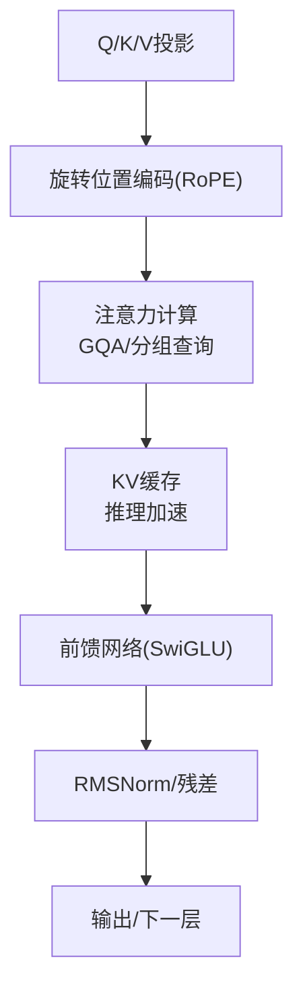

# 实践项目

<cite>
**本文引用的文件**
- [README.md](file://README.md)
- [_navbar.md](file://_navbar.md)
- [08.检索增强rag/README.md](file://08.检索增强rag/README.md)
- [08.检索增强rag/检索增强llm/检索增强llm.md](file://08.检索增强rag/检索增强llm/检索增强llm.md)
- [08.检索增强rag/大模型agent技术/大模型agent技术.md](file://08.检索增强rag/大模型agent技术/大模型agent技术.md)
- [02.大语言模型架构/llama系列模型/llama系列模型.md](file://02.大语言模型架构/llama系列模型/llama系列模型.md)
- [02.大语言模型架构/llama 3/llama 3.md](file://02.大语言模型架构/llama 3/llama 3.md)
- [02.大语言模型架构/llama 2代码详解/llama 2代码详解.md](file://02.大语言模型架构/llama 2代码详解/llama 2代码详解.md)
- [02.大语言模型架构/MHA_MQA_GQA/MHA_MQA_GQA.md](file://02.大语言模型架构/MHA_MQA_GQA/MHA_MQA_GQA.md)
- [07.强化学习/1.rlhf相关/1.rlhf相关.md](file://07.强化学习/1.rlhf相关/1.rlhf相关.md)
- [ai_generataion/中级LLM_Agent工程师面试QA清单.md](file://ai_generataion/中级LLM_Agent工程师面试QA清单.md)
- [ai_generataion/中级LLM_Agent工程师面试_快速参考.md](file://ai_generataion/中级LLM_Agent工程师面试_快速参考.md)
</cite>

## 目录
1. [简介](#简介)
2. [项目总览](#项目总览)
3. [核心项目详解](#核心项目详解)
4. [架构与关系图](#架构与关系图)
5. [学习路径与进阶建议](#学习路径与进阶建议)
6. [部署与本地运行指南](#部署与本地运行指南)
7. [故障排查与常见问题](#故障排查与常见问题)
8. [结语](#结语)

## 简介
本仓库围绕大模型面试知识与实践项目，系统梳理了从基础架构到工程落地的完整知识体系。其中，四个核心实践项目覆盖“小参数中文模型”“RAG系统”“MCP协议Agent”“从零实现Llama3”四大主题，帮助读者在低资源条件下完成端到端的动手实践，掌握预训练、微调、推理优化、检索增强与Agent协作等关键能力。

## 项目总览
- tiny-llm-zh：从零实现一个小参数量的中文大语言模型，快速掌握预训练、微调、RL等核心技术，并已上线体验。
- tiny-rag：实现一个简单的RAG系统，支持多路召回、重排等，快速了解检索增强生成的工程要点。
- tiny-mcp：使用 Prompt 与 Function Calling 实现 MCP（模型上下文协议）服务端与客户端，快速搭建基于MCP的Agent项目。
- llama3-from-scratch-zh：从零实现 Llama3，支持加载官方权重，可在本地笔记本（16G内存）调试运行。

以上项目均已在仓库中明确列出，便于读者对照学习与实践。

**章节来源**
- [README.md:10-14](file://README.md#L10-L14)

## 核心项目详解

### tiny-llm-zh：小参数量中文大语言模型
- 实现目标
  - 从零实现中文大语言模型，聚焦预训练、微调与RL等关键环节，适合低资源环境快速上手。
  - 已部署上线，可通过在线体验站点进行交互与验证。
- 技术特点
  - 采用Decoder-only架构，结合前置层归一化、旋转位置编码（RoPE）、SwiGLU激活等关键设计，兼顾训练稳定性与推理效率。
  - 通过分组查询注意力（GQA）等手段优化长序列处理与吞吐。
- 适用场景
  - 中文场景下的教学与演示、低成本推理部署、中文指令微调与评测。
- 学习价值
  - 理解中文大模型的训练与微调流程，掌握关键模块（嵌入、注意力、FFN、归一化、位置编码）的实现与优化。
- 项目链接
  - 项目主页：[tiny-llm-zh](https://github.com/wdndev/tiny-llm-zh)
  - 在线体验：[ModeScope Tiny LLM](https://www.modelscope.cn/studios/wdndev/tiny_llm_92m_demo/summary)
- 部署与运行
  - 项目主页提供部署与运行指引，建议参考项目内说明进行本地环境准备与权重加载。

**章节来源**
- [README.md:8-11](file://README.md#L8-L11)
- [02.大语言模型架构/llama系列模型/llama系列模型.md:100-156](file://02.大语言模型架构/llama系列模型/llama系列模型.md#L100-L156)
- [02.大语言模型架构/llama 3/llama 3.md:32-46](file://02.大语言模型架构/llama 3/llama 3.md#L32-L46)

### tiny-rag：RAG系统实现
- 实现目标
  - 构建一个简易的RAG系统，涵盖数据获取、文本分块、向量索引、查询与检索、重排序与生成增强等关键模块。
- 技术特点
  - 支持多路召回与重排序，结合向量数据库与相似向量检索（如FAISS、Pinecone）提升检索质量。
  - 通过Prompt模板与上下文拼接，将检索结果注入生成阶段，降低幻觉并提升事实性。
- 适用场景
  - 文档问答、知识库检索、企业内部知识增强、长尾知识与私有数据接入。
- 学习价值
  - 理解RAG两阶段流程（检索+生成）与关键优化点（分块策略、重排序、查询改写、HyDE等）。
- 项目链接
  - 项目主页：[tiny-rag](https://github.com/wdndev/tiny-rag)
- 部署与运行
  - 建议参考项目内说明准备向量数据库与嵌入模型，完成数据入库与查询接口测试。

**章节来源**
- [README.md:12](file://README.md#L12)
- [08.检索增强rag/README.md:1-14](file://08.检索增强rag/README.md#L1-L14)
- [08.检索增强rag/检索增强llm/检索增强llm.md:81-101](file://08.检索增强rag/检索增强llm/检索增强llm.md#L81-L101)

### tiny-mcp：MCP协议Agent项目
- 实现目标
  - 基于MCP（模型上下文协议）实现服务端与客户端，使用Prompt与Function Calling快速搭建Agent项目。
- 技术特点
  - 通过Function Calling将外部工具与模型能力解耦，实现可组合、可扩展的Agent能力。
  - 支持Prompt驱动的任务编排与工具调用，便于构建多Agent协作与任务分解。
- 适用场景
  - 快速原型Agent、工具编排、跨应用服务集成、多Agent任务编排。
- 学习价值
  - 掌握Agent设计模式、工具调用协议与任务分解策略，理解Agent与外部系统的交互边界。
- 项目链接
  - 项目主页：[tiny-mcp](https://github.com/wdndev/tiny-mcp)
- 部署与运行
  - 建议参考项目内说明完成服务端与客户端的初始化、工具注册与调用链路测试。

**章节来源**
- [README.md:13](file://README.md#L13)
- [08.检索增强rag/大模型agent技术/大模型agent技术.md:122-176](file://08.检索增强rag/大模型agent技术/大模型agent技术.md#L122-L176)
- [07.强化学习/1.rlhf相关/1.rlhf相关.md:137-148](file://07.强化学习/1.rlhf相关/1.rlhf相关.md#L137-L148)

### llama3-from-scratch-zh：从零实现llama3
- 实现目标
  - 从零实现Llama3核心模块，支持加载官方权重，可在本地笔记本（16G内存）进行调试与运行。
- 技术特点
  - 采用标准解码器架构，引入GQA、RoPE、RMSNorm、SwiGLU等关键设计，兼顾性能与效率。
  - 支持长序列（8k）处理与多语言数据，具备良好的扩展性与工程落地能力。
- 适用场景
  - Llama3架构学习、本地推理验证、中文场景微调与评测、工程化部署入门。
- 学习价值
  - 深入理解Llama3的模型结构、注意力变体与训练/微调流程，掌握推理优化（KV Cache、分页注意力等）。
- 项目链接
  - 项目主页：[llama3-from-scratch-zh](https://github.com/wdndev/llama3-from-scratch-zh)
- 部署与运行
  - 建议参考项目内说明准备环境与权重，完成模型加载与推理验证。

**章节来源**
- [README.md:14](file://README.md#L14)
- [02.大语言模型架构/llama 3/llama 3.md:15-51](file://02.大语言模型架构/llama 3/llama 3.md#L15-L51)
- [02.大语言模型架构/llama 2代码详解/llama 2代码详解.md:160-522](file://02.大语言模型架构/llama 2代码详解/llama 2代码详解.md#L160-L522)
- [02.大语言模型架构/MHA_MQA_GQA/MHA_MQA_GQA.md:162-225](file://02.大语言模型架构/MHA_MQA_GQA/MHA_MQA_GQA.md#L162-L225)

## 架构与关系图

### RAG系统关键模块与流程

**图表来源**
- [08.检索增强rag/检索增强llm/检索增强llm.md:81-101](file://08.检索增强rag/检索增强llm/检索增强llm.md#L81-L101)
- [08.检索增强rag/检索增强llm/检索增强llm.md:213-282](file://08.检索增强rag/检索增强llm/检索增强llm.md#L213-L282)

### Agent系统设计与MCP协议

**图表来源**
- [08.检索增强rag/大模型agent技术/大模型agent技术.md:122-176](file://08.检索增强rag/大模型agent技术/大模型agent技术.md#L122-L176)
- [07.强化学习/1.rlhf相关/1.rlhf相关.md:137-148](file://07.强化学习/1.rlhf相关/1.rlhf相关.md#L137-L148)

### Llama3关键模块与优化

**图表来源**
- [02.大语言模型架构/llama 3/llama 3.md:32-46](file://02.大语言模型架构/llama 3/llama 3.md#L32-L46)
- [02.大语言模型架构/llama 2代码详解/llama 2代码详解.md:258-331](file://02.大语言模型架构/llama 2代码详解/llama 2代码详解.md#L258-L331)
- [02.大语言模型架构/MHA_MQA_GQA/MHA_MQA_GQA.md:162-225](file://02.大语言模型架构/MHA_MQA_GQA/MHA_MQA_GQA.md#L162-L225)

## 学习路径与进阶建议
- 基础阶段
  - 掌握Transformer与Decoder-only架构、注意力机制、位置编码、归一化与激活函数等核心概念。
  - 参考：[02.大语言模型架构/llama系列模型/llama系列模型.md](file://02.大语言模型架构/llama系列模型/llama系列模型.md)、[02.大语言模型架构/llama 3/llama 3.md](file://02.大语言模型架构/llama 3/llama 3.md)。
- 实践阶段
  - 从tiny-llm-zh入手，理解中文模型的训练与微调流程；再完成tiny-rag，掌握RAG检索与生成链路；最后完成tiny-mcp，构建基于MCP的Agent。
  - 参考：[README.md:10-14](file://README.md#L10-L14)、[08.检索增强rag/README.md](file://08.检索增强rag/README.md)、[08.检索增强rag/大模型agent技术/大模型agent技术.md](file://08.检索增强rag/大模型agent技术/大模型agent技术.md)。
- 进阶阶段
  - 深入理解推理优化（KV Cache、分页注意力、量化）与系统设计（动态批处理、负载均衡、自动扩缩容）。
  - 参考：[ai_generataion/中级LLM_Agent工程师面试QA清单.md](file://ai_generataion/中级LLM_Agent工程师面试QA清单.md)、[ai_generataion/中级LLM_Agent工程师面试_快速参考.md](file://ai_generataion/中级LLM_Agent工程师面试_快速参考.md)。

## 部署与本地运行指南
- tiny-llm-zh
  - 项目主页提供部署与运行说明，建议准备Python环境与所需依赖，下载并加载权重后进行推理验证。
  - 在线体验：[ModeScope Tiny LLM](https://www.modelscope.cn/studios/wdndev/tiny_llm_92m_demo/summary)
- tiny-rag
  - 准备向量数据库（如FAISS/Pinecone）与嵌入模型，完成数据入库与查询接口测试，验证检索与生成链路。
- tiny-mcp
  - 完成服务端与客户端初始化、工具注册与调用链路测试，确保Function Calling与上下文协商正常。
- llama3-from-scratch-zh
  - 准备环境与官方权重，完成模型加载与推理验证，建议在本地笔记本（16G内存）进行调试运行。

**章节来源**
- [README.md:8-14](file://README.md#L8-L14)
- [_navbar.md:4-5](file://_navbar.md#L4-L5)

## 故障排查与常见问题
- RAG检索质量不佳
  - 检查分块策略（语义边界、重叠窗口）、嵌入模型与向量索引配置、重排序模块与查询变换（改写/分解/HyDE）。
  - 参考：[08.检索增强rag/检索增强llm/检索增强llm.md:122-179](file://08.检索增强rag/检索增强llm/检索增强llm.md#L122-L179)、[08.检索增强rag/检索增强llm/检索增强llm.md:332-375](file://08.检索增强rag/检索增强llm/检索增强llm.md#L332-L375)
- Agent调用失败或上下文异常
  - 核查MCP协议协商、工具注册与Function Calling格式，确认上下文拼接与Prompt模板。
  - 参考：[08.检索增强rag/大模型agent技术/大模型agent技术.md:122-176](file://08.检索增强rag/大模型agent技术/大模型agent技术.md#L122-L176)
- 推理性能瓶颈
  - 优化KV Cache管理、启用分页注意力（PagedAttention）、考虑量化与批处理策略。
  - 参考：[ai_generataion/中级LLM_Agent工程师面试QA清单.md:55-87](file://ai_generataion/中级LLM_Agent工程师面试QA清单.md#L55-L87)、[ai_generataion/中级LLM_Agent工程师面试_快速参考.md:9-19](file://ai_generataion/中级LLM_Agent工程师面试_快速参考.md#L9-L19)

## 结语
四个核心实践项目覆盖了从模型实现、检索增强到Agent协作与系统优化的完整路径。建议以tiny-llm-zh为起点，逐步推进到tiny-rag、tiny-mcp与llama3-from-scratch-zh，结合仓库中的架构与优化知识，完成端到端的工程化落地与性能调优。