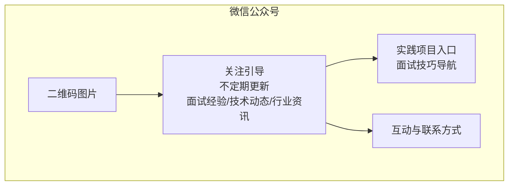
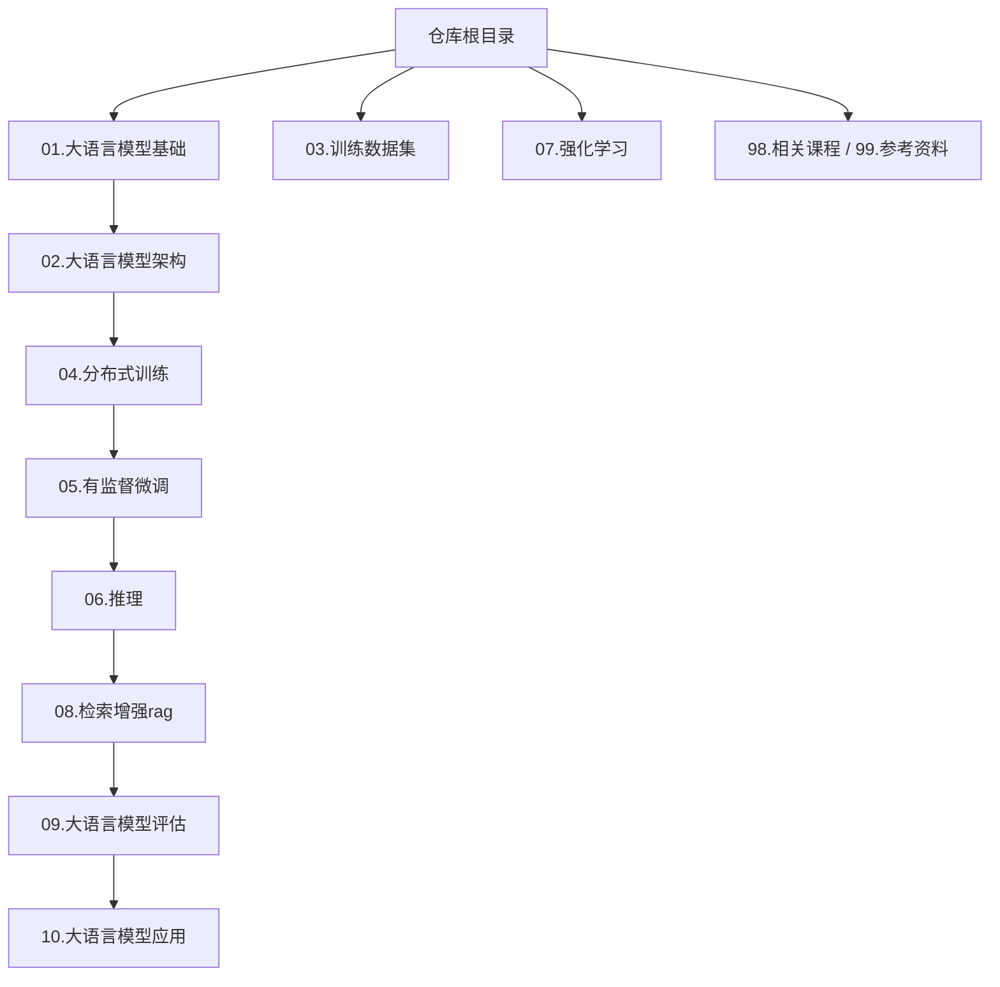
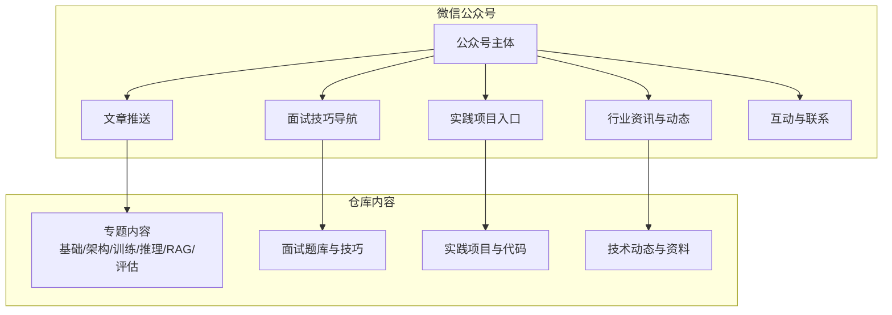
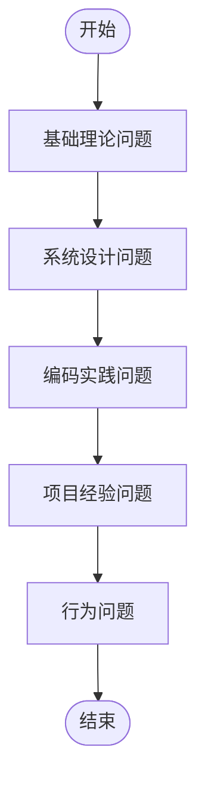
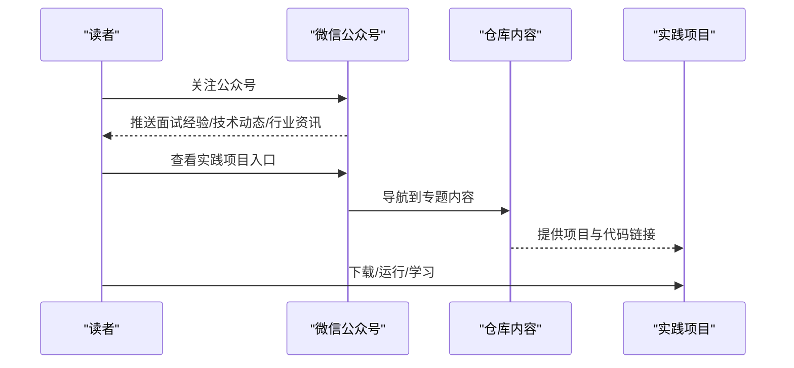
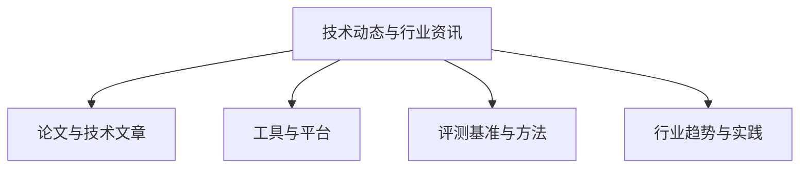
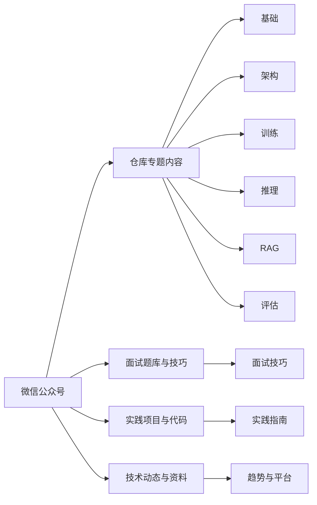

# 微信公众号

<cite>
**本文引用的文件**
- [README.md](file://README.md)
- [ai_generataion/中级LLM_Agent工程师面试QA清单.md](file://ai_generataion/中级LLM_Agent工程师面试QA清单.md)
- [ai_generataion/中级LLM_Agent工程师面试_快速参考.md](file://ai_generataion/中级LLM_Agent工程师面试_快速参考.md)
- [01.大语言模型基础/README.md](file://01.大语言模型基础/README.md)
- [02.大语言模型架构/README.md](file://02.大语言模型架构/README.md)
- [04.分布式训练/README.md](file://04.分布式训练/README.md)
- [04.分布式训练/分布式训练题目/分布式训练题目.md](file://04.分布式训练/分布式训练题目/分布式训练题目.md)
- [05.有监督微调/README.md](file://05.有监督微调/README.md)
- [06.推理/README.md](file://06.推理/README.md)
- [06.推理/1.vllm/1.vllm.md](file://06.推理/1.vllm/1.vllm.md)
- [08.检索增强rag/README.md](file://08.检索增强rag/README.md)
- [09.大语言模型评估/1.评测/1.评测.md](file://09.大语言模型评估/1.评测/1.评测.md)
</cite>

## 目录
1. [简介](#简介)
2. [项目结构](#项目结构)
3. [核心组件](#核心组件)
4. [架构总览](#架构总览)
5. [详细组件分析](#详细组件分析)
6. [依赖分析](#依赖分析)
7. [性能考量](#性能考量)
8. [故障排查指南](#故障排查指南)
9. [结论](#结论)
10. [附录](#附录)

## 简介
本仓库聚焦于大模型面试与实践，内容覆盖基础概念、架构原理、训练与推理、微调、RAG、评估等多个维度，配套有监督微调、分布式训练、推理优化、评估方法等专题材料。为便于读者持续获取更新与交流，项目提供微信公众号渠道，不定期推送面试经验、技术动态与行业资讯，并提供实践项目与面试技巧的延伸入口。

- 关注方式：扫描下方二维码，或在微信中搜索公众号名称并关注
- 内容更新频率：不定期更新，重点围绕面试热点、技术趋势与项目实践
- 特色功能：
  - 面试经验分享：覆盖基础理论、系统设计、编码实践、项目经验与行为面试要点
  - 最新技术动态：追踪大模型前沿进展与工程实践
  - 行业资讯：汇总与提炼行业趋势、工具与平台动态
  - 实践项目导航：提供动手项目入口与进阶路径
  - 互动与联系：通过留言与后台互动，获取个性化学习建议与资源

[本图为概念示意，不直接映射具体源文件，故不附“图表来源”]

## 项目结构
仓库采用主题化目录组织，便于按模块学习与查阅。微信公众号作为对外发布与互动的统一入口，与仓库内各专题内容形成互补。

**图表来源**
- [README.md:37-169](file://README.md#L37-L169)
- [01.大语言模型基础/README.md:1-36](file://01.大语言模型基础/README.md#L1-L36)
- [02.大语言模型架构/README.md:1-52](file://02.大语言模型架构/README.md#L1-L52)
- [04.分布式训练/README.md:1-45](file://04.分布式训练/README.md#L1-L45)
- [05.有监督微调/README.md:1-30](file://05.有监督微调/README.md#L1-L30)
- [06.推理/README.md:1-28](file://06.推理/README.md#L1-L28)
- [08.检索增强rag/README.md:1-14](file://08.检索增强rag/README.md#L1-L14)
- [09.大语言模型评估/1.评测/1.评测.md:1-43](file://09.大语言模型评估/1.评测/1.评测.md#L1-L43)

**章节来源**
- [README.md:37-169](file://README.md#L37-L169)

## 核心组件
- 面试知识体系：涵盖基础、架构、训练、推理、RAG、评估等专题，形成系统化知识地图
- 面试题库与技巧：提供理论、系统设计、编码、项目经验与行为面试的要点与范式
- 实践项目导航：链接到动手项目与代码实现，帮助读者从理论走向实践
- 行业动态与资讯：汇总前沿技术、工具与平台动态，辅助读者把握趋势

**章节来源**
- [README.md:1-36](file://README.md#L1-L36)
- [ai_generataion/中级LLM_Agent工程师面试QA清单.md:1-343](file://ai_generataion/中级LLM_Agent工程师面试QA清单.md#L1-L343)
- [ai_generataion/中级LLM_Agent工程师面试_快速参考.md:1-66](file://ai_generataion/中级LLM_Agent工程师面试_快速参考.md#L1-L66)

## 架构总览
微信公众号与仓库内容的协同关系如下：

**图表来源**
- [README.md:1-36](file://README.md#L1-L36)
- [ai_generataion/中级LLM_Agent工程师面试QA清单.md:1-343](file://ai_generataion/中级LLM_Agent工程师面试QA清单.md#L1-L343)
- [ai_generataion/中级LLM_Agent工程师面试_快速参考.md:1-66](file://ai_generataion/中级LLM_Agent工程师面试_快速参考.md#L1-L66)

## 详细组件分析

### 组件A：面试经验与技巧
- 内容定位：面向中级工程师，覆盖理论深度与系统设计、编码实现、项目经验与行为面试
- 关键模块：
  - 基础理论问题：Transformer、推理优化、RAG系统、微调技术
  - 系统设计问题：高并发推理服务、多Agent协作、RAG检索优化
  - 编码实践问题：Top-k采样、KV Cache内存池管理等核心算法实现
  - 项目经验问题：STAR法则展示技术决策与量化结果
  - 行为问题：学习能力、技术改进推动与团队协作

**图表来源**
- [ai_generataion/中级LLM_Agent工程师面试QA清单.md:12-343](file://ai_generataion/中级LLM_Agent工程师面试QA清单.md#L12-L343)
- [ai_generataion/中级LLM_Agent工程师面试_快速参考.md:21-66](file://ai_generataion/中级LLM_Agent工程师面试_快速参考.md#L21-L66)

**章节来源**
- [ai_generataion/中级LLM_Agent工程师面试QA清单.md:1-343](file://ai_generataion/中级LLM_Agent工程师面试QA清单.md#L1-L343)
- [ai_generataion/中级LLM_Agent工程师面试_快速参考.md:1-66](file://ai_generataion/中级LLM_Agent工程师面试_快速参考.md#L1-L66)

### 组件B：实践项目与面试技巧导航
- 实践项目入口：提供动手项目与代码实现，帮助读者从理论走向实践
- 面试技巧导航：提供面试准备建议、技术深度与广度的平衡、白板编码注意事项等

**图表来源**
- [README.md:10-14](file://README.md#L10-L14)
- [README.md:32-35](file://README.md#L32-L35)

**章节来源**
- [README.md:10-14](file://README.md#L10-L14)
- [README.md:32-35](file://README.md#L32-L35)

### 组件C：技术动态与行业资讯
- 动态来源：涵盖大模型前沿进展、推理框架、分布式训练、评估方法等
- 资讯整合：提供资料与参考链接，帮助读者快速定位权威内容

**图表来源**
- [06.推理/1.vllm/1.vllm.md:1-220](file://06.推理/1.vllm/1.vllm.md#L1-L220)
- [04.分布式训练/README.md:1-45](file://04.分布式训练/README.md#L1-L45)
- [09.大语言模型评估/1.评测/1.评测.md:1-43](file://09.大语言模型评估/1.评测/1.评测.md#L1-L43)

**章节来源**
- [06.推理/1.vllm/1.vllm.md:1-220](file://06.推理/1.vllm/1.vllm.md#L1-L220)
- [04.分布式训练/README.md:1-45](file://04.分布式训练/README.md#L1-L45)
- [09.大语言模型评估/1.评测/1.评测.md:1-43](file://09.大语言模型评估/1.评测/1.评测.md#L1-L43)

## 依赖分析
微信公众号与仓库内容的耦合关系如下：

**图表来源**
- [README.md:1-36](file://README.md#L1-L36)
- [01.大语言模型基础/README.md:1-36](file://01.大语言模型基础/README.md#L1-L36)
- [02.大语言模型架构/README.md:1-52](file://02.大语言模型架构/README.md#L1-L52)
- [04.分布式训练/README.md:1-45](file://04.分布式训练/README.md#L1-L45)
- [05.有监督微调/README.md:1-30](file://05.有监督微调/README.md#L1-L30)
- [06.推理/README.md:1-28](file://06.推理/README.md#L1-L28)
- [08.检索增强rag/README.md:1-14](file://08.检索增强rag/README.md#L1-L14)
- [09.大语言模型评估/1.评测/1.评测.md:1-43](file://09.大语言模型评估/1.评测/1.评测.md#L1-L43)

**章节来源**
- [README.md:1-36](file://README.md#L1-L36)

## 性能考量
- 面试准备的性能提升：通过系统化知识地图与面试题库，缩短准备周期，提升面试表现
- 实践导向：提供可运行的项目与代码，加速从理论到工程落地
- 动态更新：持续推送前沿技术与行业资讯，帮助读者保持技术敏感度

[本节为通用指导，不直接分析具体文件，故不附“章节来源”]

## 故障排查指南
- 关注与二维码问题：若二维码失效或无法识别，请通过公众号名称搜索并关注
- 内容链接失效：如推送链接无法打开，请在公众号内回复关键词或联系管理员获取最新链接
- 技术问题与建议：欢迎在公众号内留言，我们将尽力提供针对性建议与资源

[本节为通用指导，不直接分析具体文件，故不附“章节来源”]

## 结论
微信公众号作为本项目的对外发布与互动平台，与仓库内的系统化知识体系、面试题库与实践项目形成有机协同。通过不定期推送面试经验、技术动态与行业资讯，公众号为读者提供持续学习与实践的桥梁，助力在大模型领域稳步成长。

[本节为总结性内容，不直接分析具体文件，故不附“章节来源”]

## 附录
- 关注方式：扫描下方二维码，或在微信中搜索公众号名称并关注
- 二维码图片：请在公众号内查看或通过官方渠道获取
- 互动与联系：欢迎在公众号内留言，获取个性化学习建议与资源

**章节来源**
- [README.md:32-35](file://README.md#L32-L35)