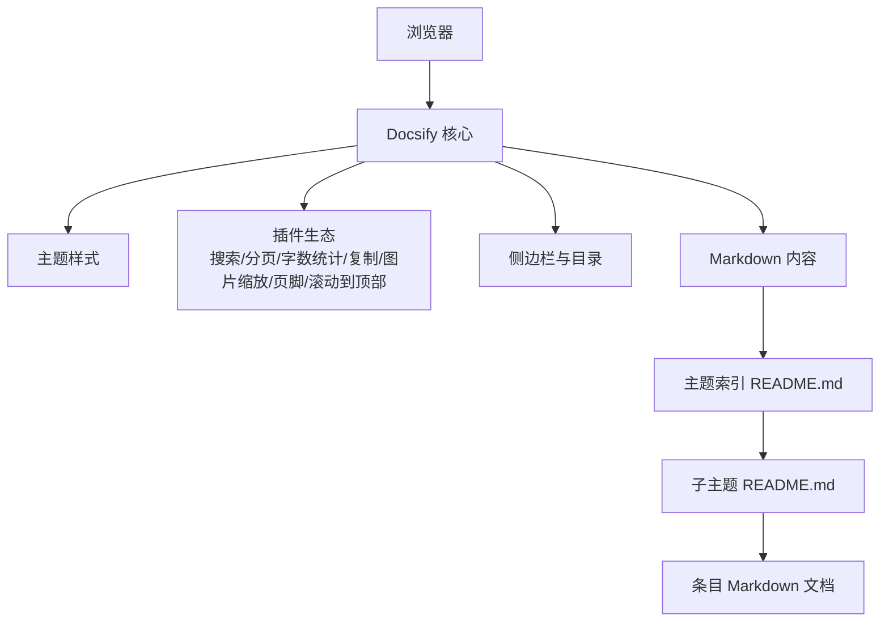
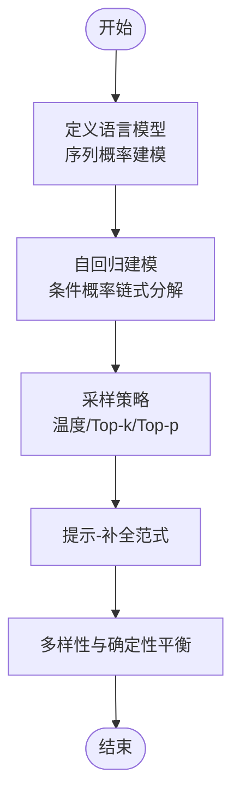
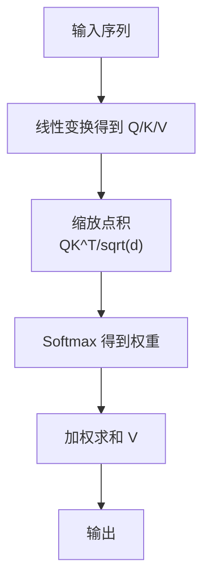
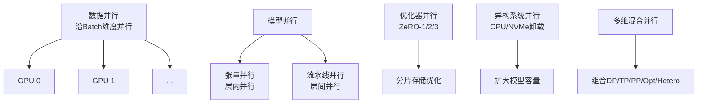
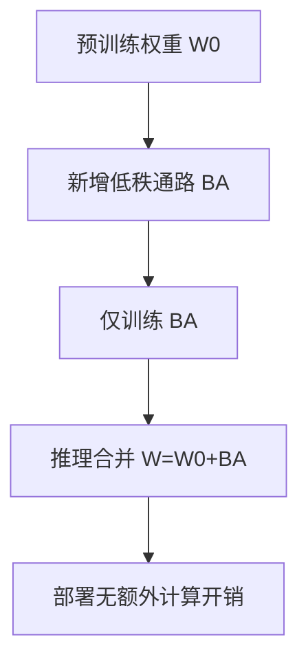
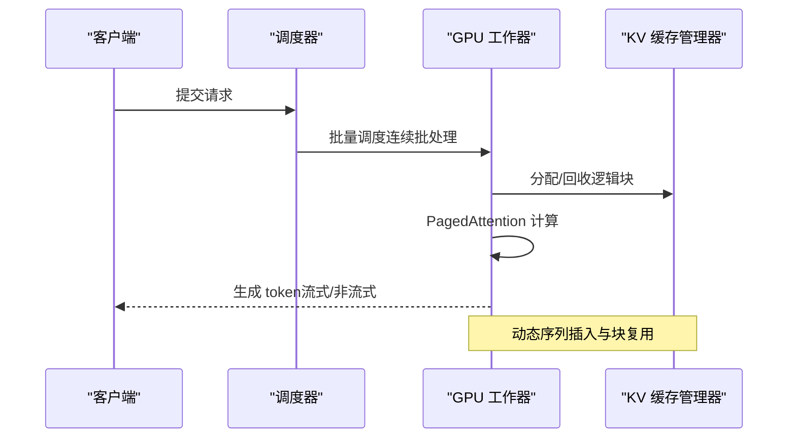
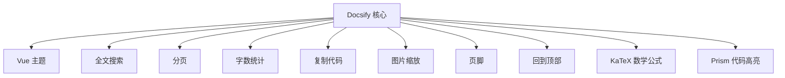

# 项目概述

<cite>
**本文引用的文件**
- [README.md](file://README.md)
- [index.html](file://index.html)
- [_navbar.md](file://_navbar.md)
- [01.大语言模型基础/README.md](file://01.大语言模型基础/README.md)
- [01.大语言模型基础/1.语言模型/1.语言模型.md](file://01.大语言模型基础/1.语言模型/1.语言模型.md)
- [02.大语言模型架构/README.md](file://02.大语言模型架构/README.md)
- [02.大语言模型架构/1.attention/1.attention.md](file://02.大语言模型架构/1.attention/1.attention.md)
- [04.分布式训练/README.md](file://04.分布式训练/README.md)
- [04.分布式训练/1.概述/1.概述.md](file://04.分布式训练/1.概述/1.概述.md)
- [05.有监督微调/README.md](file://05.有监督微调/README.md)
- [05.有监督微调/4.lora/4.lora.md](file://05.有监督微调/4.lora/4.lora.md)
- [06.推理/README.md](file://06.推理/README.md)
- [06.推理/1.vllm/1.vllm.md](file://06.推理/1.vllm/1.vllm.md)
- [07.强化学习/README.md](file://07.强化学习/README.md)
- [08.检索增强rag/README.md](file://08.检索增强rag/README.md)
- [09.大语言模型评估/README.md](file://09.大语言模型评估/README.md)
- [10.大语言模型应用/README.md](file://10.大语言模型应用/README.md)
- [98.相关课程/README.md](file://98.相关课程/README.md)
</cite>

## 目录
1. [简介](#简介)
2. [项目结构](#项目结构)
3. [核心组件](#核心组件)
4. [架构总览](#架构总览)
5. [详细组件分析](#详细组件分析)
6. [依赖分析](#依赖分析)
7. [性能考量](#性能考量)
8. [故障排查指南](#故障排查指南)
9. [结论](#结论)
10. [附录](#附录)

## 简介
本项目为“LLM面试知识库”，围绕大语言模型（LLM）的理论、架构、训练、推理、微调、强化学习、RAG与评估等主题，整理了系统化的面试知识点与实践要点。项目采用静态文档站点（Docsify）进行组织与发布，便于在线阅读与检索。

- 项目定位：知识梳理与面试准备材料，覆盖从基础概念到工程实践的多维度内容。
- 在线阅读：通过 GitHub Pages 提供浏览入口，支持目录导航、全文搜索、字数统计、分页等增强体验。
- 适用人群：初学者可循序渐进建立知识体系；有经验者可作为检索与复习的索引。

**章节来源**
- [README.md:1-169](file://README.md#L1-L169)

## 项目结构
项目采用“主题分区 + 子主题目录 + Markdown 文档”的组织方式，配合 Docsify 的侧边栏与导航，形成清晰的知识地图。

```mermaid
graph TB
Root["根目录"] --> Home["README.md"]
Root --> Index["index.html"]
Root --> Nav["_navbar.md"]
Root --> Topic1["01.大语言模型基础"]
Root --> Topic2["02.大语言模型架构"]
Root --> Topic3["03.训练数据集"]
Root --> Topic4["04.分布式训练"]
Root --> Topic5["05.有监督微调"]
Root --> Topic6["06.推理"]
Root --> Topic7["07.强化学习"]
Root --> Topic8["08.检索增强RAG"]
Root --> Topic9["09.大语言模型评估"]
Root --> Topic10["10.大语言模型应用"]
Root --> Topic98["98.相关课程"]
Root --> Topic99["99.参考资料"]
Topic1 --> Topic1Readme["01.README.md"]
Topic2 --> Topic2Readme["02.README.md"]
Topic4 --> Topic4Readme["04.README.md"]
Topic5 --> Topic5Readme["05.README.md"]
Topic6 --> Topic6Readme["06.README.md"]
Topic7 --> Topic7Readme["07.README.md"]
Topic8 --> Topic8Readme["08.README.md"]
Topic9 --> Topic9Readme["09.README.md"]
Topic10 --> Topic10Readme["10.README.md"]
Topic98 --> Topic98Readme["98.README.md"]
```

**图示来源**
- [README.md:37-169](file://README.md#L37-L169)
- [index.html:14-66](file://index.html#L14-L66)

**章节来源**
- [README.md:37-169](file://README.md#L37-L169)
- [index.html:14-66](file://index.html#L14-L66)
- [_navbar.md:1-5](file://_navbar.md#L1-L5)

## 核心组件
- 文档站点引擎：Docsify（Vue 主题、搜索、分页、字数统计、代码高亮、KaTeX 支持）
- 导航与侧边栏：通过全局配置与 alias 实现跨章节导航与侧边栏加载
- 内容组织：按主题分层，每个主题下以 README.md 作为子主题索引，正文以 Markdown 文件呈现
- 外部链接：提供在线阅读地址与相关仓库链接，便于扩展学习

**章节来源**
- [index.html:14-120](file://index.html#L14-L120)
- [README.md:23-35](file://README.md#L23-L35)

## 架构总览
从用户视角看，项目由“前端渲染层（Docsify）+ 内容层（Markdown）+ 导航层（侧边栏/目录）”构成；从内容组织看，采用“主题-子主题-条目”的层级索引，便于按需检索。

**图示来源**
- [index.html:14-120](file://index.html#L14-L120)
- [README.md:37-169](file://README.md#L37-L169)

## 详细组件分析

### 组件A：语言模型与基础概念
- 覆盖范围：语言模型定义、自回归建模、温度采样、n-gram 历史、神经语言模型演进
- 关键点：联合概率链式分解、条件概率建模、温度参数对采样多样性的影响
- 实践要点：提示-补全范式、温度与Top-k/Top-p/采样策略的结合

**图示来源**
- [01.大语言模型基础/1.语言模型/1.语言模型.md:3-96](file://01.大语言模型基础/1.语言模型/1.语言模型.md#L3-L96)

**章节来源**
- [01.大语言模型基础/README.md:1-36](file://01.大语言模型基础/README.md#L1-L36)
- [01.大语言模型基础/1.语言模型/1.语言模型.md:3-96](file://01.大语言模型基础/1.语言模型/1.语言模型.md#L3-L96)

### 组件B：Transformer 与注意力机制
- 覆盖范围：Attention 计算步骤、Self-Attention 与 Target-Attention、Mask 处理、Multi-Head 设计、缩放因子
- 关键点：Q/K/V 的线性变换、注意力权重 softmax、多头拼接与输出投影
- 实践要点：Padding 掩码、点积缩放、相对位置编码、Transformer-XL 上下文扩展

**图示来源**
- [02.大语言模型架构/1.attention/1.attention.md:24-33](file://02.大语言模型架构/1.attention/1.attention.md#L24-L33)

**章节来源**
- [02.大语言模型架构/README.md:1-52](file://02.大语言模型架构/README.md#L1-L52)
- [02.大语言模型架构/1.attention/1.attention.md:15-88](file://02.大语言模型架构/1.attention/1.attention.md#L15-L88)

### 组件C：分布式训练与并行策略
- 覆盖范围：数据并行、模型并行（张量/流水线）、ZeRO 优化器分片、异构系统、多维混合并行、自动并行、MoE 并行
- 关键点：显存占用构成、通信与吞吐权衡、流水线阶段空闲与带宽约束
- 实践要点：多维混合并行在超大规模模型中的组合使用

**图示来源**
- [04.分布式训练/1.概述/1.概述.md:3-87](file://04.分布式训练/1.概述/1.概述.md#L3-L87)

**章节来源**
- [04.分布式训练/README.md:1-45](file://04.分布式训练/README.md#L1-L45)
- [04.分布式训练/1.概述/1.概述.md:3-87](file://04.分布式训练/1.概述/1.概述.md#L3-L87)

### 组件D：有监督微调与高效适配
- 覆盖范围：LoRA、AdaLoRA、QLoRA 的低秩适配思想、秩预算分配、4bit 量化与分页优化器
- 关键点：将权重更新 ΔW 参数化为 BA 形式、训练时冻结主模型、推理时权重叠加
- 实践要点：秩 r 的选择、重要性评分与自适应预算、NF4/双量化与分页优化器

**图示来源**
- [05.有监督微调/4.lora/4.lora.md:23-27](file://05.有监督微调/4.lora/4.lora.md#L23-L27)

**章节来源**
- [05.有监督微调/README.md:1-30](file://05.有监督微调/README.md#L1-L30)
- [05.有监督微调/4.lora/4.lora.md:1-114](file://05.有监督微调/4.lora/4.lora.md#L1-L114)

### 组件E：推理服务与高性能实现
- 覆盖范围：vLLM 的连续批处理（Continuous Batching）、PagedAttention、KV Cache 管理、Tensor Parallel、OpenAI 兼容 API
- 关键点：内存瓶颈（HBM）限制吞吐、以页为单位的 KV Cache 管理、动态序列插入与并行采样
- 实践要点：分页块大小、块表映射、物理块按需分配、共享提示缓存

**图示来源**
- [06.推理/1.vllm/1.vllm.md:55-151](file://06.推理/1.vllm/1.vllm.md#L55-L151)

**章节来源**
- [06.推理/README.md:1-28](file://06.推理/README.md#L1-L28)
- [06.推理/1.vllm/1.vllm.md:1-200](file://06.推理/1.vllm/1.vllm.md#L1-L200)

### 组件F：强化学习与 RLHF
- 覆盖范围：策略梯度、PPO、DPO、RLHF 的原理与实践要点
- 关键点：策略优化、重要性采样、KL 正则、偏好对齐
- 实践要点：奖励模型、人类反馈、策略更新稳定性

**章节来源**
- [07.强化学习/README.md:1-22](file://07.强化学习/README.md#L1-L22)

### 组件G：检索增强与 Agent 技术
- 覆盖范围：RAG 检索增强生成、多路召回与重排、Agent 技术
- 关键点：检索质量、上下文注入、工具调用与计划执行
- 实践要点：向量检索、重排序、提示设计与安全控制

**章节来源**
- [08.检索增强rag/README.md:1-14](file://08.检索增强rag/README.md#L1-L14)

### 组件H：模型评估与幻觉治理
- 覆盖范围：评测指标、幻觉来源与缓解策略
- 关键点：事实性、一致性、鲁棒性、可控性
- 实践要点：人工评估、自动化指标、对抗测试、提示注入检测

**章节来源**
- [09.大语言模型评估/README.md:1-12](file://09.大语言模型评估/README.md#L1-L12)

### 组件I：应用与提示工程
- 覆盖范围：思维链（CoT）、LangChain 框架、提示设计与工程化
- 关键点：结构化推理、模块化链路、工具与外部 API 集成
- 实践要点：提示模板、缓存与重试、可观测性与日志

**章节来源**
- [10.大语言模型应用/README.md:1-10](file://10.大语言模型应用/README.md#L1-L10)

## 依赖分析
- 文档渲染依赖：Docsify 核心 + 主题与插件生态（搜索、分页、字数统计、复制、图片缩放、页脚、滚动到顶部、KaTeX、代码高亮）
- 导航与索引：全局 alias 与侧边栏配置，实现跨章节跳转与子主题索引
- 内容耦合：各主题 README 作为子主题索引，条目文档作为知识单元，耦合度低、内聚性强

**图示来源**
- [index.html:70-120](file://index.html#L70-L120)

**章节来源**
- [index.html:14-120](file://index.html#L14-L120)

## 性能考量
- 推理性能瓶颈：显存（HBM）受限于模型规模与序列长度，吞吐由 KV Cache 管理与批处理策略决定
- 连续批处理：动态插入新序列，减少 GPU 空闲，提升利用率
- KV Cache 分页：以内存换计算，块表映射与按需分配，显著降低碎片化与浪费
- 训练性能：多维混合并行在通信与计算之间寻求平衡，ZeRO 降低优化器状态与梯度冗余

**章节来源**
- [06.推理/1.vllm/1.vllm.md:47-151](file://06.推理/1.vllm/1.vllm.md#L47-L151)
- [04.分布式训练/1.概述/1.概述.md:47-87](file://04.分布式训练/1.概述/1.概述.md#L47-L87)

## 故障排查指南
- 在线阅读异常
  - 现象：页面空白或资源加载失败
  - 排查：确认 CDN 资源可用性、检查本地网络与代理设置
  - 参考：Docsify 与插件加载顺序与版本兼容性
- 搜索/分页/字数统计无效
  - 现象：搜索无结果、分页按钮不可用、字数统计不显示
  - 排查：确认全局配置项启用与脚本加载顺序
  - 参考：搜索与分页插件的初始化顺序
- 侧边栏与目录不显示
  - 现象：侧边栏缺失或目录层级不正确
  - 排查：检查 alias 配置与子主题 README 是否存在
- 数学公式渲染问题
  - 现象：公式未渲染或显示异常
  - 排查：确认 KaTeX 与 docsify-katex 插件版本匹配
- 代码高亮缺失
  - 现象：代码块未高亮
  - 排查：确认 PrismJS 加载顺序与语言包引入

**章节来源**
- [index.html:14-120](file://index.html#L14-L120)

## 结论
本项目以“知识体系化 + 工程实践化”为目标，通过 Docsify 构建的静态站点，系统覆盖 LLM 的理论、架构、训练、推理、微调、强化学习、RAG、评估与应用等关键主题。建议读者结合自身背景，从基础主题逐步深入，并在实践中对照工程实现（如 vLLM、LoRA、分布式并行）加深理解。

## 附录
- 在线阅读入口与快捷链接：参见导航栏与 README 中的在线阅读与外部链接
- 相关课程与参考资料：提供课程索引与参考链接，便于拓展学习

**章节来源**
- [README.md:23-35](file://README.md#L23-L35)
- [_navbar.md:1-5](file://_navbar.md#L1-L5)
- [98.相关课程/README.md:1-4](file://98.相关课程/README.md#L1-L4)