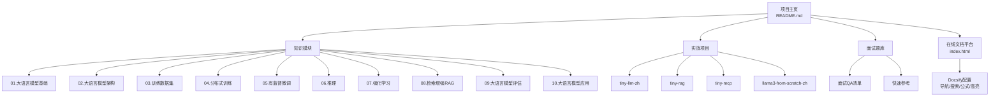
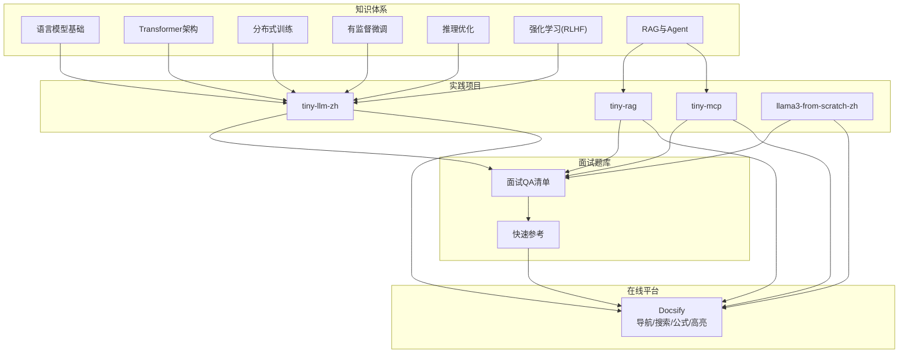
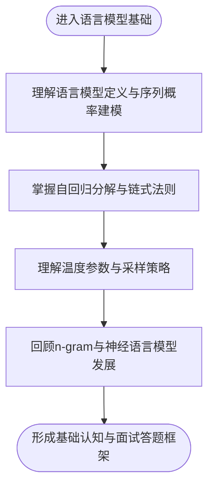
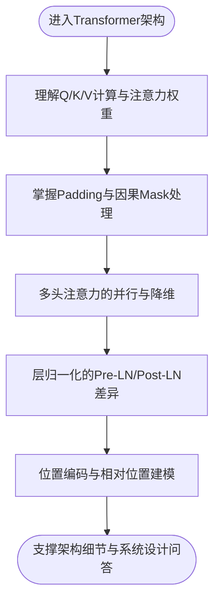
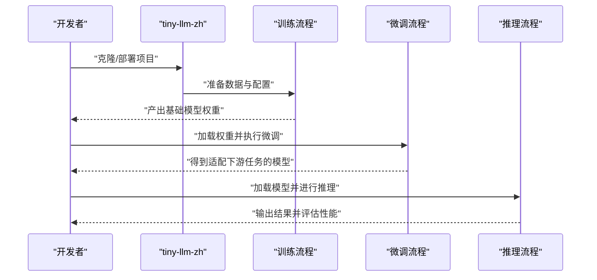
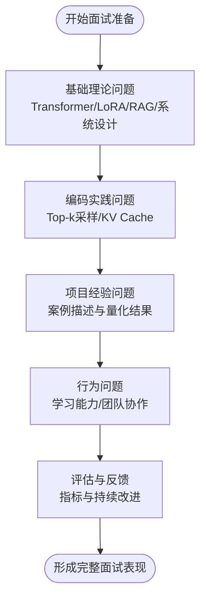
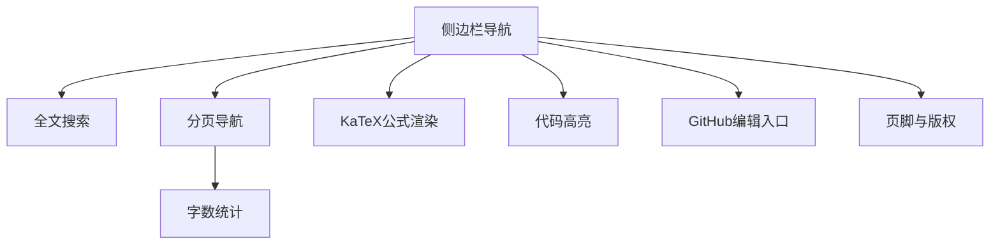
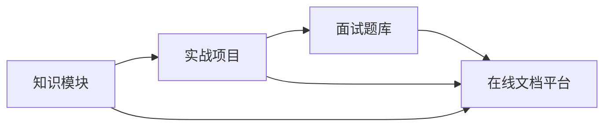

# 项目简介

<cite>
**本文引用的文件**
- [README.md](file://README.md)
- [index.html](file://index.html)
- [ai_generataion/中级LLM_Agent工程师面试QA清单.md](file://ai_generataion/中级LLM_Agent工程师面试QA清单.md)
- [ai_generataion/中级LLM_Agent工程师面试_快速参考.md](file://ai_generataion/中级LLM_Agent工程师面试_快速参考.md)
- [01.大语言模型基础/README.md](file://01.大语言模型基础/README.md)
- [02.大语言模型架构/README.md](file://02.大语言模型架构/README.md)
- [04.分布式训练/README.md](file://04.分布式训练/README.md)
- [05.有监督微调/README.md](file://05.有监督微调/README.md)
- [06.推理/README.md](file://06.推理/README.md)
- [07.强化学习/README.md](file://07.强化学习/README.md)
- [08.检索增强rag/README.md](file://08.检索增强rag/README.md)
- [01.大语言模型基础/1.语言模型/1.语言模型.md](file://01.大语言模型基础/1.语言模型/1.语言模型.md)
- [02.大语言模型架构/1.attention/1.attention.md](file://02.大语言模型架构/1.attention/1.attention.md)
</cite>

## 目录
1. [简介](#简介)
2. [项目结构](#项目结构)
3. [核心组件](#核心组件)
4. [架构总览](#架构总览)
5. [详细组件分析](#详细组件分析)
6. [依赖分析](#依赖分析)
7. [性能考量](#性能考量)
8. [故障排查指南](#故障排查指南)
9. [结论](#结论)
10. [附录](#附录)

## 简介
本仓库聚焦于大模型（LLM）面试的知识体系与实践路径，旨在帮助开发者系统梳理从基础理论到工程落地的完整知识谱系，并配套实战项目与面试题库，提升面试竞争力与工程能力。项目内容覆盖语言模型基础、Transformer架构、分布式训练、有监督微调、推理优化、强化学习（RLHF）、检索增强（RAG）与Agent应用等关键主题，形成“知识—实践—面试”的闭环。

项目价值主张：
- 知识体系完整：从NLP基础、语言模型、Transformer到MoE、分布式训练、推理优化、RLHF与RAG/Agent，形成贯通式知识地图。
- 实践项目丰富：配套“tiny-llm-zh”“tiny-rag”“tiny-mcp”“llama3-from-scratch-zh”等动手项目，便于在低资源环境下完成从零到一的实践。
- 面试导向明确：提供面试清单、快速参考与系统设计模板，覆盖技术深度与广度、编码实现、项目经验与行为问题。
- 在线可读性强：基于Docsify构建，支持全文搜索、字数统计、分页导航、KaTeX公式渲染与代码高亮，便于系统学习与查阅。

适用人群与预期收益：
- 初学者：通过系统化知识与入门级实践项目，建立对LLM的全局认知与动手能力。
- 有经验的开发者：借助实战项目与面试题库，补齐工程短板，强化系统设计与性能优化能力。
- 面试者：通过面试清单与快速参考，针对性准备技术深度、系统设计、编码实现与行为问题，提升面试表现。

开源协议与社区贡献：
- 本仓库为个人整理与分享，欢迎阅读与Star支持。若需了解具体开源协议，请参阅仓库根目录或相关文件声明。
- 社区贡献方式：欢迎通过Issue反馈问题、通过Pull Request提交修正与补充内容；也可关注作者公众号获取更新与交流。

**章节来源**
- [README.md:1-169](file://README.md#L1-L169)
- [index.html:1-123](file://index.html#L1-L123)

## 项目结构
项目采用“主题模块 + 实战项目 + 面试题库”的组织方式，辅以在线文档平台，便于导航与检索。

**图表来源**
- [README.md:37-169](file://README.md#L37-L169)
- [index.html:14-120](file://index.html#L14-L120)

**章节来源**
- [README.md:37-169](file://README.md#L37-L169)
- [01.大语言模型基础/README.md:1-36](file://01.大语言模型基础/README.md#L1-L36)
- [02.大语言模型架构/README.md:1-52](file://02.大语言模型架构/README.md#L1-L52)
- [04.分布式训练/README.md:1-45](file://04.分布式训练/README.md#L1-L45)
- [05.有监督微调/README.md:1-30](file://05.有监督微调/README.md#L1-L30)
- [06.推理/README.md:1-28](file://06.推理/README.md#L1-L28)
- [07.强化学习/README.md:1-22](file://07.强化学习/README.md#L1-L22)
- [08.检索增强rag/README.md:1-14](file://08.检索增强rag/README.md#L1-L14)
- [index.html:14-120](file://index.html#L14-L120)

## 核心组件
- 知识模块：涵盖语言模型基础、Transformer架构、分布式训练、微调、推理、强化学习、RAG与Agent应用等，形成完整的知识地图。
- 实战项目：提供从零实现中文小模型、RAG系统、MCP Agent与Llama3复现等项目，强调低门槛与可操作性。
- 面试题库：包含面试清单、系统设计模板、编码题与行为问题准备要点，帮助面试者系统化准备。
- 在线文档平台：基于Docsify，提供导航、搜索、分页、字数统计、公式渲染与代码高亮，提升阅读体验。

**章节来源**
- [README.md:10-20](file://README.md#L10-L20)
- [README.md:169-169](file://README.md#L169-L169)
- [index.html:14-120](file://index.html#L14-L120)

## 架构总览
项目整体以“知识—实践—面试”为主线，通过模块化知识与实战项目串联，配合在线文档平台实现高效学习与查阅。

**图表来源**
- [README.md:10-20](file://README.md#L10-L20)
- [README.md:37-169](file://README.md#L37-L169)
- [index.html:14-120](file://index.html#L14-L120)

## 详细组件分析

### 组件A：知识模块（以“语言模型基础”为例）
- 目标：帮助读者建立对语言模型、自回归建模与温度采样等基础概念的系统理解。
- 关键内容：语言模型定义、自回归分解、温度参数与采样策略、历史演进（n-gram、神经语言模型）等。
- 学习路径：从基础定义到历史回顾，逐步深入到采样与生成机制，便于面试中回答基础理论问题。

**图表来源**
- [01.大语言模型基础/1.语言模型/1.语言模型.md:1-200](file://01.大语言模型基础/1.语言模型/1.语言模型.md#L1-L200)

**章节来源**
- [01.大语言模型基础/1.语言模型/1.语言模型.md:1-200](file://01.大语言模型基础/1.语言模型/1.语言模型.md#L1-L200)

### 组件B：知识模块（以“Transformer架构”为例）
- 目标：系统讲解注意力机制、多头注意力、位置编码与Transformer变体，支撑面试中对架构细节的深入提问。
- 关键内容：Attention计算步骤、Self-Attention与Target-Attention、多头注意力降维、权重共享、缩放点积动机、BERT与Decoder-only架构等。
- 面试价值：覆盖高频考点，如注意力机制原理、多头设计动机、Mask策略、相对/绝对位置编码等。

**图表来源**
- [02.大语言模型架构/1.attention/1.attention.md:1-200](file://02.大语言模型架构/1.attention/1.attention.md#L1-L200)

**章节来源**
- [02.大语言模型架构/1.attention/1.attention.md:1-200](file://02.大语言模型架构/1.attention/1.attention.md#L1-L200)

### 组件C：实战项目（以“tiny-llm-zh”为例）
- 目标：在低资源环境下从零实现中文小参数量LLM，掌握预训练、微调与推理优化的关键流程。
- 价值：通过最小可行项目，快速验证知识体系，形成可展示的项目经验，支撑面试中的项目问答与白板编码。

**图表来源**
- [README.md:10-14](file://README.md#L10-L14)

**章节来源**
- [README.md:10-14](file://README.md#L10-L14)

### 组件D：面试题库（以“面试QA清单”为例）
- 目标：提供系统化面试准备清单，覆盖基础理论、系统设计、编码实践、项目经验与行为问题。
- 特色：包含白板编码模板、系统设计要点、性能评估框架与行为问题STAR法则，帮助面试者在有限时间内高效准备。

**图表来源**
- [ai_generataion/中级LLM_Agent工程师面试QA清单.md:1-343](file://ai_generataion/中级LLM_Agent工程师面试QA清单.md#L1-L343)

**章节来源**
- [ai_generataion/中级LLM_Agent工程师面试QA清单.md:1-343](file://ai_generataion/中级LLM_Agent工程师面试QA清单.md#L1-L343)

### 组件E：在线文档平台（Docsify）
- 目标：提供统一入口与良好阅读体验，支持导航、搜索、分页、字数统计、公式渲染与代码高亮。
- 价值：降低学习成本，提升知识检索效率，便于长期维护与扩展。

**图表来源**
- [index.html:14-120](file://index.html#L14-L120)

**章节来源**
- [index.html:14-120](file://index.html#L14-L120)

## 依赖分析
- 内部耦合：知识模块为实战项目与面试题库提供理论基础；实战项目为面试题库提供案例素材；在线平台承载知识与项目展示。
- 外部依赖：Docsify生态（导航、搜索、分页、字数统计、公式与代码高亮插件）。
- 风险点：知识更新滞后、项目依赖外部环境变化；建议定期更新并提供最小运行环境说明。

**图表来源**
- [README.md:37-169](file://README.md#L37-L169)
- [index.html:14-120](file://index.html#L14-L120)

**章节来源**
- [README.md:37-169](file://README.md#L37-L169)
- [index.html:14-120](file://index.html#L14-L120)

## 性能考量
- 学习效率：通过模块化知识与在线平台的搜索、分页与字数统计，降低查找成本，提升学习节奏。
- 实践效率：以“tiny-llm-zh”等最小可行项目为抓手，快速验证理论，缩短从学习到产出的时间周期。
- 面试效率：以“面试QA清单”与“快速参考”为纲，聚焦高频考点与系统设计模板，提升面试表现稳定性。

[本节为通用指导，无需特定文件来源]

## 故障排查指南
- 在线阅读异常：检查Docsify配置与CDN资源可用性，确认浏览器兼容性与缓存清理。
- 搜索/分页失效：核对Docsify插件启用顺序与版本，确保插件依赖正确加载。
- 公式渲染问题：确认KaTeX与Marked版本兼容，检查CDN链接有效性。
- 代码高亮缺失：确认PrismJS插件加载顺序与语言包是否齐全。

**章节来源**
- [index.html:70-120](file://index.html#L70-L120)

## 结论
本项目以“知识—实践—面试”为核心主线，结合系统化的知识模块、可操作的实战项目与针对性的面试题库，形成面向LLM面试与工程实践的完整学习路径。通过在线文档平台与丰富的模块化内容，帮助不同层次的开发者高效构建知识体系、积累项目经验并提升面试表现。

[本节为总结性内容，无需特定文件来源]

## 附录
- 在线阅读入口：[LLMs Interview Note](http://wdndev.github.io/llm_interview_note)
- 项目主页：[README.md](file://README.md)

**章节来源**
- [README.md:23-26](file://README.md#L23-L26)