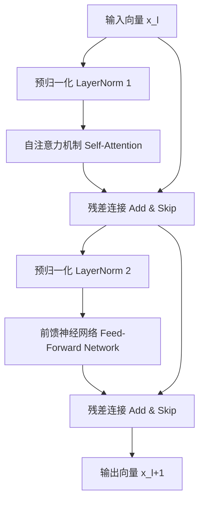
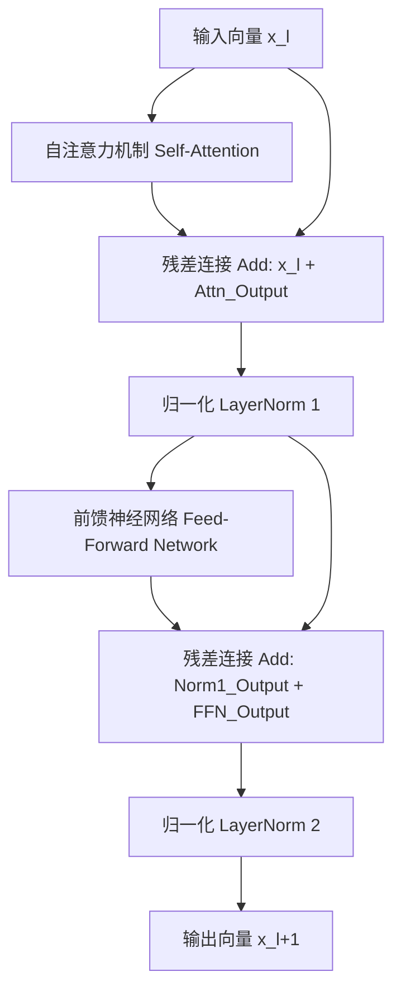

<!--
 * @Author: Bruce Zhang
 * @Date: 2026-03-10 19:15:36
 * @LastEditTime: 2026-03-10 19:24:35
-->
这是一个非常经典且关键的问题。Transformer 选择 **LayerNorm (LN)** 而不是 **BatchNorm (BN)**，是由 **NLP 数据的特性** 和 **Transformer 的架构机制** 共同决定的。

### 1. 为什么 Transformer 使用 LayerNorm 而不是 BatchNorm？

核心原因可以归纳为以下三点：

#### A. 变长序列与 Padding 问题 (最关键原因)
*   **NLP 数据特性**：自然语言中的句子长度是不固定的。为了组成一个 Batch 进行并行计算，我们通常会对短句子进行 **Padding**（填充特殊符号 `<pad>` 直到最长句子的长度）。
*   **BatchNorm 的缺陷**：BN 需要计算整个 Batch 在某个特征维度上的均值和方差。
    *   如果使用了 Padding，这些填充的“无意义”数据会被计入统计量，导致均值和方差被严重污染（例如，如果 pad 是 0，均值会被拉低，方差会变小）。
    *   虽然可以通过 Mask 屏蔽掉 pad，但这增加了实现的复杂性，且在不同长度的 Batch 间，统计量的分布依然不稳定。
*   **LayerNorm 的优势**：LN **只针对单个样本内部** 的特征维度进行归一化。
    *   它完全不依赖 Batch 中的其他样本。
    *   无论句子多长、Batch 大小是多少，甚至 Batch Size = 1（推理时常见），LN 的计算逻辑都完全一致，不受 Padding 干扰（只要对 pad 位置不做更新或忽略即可，通常 Embedding 层处理后 pad 向量也是固定的，LN 对其操作也是确定的）。

#### B. 序列依赖与统计独立性
*   **BatchNorm 的假设**：BN 假设 Batch 中不同样本的同一个特征是独立同分布的（i.i.d.）。这在图像分类（CNN）中很成立，因为一张图里的猫和另一张图里的狗在统计上是独立的。
*   **Transformer 的机制**：Transformer 的核心是 **Self-Attention**，它显式地建模了序列内部 Token 之间的依赖关系。
    *   在 NLP 任务中，同一个 Batch 内不同句子的语义可能差异巨大（一句是新闻，一句是对话），强行把它们放在一起算统计均值没有物理意义。
    *   LN 关注的是**一个句子内部**，各个词向量特征的分布平衡，这更符合语言模型的需求（让一个句子内的词特征分布稳定）。

#### C. 训练与推理的一致性 (无需保存运行统计量)
*   **BatchNorm 的麻烦**：BN 在训练时使用当前 Batch 的统计量，而在推理时使用训练过程中积累的**移动平均统计量 (Running Mean/Var)**。
    *   如果训练时的 Batch Size 很小或者数据分布变化大，这些积累的统计量可能不准，导致推理效果下降。
    *   对于 RNN/Transformer 这种序列模型，BN 还需要决定是在时间步上共享统计量还是每个时间步独立，这非常复杂。
*   **LayerNorm 的简洁**：LN 在训练和推理时的计算公式**完全一样**，都是基于当前输入样本自己算均值和方差。
    *   不需要保存任何额外的全局统计参数。
    *   天然支持 **Online Learning** 或 **动态 Batch Size**，部署极其方便。

---

### 2. LayerNorm 在 Transformer 中的位置在哪里？

LayerNorm 的位置经历了一个演进过程，主要分为 **Post-Norm** 和 **Pre-Norm** 两种架构。

#### A. 原始 Transformer (Post-Norm)
在 2017 年最初的《Attention Is All You Need》论文中，LayerNorm 位于 **子层（Attention/FFN）之后，残差连接之前**。
*   **流程**：输入 $x$ $\rightarrow$ 子层 (Attention/FFN) $\rightarrow$ **Add & Norm** ($\text{LayerNorm}(x + \text{Sublayer}(x))$)。
*   **缺点**：梯度需要经过子层才能到达 LayerNorm，在深层网络中容易导致梯度消失，训练不稳定，需要精心调整学习率 Warmup。

#### B. 现代大模型 (Pre-Norm) —— **主流选择**
现在的 LLM（如 Llama, GPT-3/4, BERT 后续变体）几乎全部采用 **Pre-Norm** 结构。LayerNorm 位于 **子层之前，残差连接的分支上**。
*   **流程**：
    1.  输入 $x$ 先经过 **LayerNorm**。
    2.  归一化后的结果进入子层 (Attention/FFN)。
    3.  子层输出与原始输入 $x$ 相加（残差连接）。
    *   公式：$y = x + \text{Sublayer}(\text{LayerNorm}(x))$
*   **优点**：
    *   梯度可以直接通过残差连接流向底层，无需穿过子层，极大地缓解了梯度消失。
    *   训练更加稳定，收敛更快，允许构建更深的网络（如 100+ 层）。
    *   虽然理论上表达能力略弱于 Post-Norm（因为子层接收的是归一化后的数据），但在深度网络中，稳定性带来的收益远大于此损失。

#### C. 具体位置图示 (Pre-Norm 架构)

在一个标准的 Decoder Block 中，有两个 LayerNorm：

1.  **第一个 LayerNorm**：位于 **Self-Attention 模块之前**。
    *   输入 $h_l$ $\rightarrow$ **LN1** $\rightarrow$ Self-Attention $\rightarrow$ Add ($+ h_l$)
2.  **第二个 LayerNorm**：位于 **Feed-Forward Network (FFN) 模块之前**。
    *   上一步输出 $h_{mid}$ $\rightarrow$ **LN2** $\rightarrow$ FFN $\rightarrow$ Add ($+ h_{mid}$)

*(注：Llama 等最新模型将 LayerNorm 替换为 **RMSNorm**，去掉了均值中心化 $\mu$，只保留均方根缩放，计算更高效，但位置和作用逻辑与 Pre-Norm 的 LayerNorm 完全一致。)*

### 总结

| 特性 | BatchNorm (BN) | LayerNorm (LN) | 为什么 Transformer 选 LN |
| :--- | :--- | :--- | :--- |
| **归一化维度** | 跨样本 (Batch 维度) | 单样本内部 (特征维度) | NLP 样本间差异大，无需跨样本统计 |
| **变长序列支持** | 差 (受 Padding 污染) | **优** (与长度无关) | 句子长度不固定是 NLP 常态 |
| **推理一致性** | 需维护 Running Stats | **完全一致** | 部署简单，支持动态 Batch |
| **典型位置** | CNN 卷积后 | **Transformer 子层前 (Pre-Norm)** | Pre-Norm 训练更深网络更稳定 |

简单来说：**BatchNorm 是为一堆相似的图片设计的，而 LayerNorm 是为千变万化的句子设计的。**

### pre-Norm

### Post-Norm
